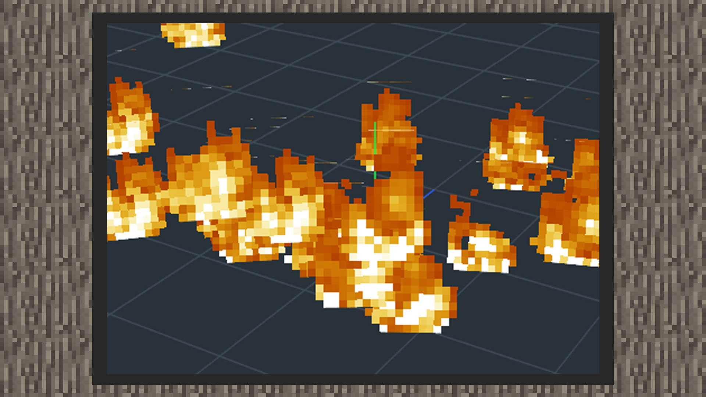
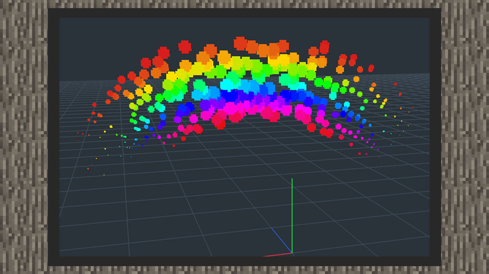
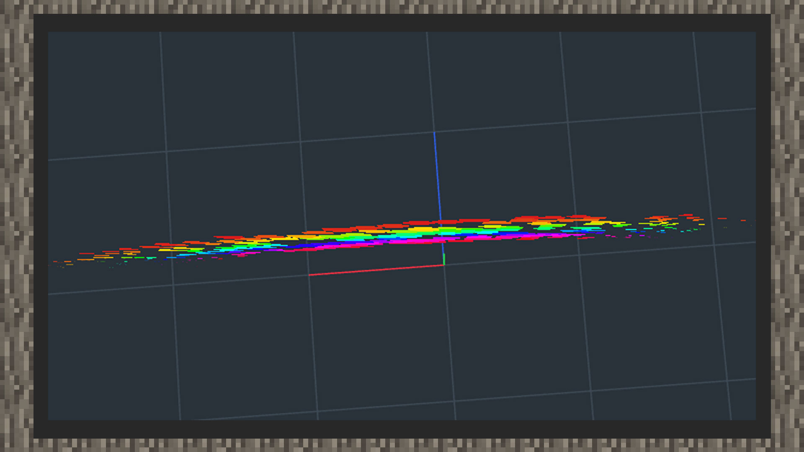
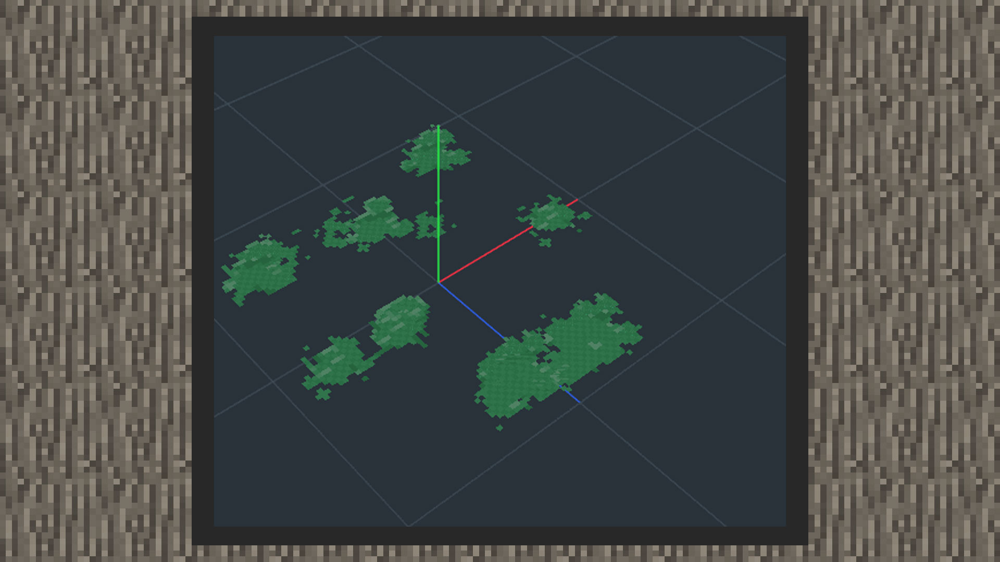

--- 
front: https://mc.res.netease.com/pc/zt/20201109161633/mc-dev/assets/img/2_2.253bcfde.jpg 
hard: Advanced 
time: 20 minutes 
--- 

# The relationship between particles and particle emitters 

#### Author: Realm 

In the 3D game world, many visual effects of blurry phenomena are packaged by the concept of special effects. Phenomena that often use this concept include abstract visual effects such as fire, explosion, smoke, water flow, snow, and dust. Particle emitters are a typical implementation of controlling the displacement movement of particles in three-dimensional space, and the various dynamic changes are packaged by the technical team and then provided with particle behavior parameters for control. The current updated version of the Nether in the Chinese version supports both original particle customization and MODSDK particle customization. Although there may be slight differences in the functional details, there are not many differences in the ideas of making particle special effects and sequence frame special effects. After learning one, the learning cost of migrating to another system will be much less. Let's take a look at their similarities. 

| | Original particles | Special effect particles | 
| -------- | ------------------------------------------------------------ | ------------------------------------------------------------ | 
| Emitter | 1) There are 5 shapes of original particle emitters, namely: point, sphere, square, plane, and biological collision box. The shape of the emitter makes the particles disperse along the surface of the shape and controls the direction and direction of the particle emission. For example, if the particle emitter is set to a square, the particles will be dispersed in a square space. If it is set to a point, the particles will gather at one point. 2) The size of the special effect can be scaled by setting the size of the emitter. | 1) There are 4 shapes of special effect particle emitters, namely sphere, hemisphere, cylinder, and square. The emitter shape makes the particles disperse along the surface of the shape and controls the direction and emission of particles. For example, if the particle emitter is set to a square, the particles will be dispersed in a square space. If it is set to a point shape, the particles will gather at a point. 2) The size of the special effect can be scaled by setting the size of the emitter. | 
| Variation | 1) Particles can adjust acceleration and resistance, rotation angle, rotation speed, etc. with parameters, and move and rotate in three-dimensional space. 2) Particles have the concept of quantity. For example, if the particle shape is changed to fire, the number of fires can be increased or decreased by changing the number. 3) Particles have the concept of size. For example, if the particle shape is changed to fire, the display size of a ball of fire in the world can also be adjusted. | | 
| Facing mode | 1) The particle facing mode can be set to facing the camera, facing the ground, and facing the direction. It refers to the parameter of the direction in which the particle faces in the player's line of sight. Facing the camera means that the particle always faces the player's camera perspective, and you can see its complete appearance no matter what angle you look at the particle from. 【Example 1】 Facing the ground means that the particles will always face the player's perspective in the Y-axis direction, that is, when the player's perspective is parallel to the ground, the complete particle effect can be seen. If you look down at the particles, you cannot see the complete appearance of the particles. 【Example 2】 Facing direction means that the particles are facing a certain direction, such as: a pool of green liquid emerges from the ground, and the developer wants the particles to be close to the ground, so the facing mode is set to facing the Z axis. 【Example 3】 | | 
| Duration | 1) Particles have the concept of time for the life cycle. When the duration ends, the particles will disappear. 2) Particles have the options of looping and playing only once. When set to loop, the particles will reappear at the initial position after the duration ends. When set to play once, the particles will not appear again after they disappear. | | 
| Rendering | 1) The original particles also need textures and materials. When a single particle texture is imported into the snowstorm editor, the texture size will be automatically matched. If the sequence frame is composed of multiple particle maps with continuous changes, you need to change the UV mode to animation mode, and play the sequence frame by setting parameters such as uv starting point, uv size, uv stepping, frame rate, and maximum rendering frame number. 2) The original particles currently support transparent, semi-transparent, and opaque materials. 3) The original particles can be colored. | 1) Special effect particles require map textures and do not need to set the material type additionally. 2) The developer needs to determine in advance whether the special effect particle type uses a single map or a sequence frame. The sequence frame needs to be packaged with the TexturePacker tool and then output as a configuration file for use. 3) Special effect particles can be colored, and the form can be selected as transparency overlay or color value overlay mode. | 

#### Towards the camera [Example 1] 

 

#### Towards the ground [Example 2] 

 

 

#### Towards the Z direction [Example 3] 

