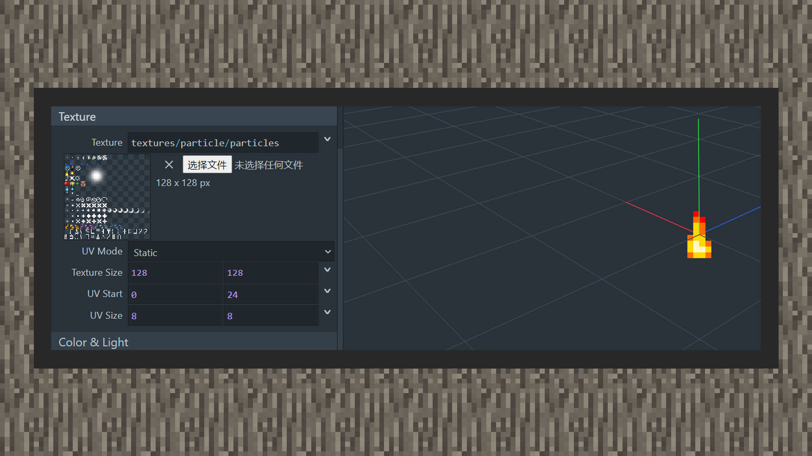
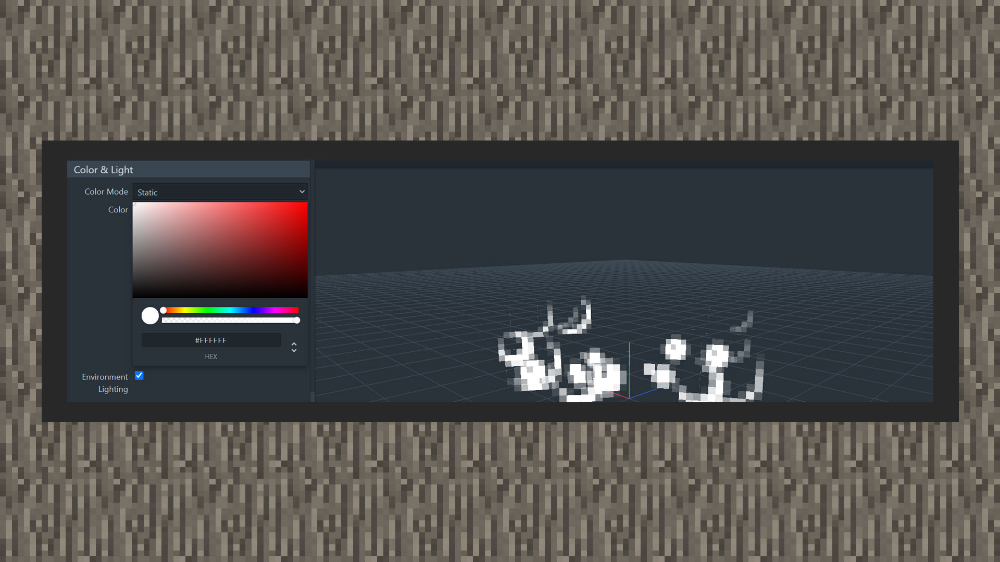

--- 
front: https://mc.res.netease.com/pc/zt/20201109161633/mc-dev/assets/img/3_1.ae73d778.jpg 
hard: advanced 
time: 25 minutes 
--- 
# Rendering particles and shading 

#### Author: Realm 

#### Original particle rendering tutorial 

#### Setting texture 

1) Go to [https://jannisx11.github.io/snowstorm/](https://jannisx11.github.io/snowstorm/) and scroll down to texture. Select the original texture particle, which is located in the particles file of the original texture pack/textures/particle. Since the original particle map is a collection map, it combines multiple particles in one image file, which contains both single particle textures and sequence frames of continuous multiple particle textures. Each single particle texture is 8x8 in size. We set the texture size to 128x128 to match the pixels of the texture file in the hard disk. The UV starting point is the point in the upper left corner. We move the Y axis down 24 pixels, leaving the x axis unchanged, and then set the uv size to 8x8, so that the particle texture is locked on the flame particle. 

 

2) When using sequence frame textures, you need to change the uv mode to animated. Then, under the uv size, new parameters such as uv step, fps (how many frames are played in one second), max frame (maximum sequence frame number), stretch to life time (sequence frame number matches particle duration), and loop (loop sequence frame playback) will be added. 

Take the explosion sequence frame in the sixth column from the bottom of the original particle map as an example. There are 16 continuous textures from left to right, so the maximum sequence frame number should be set to 16, and the fps should be set to a value that can be divided by 16, such as 2 means playing 2 frames per second, and 16 means playing 16 frames in one second. The uv step is set to 8x0, that is, at the end of each frame, the uv increases by 8 pixels to the right and starts playing the next frame. The particle will return to the first frame when the frame number reaches the end. 

Once stretch to life time is checked, the sequence frame number will match the particle life cycle and ignore the fps. For example, if the particle life cycle is 1 second, the sequence frame will play 16 frames in 1 second. If the life cycle is 0.5 seconds, 16 frames will be played in 0.5 seconds, and the FPS is equal to 32 frames per second. 

Check the loop parameter to play the sequence frame in a loop until the emitter is cleared by the game. 

 

#### Special Effect Particle Tutorial 

#### Set Texture 

1) Enter MCSTUDIO, you can quickly create a special effect production template in the new entrance. After creating it and entering the editor, the page will automatically switch to the special effect editor. 

 

2) In the resource entrance list at the bottom center of the page, select the + button of the effects (NetEase version special effects) option. You can choose to create particles or create sequence frames, depending on the type of texture used by the developer when making custom special effects. In the tutorial, we create a particle special effect. 

 

 

3) Click the special effect json file once in the resource management portal, drag the particle map into the portal named map, the particle has a default displacement and life cycle, in order to see the effect immediately, you can switch the right panel to the preview setting in the properties-preview setting. Click the "+" sign in the scene special effect, the default settings do not need to be changed, the particles created before the special effect option is selected, the developer can see the changes of the special effect in the world. 

#### Original particle coloring tutorial 

#### Set color 

1) Click the color&light panel, drag the first slider below to adjust the color hue, drag the second slider to set the color transparency, and click the color wheel to select the color. 

 

2) If there is a color selected in advance, you can directly enter the color code in the input port below. 

3) If you want the particle color to be affected by light, that is, the color will be enhanced and weakened as the game gets brighter and darker. If not checked, the particle color will show the original color at night or day. 

 

4) If you want to set dynamic color, you need to set the color mode to gradient, enter variable.particle_age in the Interpolant window, and adjust the range to 1, so that the particle can play all the colors in the gradient color selection. 

 

#### Special Effect Particle Rendering Tutorial 

#### Set Color 

1) Click the particle's property panel, swipe to the dynamic property fold window, and select dynamic color. If you only want one color, select the same color for the left and right points. 

 

2) If you want multiple colors, you can choose to insert keyframe selection points and select the required color at each selection point. 

 

3) The higher the selection point is, the more opaque it is, and the lower it is, the less transparent it is. 

