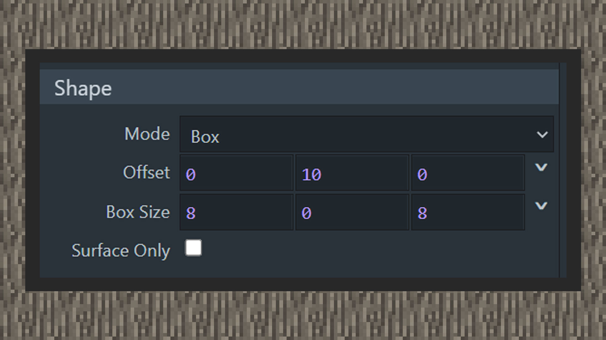
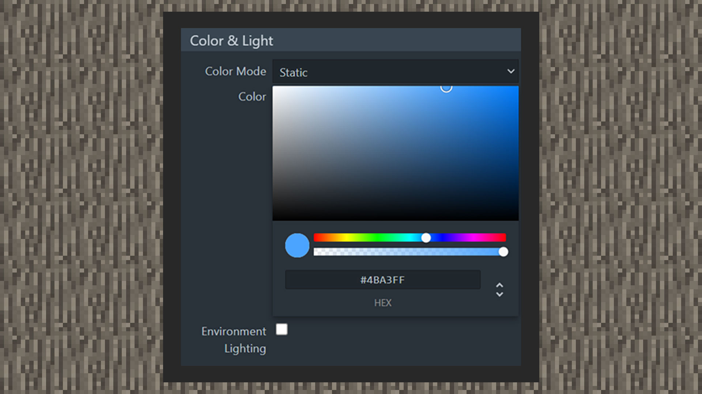
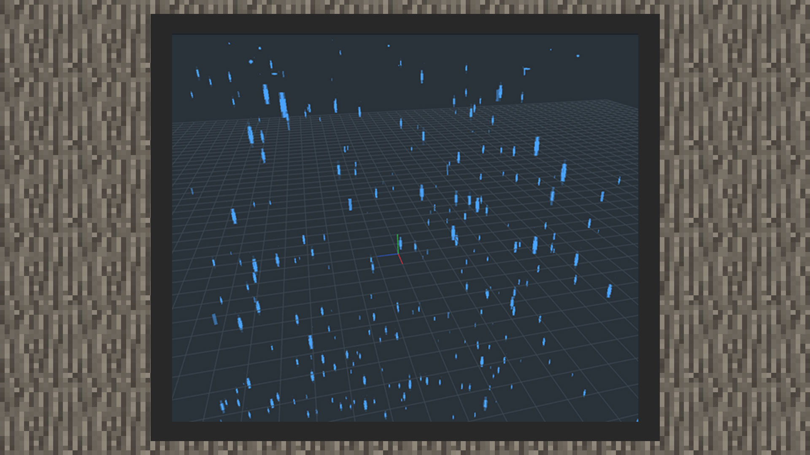

--- 
front: https://mc.res.netease.com/pc/zt/20201109161633/mc-dev/assets/img/5_4.be84bb9e.jpg 
hard: Advanced 
time: 15 minutes 
--- 
# Make particles move 

#### Author: Realm 

#### Rain Particle Tutorial 

#### Create displacement 

1) Select the square particle emitter, adjust the shape of the square emitter to 8,0,8, and reduce the height of the particle emitter to 10 grids. 

 

2) Make a map with only 1 pixel, and use it as the particle map texture, and overlay blue with color overlay. 

 

3) After adding a blue color, the particle turns blue, and the particle size is adjusted to be larger than the width, and a falling blue straight line is drawn. Set the direction to face the ground, and keep the material as the default setting with a transparent channel. 

 

4) Increase the life cycle of the particle, fill in 0, -4, 0 in the acceleration, and provide an acceleration moving downward on the y axis, so that the particle is realized. 

