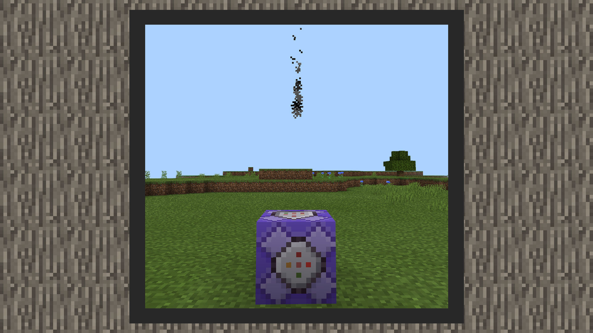
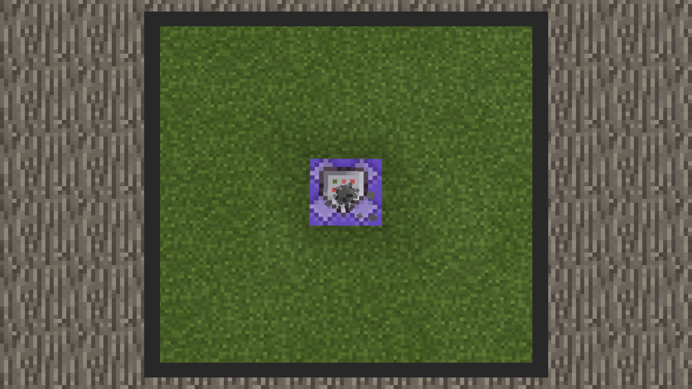
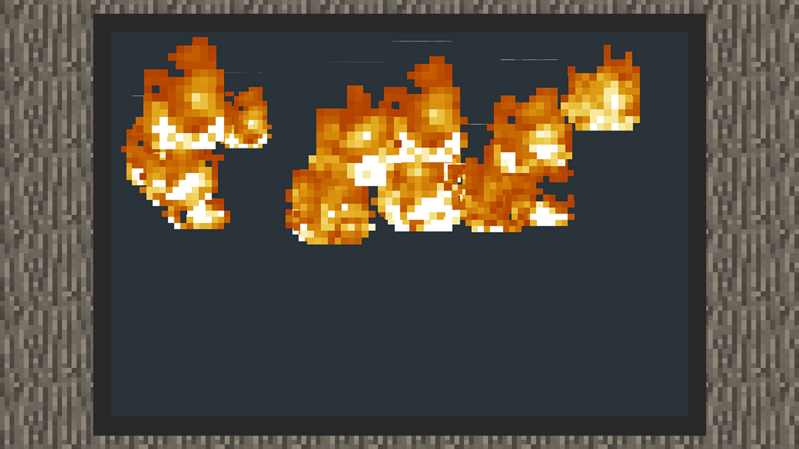
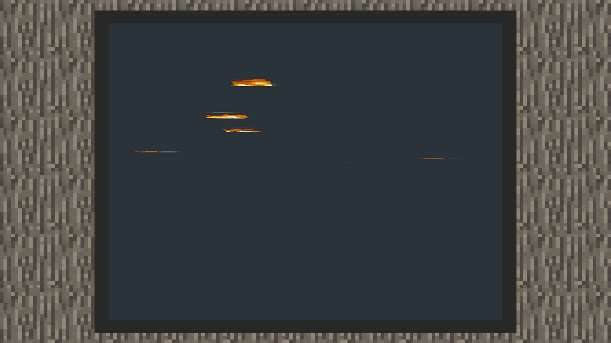
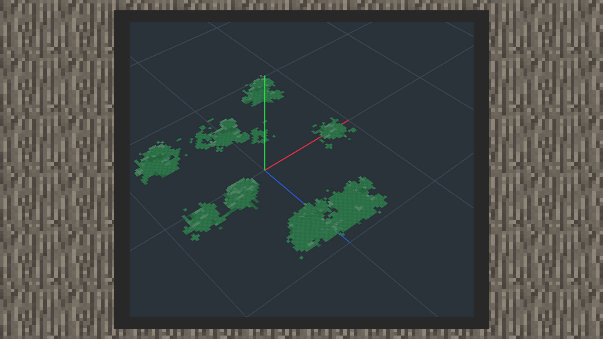

--- 
front: https://mc.res.netease.com/pc/zt/20201109161633/mc-dev/assets/img/7_1.13819fac.jpg 
hard: Advanced 
time: 10 minutes 
--- 
# Identify the orientation of particles 

#### Author: Realm 

#### Facing the camera 

If the developer wants the particles to be the most complete when the player passes by from any angle, such as the smoke particles, heart particles, and angry particles of villagers in the original world, when making original particles or special effect particles, you can choose the orientation of facing the camera. 

 

 

1) In the snowstorm editor, there are two orientations for facing the camera: Rotate xyz and lookat xyz.

2) In the special effects editor of MCSTUDIO, facing the camera is called the orientation mode facing the camera, which can be found in the orientation mode panel. 

#### Facing the ground 

If the developer wants the particle orientation mode to be perpendicular to the Y axis, he can choose the orientation mode facing the ground. In this effect, the developer can see that only part of the particle can be seen when looking down, because the particle map is perpendicular to the horizontal ground. 

 

1) In the snowstorm editor, there are two orientation modes facing the camera: Rotate y and lookat y. 

 

2) In the special effects editor of MCSTUDIO, the orientation mode facing the ground can be found in the orientation mode panel. 

#### Facing direction 

If the developer wants the particle orientation to face a certain direction, such as wanting the particle texture to fit tightly with the ground, or wanting the particles to fit tightly on a billboard, the facing direction orientation should be used. 

1) In the snowstorm editor, there are three facing direction orientations: Direction x, Direction y, and Direction Z. Note: To use this mode, you need to change the motion mode to Parametric, and then set the Direction under the Motion panel, so that the particles will be displayed normally in the world. 

 

2) In the special effects editor of MCSTUDIO, the horizontal orientation is equivalent to the Direction Z of the original particles.