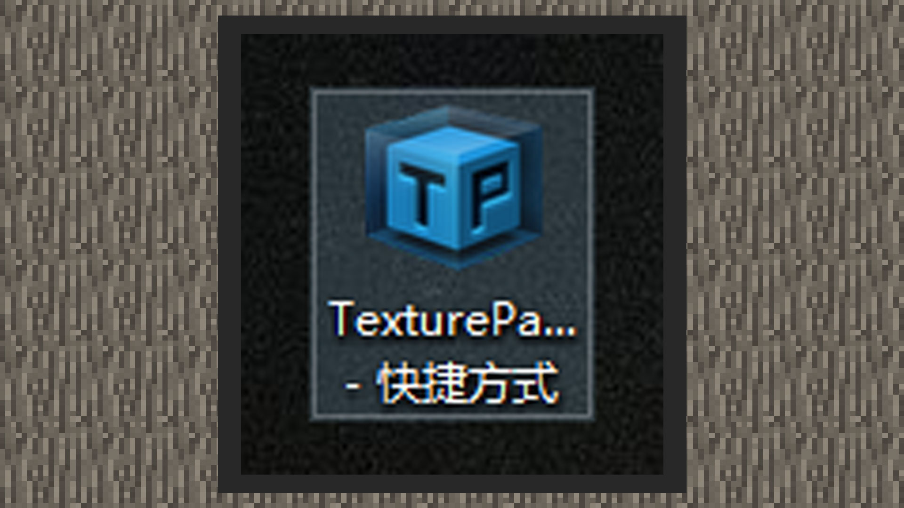

--- 
front: https://mc.res.netease.com/pc/zt/20201109161633/mc-dev/assets/img/8_1.7818512f.jpg 
hard: Advanced 
time: 10 minutes 
--- 
# Use sequence frames to enhance the effect 

#### Author: Realm 

#### Configure sequence frame files 

1) When making original particles and special effect particles, using dynamic textures with continuity can enhance the visual effect of particles. The sequence frame textures of original particles do not require additional configuration files. You only need to use the snowstorm editor to set the FPS, maximum frame number, uv and other parameters. The sequence frames of special effect particles need to be packaged with the TexturePacker software and output a configuration file before they can be used by the special effect editor. 

 

2) When using texturepacker to pack sequence frames, the following configurations need to be noted: 

Allow rotation should not be checked; 

Trim mode should be set to None; 

In this way, each small image in the exported large image is the same size. The sequence frames supported by the current special effects editor only support sub-images of the same size. 

At the same time, the sequence frame texture has the following specifications: 

The texture format is png; 

The maximum size of a single texture of the original particle is no more than 2048x2048; 

The size of a single texture of special effect particles is no more than 512x512;