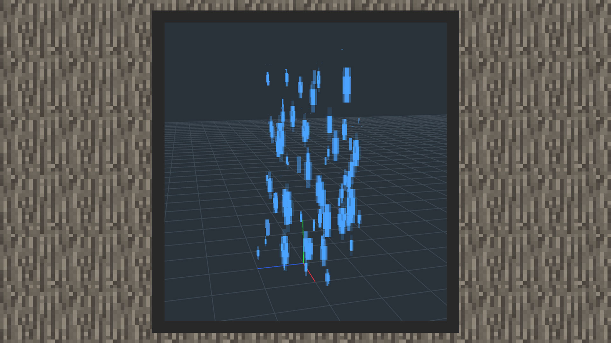
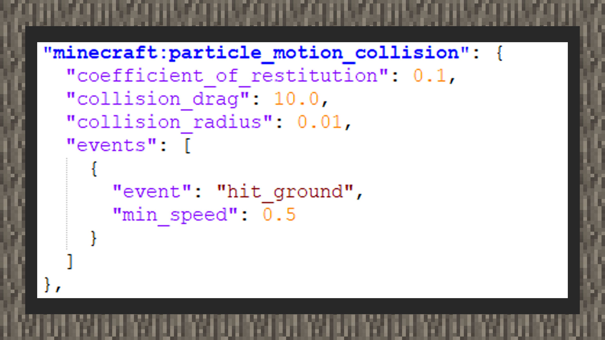
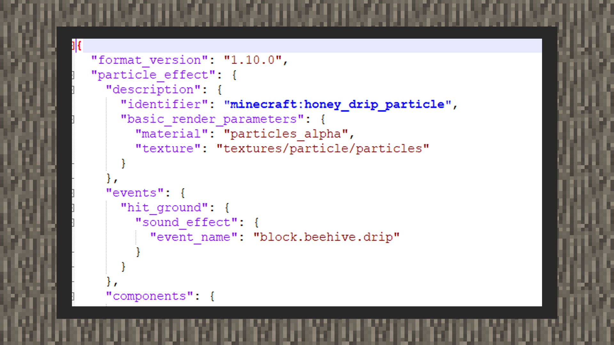

--- 
front: https://mc.res.netease.com/pc/zt/20201109161633/mc-dev/assets/img/9_1.045044b5.jpg 
hard: advanced 
time: 15 minutes 
--- 
# Understanding particle collisions and events 


#### Author: Realm 


#### Collision generation 

1) This function can only be used for original custom particles. 

2) Open the snowstorm editor, pull down to the collision panel, and enter true in the Enable window, where collision drag represents the drag on the particle after the particle collides with the environment. The larger the value, the greater the drag after the particle collides with the environment, and the particle may slow down to a stop; the smaller the value, the particle may follow the displacement of the environment block. Bounciness represents the elasticity of particles after they collide with the environment. The greater the elasticity, the greater the rebound force between particles and environmental blocks. The smaller the elasticity, the smaller the rebound force between particles and environmental blocks. Multiple bounces may occur. The value range is between 0.0 and 1.0. Collision Radius is used to minimize the overlap between particles and environmental blocks. This value must be between 0.0 and 0.5. If it is not set, some areas of the particle map may fall into the blocks. Expire on Contact means that particles will self-destruct when they collide with the environment. 

 

[Square emitter rain particles that self-destruct after colliding with the environment. You can see that the particles will not continue to seep after falling on the coordinate axis] 

#### Trigger event 

1) This function can only be used for original custom particles, and it has not yet been implemented in the snowstorm editor. Developers need to configure it manually. 




```
{
    "format_version":"1.10.0",
    "particle_effect":{
        "description":{
            "identifier":"...",
            "basic_render_parameters":{
                "material":"particles_alpha",
                "texture":"textures/particle/particles"
            }
        },
        "events":{
            "hit_ground":{
                "sound_effect":{

"event_name":"..." 
} 
} 
}, 
"components":{ 
"minecraft:particle_motion_collision":{ 
"coefficient_of_restitution":0.1, 
"collision_drag":"10.0", 
"collision_radius":0.01, 
"events":[ 
{ 
"event":"hit_ground", 
"min_speed":0.5 
} 
] 
} 
} 
} 
} 
``` 

2) Minecraft:particle_motion_collision is required to specify the event name. Multiple events can be triggered. Min_speed means the shortest time to trigger the event. 




```
{
    "format_version":"1.10.0",
    "particle_effect":{
        "description":{
            "identifier":"...",
            "basic_render_parameters":{
                "material":"particles_alpha",
                "texture":"textures/particle/particles"
            }
        },
        "events":{
            "hit_ground":{
                "sound_effect":{
                    "event_name":"block.beehive.drip"
                }
            }
        }
    }
}
```


3) Define events under particle_effect and play sound effects. The sound effects are based on the sound effect resource path name in sound_definitions.json.