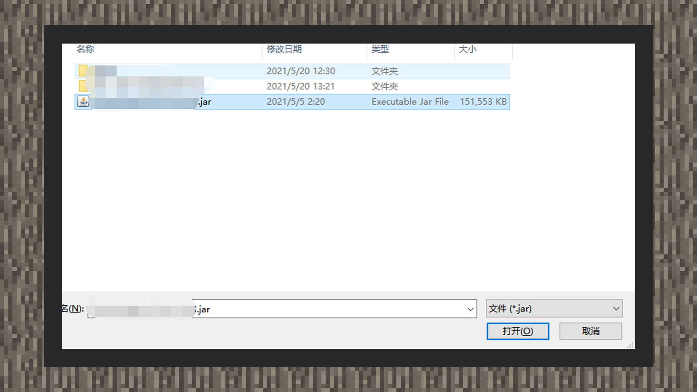
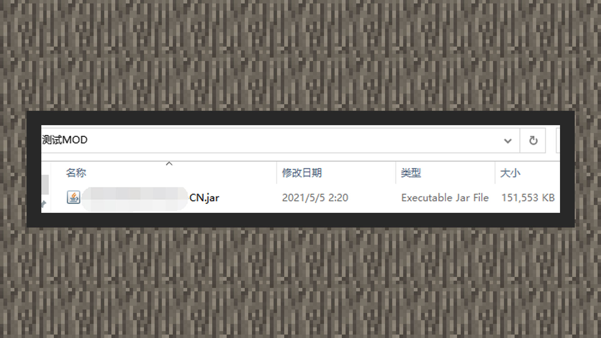
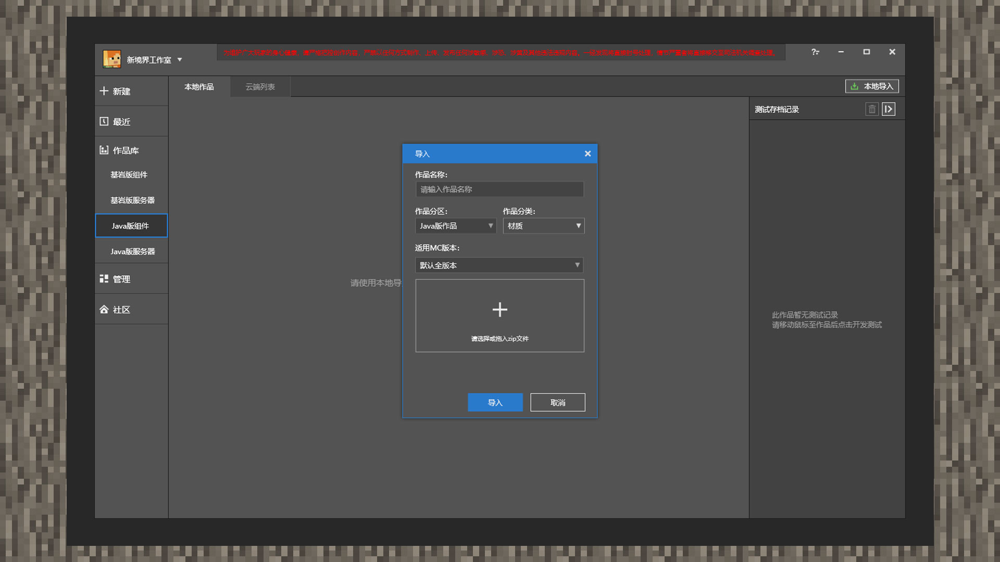
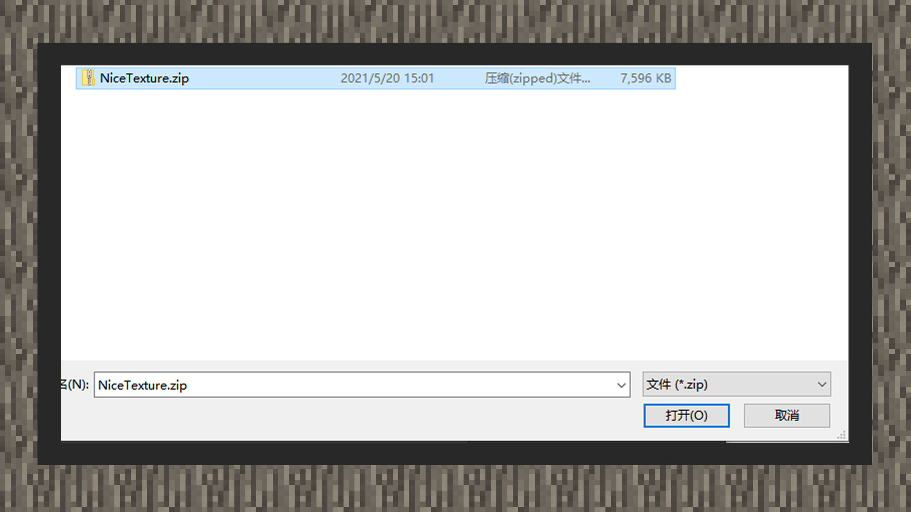
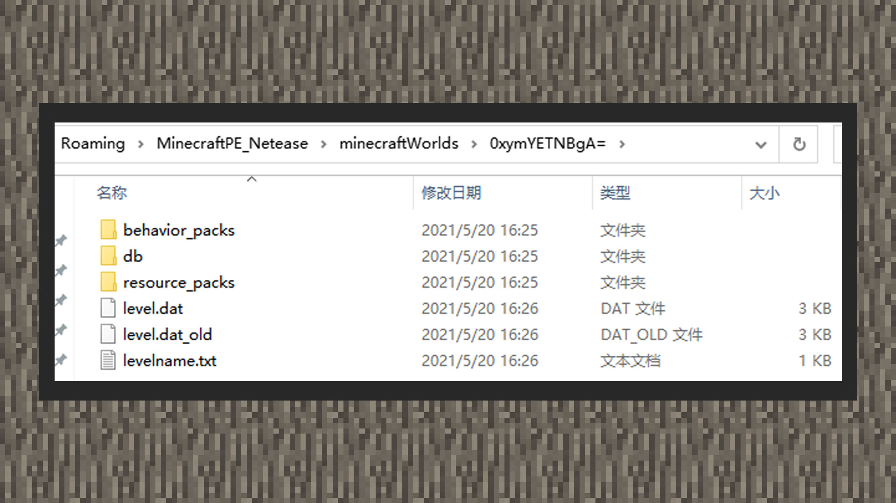

--- 
front: https://mc.res.netease.com/pc/zt/20201109161633/mc-dev/assets/img/1_1.dc5d5f44.jpg 
hard: Advanced 
time: 20 minutes 
--- 
# Package structure and import 

#### Author: Realm 

Package is also called Package. It is a compressed and packaged file by the developer that contains the local JAVA version resource content and the Bedrock version resource content. After the uploaded package is obtained from the Chinese version developer platform, it will be pushed to the public download server after machine review and manual review. Finally, the player downloads the compressed package and decompresses it on the client to play the component resources. 

Before uploading to the platform, the developer should ensure that the content developed locally has achieved the expected running effect. And compress and package it according to the packaging method in this chapter to reduce the probability of rejection or review time of machine review.

### Understanding the JAVA package structure 

#### PC map 

 

1) The screenshot shows the contents of the world archive generated by the Minecraft JAVA version 1.12.2 game client. The test folder contains the world information named test. 

 

2) Open this client to see the test archive. 

 

3) Return to the previous level of the directory, and the saves folder will contain all the archive folders that can be started by this client, including the test archive mentioned above. 

 

4) Open MCSTUDIO, click the work library, and then click the Java version component. Click Local Import in the upper right corner, and select the Java version work in [Work Partition]. Select the map in [Work Category]. [Applicable MC version] Select the corresponding archived version. If multiple versions are supported, you can select multiple corresponding versions. 

 

5) Click the + button in the import form, directly select the test folder and click Select Folder. 

 

6) Finally, click the Import button to copy the work from MCSTUDIO and import it into the work library for subsequent testing, publishing, configuration and other operations. If the developer chooses to delete the work, it will not affect the original archive folder. 

 

7) If the developer does not use MCSTUDIO but chooses to package it by himself, please use the 7Z compression tool to package the archive folder into a compressed document with the suffix 7z. Then upload it through the developer platform. 

#### PC MOD 

 

1) The MOD file uploaded to the platform must be in jar format as the standard file format for distribution to players. 

 

2) Open MCSTUDIO, click on the work library and then click on the Java version component. Click Local Import in the upper right corner, and select the Java version work in [Work Partition]. Select Mod in [Work Category]. Select the corresponding archived version in [Applicable MC Version]. If multiple versions are supported, you can select multiple corresponding versions. 

 

3) Click the + button in the import window, double-click directly or select the jar file and select Open. 

 

4) Finally, click the Import button, and MCSTUDIO can copy the work and import it into the work library for subsequent testing, publishing, configuration and other operations. If the developer chooses to delete the work, it will not affect the original jar file. 

 

 

5) If the developer chooses to package by himself instead of using MCSTUDIO, please put the jar file into a folder and compress the folder into a compressed package with a 7z suffix using the 7z compression tool. Then upload the component resource source document through the developer platform. 

#### PC material 

 

1) The screenshot mainly shows the directory and file structure of the JAVA version material. 

 

2) Select all the contents in the material folder and right-click to save it as a zip compressed document. 

 

3) Open MCSTUDIO, click the work library and then click the Java version component. Click Local Import in the upper right corner, and select the Java version work in [Work Partition]. Select the material in [Work Category]. Select the corresponding archived version in [Applicable MC version]. If multiple versions are supported, multiple corresponding versions can be selected. 

 

4) Click the + button in the import window, double-click directly or select the zip file and choose Open. 

 

5) Finally, click the Import button, and the work can be copied by MCSTUDIO and imported into the work library for subsequent testing, publishing, configuration and other operations. If the developer chooses to delete the work, it will not affect the original material compression file. 

 

6) When the developer chooses to package it by himself instead of using MCSTUDIO, please put the material compression document into a folder and compress the folder into a compressed package with a 7z suffix format using the 7z compression tool. Then upload the component resource source document through the developer platform. 

#### PC Light and Shadow 

 

1) The screenshot mainly shows the content directory and file structure of the JAVA version of Light and Shadow. 

 

2) Select all the files in the folder and save them as a zip compressed document with right click. 

 

3) Open MCSTUDIO, click the Works Library and then click the Java version component. Click Local Import in the upper right corner, select the Java version work in [Works Partition]. Select Light and Shadow in [Works Category]. Select the corresponding archived version in [Applicable MC Version]. If multiple versions are supported, multiple corresponding versions can be selected. 

 

4) Click the + button in the import window, double-click directly or select the zip file and select Open. 

 

5) Finally, click the Import button to copy the work from MCSTUDIO and import it into the work library for subsequent testing, publishing, configuration and other operations. If the developer chooses to delete the work, it will not affect the original light and shadow compression file. 

6) If the developer does not use MCSTUDIO but chooses to package it by himself, please put the light and shadow compression file into a folder and compress the folder into a compressed package with a 7z suffix format using the 7z compression tool. Then upload the component resource source document through the developer platform. 

#### PC skin 

 

1) The screenshot mainly shows the file format supported by PC skin resources, which is a picture file ending with png. This format of picture saves a transparent channel. 

 

2) Open MCSTUDIO, click the work library and then click the Java version component. Click Local Import in the upper right corner, and select the Java version work in [Work Partition]. Select the skin in [Work Category]. Select the default selection of all versions in [Applicable MC Version]. 

 

3) Click the + button in the import window, double-click directly or select the png file and choose Open. 

 

4) Finally, click the Import button, and the work can be copied by MCSTUDIO and imported into the work library for subsequent testing, publishing, configuration and other operations. If the developer chooses to delete the work, it will not affect the original image file. 

5) If the developer chooses to package it by himself instead of using MCSTUDIO, please upload the skin component source image file directly through the developer platform. 

#### PC gameplay 

 

1) The screenshot captures the content of the map generated by the Minecraft JAVA version 1.12.2 game client. The test folder stores the world information named test. The command block gameplay, data package, etc. are carried by the Minecraft JAVA version map. 

 

2) Open this client to see the test archive. 

 

3) Return to the previous level of the directory, and the saves folder will contain all the archive folders that can be started by this client, including the test archive mentioned above. 

 

4) Open MCSTUDIO, click the work library and then click the Java version component. Click Local Import in the upper right corner, select the Java version work in [Work Partition]. Select the gameplay in [Work Category]. Select the corresponding archive version in [Applicable MC Version]. If multiple versions are supported, you can select multiple corresponding versions. 

 

5) Click the + button in the import window, directly select the test folder and click Select Folder. 

 

6) Finally, click the Import button, and MCSTUDIO will copy the work and import it into the work library for subsequent testing, publishing, configuration, and other operations. If the developer chooses to delete the work, it will not affect the original archive folder. 

 

7) If the developer chooses to package the archive folder by themselves instead of using MCSTUDIO, please use the 7Z compression tool to package the archive folder into a compressed file with the suffix 7z. Then upload it through the developer platform. 

### Understanding the structure of the Bedrock Edition package 

#### PE map 

 

1) The screenshot captures the contents of the world archive generated by the Minecraft Bedrock Edition 1.16.12 game client. The folder with the English and number combination name stores the world information of the archive. 

 

2) Open MCSTUDIO, click the work library, then click the Bedrock Edition component, and select [Map] in the category. If you check [Copy files to default folder], MCSTUDIO will copy the map completely to C:/MCStudioDownload/work/Developer ID/Cpp/Map. If you do not check it, this operation will not be performed. 

 

3) When the option is checked, click the + sign in the form. When the option is not checked, click the selection button in the form. Double-click the archive folder or select a folder and click the [Select Folder] button. 

 

4) Finally, click the Import button, and MCSTUDIO will copy the work and import it into the work library for subsequent testing, publishing, configuration, and other operations. If the developer chooses to delete the work and the work checks [Copy files to default folder], the system will delete the corresponding copy folder under C:/MCStudioDownload/work/Developer ID/Cpp/Map. 

 

5) If the developer chooses to package by himself instead of using MCSTUDIO, please use any compression tool to package the entire archive folder into a compressed document with the suffix zip. Then upload it through the developer platform. 

#### PE online map 

 

1) The screenshot captures the contents of the world archive generated by the Minecraft Bedrock Edition 1.16.12 game client. The folder with the English and numerical combination name stores the world information of the archive. Online maps refer to map resources that can be used locally, locally online, and in online lobbies at the same time. 

 

 

2) If the world archive carries additional pack gameplay, please make sure that there are world_behavior_packs.json and world_resource_packs.json files in the archive folder directory. Among them, pack_id corresponds to the uuid under the header in the material pack or behavior pack manifest. Version corresponds to the version under the header in the manifest. If only the material pack or behavior pack is carried, you can clear all the contents in the first square bracket in world_behavior_packs.json or world_resource_packs.json. If you do not carry additional packs, you do not need to carry such files in the archive folder. 

 

3) Developers can place a server.properties file in the archive to specify the player's game mode. In this way, when playing this online map in the online lobby, the player will enter the game mode set in the server.properties file each time. For more configuration settings of Bedrock Edition multiplayer online maps, please refer to the website [https://minecraft.fandom.com/zh/wiki/Server.properties#.E5.9F.BA.E5.B2.A9.E7.89.88_3](https://minecraft.fandom.com/zh/wiki/Server.properties#.E5.9F.BA.E5.B2.A9.E7.89.88_3) 

4) Currently, MCSTUDIO does not support importing online lobby maps. Please use any compression tool to package the entire archive folder into a compressed file with the suffix zip. Then upload it through the developer platform. 

#### PE Addon 

 

1) The screenshot shows the contents of the Minecraft Bedrock Edition Addon. Addon is also called an add-on pack, which consists of a texture pack and a behavior pack. Therefore, when developers upload the complete add-on pack content (including add-on packs and behavior packs), they only need to package and upload it according to the following specifications. Please note: in the add-on packs uploaded to the Chinese version platform, the behavior pack must carry the entities folder, and the texture pack must carry the textures folder. 

 

 

2) Open MCSTUDIO, click the Works Library, and then click the Bedrock Edition Component. If you check [Copy files to default folder], please select all behavior packs and material packs, right-click and use the compression tool to compress them into a zip document. MCSTUDIO will put a complete copy to C:/MCStudioDownload/work/Developer ID/Cpp/AddOn after importing the zip document. If you do not check it, just select the folder with the behavior pack or material pack. Finally, click Import. After that, the developer can perform subsequent testing, publishing, configuration and other operations in MCSTUDIO. 

3) If the developer does not use MCSTUDIO but chooses to package by himself, please select all behavior packs and material packs, right-click and use the compression tool to compress them into a zip document. Then upload it through the developer platform. 

#### PE material 

 

1) Add-on packs are a general term for behavior packs and texture packs, so texture packs are counted as a type of add-on pack. Therefore, before developers upload the complete texture pack content, they must package and upload it according to the following specifications. Please note: the texture pack uploaded to the Chinese version platform must carry the textures folder. 

 

 

2) Open MCSTUDIO, click on the work library and then click on the Bedrock Edition component, click on local import in the upper right corner, select [Bedrock Edition Works] in the partition, and select [Skin] in the category. If you check [Copy files to default folder], right-click the texture pack folder and use the compression tool to compress it into a zip file. After importing the zip file, MCSTUDIO will put a complete copy under C:/MCStudioDownload/work/Developer ID/Cpp/Material. If you do not check it, just select the folder with the texture pack. Finally, click Import, and then the developer can perform subsequent testing, publishing, configuration, and other operations in MCSTUDIO. 

3) If the developer does not use MCSTUDIO but chooses to package by himself, please right-click the texture package folder and use the compression tool to compress it into a zip document. Then upload it through the developer platform. 

#### PE Light and Shadow 

 

1) The contents of light and shadow are all saved in the texture package folder, so the operation mechanism and packaging mechanism are similar to the texture package. Therefore, before the developer puts the complete light and shadow content on the shelf, it must be packaged and uploaded in accordance with the following specifications. Please note: the texture package put on the Chinese version platform must carry the textures folder. 

 

 

2) Open MCSTUDIO, click on the Works Library and then click on the Bedrock Edition Components. Click on Local Import in the upper right corner, select [Bedrock Edition Works] in the partition, and select [Light and Shadow] in the category. If you check [Copy files to default folder], right-click the folder of the light and shadow texture pack and use the compression tool to compress it into a zip file. After importing the zip file, MCSTUDIO will put a complete copy to C:/MCStudioDownload/work/Developer ID/Cpp/Light. If you do not check it, just select the folder of the texture pack with light and shadow. Finally, click Import. After that, developers can perform subsequent testing, publishing, configuration and other operations in MCSTUDIO. 

3) If the developer does not choose to package by himself through MCSTUDIO, right-click the folder of the texture pack with light and shadow and use the compression tool to compress it into a zip file. Then upload it through the developer platform. 

#### PE skin 

 

1) The screenshot mainly shows the file format supported by PE skin resources, which is a picture document ending in png. Pictures in this format save a transparent channel. 

 

2) Open MCSTUDIO, click on the Works Library and then click on the Bedrock Edition component, click on Local Import in the upper right corner, select [Bedrock Edition Works] in the partition, and select [Skin] in the category. Simply click the + sign to select the skin image ending in png. 

3) If the developer chooses to package by himself instead of using MCSTUDIO, please upload the skin file directly through the developer platform. 

