--- 
front: https://mc.res.netease.com/pc/zt/20201109161633/mc-dev/assets/img/2_1.9097d2e2.jpg 
hard: Advanced 
time: 15 minutes 
--- 
# Export package 

#### Author: Realm 

When editing, testing, and putting works on the shelves, developers may need to back up the package. Now after importing the package using the MCSTUDIO platform, you can export the package to any location on the local computer. 

### Export JAVA package 

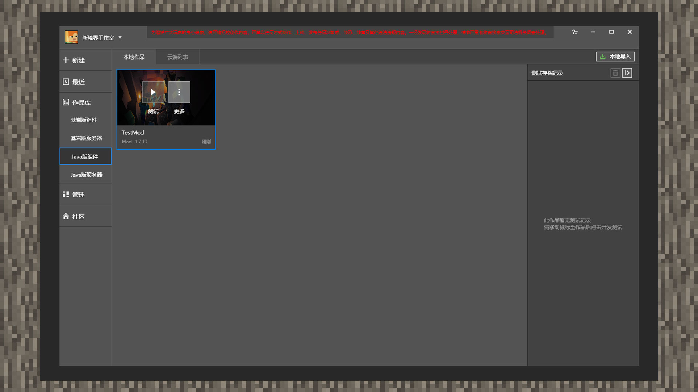 

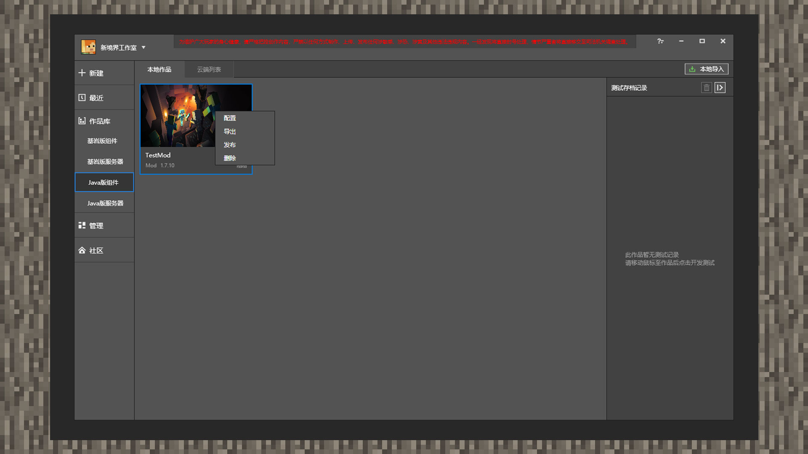 

1) Open MCSTUDIO, click the Works Library, and then click the Java version component. Place the mouse on a single component form until the [More] button appears. Then click [More], and then click [Export]. 

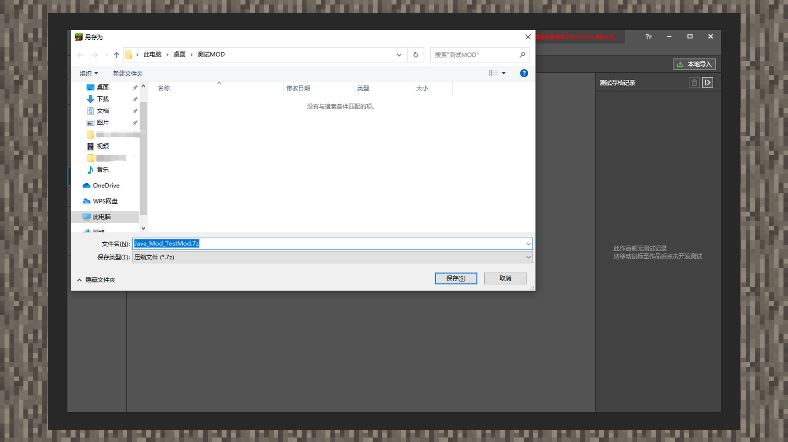 

2) Enter the [Save File As] interface and select the desired path to export. 

### Export of Bedrock Edition Package 

#### Map Resources 

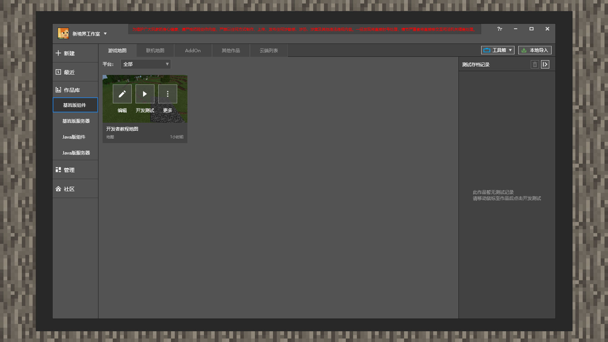 

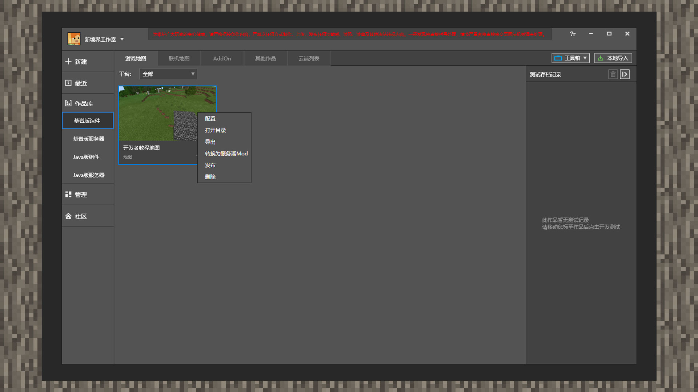 

1) Open MCSTUDIO, click the work library and then click the Bedrock Edition component, and select [Game Map] in the component label category. Move the mouse over the single component window until the [More] button appears. Then click [More] and then click [Export]. 

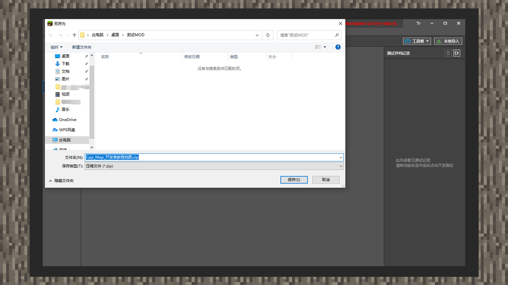 

2) Enter the [Save File As] interface and select the desired path to export. 

#### Addon Resources 

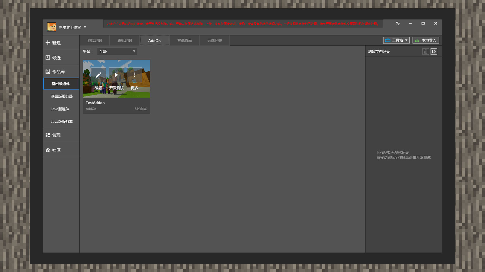 

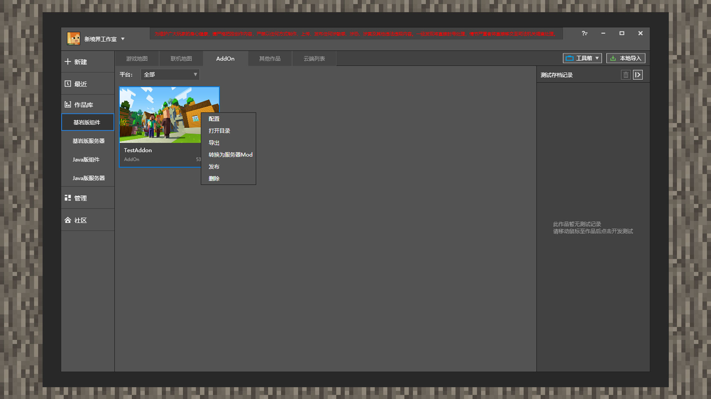 

1) Open MCSTUDIO, click the work library and then click the Bedrock Edition component, and select [AddOn] in the component label category. Move the mouse over the single component window until the [More] button appears. Then click [More] and then click [Export]. 

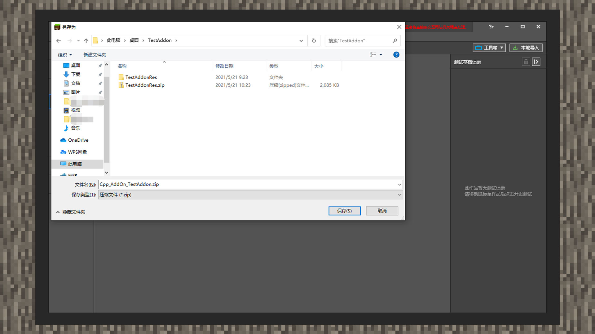 

2) Enter the [Save File As] interface and select the desired path to export. 

#### PE Lighting/Material/Skin 

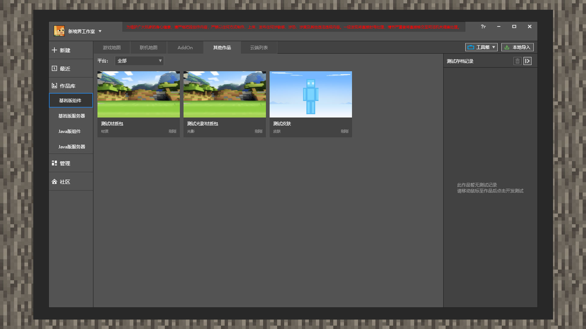 

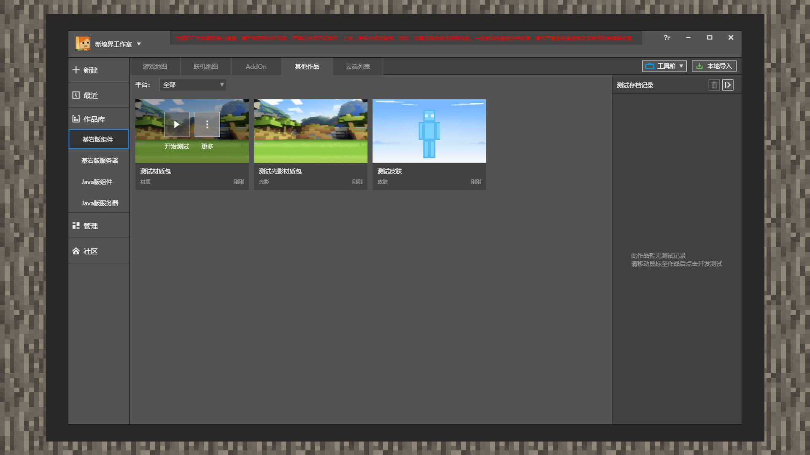 

1) Open MCSTUDIO, click the Works Library and then click the Bedrock Edition component, and select [Other Works] in the component label category. Move the mouse over the single component form until the [More] button appears. Then click [More] and then [Export]. 

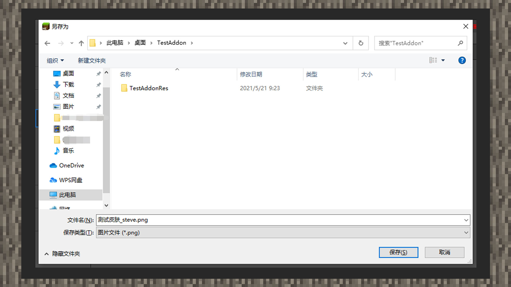 

2) Enter the [Save File As] interface and select the desired path to export.