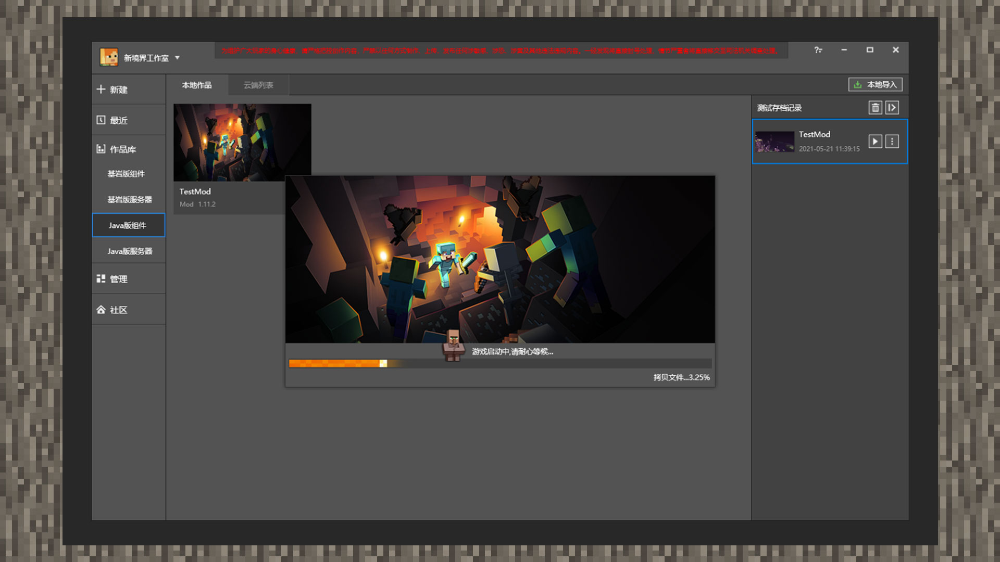
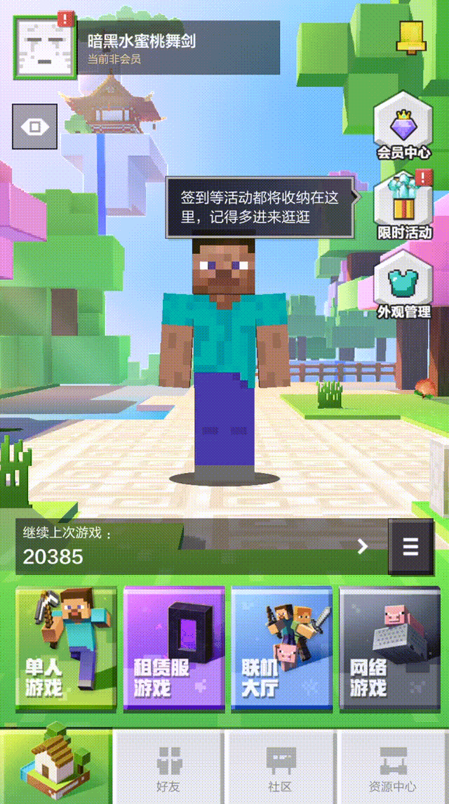
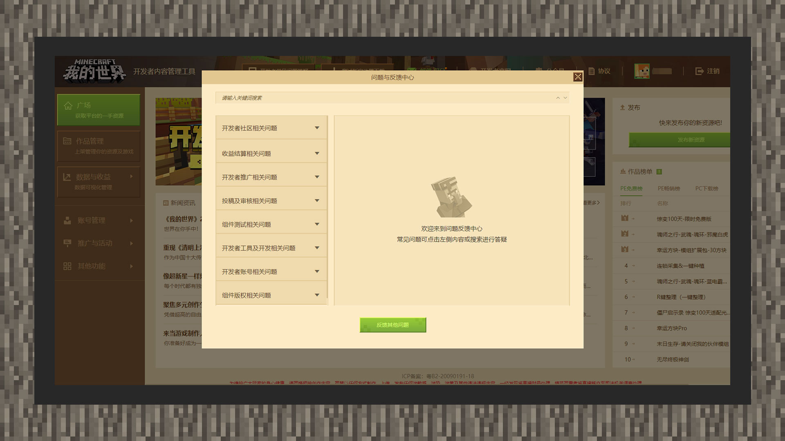

--- 
front: https://mc.res.netease.com/pc/zt/20201109161633/mc-dev/assets/img/3_2.0bf61735.jpg 
hard: Getting Started 
time: 10 minutes 
selection: true 
--- 
# Test your work on mobile phones and computers 

#### Author: Realm 

When testing your work, developers may need to use a mobile phone environment to test their work. Now that you can use MCSTUDIO to publish resources with one click and upload them to the self-test platform, you can use the self-test mobile phone development client for testing. 

## Download the beta version of Minecraft from MCSTUDIO 

1. Open MCSTUDIO and click [Toolbox] in the upper right corner. Select the second option [Mobile Tester]. 

 

2. MCSTUDIO will automatically jump the current page to the QR code link of the [Developer Platform Embedded Page]. Developers can download the mobile test client by scanning the QR code on their mobile phones. 

 

## Use MCSTUDIO and mobile devices to test works 

Through the first section of this chapter [Package Structure and Import] tutorial, developers should have a preliminary grasp of MCSTUDIO's work import function. Not only that, developers can also test components through MCSTUDIO and upload component resources to the developer platform for review and listing. Bedrock Edition components also support self-testing functions. Self-testing components do not need to be manually reviewed. As long as the components pass the machine-reviewed packaging process, developers can download test resources through the mobile test client. Let's see how to achieve these desired goals. 

 

 

1. Open MCSTUDIO, click [Library], and then click [Bedrock Edition Components]. Hover the mouse over the resource form until the [More] button appears, and click the [More] button. Click the [Publish] button again. 

 

2. MCSTUDIO will jump to the [Publish Resources] window of the [Developer Platform Embedded Page] and automatically prepare to upload resources. Developers only need to fill in basic information, charging model, promotional materials, etc. Finally, remember to click the [Save] button. 

 

3. The created Bedrock Edition resources are in the [Pending for Review] state. In this state, developers can choose to self-test. The self-tested components will eventually be put on the developer self-test mobile client. **Please note: If the developer has set a paid price, they can first change the charged components that require self-testing to free, and then change it back to the original price before submitting for review after the self-test is completed. ** 

 

4. You need to create a new account when logging in to the self-test mobile client, and you can only see your own self-tested components in the resource center. 

## Single-player test environment 

 

 

1. JAVA version resources can only be tested using a PC. On the MCSTUDIO main interface, click [Library], then click the [Local Works] category. Hover the mouse over the resource window until the [Test] button is displayed, then click the [Test] button. 

 

 

2. Bedrock Edition resources can be tested using the mobile self-test client or the MODPC client. Click [Library] on the main interface of MCSTUDIO, and then click the label category where the resource is located. Hover the mouse over the resource window until the [Development Test] button is displayed, then click the [Development Test] button. 

 

3. Before the computer starts the resource, the system may need to download the JAVA version client or the Bedrock Edition MODPC client that the resource depends on. Please wait patiently. 

## Multiplayer online test plan 

Currently MCSTUDIO supports **local ModPC LAN connection** and **using developer sub-accounts to connect on the mobile test terminal**. 

### Local ModPC LAN connection 

 

1. Start the MODPC client or click the corresponding resource for [Development Test]. 

 

2. You can see the archive rooms created by others in the LAN game. Click to enter to test the components online. 

### Use developer sub-accounts to connect to the mobile test terminal 

1. Before using the mobile test terminal to test the gameplay with other members, you need to set the member as a developer sub-account first. For information about adding developer sub-accounts, <a href="../../../mcguide/32-Developer Account and Team/Course 15-Use Member Management Module to Achieve Multi-Account Collaboration.html">Click this link to query</a>. 
2. After confirming that you have joined the member sub-account, please enter the mobile test terminal. Enter **[Online Lobby]** on the homepage, select **[Local Connection]**, and then select **[Custom Connection]** again. After you create the room, other members can find your room in the **[Custom Connection]** area. 

 

## Find your problem 

If you encounter a bug in the development of module gameplay, you can check the solution of the relevant problem on the developer's official website, <a href="../../../mcguide/20-Gameplay Development/13-Module SDK Programming/9-Mod Development BUG Solution.html">Please click this link to query</a>.

## Developer FAQ 

 

When uploading components or settling revenue, if you encounter some common problems, you can find the corresponding solutions in the "Minecraft" Developer Platform - [Developer FAQ]. If you can't find a solution to the relevant problem, you can open [[Developer FAQ] - [Feedback Other Issues] Form](https://mcdev.webapp.163.com/#/feedbackModal?target=browser) and submit the corresponding problem. The official will inform you of the processing progress or results through in-site emails and text messages. 

