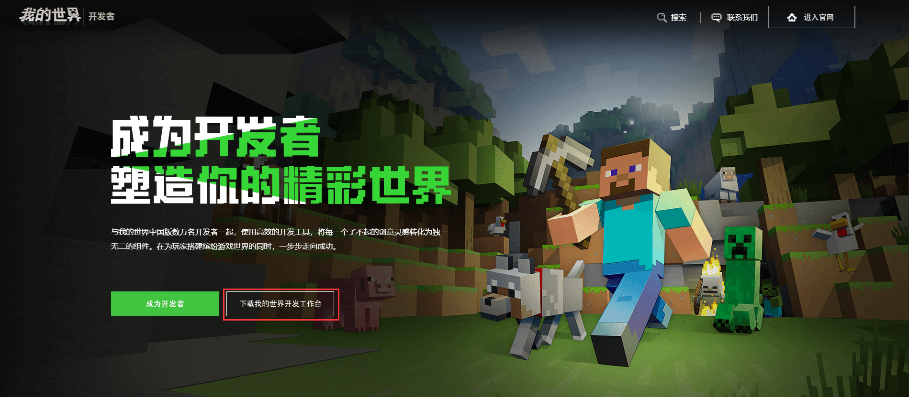
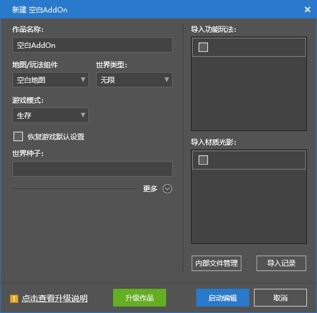

--- 
front: https://nie.res.netease.com/r/pic/20211104/69055361-2e7a-452f-8b1a-f23e1262a03a.jpg 
hard: Getting Started 
time: 10 minutes 
--- 
# Create the first blank Bedrock Edition component work 

**Minecraft Development Workbench** (**MC Studio**) is an integrated development tool that integrates developer launcher, map editor, level editor, logic editor, special effects editor, cloud testing platform and other functions. Its easy-to-use operation and simple and easy-to-understand visual interface can provide great convenience for our development work. 

Next, we use the Minecraft Development Workbench to create the first gameplay component work for the Bedrock Edition of Minecraft! 

## Download Minecraft Development Workbench 

Minecraft Development Workbench can be downloaded from the Minecraft Developer Official Website ([https://mc.163.com/dev/](https://mc.163.com/dev/)). Enter the official website and click "Download Minecraft Development Workbench" to start downloading. After the download is complete, click the installation package to start the installation and wait for the installation to complete. 

 

After the installation is complete, a shortcut to "**Minecraft Developer Launcher**" will appear on the desktop. Double-click to open it, enter the developer account password in the login interface to log in, and you can view the main interface of the Minecraft Development Workbench. 

 

## Create a new component 

In the above picture, we can see that there is a vertical navigation bar on the left side of the window, which is the tab for many functions of the Minecraft Development Workbench. We click the "+New" button to jump to the new component page. 

 

The **Component** here refers to a collection of modules and map files that can exist independently as a work. We only need to click "**Blank Map**" or "**Blank AddOn**" to create a new Bedrock Edition blank component. Of course, after you are familiar with the structure of the component, you can also use the various **templates** below to quickly generate some components with certain initial functions. Here we only want to create a blank component that does not contain a map, that is, a blank **Add-on** component, so we click the "Blank AddOn" button above. At this time, we see a pop-up window: 

 

After configuring according to your needs, click "Start Editing" to open the **Editor** of Minecraft Development Workbench. At this point, we have successfully created a blank add-on component! After that, you can show your skills on this blank component, give full play to your imagination and technical skills, and start your Minecraft development journey! 

