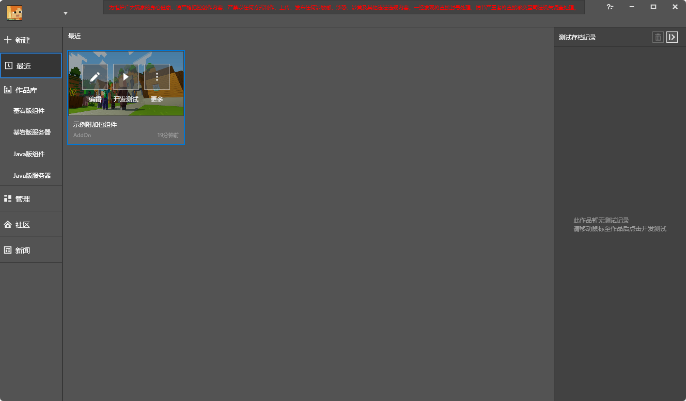
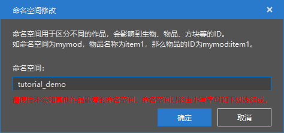
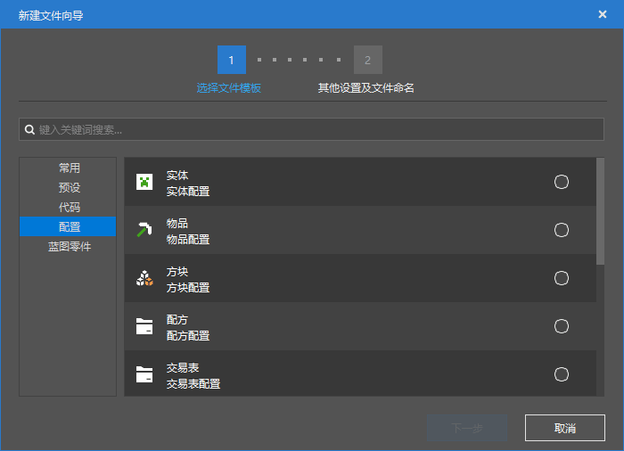
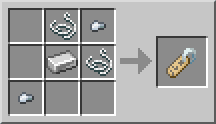

--- 
front: https://nie.res.netease.com/r/pic/20211104/69055361-2e7a-452f-8b1a-f23e1262a03a.jpg 
hard: Getting Started 
time: 15 minutes 
--- 

# Customize a new crafting recipe using recipe configuration 

Next, we use the level editor to add a custom recipe. But before that, we first need to be familiar with the editor interface and the difference between the old and new editors. 

## Old and new editors 

For a long time, the editor used by the Minecraft development workbench is a software now called the old version editor. In the latest version, we introduced the new version editor, which is a reconstruction of the old version editor, introducing most of the functions of the old version editor, and optimizing many functions, making the development of modules more convenient and efficient. 

Initialization page of the old editor: 

 

Initialization page of the new editor: 

 

### Upgrade component works to new version editor works 

At the end of the previous section, our operation will open the old version editor by default. In order to make our work development more effective, we will use the new version editor to explain in the next tutorial. So we need to upgrade our works to the new version editor works. Let's first switch to the "**Recent**" tab, as shown in the figure, here are the component works we just created. 

 

Click the "**Edit**" button, click "**Upgrade Work**", and click "**OK**" in the pop-up dialog box. The development workbench will then automatically create a new version of the work with the same name and open it. After that, you can use the new editor to edit the work! 

 

 

When you return to the "Recent" tab, you can see that the new version of the work has a green border around it and is marked with the word "New". 

 

## Namespace 

Next we want to add a custom recipe. But before adding a recipe, there is a concept that we must understand, that is **Namespace** (**Namespace**). Every module has and must have at least one namespace. A namespace is like an ID card number. It ensures that even if there are projects with the same name between modules, they can still be distinguished from each other without interfering with each other. 

You can also compare a namespace to a folder. Even if files with the same name appear in different folders, they can still coexist. But if there is no folder, there will be conflicts between files with the same name, and you will be in an awkward situation where you can either keep only one or compromise and change the name of one file. Therefore, it is very necessary to give your module a suitable namespace. 

### Change Namespace 

The editor of the Minecraft Development Workbench provides a function to quickly change the namespace. Open the new version of the editor, click Works -> Namespace in the navigation bar at the top of the editor to open the dialog box for changing the namespace. 

 

A namespace is essentially an identifier that identifies your creation, so we recommend using English words with underscores when naming your namespace. In this tutorial, we use `tutorial_demo` as the namespace for consistency. If you are following this tutorial, feel free to use your own namespace. Just remember that the namespace should be as unique as possible to distinguish your work from others. 

 

## Configuration 

In the new version of the editor, we introduced the **Configuration** feature. It is located in the lower left corner of the level editor window by default. 

 

But the configuration is empty at this time because we haven't created any configuration yet. Therefore, we need to create a new configuration through the "**New**" function in the "**Resource Management**" window. 

 

A configuration is a collection of files related to a certain function. By modifying the configuration, the related files can be automatically modified and matched. This makes complex files visual and orderly. We select the "**Configuration**" tab in the "New File Wizard" dialog box. Then select a configuration you want to create, and you can complete the creation of a configuration through the wizard. 

 

### Create a new synthesis recipe 

Let's return to the topic of this section and create a custom synthesis **Recipe** (**Recipe**) through the configuration function. We only need to select the "Recipe" configuration in the window above to enter the wizard for creating a new custom recipe. We can see that there are two functions here, the first one is to select the **Data Template** (**Data Template**). Data templates are built-in configurations with some initial data. If you select a data template, it means that you can continue to operate on the basis of a configuration that has already set some properties. We choose "**Empty**", which means creating a completely blank recipe configuration. The second function is to **Name** the recipe. Just as the namespace represents the unique identifier of the module, the name here represents the unique identifier of the recipe. Giving it a good name will help you quickly recall its content when you see it again later, and it will also help avoid conflicts between recipes. Remember that only English, numbers and underscores can be used in naming, and it is not case sensitive, so `Aa` and `aa` are essentially the same name, so it is recommended that all letters be lowercase. Here we use `recipe_demo` to represent the recipe for this demonstration. You can give it any name according to your preferences and habits. 

 

We can see that the configuration will automatically create a file called `<namespace>_<recipe name>.json` for us, which is the data file corresponding to the configuration. The existence of the namespace effectively avoids conflicts with recipes of the same name in other modules. 

After creating the recipe configuration, we can see the recipe we just created in the "Configuration" window and the "Properties" window. If you successfully see the following interface, then congratulations, you have successfully created a blank custom recipe! Now we just need to improve the recipe a little to get the result we want! 

 

### Add properties to the recipe 

Moving our eyes to the right side of the screen, we see the recipe's property bar. Here we can change the properties of the recipe we just created. 

 

**Recipe type** represents the applicability of the recipe. 

- **Ordered synthesis** is a type of workbench-like recipe. For this type of recipe, the player must place the items in the same shape as the recipe to synthesize the corresponding item. In the original version, it is only applicable to the workbench. 
- **Disordered synthesis** is also a type of workbench-like recipe, but as long as the corresponding items and their number in the synthesis grid meet the requirements, the corresponding result can be synthesized, regardless of the shape. In the original version, in addition to the workbench, this recipe is also applicable to blocks such as the cartography table and stonecutter. 
- **Furnace recipe** represents a furnace-like recipe. Furnaces, blast furnaces, campfires, smokers, etc. are all applicable to this type of recipe. 

The grid in **Recipe structure** represents the input items and shapes of the recipe. Click the slot in the grid to pop up a visual item selector. By browsing and searching, you can select any vanilla blocks and custom blocks in the Minecraft development workbench as slot items. This is very helpful for developers. 

 

**Recipe Result** represents the output item of the recipe. You can still enter the item selector by clicking the folder-shaped icon on the right to select the corresponding recipe result. **Result Quantity** is the number of items produced by synthesizing the recipe once. 

### Example: Craftable Name Tag 

We adjust the recipe properties to the following: 

 

You will get a craftable nametag in the game. 

 

Congratulations! You have mastered the crafting of custom crafting recipes! However, this does not mean that it is foolproof. You have not saved and tested it in the game yet. In the next section, we will learn how to save and self-test gameplay components.