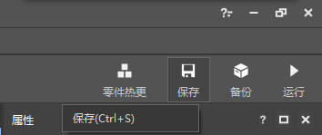

--- 
front: https://nie.res.netease.com/r/pic/20211104/69055361-2e7a-452f-8b1a-f23e1262a03a.jpg 
hard: Getting Started 
time: 15 minutes 
--- 

# Save and run gameplay 

Saving gameplay in time is a very important part of the development process. Only by developing the habit of saving in time can we avoid the loss of our hard work due to various uncertain factors. After saving, we also need to conduct real machine testing to ensure that our gameplay is truly and effectively added to the game. 

## Save gameplay 

In the upper right corner of the editor, we can see several global buttons. We only need to click the "**Save**" button to start the component saving process. 

 

If you see the following pop-up window, it means you have saved successfully. You can continue your creation with peace of mind, or take a break and leave your chair. 

 

## Run and self-test 

Operating only in the editor is not a real game experience after all. Before your work is distributed to thousands of players, the best way to ensure that there will be no loopholes in the gameplay is to open the game for actual testing. Minecraft Development Workbench provides this function. 

### PC Development Edition Self-test 

In the Minecraft Development Workbench, the easiest way to run and self-test is to use the **Minecraft Bedrock PC Development Edition** (that is, **Mod PC Development Kit**) for self-testing. You have two ways to enter the PC Development Edition. 

#### Enter directly in the editor 

Do not exit the editor, and look at the upper right corner. We can see a "**Run**" button. Click the run button, your gameplay component will be automatically saved, and the system will open the Minecraft Bedrock PC Development Edition, and automatically enter a save file loaded with your gameplay component for testing. 

 

#### Enter from the main interface 

Find the "**Recent**" or "**Library**" tab in the Minecraft Development Workbench and find your work. Move the mouse to the "**Development Test**" button. 

 

Clicking the Development Test button will pop up a Development Test dialog box. After making certain configurations, click the "**Start**" button to achieve the same effect as entering from the editor - successfully entering the Minecraft Bedrock PC Development Edition for testing. 

 

### Mobile development version self-test 

**Minecraft Bedrock Edition Mobile Development Version** self-test requires us to publish the component to the cloud first. After that, we can download it from the mobile development version for testing. We move the mouse to the map or component work and click the "**More**" button. 

 

Then click the "**Publish**" button. Fill in the relevant content in sequence according to the process of publishing resources, click Save, and then click Submit for review. When the work is in the "Under Review" state, you can access it in the mobile development version. 

 

#### Download and enter the mobile development version launcher 

Find the "**Manage**" tab on the Minecraft development workbench. Find the "**Beta Launcher Download**" in the "**Developer Content Management Tools**" column at the top. Click the button, and two QR codes will appear in the pop-up dialog box, which are the download links of the mobile development version launcher for iOS and Android versions. Use the corresponding mobile phone to scan the code to download and install, and you can get the mobile development version launcher application. 

 

 

Open the component you published in the mobile development version of Minecraft Bedrock Edition, and you can enter the map test!