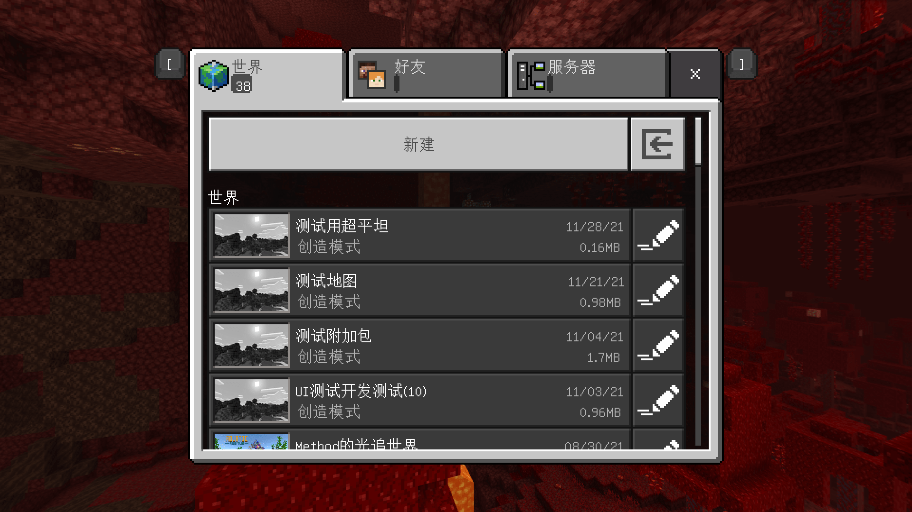

--- 
front: https://nie.res.netease.com/r/pic/20211104/69055361-2e7a-452f-8b1a-f23e1262a03a.jpg 
hard: Getting Started 
time: 10 minutes 
--- 
# Chunks, Worlds, and Archives 

In this section, we will learn about how a world is composed in Minecraft. 

## Worlds and Archives 

In Minecraft, the **World** is the main place for players to play. A world is the sum of everything that players observe after entering the game. The colorful biomes, various creatures, various terrains, and the blocks that make up the terrain are all part of this world. For each world, we have a **Level** to store it. An archive is a file record of a world, which usually exists in the form of a folder. On the game world selection interface, we can see all kinds of archives we have created and played. Each of these entries represents an archive, and is also a world that we can choose to enter. 

 

After we enter the world, the first thing we come into contact with is **Block**. Since the world is approximately infinite, blocks can also be considered infinite. A block is a block-shaped object in the game with a unit of 1m³. Some blocks can fill this 1m³ space, which we call complete blocks; some are smaller and have more diverse shapes, which are incomplete blocks; developers can also define blocks that exceed the size of the space through custom blocks. Blocks form the basic shape of this world, and combined with biomes and various creatures, make this world more colorful. 

 

## Block 

The world is very large horizontally. In order to avoid duplication between worlds, the game uses **Seed** to generate the world. Each seed will have a random impact on the world generator, so that each identical position in each world will have different results. In addition, players will carry out various constructions, mining and transformations in the world later, so we need a storage method to store this difference in the archive. **Chunk** came into being. 

A block is a collection of blocks with a size of 16×256×16. In the coordinates of my world, the x-coordinate and z-coordinate represent the length and width, and the y-coordinate represents the height. So we can see that a block is actually a vertically long rectangular block. And a save is a two-dimensional map with blocks arranged side by side horizontally. 

 

Chunks are made up of **Subchunks**, each of which is a 16×16×16 cube. So a chunk is actually made up of 16 subchunks arranged from bottom to top. Many game mechanics in Minecraft are based on chunks or subchunks. For more information, please refer to the [Minecraft Wiki Chunk Page](https://minecraft.fandom.com/zh/wiki/%E5%8C%BA%E5%9D%97).