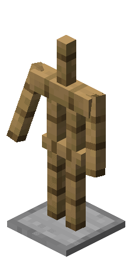

--- 
front: https://nie.res.netease.com/r/pic/20211104/69055361-2e7a-452f-8b1a-f23e1262a03a.jpg 
hard: Getting Started 
time: 10 minutes 
--- 
# Entities, Creatures, and Projectiles 
In this section, we will learn about entities, understand the composition and classification of entities, and lay a conceptual foundation for customizing entities in the future. 

## Creatures and Entities 

In a save file, in addition to blocks, the closest contact with players is **Mobs** (**Mobs**). In the world, there are good creatures such as pigs, cows, and sheep, hostile creatures such as zombies, skeletons, and endermen, as well as bosses such as the ender dragon and the wither, all of which are members of the creatures. However, creatures are not all of the non-block creations in this world. For example, we often use armor stands to place items and make shapes, and sometimes we use them to add redstone circuits to make some advanced machinery. The armor stand we just mentioned is not a creature. It belongs to a higher-level concept, that is, **Entity**. 

 

Entity, also known as **Actor**, is an interactive object with various shapes and behaviors. Unlike blocks, entities have health points and can be attacked. Of course, sometimes some entities can also attack others and destroy some blocks like players. **Player** is essentially a kind of entity. 

 

Generally speaking, entities are divided into creatures and **Non-mob Entity**, but there is actually no very strict definition of these two entities. Generally speaking, people think that entities with AI are called creatures. When we customize an entity, we can also give it some AI Goals to make it more alive. 

 

## Projectiles 

Projectiles are a typical non-biological entity. They can be thrown by players or launched by launchers. They often run a certain trajectory in the air and hit a block or entity, and then trigger certain effects. Arrows, snowballs, eggs, ender pearls, ender eyes, etc. are all types of projectiles. 

 

Projectiles generally have different movement calculation methods from other entities, and generally share the same texture map with their corresponding items. They are a very special entity.