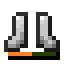

--- 
front: https://nie.res.netease.com/r/pic/20211104/69055361-2e7a-452f-8b1a-f23e1262a03a.jpg 
hard: Getting Started 
time: 10 minutes 
--- 
# Blocks, Items, and Item Entities 
In this section, we will learn more about blocks and the difference between items and item entities. 

## Blocks 
**Block** (also known as **Tile**) is the basic unit of the world and an important way for players to interact with the world. Blocks can be held in the player's inventory or placed in the world. When a block is placed in the world, most of the blocks will occupy a block-like position in the world, preventing players and other creatures from passing through here. This is called the block's **collision box** (**Collision Box**). Not all blocks have collision boxes. For example, grass, signs, and torches do not have collision boxes, and players can pass through them directly. 

Some blocks have the ability to emit light, which greatly increases the brightness of the surrounding area, such as torches and glowstone. Some blocks will block the progress of light, reducing or eliminating the level of light, such as stone that completely blocks light and ice that partially blocks light. Blocks with different lighting properties make the **lighting** system in the world rich and colorful. 

 

Blocks have different **materials** and **shapes**. The material of the block determines its solid and liquid properties, mining properties, and color performance on the map, while the shape of the block determines the shape of its collision box, visual shape, and rendering effect. 

Blocks such as water and magma are **liquid** (**Liquid**), and they are also a type of block. However, they have a special way of spreading. The flow of water and lava is essentially placing a new block at a specific location around it, but the collision volume of the new block will be either smaller (flowing around) or the entire block (flowing downward). 

## Items 

An item (also known as an icon) is an object that appears in the hands or inventory of a player or other entity. Items often have some interactivity with blocks or entities. For example, holding an item called scissors and pressing the use button on a sheep can cut the wool off the sheep. Some items have a block icon, which can also generate a block in the world after being placed. This kind of item is a block item. After the block is destroyed, it is collected by the player in the inventory. In a broad sense, block items are also a kind of item, but they all correspond one-to-one with blocks, so most people do not distinguish the relationship between block items and blocks, and use them interchangeably, calling them blocks. At this point, the remaining non-block items are called narrow items. 

Many items can be **stacked**. Stacked items will display a number in the lower right corner of the item, representing its current stack number. Some items can be used, and using them often reduces their stack number. However, there is a special type of item that does not reduce the stack number. On the contrary, they will lose a property called **Durability**. This special item is often a **Weapon**, **Tool**, or **Armor**. Of course, generally speaking, the maximum stack number of this special item is 1, but they can be used quite a lot without disappearing. 

 

## Item Entity 

The **Item Entity** is actually what we often call the **Drop Item**. Destroying blocks and killing creatures may produce drops, that is, item entities. As the name suggests, item entities are essentially an entity, but they are rendered as one or a group of items, and can automatically interact with players--picked up by nearby players. So item entities are not actually items, but they store item data, have item appearances, and can be picked up by players and become items in the player's inventory. 

 

To make the concept clearer, we can consider the following scenario: There is a grass block in the world, which is a block. I destroyed the grass block, and it dropped a piece of dirt, which is actually an item entity. To be more precise, it is an item entity of a block item. I picked up the dirt, and it became a real item in my inventory. However, this item is a block item. After I placed this item on the ground, it became a block again, a dirt block somewhere in the world.