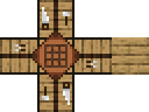
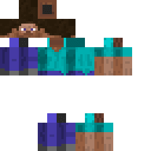
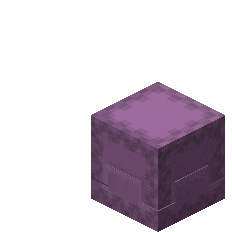

--- 
front: https://nie.res.netease.com/r/pic/20211104/69055361-2e7a-452f-8b1a-f23e1262a03a.jpg 
hard: Getting Started 
time: 15 minutes 
--- 
# Models, Textures, and Animations 
In this section, we will learn about the models in Minecraft and understand the nature and classification of models. Further understand the dependence and importance of textures and animations on models. 

## Model 
In Minecraft, whether it is a block, an item, or an entity, they are essentially composed of some more basic elements with volume. For example, a sheep is composed of a cuboid of the head, a cuboid of the body, and four vertical cuboids representing the limbs. We usually call this geometric shape with a certain volume composed of multiple basic elements a **Model**. 

In Minecraft, each creature has a model. We can easily see the shape of each creature model by observation in the game. Each block also has a model applied to it, but in the game, many blocks may share a model. For example, all 1×1×1 complete blocks share a model called `block`, which represents a standard cube. 

 

Developers can also customize the models of creatures and blocks in their own modules. The Chinese version of Minecraft supports two model formats, one is the **original model** format supported by Microsoft development, and the model works written in this format are called **Geometry** (**Geometry**), and the other is the **bone model** format supported by NetEase development, and the works obtained in this format are called **Skeleton** (**Skeleton**). In the Minecraft development workbench, we can import these two models through external files. According to the different production tools and formats of these two models, they are also called **BlockBench model** (`*.bbmodel`) and **FBX model** (`*.fbx`).

### Original Model 

The original model is essentially a JSON file written in accordance with the international version of the [Geometry JSON Schema](https://docs.microsoft.com/en-us/minecraft/creator/reference/content/schemasreference/schemas/minecraftschema_geometry_1.16.0). Developers can use the low-polygon style editor Blockbench to create the original model geometry in a visual editing form, and then import it into the module through the Minecraft Development Workbench. In the next chapter, we will focus on how to use the editor. 

The original model can be directly attached to the entity, and after a little modification, it can also be attached to the block, which provides great convenience for us to customize the model. After attaching it to the **Attachable** (***Pendant***), it can also be used with items to realize the production of 3D item models. However, the original model also has considerable disadvantages. The most important point is that the original model only supports low-polygon style, which is what we commonly call the block pixel style. This resulted in us being able to implement quadrilateral meshes at most, but unable to implement curves and surfaces. At the same time, due to the limitations of the model, we were also unable to implement dynamic textures based on the original model. Therefore, through the efforts of the NetEase development team, we implemented support for bone models. 

### Bone model 

The **bone model** is essentially also a JSON file, but it can be generated by importing FBX format files, so it has almost all the properties of the original FBX model. Therefore, the bone model supports various advanced model features, such as the ability to create curves and surfaces. At the same time, due to the support of the Chinese version of Minecraft, the bone model can also load model texture sequence frame animations and bind various advanced special effects, making the mod gameplay and appearance richer. 

Whether it is the original model or the bone model, the basic component in the model is called a **bone** (**Bone**). Each bone has its own specific shape and position, and the bones are relatively independent of each other, which helps the model to better complete the expected operation. 

## Texture 

Texture (Texture, formerly translated as Material) refers to a layer of texture files covering the model, and it is also the thing we can feel most intuitively in the game. Whether it is a block, an item or an entity, they are all displayed to the player's camera with a specific texture. For example, on the workbench block, we see a tablecloth on the top of the workbench, a 3×3 grid on the tablecloth, and tools such as saws and gears on the side. These appearance maps are actually textures, and the workbench itself is a block obtained by pasting specific textures on the 6 faces of a 1×1×1 cube model. The same is true for entities, but because the entity model is more complex, the texture maps we see are also slightly more complex. 

 

 

## Animation 

If a model is just a model, it can only be static, like a dummy. In order to make the model more realistic and realize the needs of various movements or postures, **Animation** is an indispensable part. An animation is a process of binding to each bone in the model and then making each bone move relative to each other through **Animation Controller**. Players running, creatures attacking, fish swimming, and even the lid of the shulker rotating and opening are all animations. With animation, our game content will be more vivid. 

The animation behavior of the shulker, when the lid rotates to open, the bones corresponding to the lid undergo rotational and translational transformations: 

 

Animation is not unique to entities, as long as the game engine supports it, all models can be animated. For example, through the custom block entity function of the Chinese version, you can add animation to the block model to achieve the same effect as the entity model animation. 

## Sequence frame animation 

When people mention animation in my world, they often think of "model animation", which is the animation we just introduced. However, there is another kind of "animation" in the game, which is **Frame Animation**. Sequence frame animation is a kind of "texture animation", also known as **frame animation**. Its principle is to decompose the animation action in "continuous key frames", draw different contents frame by frame on each frame of the timeline, and make it play continuously into animation. Therefore, this kind of animation is very similar to the flip book we played when we were young, and it is also called **Flipbook Animation** in Microsoft's development documents. The dynamic texture or dynamic map that everyone often talks about refers to the sequence frame animation.