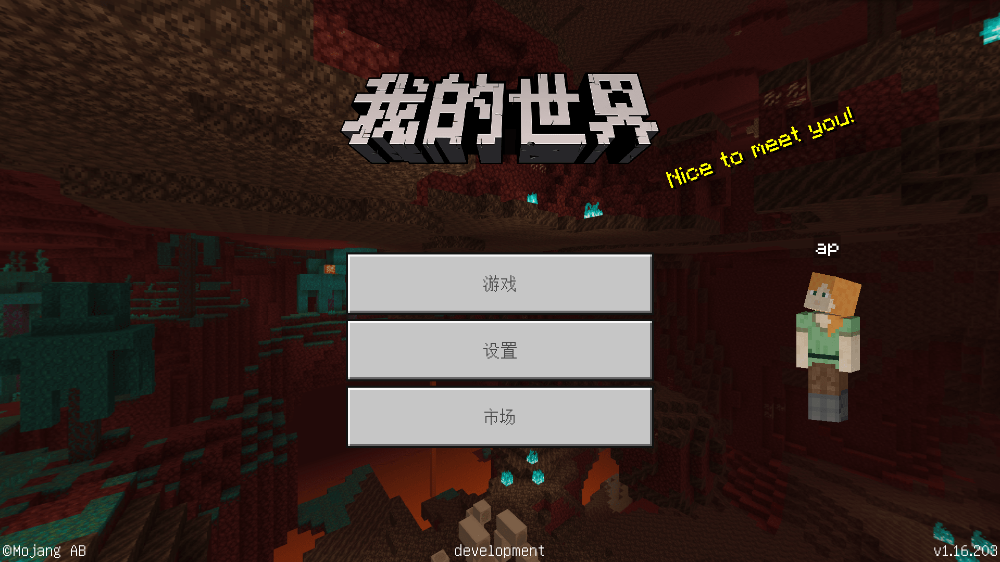

--- 
front: https://nie.res.netease.com/r/pic/20211104/69055361-2e7a-452f-8b1a-f23e1262a03a.jpg 
hard: Advanced 
time: 15 minutes 
--- 
# Game interface and special effect particles 
In this section, we will get to know the game interface and understand what special effects and particles are. 

## Game interface 

Whenever we open the Minecraft game, we can see an interface in front of us with buttons and text. When we interact with the interface through buttons, we may see pop-ups or new interfaces. After we enter the game world, in addition to the three-dimensional block world in front of us, we can also see the inventory at the bottom of the screen. If it is played on a mobile phone, you can also see buttons such as the direction buttons, jump button, and pause button on the top of the screen. All these buttons, texts, windows and other elements are part of the game interface, which we collectively call **UI** (**User Interface**, **User Interface**, also translated as **User Interface**). As the name suggests, the user interface is the interface between the user and the machine. On the computer display, the interface between the user and the machine is graphical, so the term **GUI** (**Graphical User Interface**, **Graphical User Interface**) is no different from the term UI in the game. 

 

The UI of Minecraft is an industrialized JSON control system that adds screen elements through controls and pre-sets logical functions through binding. The Minecraft workbench provides a simple visual UI editor that eliminates the complicated process of JSON data writing and provides us with great convenience. We will introduce this function in the next chapter. 

## Particles and special effects 

Particles** (**Particle**) is another very important visual effect besides UI. It is also an effect that players often encounter but easily overlook. However, careful players can still notice that particles exist everywhere in Minecraft. Particles are a granular flat patch map that always faces the player, and have different existence time and motion states depending on the type. The debris that appears when destroying blocks, the dust that is stirred up when the player falls from a high altitude, the flames produced when torches and furnaces burn, and the splashes of water when one step into the water are essentially particle effects. The particle effects built into the Bedrock Edition cannot be called out through commands in the player client. This type of particle is called **Legacy Particle**. The examples we gave above are all legacy particles. In order to allow players and developers to better use particles in the game, the International Edition introduces a "new version" of particle function and directly calls it **Particle** in the game. 

 

### Particles 

Particles in the International Edition can be defined through a JSON file. According to the [file format of particle JSON](https://docs.microsoft.com/en-us/minecraft/creator/reference/content/particlesreference/) of the international version, a particle can be defined. This particle is essentially a **Particle Emitter**, which is a virtual object that can move in the world and continuously emit single particles according to pre-set rules. The final effect shown to the player is only the particles it emits, and the player itself cannot see the particle emitter. Therefore, the particle emitter can achieve more functions than simply summoning a particle, which also gives developers more possibilities when creating. 

### Special Effects 

The Chinese version of **Special Effect** (**Effect**) is a new particle system created by the Chinese version development team based on the old version of the particle system and independent of the international version of the particles. By cooperating with the skeleton model, developers can even quickly attach it to the skeleton model to achieve a close combination of the model and particle effects. 

The special effects of the Chinese version are divided into **Particle Effect** and **Frame Effect**. Particle effects are essentially particle emitters that continuously emit multiple single particles of different sizes to achieve a specific effect. Sequence frame effects also display a flat patch map in the game, but they allow texture maps to have dynamic effects, that is, play sequence frame animations on the map, making it a "dynamic particle effect". Therefore, sequence frame effects are often more valuable for development and can also make the model or content of the module more abundant. 

So far, our study of the concept of Minecraft in this chapter has come to an end. If you don't understand some of the content, don't worry. Because we will talk about the production of these contents later. By then, we will be able to further deepen our understanding of these concepts through various operations and codes!