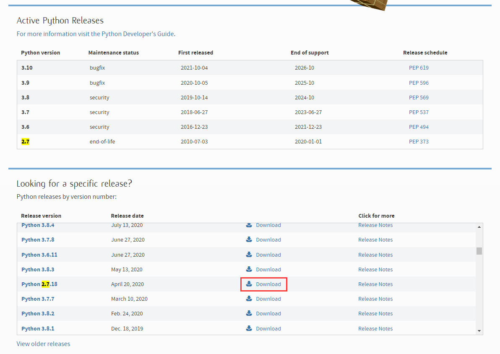
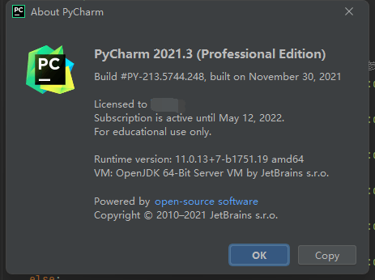
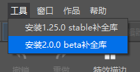
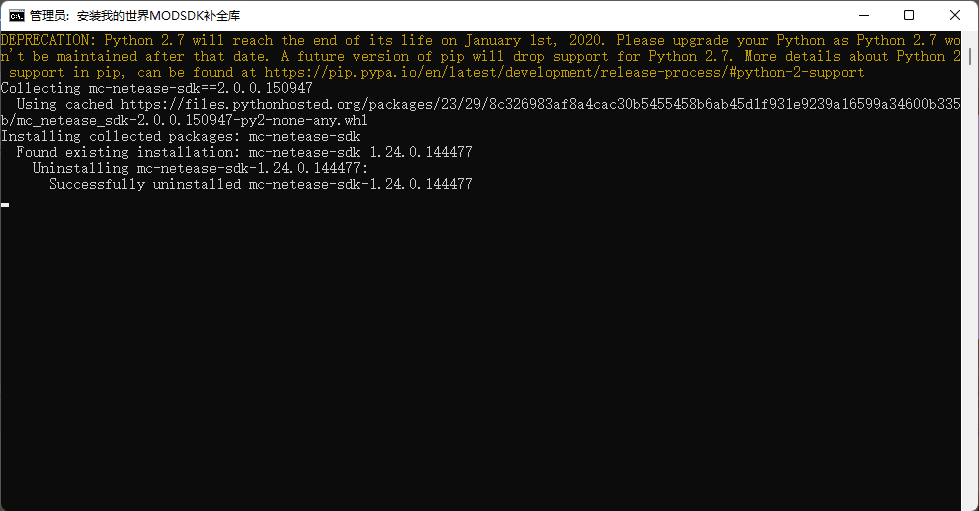
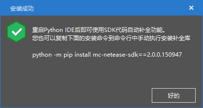
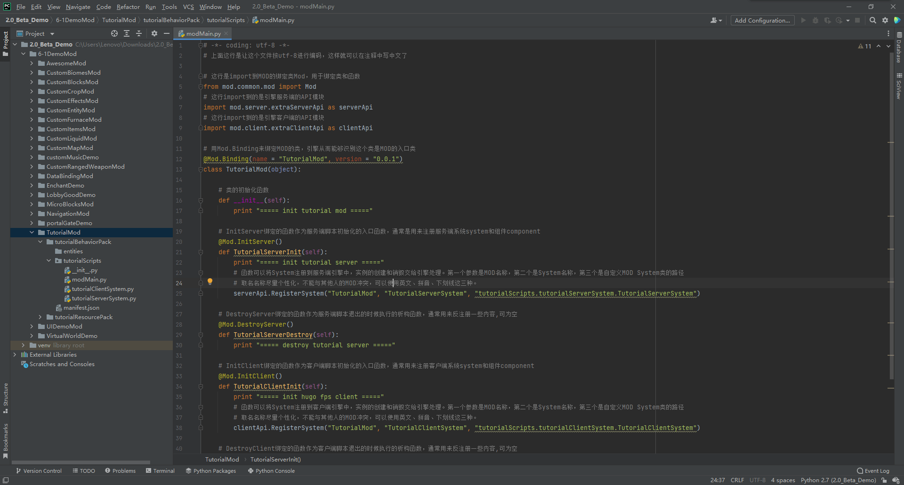

--- 
front: https://nie.res.netease.com/r/pic/20211104/69055361-2e7a-452f-8b1a-f23e1262a03a.jpg 
hard: advanced 
time: 20 minutes 
--- 
# Learn how to use the module SDK framework 

We have learned how to write and function data-driven JSON files. Through learning, we can see that data-driven files play a very important role. They can define the gameplay and give our games the basic attributes of various gameplays based on various components of entities in the game. However, data-driven also has obvious disadvantages, the biggest of which is that it cannot define complex logic. Even if some data-driven definitions can define some events, these events can only execute the corresponding logic under certain specific restrictions, such as only executing specific limited functions, calling pre-set attributes, and cannot connect various attributes through flexible logic. In the end, only a linear event response network can be obtained. This event system is considered by us to be a pseudo-event system. 

In order to realize a real event system, we need a more flexible writing method and standard. Therefore, we introduced the **Script** system. The Chinese version of the script system is written in Python. It responds to events flexibly through script-enabled components, binds callback functions to corresponding locations when the game is running, and gives the game more flexible logic. The Python script interface provided by the Chinese version of this script system is called **Mod API**, and the development package provided by the Chinese version for add-on packages with scripts based on the Mod API standard is called **Mod SDK**. 

## Configure the development environment 

Before starting the Mod SDK development, we need to configure the Python environment. Otherwise, we will not be able to write and debug normally. Note that the Chinese version of the Mod SDK uses the Python2 environment. There are large code differences between Python2 and Python3, and we do not need to use the relevant syntax of Python3. 

### Install Python2 

We go to the [Python official website](https://www.python.org/downloads/) to download the latest Python2 version. Since Python2 has stopped maintenance, we searched for the latest version 2.7 and downloaded it from the previous versions below. 

 

**Please be sure to select the installation environment variable** when installing, so that we can quickly enter the Python program executable file name in the command line. 

### Install IDE 

We recommend PyCharm as the integrated development environment (IDE) for Python. We download PyCharm from the [JetBrains official website](https://www.jetbrains.com/pycharm/download/) and install it. If you don't have a PyCharm license, please download the Community version (Community). If you want to purchase a license or have student status, you can apply for a license and download the Professional version (Professional). 

 

### Install the completion library 

In order to enable our code to have automatic completion and definition query functions, we need to install the completion library of the module SDK. We can use the editor to install the completion library. 

 

Open the editor and select the version of the completion library you want to install in the "Tools" drop-down menu in the menu bar. You can choose to install the stable version of the completion library or the beta version of the completion library according to the version and plan you are targeting. 

 

After starting the installation, a command line will be prompted. If an old version of the completion library has been installed before, the old version will be uninstalled before installing the new version. 

 

After the installation is successful, a prompt window will pop up to prompt you that the installation is complete. Of course, you can also manually install the completion library through the command prompt as stated in the prompt window. 

### View the sample package 

So far, we have done all the preparations. We open the <a href="../../../mcguide/20-Gameplay Development/13-Module SDK Programming/60-Demo Example.html" rel="noopenner">Example Package</a> that comes with the document and find the TutorialMod demonstration module. We can find the `tutorialScripts` folder in the additional package. This is a script Python module folder for the module. If you are familiar with Python, you can notice `__init__.py`, which means that this is a Python module. In fact, there can be multiple script folders in a package. But each folder must be a module, that is, it must have a `__init__.py` file. 


 

## What is the system 

We open the `modMain.py` file, which is the entry file of the Python script. The Bedrock Script engine will look for the entry file as the initial execution file of a Python module. Currently, we cannot customize the file name of the entry file, so we need to ensure that the file name of the entry file is `modMain.py`. Let's take a look at this entry file. 

```python 
# -*- coding: utf-8 -*- 
# The above line is to make this file encoded in utf-8, so that Chinese can be written in the comments 

# This line is imported into the MOD binding class Mod, used to bind classes and functions 
from mod.common.mod import Mod 
# This line imports the engine server API module 
import mod.server.extraServerApi as serverApi 
# This line imports the engine client API module 
import mod.client.extraClientApi as clientApi 

# Use Mod.Binding to bind the MOD class, so that the engine can recognize that this class is the entry class of MOD 
@Mod.Binding(name = "TutorialMod", version = "0.0.1") 
class TutorialMod(object): 

# Class initialization function 
def __init__(self): 
print "===== init tutorial mod =====" 

# The function bound to InitServer is used as the entry function for initializing the server script. It is usually used to register the server system and component 
@Mod.InitServer() 
def TutorialServerInit(self): 
print "===== init tutorial server =====" 
# The function can register the System to the server engine. The creation and destruction of instances are handled by the engine. The first parameter is the MOD name, the second is the System name, and the third is the path of the custom MOD System class 
# The name should be personalized as much as possible and should not conflict with other people's MODs. English, pinyin, and underscores can be used. 
serverApi.RegisterSystem("TutorialMod", "TutorialServerSystem", "tutorialScripts.tutorialServerSystem.TutorialServerSystem") 

# The function bound to DestroyServer is used as the destructor executed when the server script exits. It is usually used to unregister some content and can be empty. 
@Mod.DestroyServer() 
def TutorialServerDestroy(self): 
print "===== destroy tutorial server =====" 

# The function bound to InitClient is used as the entry function for initializing the client script. It is usually used to register the client system and component component 
@Mod.InitClient() 
def TutorialClientInit(self): 
print "===== init hugo fps client =====" 
# The function can register the System to the client engine, and the creation and destruction of the instance are handled by the engine. The first parameter is the MOD name, the second is the System name, and the third is the path to the custom MOD System class. 
# The name should be as personalized as possible and should not conflict with other people's MODs. English, pinyin, and underscores can be used. 
clientApi.RegisterSystem("TutorialMod", "TutorialClientSystem", "tutorialScripts.tutorialClientSystem.TutorialClientSystem") 

# The function bound to DestroyClient is used as the destructor executed when the client script exits. It is usually used to unregister some content and can be empty. 
@Mod.DestroyClient() 
def TutorialClientDestroy(self): 
print "===== destroy hugo fps client ====="


``` 

In the entry file, we see that our Python module is defined as a class, and in addition to the `__init__` method, four basic methods are defined in the class. They are `TutorialServerInit`, `TutorialServerDestroy`, `TutorialClientInit`, and `TutorialClientDestroy`. The purpose of these four methods is to register and destroy the **System**. 

Our module is divided into server and client for execution, because the Minecraft game is divided into two parts, the server and the client, which are interconnected and run. Imagine what will happen when we perform an operation if we do not distinguish between the server and the client. In a server, a player triggers a certain logic, and the result of the logic is to place a specific block at the world (0, 64, 0). If our server and client are executed separately, then all the players' clients will start to execute this logic. But we know that players can only be in a certain dimension of the world at the same time. So the client cannot tell which dimension the instruction to place the block should be located in. Although we only want to place blocks in the main world, the client in the Nether and the End will also "simulate" placing a block in the corresponding position of these two dimensions. This block is actually not placed in the Nether and the End on the server, so there will be a serious problem of client and server being out of sync. Therefore, our script also needs to set up a system on the server and client at the same time, just like the basic logic of the game, to execute different logics respectively, and to communicate with each other through certain functions to keep in sync. 

So, what is a system? In the module API, we can set up one or more systems on each end. The system will be responsible for macro work, such as defining and dedefining events, registering and deregistering event listeners, broadcasting or notifying an event, and performing various update operations. The process of broadcasting and listening to events and executing logic through the system is called **event-driven**. 

In fact, all systems are a class that inherits from the system base class. The base class of this system is `mod.common.system.baseSystem`.