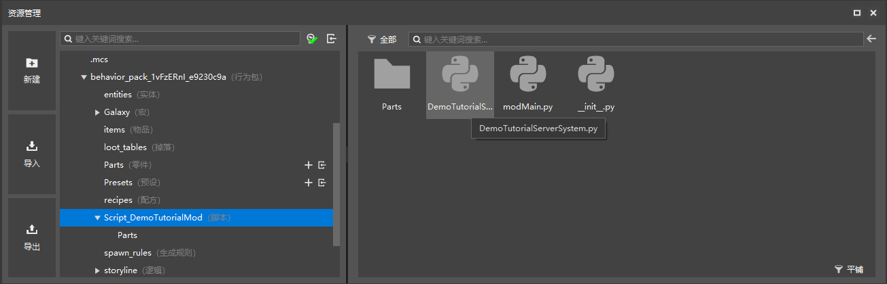

--- 
front: https://nie.res.netease.com/r/pic/20211104/69055361-2e7a-452f-8b1a-f23e1262a03a.jpg 
hard: Advanced 
time: 15 minutes 
--- 
# Create a new server system file in the quick entry 
In this section, let's learn how to create a script file in the new version of the editor. 

## Use the resource manager to quickly create a new script system 

We open the editor and click the "**New**" button in the "**Resource Management**" pane. 

 

Find **ModMain** in the "**Code**" tab. This option will help us quickly create a module API folder, which includes a `__init__.py` representing that the folder is a module and an entry file `modMain.py`. 

 

We name the file here, which is actually naming the module. The `ModName` in the decorator `@Mod.Binding(name = "ModName", version = "0.0.1")` of our module class represents our module name. The name here will be automatically filled in the decorator of the module class in the module entry file. At the same time, the script folder name and the module class name will also use our module name here, so please be careful to fill in a name that will not be the same as the module name in other developers' modules, otherwise it may cause loading conflicts. 

Next, we can create server files and client files for our module respectively! Let's take the server file as an example. 

 

Still in the "**Code**" tab, we select **ServerSystem**. This option can be used to create the server system file `xxxxServerSystem.py`. 

 

In the first drop-down menu, select the script folder directory we just created. If there are multiple script folders in an add-on package, we need to select the correct script directory we want to create in the drop-down menu. The file name is the name that will be automatically used in the class name of the server system. 

 

We can see that the server system file is also created. At the same time, the editor also creates a `Part` folder, which is a file automatically created by the new version of the editor. If our script is not for a part script, then this folder can be ignored. 

Let's take a look at the automatically created `modMain.py`: 

```python 
# -*- coding: utf-8 -*- 

from common.mod import Mod 

@Mod.Binding(name="DemoTutorialMod", version="0.0.1") 
class DemoTutorialMod(object): 

def __init__(self): 
pass 


    @Mod.InitServer()
    def DemoTutorialModServerInit(self):
        pass

    @Mod.DestroyServer()
    def DemoTutorialModServerDestroy(self):
        pass

    @Mod.InitClient()
    def DemoTutorialModClientInit(self):
        pass

    @Mod.DestroyClient()
    def DemoTutorialModClientDestroy(self):
        pass

```

and `DemoTutorialServerSystem.py`:

```python
# -*- coding: utf-8 -*-

import server.extraServerApi as serverApi
ServerSystem = serverApi.GetServerSystemCls()


class DemoTutorialServerSystem(ServerSystem):
    def __init__(self, namespace, systemName):
        ServerSystem.__init__(self, namespace, systemName)

    # The callback function of ScriptTickServerEvent will be called when the engine ticks, 30 frames per second (called 30 times) 
def OnTickServer(self): 
""" 
Driven by event, One tick way 
""" 
pass 

# This Update function is a method of the base class, and will also be called when the engine ticks, 30 frames per second (called 30 times) 
def Update(self): 
""" 
Driven by system manager, Two tick way 
""" 
pass 

def Destroy(self): 
pass 

``` 


We can see that our system will not be registered in the module class during automatic creation, so our system registration code needs to be entered manually. At the same time, automatic creation writes two functions to our server-side system class, namely the script tick **Tick** function and the system class **Update** function. These two functions respectively implement the code running 30 times per second through event response callbacks and overloading superclass methods. The time for such a run is called a **Script Tick**.