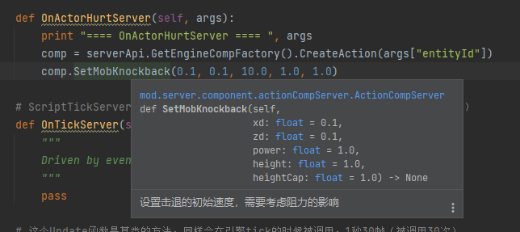

--- 
front: https://nie.res.netease.com/r/pic/20211104/69055361-2e7a-452f-8b1a-f23e1262a03a.jpg 
hard: Advanced 
time: 20 minutes 
--- 
# Listen for events and create component logic 

Now that we have created a server-side system, let's try to add logic to this system. 

Before adding logic, we need to manually register the system in the main module file. We follow the example we saw before and write the `RegisterSystem` function of the additional API in the method under the `@Mod.InitServer()` decorator. 

```python 
@Mod.InitServer() 
def DemoTutorialModServerInit(self): 
serverApi.RegisterSystem("DemoTutorialMod", "Server", "Script_DemoTutorialMod.DemoTutorialServerSystem.DemoTutorialServerSystem") 

``` 

## Listening for entity injury events 

Let's go back to the server system file `DemoTutorialServerSystem.py`. Let's try to do a simple event listener, for example, listen for events when entities (active objects) receive damage. 

By consulting the API documentation, we get the event `ActorHurtServerEvent` that controls the entity's damage, which literally means "active object injury server event". We register this event listener through the `ListenForEvent` method of the system itself. We add our listener registration function at the end of the `__init__` method, and define a new method in the class, such as `OnActorHurtServer`, and bind this method to the event as a callback function. 

```python 
def __init__(self, namespace, systemName): 
ServerSystem.__init__(self, namespace, systemName) 
self.ListenForEvent(serverApi.GetEngineNamespace(), serverApi.GetEngineSystemName(), "ActorHurtServerEvent", self, self.OnActorHurtServer) 

``` 

In this way, we have completed the listening of entity damage. When the entity is damaged, the `OnActorHurtServer` method of the `DemoTutorialServerSystem` instance will run. 

## Trigger the knockback logic in the event 

We want to not only listen to the event, but also execute some logic when the event occurs, such as changing the knockback attribute of the hit entity. 

We know from the API documentation that the `action` component (`mod.server.component.actionCompServer`) has a method `SetMobKnockback` to change the knockback logic. So we use the engine component factory to create an `action` engine component, and then call its set knockback method to do some logic, for example, we want to increase the power of the knockback. We write the following in `OnActorHurtServer`. 

```python 
def OnActorHurtServer(self, args): 
comp = serverApi.GetEngineCompFactory().CreateAction(args["entityId"]) 
comp.SetMobKnockback(0.1, 0.1, 10.0, 1.0, 1.0) 

``` 

 

In this way, we have successfully changed the power of the knockback. We show the complete modified code here. First is `modMain.py`:


```python
# -*- coding: utf-8 -*-

from mod.common.mod import Mod
import mod.server.extraServerApi as serverApi
import mod.client.extraClientApi as clientApi

@Mod.Binding(name="DemoTutorialMod", version="0.0.1")
class DemoTutorialMod(object):

    def __init__(self):

    @Mod.InitServer()
    def DemoTutorialModServerInit(self):
        serverApi.RegisterSystem("DemoTutorialMod", "Server", "Script_DemoTutorialMod.DemoTutorialServerSystem.DemoTutorialServerSystem")

    @Mod.DestroyServer()
    def DemoTutorialModServerDestroy(self):
        pass

    @Mod.InitClient()
    def DemoTutorialModClientInit(self):
        pass

    @Mod.DestroyClient()
    def DemoTutorialModClientDestroy(self):
        pass

```

Then `DemoTutorialServerSystem.py`:

```python
# -*- coding: utf-8 -*-

import mod.server.extraServerApi as serverApi
ServerSystem = serverApi.GetServerSystemCls()


class DemoTutorialServerSystem(ServerSystem):
    def __init__(self, namespace, systemName):
        ServerSystem.__init__(self, namespace, systemName)
        self.ListenForEvent(serverApi.GetEngineNamespace(), serverApi.GetEngineSystemName(), "ActorHurtServerEvent", self, self.OnActorHurtServer)

    def OnActorHurtServer(self, args):
        comp = serverApi.GetEngineCompFactory().CreateAction(args["entityId"]) 
comp.SetMobKnockback(0.1, 0.1, 10.0, 1.0, 1.0) 
# The callback function of ScriptTickServerEvent will be called when the engine ticks, 30 frames per second (called 30 times)

def OnTickServer(self): 
""" 
Driven by event, One tick way 
""" 
pass 

# This Update function is a base class method, and will also be called when the engine ticks, 30 frames per second (called 30 times) 
def Update(self): 
""" 
Driven by system manager, Two tick way 
""" 
pass 

def Destroy(self): 
self.UnListenForEvent(serverApi.GetEngineNamespace(), serverApi.GetEngineSystemName(), "ActorHurtServerEvent", self, self.OnActorHurtServer) 

``` 

 

Enter the game test, and you can find that `SetMobKnockback` changes the repulse attribute "honestly". 

