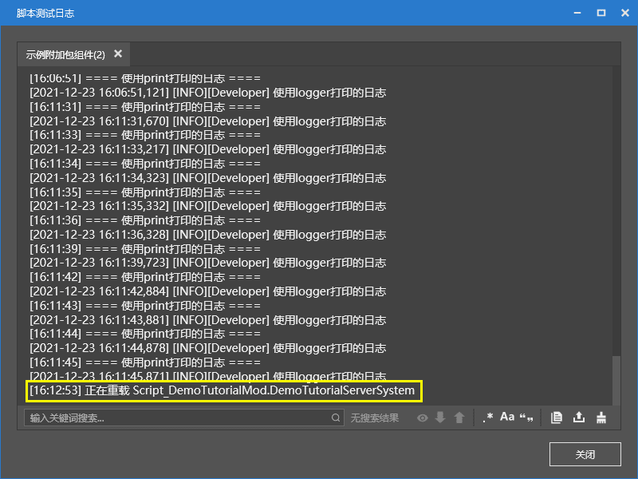

--- 
front: https://nie.res.netease.com/r/pic/20211104/69055361-2e7a-452f-8b1a-f23e1262a03a.jpg 
hard: Advanced 
time: 10 minutes 
--- 

# Print information and run debugging 

Knowing how to print information to the console is a must-have skill for a qualified developer. In this section, we will learn how to print information and debug. 

## Learn to print logs and view the console 

Every time you open the computer development version, the Minecraft development workbench will create a "Script Test Log" window, which is our script debugging console. 

In the module, we can print the context information in any module to the console at any location according to our wishes. We have two ways to print. 

### `print` 

We can use the native `print` function to print information. For example, here is a print function example, which will print the initialization message before registering the initialization module server. 

```python 
@Mod.InitServer() 
def DemoTutorialModServerInit(self): 
print "===== init tutorial server =====" 
serverApi.RegisterSystem("DemoTutorialMod", "Server", "Script_DemoTutorialMod.DemoTutorialServerSystem.DemoTutorialServerSystem") 

``` 

### `mod_log` 

We can also print information through the `mod_log` module. The following example prints a message by importing and executing `logger.info`. 

```python 
from mod_log import logger 
logger.info("print log: %s", "OK") 
``` 

### The difference between the two 

We can use the following code as an example to see the difference between the two printing methods in the console. 

```python 
def OnActorHurtServer(self, args): 
print "==== Log printed using print ==== " 
logger.info("Log printed using logger") 
comp = serverApi.GetEngineCompFactory().CreateAction(args["entityId"]) 
comp.SetMobKnockback(0.1, 0.1, 10.0, 1.0, 1.0) 
``` 


## Use hot update to quickly fix problems 

Our Python code supports hot update debugging in the game. When the computer development version of the game is running, if we modify the Python code, the file will be reloaded in the development version. Automatic hot update is mainly used to modify the implementation within the function. For example, I can modify the knockback power to increase it to 20, so I can extend the knockback distance in the next attack in the game. However, hot update is invalid for global variables, newly added classes or files. Because these are initialized at the beginning of the Python code running, the hot update file will not initialize it again, so it may be invalid. 

 

We take the knockback as an example and change it from 10 to 20. You can see the hot update information in the console. Flexible control of the hot update of the code will effectively reduce the number of times the game is opened and closed, making debugging more convenient.