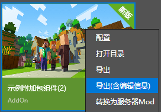

--- 
front: https://nie.res.netease.com/r/pic/20211104/69055361-2e7a-452f-8b1a-f23e1262a03a.jpg 
hard: Getting Started 
time: 10 minutes 
--- 
# Exporting components from the editor 

Exporting components is also an essential part of development that developers should learn. We have multiple ways to export components. 

## Export as a resource package 

Open the editor and click "Export" in the "Resource Management" pane to export the component as a resource package in the file format of `.mep`. 

 

The resource package exported in this way can be merged and imported in another add-on component through the "Import" function in the same location. 

## Overall export 

Find the work in the Minecraft development workbench. Right-click or click the "More" button and click "Export" or "Export (with edit information)" in the expanded menu. 

 

This will export the entire package as a `.zip` file. Files exported in this way can be re-imported as a component in the Minecraft Development Workbench using the "Local Import" function.