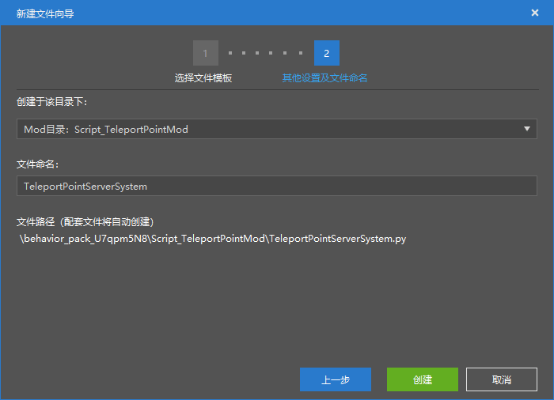

--- 
front: https://nie.res.netease.com/r/pic/20211104/69055361-2e7a-452f-8b1a-f23e1262a03a.jpg 
hard: Advanced 
time: 30 minutes 
--- 
# Challenge: Custom Teleport Point 
In this section, let's make a teleport point module. We know that in my world, the terrain can be considered infinitely vast, so we may often get lost during the exploration and can't find the way back to the base. Therefore, we can customize a teleport point module. By saving a teleport point, we can quickly return to the location specified by the teleport point when we get lost. 

Next, let's use the module SDK to make a teleport point module. 

## Create a project 

We create a "teleport point module" component in the Minecraft development workbench, and then use the "Create" button in the editor's "Resource Management" pane to quickly create a Python module module and name it `TeleportPointMod`. 

 

Since we know that only the server can obtain and control the position of each player, we only need to create a server system and name it `TeleportPointServerSystem`. For each player, the client is generally only responsible for screen rendering and some local calculations, and cannot directly change the player's position in the entire world, so we don't need to make the server interact with the client. Therefore, we don't need to create a client system. 

 

After the creation is completed, we can see the file arrangement as shown in the "Resource Management" pane. We open the entire behavior pack folder in the Python IDE for subsequent code writing. The content of the Python file at this time is as follows.

`modMain.py`:

```python
# -*- coding: utf-8 -*-

from common.mod import Mod


@Mod.Binding(name="TeleportPointMod", version="0.0.1")
class TeleportPointMod(object):

    def __init__(self):
        pass

    @Mod.InitServer()
    def TeleportPointModServerInit(self):
        pass

    @Mod.DestroyServer()
    def TeleportPointModServerDestroy(self):
        pass

    @Mod.InitClient()
    def TeleportPointModClientInit(self):
        pass

@Mod.DestroyClient() 
def TeleportPointModClientDestroy(self): 
pass 

``` 

`TeleportPointServerSystem.py` 

```python 
# -*- coding: utf-8 -*- 

import server.extraServerApi as serverApi 
ServerSystem = serverApi.GetServerSystemCls() 

class TeleportPointServerSystem(ServerSystem): 
def __init__(self, namespace, systemName): 
ServerSystem.__init__(self, namespace, systemName) 

# ScriptTickServerEvent callback function, will be called when the engine ticks, 30 frames per second (called 30 times) 
def OnTickServer(self): 
""" 
Driven by event, One tick way 
""" 
pass 

# This Update function is a method of the base class and will also be called when the engine ticks, 30 frames per second (called 30 times) 
def Update(self): 
""" 
Driven by system manager, Two tick way 
""" 
pass 

def Destroy(self): 
pass 

``` 

## Register the server system 

We know that simply creating a server system file cannot register it in the main module file at the same time. We manually register our server system. We enter the method of registering the system in the `TeleportPointModServerInit` function: 

```python 
@Mod.InitServer() 
def TeleportPointModServerInit(self): 
serverApi.RegisterSystem('TeleportPointMod', 'TeleportPointServerSystem', 'Script_TeleportPointMod.TeleportPointServerSystem.TeleportPointServerSystem') 

``` 

Among them, `Script_TeleportPointMod.TeleportPointServerSystem.TeleportPointServerSystem` corresponds to the `TeleportPointServerSystem` class in the `TeleportPointServerSystem.py` file in the `Script_TeleportPointMod` folder. In this way, we have successfully registered the system.


## Make the main body of the teleportation point module 

The main part of the teleportation point module should be located in the service order system, and we only need to consider the implementation logic. 

We can allow players to use multiple methods to trigger teleportation. The simplest one is to use the chat bar to trigger. Let's take this approach to make the module. We can set some keywords for setting, teleporting and removing teleportation points, such as `tppoint set`, `tppoint apply`, `tppoint remove`. Each player uses a variable to save the data of the teleportation point coordinates set by him. For easy saving, we can use a dictionary to do this. The key in the dictionary is the player's ID, and the value is the teleportation point coordinates saved by the player. When the player executes the teleportation, we mainly need to retrieve the player's ID, get the value saved in the dictionary, and then set the player's coordinates to this value. 

Let's implement this logic in turn. 

### Listen to the player's chat bar message 

We know from the document that the server-side `ServerChatEvent` event can respond to the player sending chat bar information, so we set up an event listener for it. 

```python 
def __init__(self, namespace, systemName): 
ServerSystem.__init__(self, namespace, systemName) 
self.ListenForEvent(serverApi.GetEngineNamespace(), serverApi.GetEngineSystemName(), "ServerChatEvent", self, self.on_chat) 

``` 

Also add an `on_chat` method to act as a callback function. 

```python 
def on_chat(self, event): 
pass 
``` 

### Recording Legend Points 

Next, we start writing the basic logic according to our previous assumptions. We read the `playerId` and `message` in the event data. They are the player ID and the message sent by the message. We use the `startswith` method of the string to determine whether the message starts with `tppoint set`. If the message starts with `tppoint set`, then create a `pos` engine component with the player ID. The `pos` engine component has `GetFootPos`, `GetPos` and `SetPos` methods. We can use the `GetFootPos` method to get the player's footsteps coordinates and store them in a dictionary, which we might as well name `player_tp_cache`. The `player_tp_cache` dictionary variable needs to be implemented in the entire class, so we put it in the class initialization method. 

```python 
class TeleportPointServerSystem(ServerSystem): 
def __init__(self, namespace, systemName): 
ServerSystem.__init__(self, namespace, systemName) 
self.ListenForEvent(serverApi.GetEngineNamespace(), serverApi.GetEngineSystemName(), "ServerChatEvent", self, self.on_chat) 
# Used to temporarily cache the player's teleport point information, which will be reset each time the game is restarted 
self.player_tp_cache = {} 

def on_chat(self, event): 
# Get the player ID 
player_id = event['playerId'] 
# Get the chat message 
message = event['message'] 
if message.startswith('tppoint set'): 
pos_comp = serverApi.GetEngineCompFactory().CreatePos(player_id) 
teleport_pos = pos_comp.GetFootPos() 
# Save the player's current coordinates to the dictionary cache 
self.player_tp_cache[player_id] = teleport_pos 
print 'Player teleport point has been set'


``` 

### Delete the teleport point 

Based on the same principle, we use the `pop` method of the dictionary to remove a player's key-value pair. We add the logic of deleting the teleport point. 

```python 
def on_chat(self, event): 
# Get player ID 
player_id = event['playerId'] 
# Get chat message 
message = event['message'] 
if message.startswith('tppoint set'): 
pos_comp = serverApi.GetEngineCompFactory().CreatePos(player_id) 
teleport_pos = pos_comp.GetFootPos() 
# Save the player's current coordinates to the dictionary cache 
self.player_tp_cache[player_id] = teleport_pos 
print 'Player teleport point has been set' 
if message.startswith('tppoint remove'): 
# Determine whether the player has data 
if player_id in self.player_tp_cache: 
# Pop up the player data in the dictionary 
self.player_tp_cache.pop(player_id) 
print 'Player teleport point removed' 
else: 
print 'The player has no teleport point set' 

``` 

### Teleport to the teleport point 

Finally, we use the `SetPos` method of the `pos` engine component to implement the teleport logic. 

```python 
def on_chat(self, event): 
# Get player ID 
player_id = event['playerId'] 
# Get chat message 
message = event['message'] 
if message.startswith('tppoint set'): 
pos_comp = serverApi.GetEngineCompFactory().CreatePos(player_id) 
teleport_pos = pos_comp.GetFootPos() 
# Save the player's current coordinates to the dictionary cache 
self.player_tp_cache[player_id] = teleport_pos 
print 'Player teleport point has been set' 
if message.startswith('tppoint remove'): 
# Determine whether the player has data 
if player_id in self.player_tp_cache: 
# Pop up the player data in the dictionary

self.player_tp_cache.pop(player_id) 
print 'Player teleport point removed' 
else: 
print 'The player has not set a teleport point' 
if message.startswith('tppoint apply'): 
pos_comp = serverApi.GetEngineCompFactory().CreatePos(player_id) 
# Determine whether the player has data 
if player_id in self.player_tp_cache: 
teleport_pos = self.player_tp_cache[player_id] 
# Teleport player 
pos_comp.SetPos(teleport_pos) 
print 'Player teleport point applied' 
else: 
print 'The player has not set a teleport point' 

``` 

In this way, we have completed the writing of the teleportation logic. In addition, we can also use the `msg` component to display message prompts for players to show prompts for successful setting, teleportation or removal. We can modify it as follows: 

```python 
def on_chat(self, event): 
# Get player ID 
player_id = event['playerId'] 
# Get chat message 
message = event['message'] 
if message.startswith('tppoint set'): 
pos_comp = serverApi.GetEngineCompFactory().CreatePos(player_id) 
teleport_pos = pos_comp.GetFootPos() 
# Save the player's current coordinates to the dictionary cache 
self.player_tp_cache[player_id] = teleport_pos 
msg_comp = serverApi.GetEngineCompFactory().CreateMsg(player_id) 
msg_comp.NotifyOneMessage(player_id, "Teleport point has been set") 
print 'Player teleport point has been set' 
if message.startswith('tppoint remove'): 
# Determine whether the player has data 
if player_id in self.player_tp_cache: 
# Pop up the player data in the dictionary 
self.player_tp_cache.pop(player_id) 
msg_comp = serverApi.GetEngineCompFactory().CreateMsg(player_id) 
msg_comp.NotifyOneMessage(player_id, "Removed teleport point") 
print 'The player's teleport point has been removed' 
else: 
msg_comp = serverApi.GetEngineCompFactory().CreateMsg(player_id) 
msg_comp.NotifyOneMessage(player_id, "Please set the teleport point first") 
print 'The player has not set the teleport point' 
if message.startswith('tppoint apply'): 
pos_comp = serverApi.GetEngineCompFactory().CreatePos(player_id) 
# Determine whether the player has data 
        if player_id in self.player_tp_cache:
            teleport_pos = self.player_tp_cache[player_id]

# Teleport player 
pos_comp.SetPos(teleport_pos) 
msg_comp = serverApi.GetEngineCompFactory().CreateMsg(player_id) 
msg_comp.NotifyOneMessage(player_id, "Teleported to teleport point") 
print 'Player teleport point applied' 
else: 
msg_comp = serverApi.GetEngineCompFactory().CreateMsg(player_id) 
msg_comp.NotifyOneMessage(player_id, "Please set teleport point first") 
print 'The player has not set a teleport point' 

``` 

We can enter the game to view the teleport and message prompts. 

 

We can see that the teleport and message are working as we set them! 

We finally release the complete code for your reference, `modMain.py` is as follows:

```python
# -*- coding: utf-8 -*-

from mod.common.mod import Mod
import mod.server.extraServerApi as serverApi


@Mod.Binding(name="TeleportPointMod", version="0.0.1")
class TeleportPointMod(object):

    def __init__(self):
        pass

    @Mod.InitServer()
    def TeleportPointModServerInit(self):
        serverApi.RegisterSystem('TeleportPointMod', 'TeleportPointServerSystem', 'Script_TeleportPointMod.TeleportPointServerSystem.TeleportPointServerSystem')

    @Mod.DestroyServer()
    def TeleportPointModServerDestroy(self):
        pass    @Mod.InitClient()
    def TeleportPointModClientInit(self):
        pass

    @Mod.DestroyClient()
    def TeleportPointModClientDestroy(self):
        pass

```


`TeleportPointServerSystem.py` is as follows: 

```python 
# -*- coding: utf-8 -*- 

import mod.server.extraServerApi as serverApi 
from mod.server.system.serverSystem import ServerSystem 
ServerSystem = serverApi.GetServerSystemCls() 

class TeleportPointServerSystem(ServerSystem): 
def __init__(self, namespace, systemName): 
ServerSystem.__init__(self, namespace, systemName) 
self.ListenForEvent(serverApi.GetEngineNamespace(), serverApi.GetEngineSystemName(), "ServerChatEvent", self, self.on_chat) 
# Used to temporarily cache the player's teleport point information, which will be reset each time the game is restarted 
self.player_tp_cache = {} 

def on_chat(self, event): 
# Get the player ID 
player_id = event['playerId'] 
# Get chat message 
message = event['message'] 
if message.startswith('tppoint set'): 
pos_comp = serverApi.GetEngineCompFactory().CreatePos(player_id) 
teleport_pos = pos_comp.GetFootPos() 
# Save the player's current coordinates to the dictionary cache 
self.player_tp_cache[player_id] = teleport_pos 
msg_comp = serverApi.GetEngineCompFactory().CreateMsg(player_id) 
msg_comp.NotifyOneMessage(player_id, "Teleport point set") 
print 'Player teleport point set' 
if message.startswith('tppoint remove'): 
# Determine whether the player has data 
if player_id in self.player_tp_cache: 
# Pop up the player data in the dictionary 
self.player_tp_cache.pop(player_id) 
msg_comp = serverApi.GetEngineCompFactory().CreateMsg(player_id) 
msg_comp.NotifyOneMessage(player_id, "Removed teleport point") 
print 'Player teleport point removed' 
else: 
msg_comp = serverApi.GetEngineCompFactory().CreateMsg(player_id) 
msg_comp.NotifyOneMessage(player_id, "Please set teleport point first") 
print 'The player has not set a teleport point' 
if message.startswith('tppoint apply'): 
pos_comp = serverApi.GetEngineCompFactory().CreatePos(player_id) 
# Determine whether the player has data 
if player_id in self.player_tp_cache: 
teleport_pos = self.player_tp_cache[player_id] 
# Teleport player 
pos_comp.SetPos(teleport_pos)

msg_comp = serverApi.GetEngineCompFactory().CreateMsg(player_id) 
msg_comp.NotifyOneMessage(player_id, "Teleported to teleport point") 
print 'Player teleport point applied' 
else: 
msg_comp = serverApi.GetEngineCompFactory().CreateMsg(player_id) 
msg_comp.NotifyOneMessage(player_id, "Please set teleport point first") 
print 'The player has not set a teleport point' 

def Destroy(self): 
pass 

``` 
