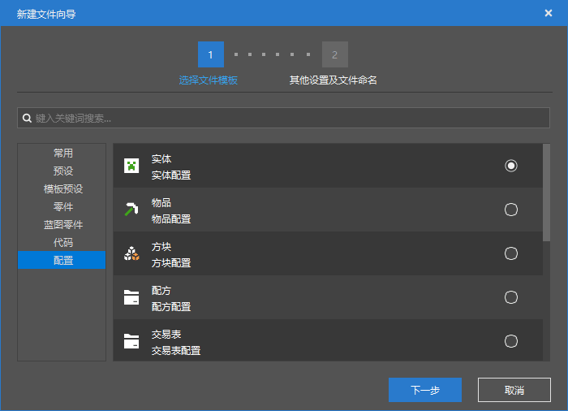
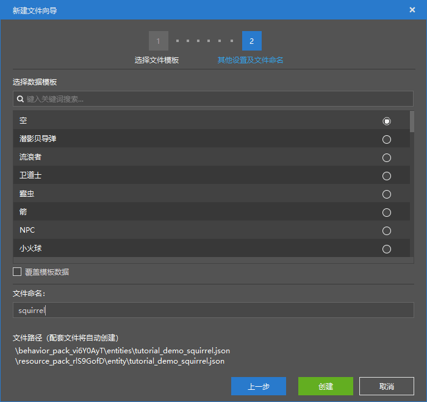

--- 
front: https://nie.res.netease.com/r/pic/20211104/69055361-2e7a-452f-8b1a-f23e1262a03a.jpg 
hard: Getting Started 
time: 10 minutes 
--- 
# Create basic entities using the configuration function 

In the next few sections, we will make a demo entity of a squirrel together. We will learn various advanced features of Molang by making a squirrel entity together. 

## Create a squirrel entity using configuration 

We open the editor and create a new AddOn component and name it "Squirrel Demo Entity". Then open the editor and change the namespace to `tutorial_demo`. After the preparatory work is completed, we start to create a new entity using the configuration function. 

 

 

We name the squirrel and click "Create" to successfully create the squirrel entity. After the creation is completed, we can open the squirrel's behavior pack and resource pack definition files to view the effect. 

Resource pack definition file: 

```json 
{ 
"format_version": "1.8.0", 
"minecraft:client_entity": { 
"description": { 
"identifier": "tutorial_demo:squirrel" 
} 
} 
} 
``` 

Behavior pack definition file: 

```json 
{ 
"format_version": "1.12.0", 
"minecraft:entity": { 
"description": { 
"identifier": "tutorial_demo:squirrel", 
"is_experimental": false, 
"is_spawnable": true, 
"is_summonable": true 
}, 
"component_groups": { 

}, 
"components": { 
"minecraft:persistent": {


} 
}, 
"events": { 

} 
} 
} 
``` 

We can see that since we are using a blank data template, the contents of these two files are relatively "dry". 

We make a few additions to the resource pack definition file so that we can add resources later: 

```json 
{ 
"format_version": "1.8.0", 
"minecraft:client_entity": { 
"description": { 
"identifier": "tutorial_demo:squirrel",/* 
"materials": { 

}, 
"textures": { 

}, 
"geometry": { 

}, 
"animations": { 

}, 
"animation_controllers": [ 

], 
"render_controllers": [ 

], 
"spawn_egg": { 

}*/ 
} 
} 
} 
``` 

Because the editor automatically creates the `1.8.0` format version, animations and animation controllers are defined separately. We also create an `animation_controllers` array for it to define the animation controller. Unlike the `1.10.0` format version, the `1.8.0` format version cannot perform conditional animation playback, that is, there is no `scripts/animate` field. But this doesn't matter, because in the `1.8.0` format version, although the animation itself cannot be played directly through the entity's resource package definition file, all animation controllers start playing automatically, and we only need to control the animation through the animation controller. 

We add a default material to the squirrel. Because we want the squirrel to behave like a rabbit in all aspects, and naturally we want the squirrel to render like a rabbit, so we add the original rabbit's default material to the squirrel. 


```json 
"materials": { 
"default": "rabbit" 
} 
``` 

This way, we have created a new entity without adding a model or behavior, which we will focus on in the next two sections. 
