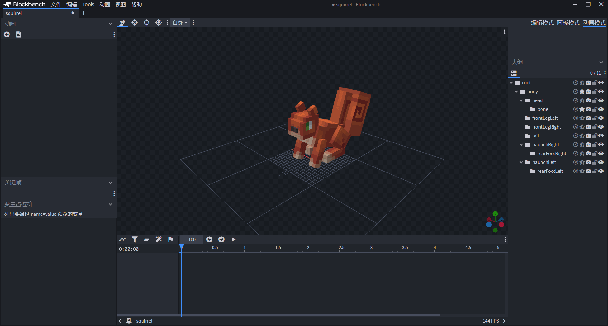
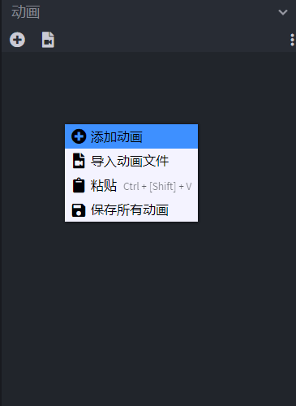
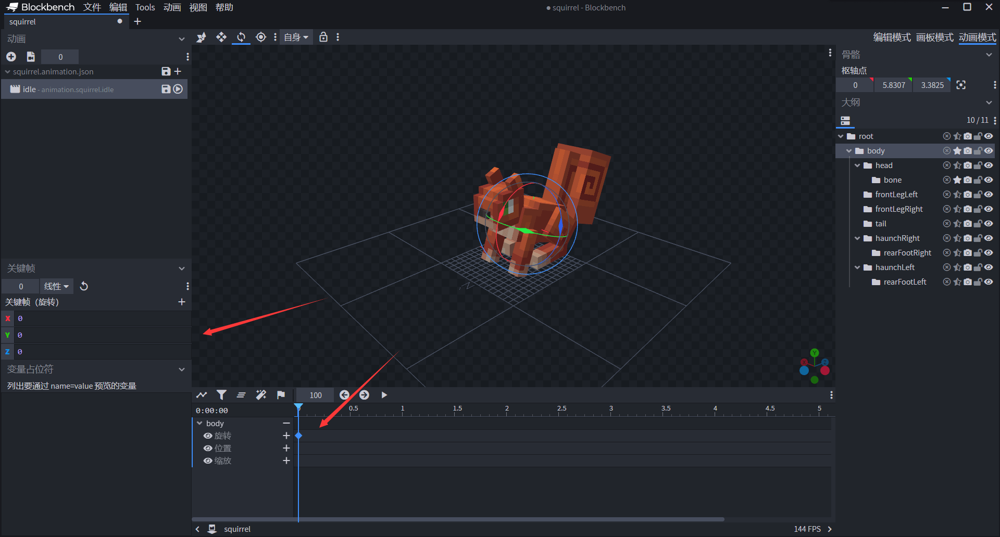
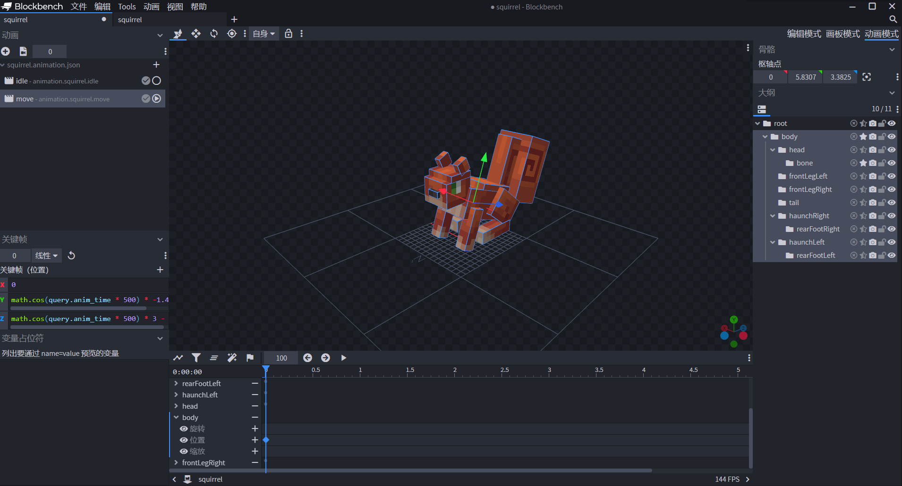
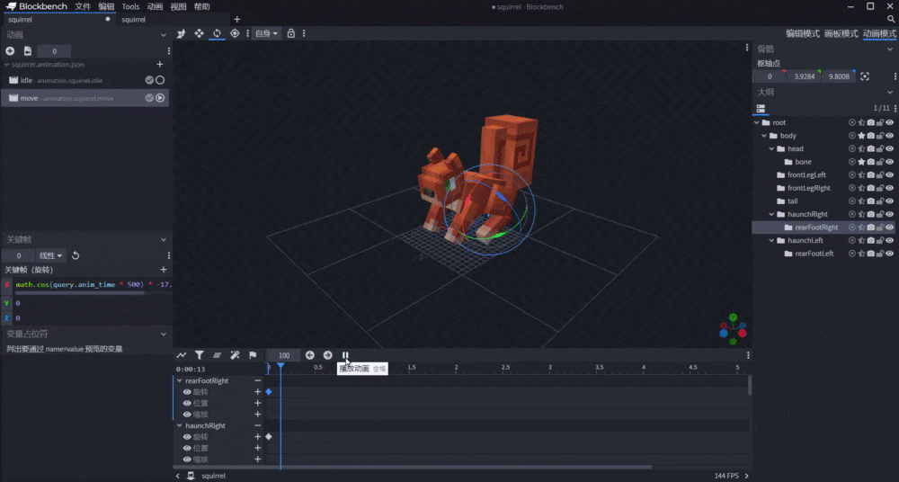

--- 
front: https://nie.res.netease.com/r/pic/20220408/710ecfce-57e5-4f5d-88b9-0eda8c2d1c45.gif 
hard: Advanced 
time: 40 minutes 
selection: true 
--- 

# Customize the squirrel entity resource 

In this section, we will complete the resource part of the squirrel together. You can click the link to download the resource of the [squirrel model](https://g79.gdl.netease.com/addonguide-12.zip). 

## Attach geometry and map texture resources 

Similar to the steps in Chapter 8, we create the geometry and texture of the squirrel model in Blockbench. 

 

Here, we create a squirrel geometry and two sets of textures for this geometry, one red texture and one gray texture. We hope that some squirrels generated in the world are red squirrels and some are gray squirrels, so two sets of textures can meet our needs. 

We export the squirrel geometry `squirrel.geo.json` to the `models\entity` folder of the resource pack, and export the textures `red.png` and `gray.png` to the `textures\entity\squirrel` folder of the resource pack respectively. Let's show the geometry JSON file exported by squirrel: 

```json 
{ 
"format_version": "1.12.0", 
"minecraft:geometry": [ 
{ 
"description": { 
"identifier": "geometry.squirrel", 
"texture_width": 64, 
"texture_height": 64, 
"visible_bounds_width": 4, 
"visible_bounds_height": 2, 
"visible_bounds_offset": [0, 1, 0] 
}, 
"bones": [ 
{ 
"name": "root", 
"pivot": [0, 7, 3], 
"rotation": [-20, 0, 0], 
"mirror": true 
}, 
{ 
"name": "body", 
"parent": "root", 
"pivot": [0, 5.83072, 3.3825],
          "cubes": [
            {"origin": [-3, 8.83072, 1.3825], "size": [6, 1, 7], "uv": [22, 0]},
            {"origin": [-3, 3.83072, -1.6175], "size": [6, 5, 10], "uv": [0, 0]}
          ]
        },

        {
          "name": "head",
          "parent": "body",
          "pivot": [0, 6.83072, -0.6175],
          "rotation": [20, 0, 0],
          "mirror": true,
          "cubes": [
            {"origin": [-2.5, 6.83072, -5.6175], "size": [5, 4, 5], "uv": [26, 26], "mirror": false},
            {"origin": [-2.5, 10.83072, -4.6175], "size": [5, 1, 4], "uv": [40, 21], "mirror": false},
            {"origin": [-1, 8.33072, -6.1175], "size": [2, 1, 1], "uv": [0, 19], "mirror": false}
          ]
        },
        {
          "name": "bone",
          "parent": "head",
          "pivot": [0, 11.83072, -1.6175],
          "rotation": [25, 0, 0],
          "cubes": [
            {"origin": [-2.5, 11.83072, -2.6175], "size": [1, 2, 2], "uv": [0, 15]},
            {"origin": [1.5, 11.83072, -2.6175], "size": [1, 2, 2], "uv": [0, 15], "mirror": true}
          ]
        },
        {
          "name": "frontLegLeft",
          "parent": "body",
          "pivot": [-3, 5.83072, 0.3825],
          "mirror": true,
          "cubes": [
            {"origin": [-4, -1.16928, -0.6175], "size": [2, 7, 2], "uv": [0, 44], "mirror": false}
          ]
        },
        {
          "name": "frontLegRight",
          "parent": "body",
          "pivot": [3, 5.83072, 0.3825],
          "mirror": true,
          "cubes": [
            {"origin": [2, -1.16928, -0.6175], "size": [2, 7, 2], "uv": [0, 44]}
          ]
        },
        {
          "name": "tail",
          "parent": "body",
          "pivot": [0, 5.83072, 7.3825],
          "mirror": true,
          "cubes": [
            {"origin": [-1.5, 4.33072, 7.3825], "size": [3, 14, 3], "uv": [32, 8], "mirror": false},
            {"origin": [-3.5, 7.33072, 10.3825], "size": [7, 12, 6], "uv": [0, 15], "mirror": false}
          ]
        },

        {
          "name": "haunchRight",
          "parent": "body",
          "pivot": [3, 7.33072, 7.0825],
          "rotation": [-20, 0, 0],
          "mirror": true,
          "cubes": [
            {"origin": [-4, 3.92839, 4.80079], "size": [2, 5, 6], "uv": [0, 33], "mirror": false}
          ]
        },
        {
          "name": "rearFootRight",
          "parent": "haunchRight",
          "pivot": [0, 3.92839, 9.80079],
          "rotation": [40, 0, 0],
          "mirror": true,
          "cubes": [
            {"origin": [-4, 2.42839, 4.10079], "size": [2, 2, 7], "inflate": 0.05, "uv": [16, 35], "mirror": false}
          ]
        },
        {
          "name": "haunchLeft",
          "parent": "body",
          "pivot": [3, 7.33072, 7.0825],
          "rotation": [-20, 0, 0],
          "mirror": true,
          "cubes": [
            {"origin": [2, 3.92839, 4.80079], "size": [2, 5, 6], "uv": [0, 33]}
          ]
        },
        {
          "name": "rearFootLeft", 
"parent": "haunchLeft", 
"pivot": [0, 3.92839, 9.80079], 
"rotation": [40, 0, 0], 
"mirror": true, 
"cubes": [ 
{"origin": [2, 2.42839, 4.10079], "size": [2, 2, 7], "inflate": 0.05, "uv": [16, 35]} 
] 
} 
] 
} 
] 
} 
``` 

Then we can start hooking up our geometry and textures in our resource pack definition. 

```json 
{

  "format_version": "1.8.0",
  "minecraft:client_entity": {
    "description": {
      "identifier": "tutorial_demo:squirrel",
      "materials": {
        "default": "rabbit"
      },
      "textures": {
        "red": "textures/entity/squirrel/red",
        "gray": "textures/entity/squirrel/gray"
      },
      "geometry": {
        "default": "geometry.squirrel"
      },/*
      "animations": {
        
      },
      "animation_controllers": [
        
      ],
      "render_controllers": [
        
      ],
      "spawn_egg": {
        
      }*/
    } } 
} 
``` 

Now that our textures and geometry are hooked up, we need to use a render controller to apply materials, textures, and geometry to entities, and make separate variant renders for red and gray textures. 

## Using a render controller to make variants 

We create a `squirrel.render_controllers.json` file in the `render_controllers` folder of the resource pack. Then write our texture array, geometry, and materials into it. 

```json 
{ 
"format_version": "1.8.0", 
"render_controllers": { 
"controller.render.squirrel": { 
"arrays": { 
"textures": { 
"Array.skins": [ 
"Texture.red", 
"Texture.brown" 
] 
} 
},

"geometry": "Geometry.default", 
"materials": [ { "*": "Material.default" } ], 
"textures": [ 
// texture list 
] 
} 
} 
} 
``` 

The most important thing is how to use variants to make textures. In fact, the original bunny provides a very good variant solution. That is to use the minecraft:variant component in the behavior pack definition. The minecraft:variant component only accepts an integer value, which can be used as the "variant ID" of the entity, thereby defining a **variant** (**Variant**) of the entity. The variant ID of the entity can be obtained on the client side through the Molang query function query.variant. So we can use this ID to reference the texture array. Let's assume that we have defined the red variant ID as 0 and the gray variant ID as 1 in the behavior pack, which is consistent with the definition of our texture array index. In this way, we can use a Molang expression like Array.skins[query.variant] to change the texture according to the variant in real time. The completed controller is as follows: 

```json 
{ 
"format_version": "1.8.0", 
"render_controllers": { 
"controller.render.squirrel": { 
"arrays": { 
"textures": { 
"Array.skins": [ 
"Texture.red", 
"Texture.gray" 
] 
} 
}, 
"geometry": "Geometry.default", 
"materials": [ { "*": "Material.default" } ], 
"textures": [ 
"Array.skins[query.variant]" 
] 
} 
} 
} 
``` 

We define the controller in the entity resource package definition file and get the following definition file: 

```json 
{ 
"format_version": "1.8.0", 
  "minecraft:client_entity": {
    "description": {
      "identifier": "tutorial_demo:squirrel",
      "materials": {
        "default": "rabbit"
      },
      "textures": {
        "red": "textures/entity/squirrel/red",
        "gray": "textures/entity/squirrel/gray"
      },

"geometry": { 
"default": "geometry.squirrel" 
},/* 
"animations": { 

}, 
"animation_controllers": [ 

],*/ 
"render_controllers": [ 
"controller.render.squirrel" 
],/* 
"spawn_egg": { 

}*/ 
} 
} 
} 
``` 

## Custom entity egg texture 

Next, we customize the entity's spawn egg texture. We can follow the previous definition of the teal and define the color of the spawn egg through two colors, **Base Color** and **Overlay Color**. The color uses a hexadecimal color code. Developers can use many public color preview software on the Internet to preview the color and use it. We can also use the Minecraft Entity Wizard plugin of Blockbench for a quick preview, which is a tricky way. 

 

We add the spawn egg colors to the client definition file: 

```json 
{ 
"format_version": "1.8.0", 
"minecraft:client_entity": { 
"description": { 
"identifier": "tutorial_demo:squirrel", 
"materials": { 
"default": "rabbit" 
}, 
"textures": { 
"red": "textures/entity/squirrel/red", 
"gray": "textures/entity/squirrel/gray" 
}, 
"geometry": { 
"default": "geometry.squirrel" 
},/* 
"animations": { 

}, 
"animation_controllers": [ 

],*/

"render_controllers": [ 
"controller.render.squirrel" 
], 
"spawn_egg": { 
"base_color":"#1778D2", 
"overlay_color":"#1778D2" 
} 
} 
} 
} 
``` 

 

So far, we have made a "non-moving" squirrel. We can first enter the game self-test to check the rendering of this squirrel. Next, we animate the squirrel. Since we have not defined the behavior for the squirrel, our animation cannot be previewed in the game yet, so we plan to use Blockbench to visualize the animation. 

## Using Molang to create idle animations 

 

We open the Blockbench project file of the squirrel model we created earlier again. Click "**Animation Mode**" in the upper right corner to enter the animation mode. 

 

We can see that the various panes of the entire interface have changed. The pane on the left that was originally a texture map has become the "**Animation**" pane, which stores the animations we added to the entity. Below the animation pane are the "**Keyframe**" pane and the "**Variable Placeholder**" pane. The keyframe pane will display the values of each axis of the current keyframe of the current channel. The variable placeholder is used to define some "placeholder" values for variables or queries that can only be obtained in the game. Because these variables or queries need to have context in the game, and they have no value in Blockbench. In order to preview the effect, we need to define values for them here. At the bottom is the **timeline** of the animation, through which we can adjust the time, preview the animation, and so on. 

 

We right-click in the animation pane and click "**Add animation**". 

 

Then change the name to `animation.squirrel.idle` and the loop to "Loop Play". Because we want our `idle` animation to play continuously when the squirrel's idle AI intention is triggered, we use loop play. This is equivalent to adding `"loop": true` to it in the corresponding JSON file. In this way, we have added a new animation. 

 

 

In order to prevent our work from being lost, we will save it as a JSON file in time. Click the Save button on the file, locate the `animations` folder in our resource package, and then click "**Save(S)**" in the Save As dialog box. 

 

Next, we will start making the idle animation. We hope that the squirrel's entire body will move slightly forward and backward when it is idle. So we first select the `body` bone group on the right. 

 

We can see that the outline of `body` has been displayed in the preview window, and the three channels of `body` have been added to the timeline below. Since we only want it to shake back and forth, we'll only focus on the "**Rotation**" channel for now. 

 


We click the "**+**" button on the right side of the rotation channel, which can add a keyframe at the current timeline position. Since our timeline is currently at the initial position of `0.0`, if we only add a keyframe here, it is equivalent to the situation where we did not use keyframes before. In fact, this situation is equivalent to having only one keyframe at `0.0`. We add a Molang expression to this keyframe, and since this is a looping animation, this ensures that the Molang expression is calculated for each frame and the different values calculated for each frame are applied to the entity, and the entity will move according to the result of the Molang calculation. 

 

After adding a keyframe, we can find a diamond mark on the timeline. This means a keyframe. At the same time, we can see the current value in the "Keyframe" pane on the left. At this time, the coordinate axis on the squirrel becomes a spherical coordinate axis. We can see that the "back and forth swing" animation we want can be obtained by rotating the face represented by red in the spherical coordinate axis. And we can locate the red in the "Keyframe" pane, which is the X axis. So we write Molang on the X axis. In fact, the X axis is the east-west direction of the model space, so the perpendicular plane of the X axis is the red plane we see in the preview window. 

So, how can we use Molang to make the body swing back and forth over time? This requires Molang's query function `query.anim_time` to do it. `query.anim_time` is a global parameter that represents the time that has passed since the start of an animation, in seconds (s). So, let's recall, with time as the independent variable, what function can do "swing back and forth"? We may quickly think of a pendulum, a spring, and simple harmonic motion. That's right, we only need to use a `cos` or `sin` function to control it like simple harmonic motion, and we can make the bone swing back and forth in a certain direction over time. 

For the "rotation" channel, it is the swing angle that performs simple harmonic vibration over time; for the "position" channel, it is the displacement of the bone on a certain axis that performs simple harmonic vibration over time. The formula for simple harmonic vibration is: 
$$ 
x=A\mathrm{cos}(\omega t+\varphi)+x_0 
$$ 
Wherein, $A$ is the **amplitude**, that is, the amplitude of the swing or vibration. The larger its value, the more the bone will "sway" or "vibrate". $\omega$ is the **angular velocity** or **angular frequency** of the vibration, which represents the speed of the swing or vibration. $\varphi$ represents the initial phase of the vibration, that is, the initial position in a cycle of vibration. $x_0$ represents the initial displacement. Generally speaking, when we use the cosine function, if the initial phase is not specified, when $t$ is 0, the final calculated value will be 1 or its amplitude $A$, which means that the animation starts from one end of the vibration, not the origin. If we want the animation to start from a stationary state, that is, from the origin, then we must set $x_0=-A$, for example, use the expression $x=A\mathrm{cos}(\omega t)-A$. 

In my world, `query.anim_time` represents time $t$, and we use `math.cos` to calculate the cosine function. For example, we use this expression in Blockbench: 

 

This means $x=5\mathrm{cos}(450t)$. Of course, the angular velocity of 450 is a more appropriate speed we have found. You can preview it by clicking the play button on the timeline, and then modify the value here according to your own feeling. 

 

 

Based on this principle, we add `0.0` keyframes to all bones and add simple harmonic motion animations in the X axis. Note that in order to keep all bones moving at the same frequency, we need all bones to use the same angular velocity, otherwise the ugly "uncoordinated limbs" will appear during movement. 

 

We also display the completed JSON as follows: 

```json 
{ 
"format_version": "1.8.0", 
"animations": { 
"animation.squirrel.idle": { 
"loop": true, 
"bones": { 
"tail": { 
"rotation": ["math.sin(query.anim_time * 450) * 15", 0, 0] 
}, 
"head": { 
"rotation": ["math.sin(query.anim_time * 450) * 15", 0, 0] 
}, 
"frontLegLeft": { 
"rotation": ["math.cos(query.anim_time * 450) * 65 - 65", 0, 0]
        },
        "frontLegRight": {
          "rotation": ["math.cos(query.anim_time * 450) * 45 - 45", 0, 0]
        },
        "body": {

"rotation": ["math.cos(query.anim_time * 450) * 5", 0, 0] 
} 
} 
} 
} 
} 
``` 

In fact, when editing the animation, we can click "Switch Graph Editor" in the upper left corner of the timeline to open the function graph view. This view will render the function graph calculated by our Molang expression, which will help us understand the animation process more. 

 

In addition, if the developer has sufficient mathematical skills, we can also use multiple simple harmonic motions to superimpose a more complex motion, which is called the superposition of Fourier series. The motion through Fourier superposition will be more realistic, but it will also involve more mathematical techniques, so this is not within the scope of our discussion today. 

## Using Molang to make moving animations 

The principles of moving animations and idle animations are the same. However, in addition to the rotation of each bone, the `body` bone group that controls all bones here needs to be translated. In other words, we need to modify the position channel of `body`. 

 

Since we want to move forward and backward, and the X axis represents the east-west reverse, that is, the left and right of the squirrel, our X axis does not understand, and the other two axes vibrate forward and backward or up and down at the same frequency. 

 

In the process of overall translation, we add the same angular frequency rotation effect to each other bone. Therefore, we get a moving animation, which we name `move` and put in the same JSON file. 

 

Let's look at the animation in the JSON file: 

```json 
{ 
"format_version": "1.8.0", 
"animations": { 
"animation.squirrel.idle": { 
// ... 
}, 
"animation.squirrel.move": { 
"loop": true, 
"bones": { 
"body": { 
"position": [0, "math.cos(query.anim_time * 500) * -1.4 + 1.4", "math.cos(query.anim_time * 500) * 3 - 3"] 
}, 
"head": { 
"rotation": ["math.sin(query.anim_time * 500) * 10", 0, 0] 
        },
        "haunchLeft": {
          "rotation": ["math.cos(query.anim_time * 500) * -30 + 30", 0, 0]
        },
        "rearFootLeft": {

          "rotation": ["math.cos(query.anim_time * 500) * -15 + 15", 0, 0]
        },
        "frontLegLeft": {
          "rotation": ["math.cos(query.anim_time * 500) * 20 - 20", 0, 0]
        },
        "frontLegRight": {
          "rotation": ["math.cos(query.anim_time * 500) * 35 - 35", 0, 0]
        },
        "tail": {
          "rotation": ["math.sin(query.anim_time * 500) * 20", 0, 0]
        },
        "haunchRight": {
          "rotation": ["math.cos(query.anim_time * 500) * -35 + 35", 0, 0] 
}, 
"rearFootRight": { 
"rotation": ["math.cos(query.anim_time * 500) * -17.5 + 17.5", 0, 0] 
} 
} 
} 
} 
``` 

## Use Molang to make head rotation animation 

We know that many entities in the original version will look at the player when the player approaches. This is because the entity has an AI intention to look at the player and has a `look_at_target` animation to cooperate. So, how do we make an animation to look at the player? This requires `query.target_x_rotation` and `query.target_y_rotation`. These two Molang variables represent the angle of rotation of the entity looking at the player, so we only need to set the rotation channel of the entity's `head` bone to these two query functions. 


```json
{
  "format_version": "1.8.0",
  "animations": {
    "animation.squirrel.idle": {
      // ...
    },
    "animation.squirrel.move": {
      // ...
    },
    "animation.squirrel.look_at_target": {
      "loop": true,
      "bones": {
        "head": {
          "rotation": ["query.target_x_rotation", "query.target_y_rotation", 0]
        }
      }
    }
  }
}
```


## Attach the animation to the entity 

Since the entity client format version of `1.8.0` cannot directly control the playback of animation, we use the animation controller to control the playback of the animation. We create a new `squirrel.animation_controllers.json` file in the `animation_controllers` folder of the resource pack to control the animation playback of the entity. 

Before editing the animation controller, we first define the short name of the animation in the entity client definition file. 

```json
{
  "format_version": "1.8.0",
  "minecraft:client_entity": {
    "description": {
      "identifier": "tutorial_demo:squirrel",
      "materials": {
        "default": "rabbit"
      },
      "textures": {
        "red": "textures/entity/squirrel/red",
        "gray": "textures/entity/squirrel/gray"
      },
      "geometry": {
        "default": "geometry.squirrel"
      },
      "animations": {
        "move": "animation.squirrel.move",
        "idle": "animation.squirrel.idle",
        "look_at_target": "animation.squirrel.look_at_target"
      },/* "animation_controllers": [ 

],*/ 
"render_controllers": [ 
"controller.render.squirrel" 
], 
"spawn_egg": { 
"base_color":"#1778D2", 
"overlay_color":"#1778D2" 
} 
} 
} 
} 
``` 

Then we can write the animation playback conditions in the animation controller. For example, we write it in the following format: 

```json 
{ 
"format_version" : "1.10.0", 
"animation_controllers" : { 
"controller.animation.squirrel.general" : {

      "initial_state" : "default",
      "states" : {
        "default" : {
          "variables": {
            "move_speed": {
              "input": "query.modified_move_speed",
              "remap_curve": {
                "0.01": 0.0,
                "0.1": 1.0
              }
            },
            "is_idling": {
              "input": "query.modified_move_speed",
              "remap_curve": {
                "0.0": 1.0,
                "0.01": 0.0
              }
            }
          },
          "animations" : [
            {
              "idle" : "variable.is_idling && query.is_on_ground"
            },
            "look_at_target",
            {
              "move" : "!query.is_on_ground || variable.move_speed" 
} 
] 
} 
} 
} 
} 
} 
``` 

The `variables` field is used to define variables that may be used later. Here we use the `remap_curve` field, which is the **Curve Remap** function. According to the value of `query.modified_move_speed`, when it changes between 0.01 and 0.1, `variable.move_speed` will be linearly remapped to between 0.0 and 1.0, and when it is lower than 0.01, it will be remapped to 0.0, and when it is greater than 0.1, it will be remapped to 1.0; at the same time, when it changes between 0.0 and 0.01, `variable.is_idling` will be linearly remapped to between 1.0 and 0.0, and when it is greater than 0.01, it will always be remapped to 0.0. 

`"idle" : "variable.is_idling && query.is_on_ground"` and `"move" : "!query.is_on_ground || variable.move_speed"` mean that the values of the two Molang expressions after the colon are passed to the `idle` and `move` animations respectively, as the value source of the elapsed speed of `query.anim_time`. Originally, the value source of `query.anim_time` is the elapsed speed of the computer's timer, but once it is changed to the speed we have modified, such as `!query.is_on_ground || variable.move_speed`, due to the short-circuit nature of `||`, this is equivalent to `query.anim_time` becoming the actual distance traveled by the entity after it is generated, and `query.anim_time` will only elapse when the entity leaves the ground. This is more reasonable. 

We also attach the animation controller to the entity: 

```json 
{ 
"format_version": "1.8.0", 
"minecraft:client_entity": { 
"description": { 
"identifier": "tutorial_demo:squirrel", 
"materials": { 
"default": "rabbit" 
},

      "textures": {
        "red": "textures/entity/squirrel/red",
        "gray": "textures/entity/squirrel/gray"
      },
      "geometry": {
        "default": "geometry.squirrel"
      },
      "animations": {
        "move": "animation.squirrel.move",
        "idle": "animation.squirrel.idle",
        "look_at_target": "animation.squirrel.look_at_target"
      },
      "animation_controllers": [
        { "general": "controller.animation.squirrel.general" },
        { "move": "controller.animation.squirrel.move" }
      ],
      "render_controllers": [ "controller.render.squirrel" 
], 
"spawn_egg": { 
"base_color":"#1778D2", 
"overlay_color":"#1778D2" 
} 
} 
} 
} 
``` 

So far, we have completed the basic resource control. Finally, for the convenience of subsequent description, we will add another function to the entity. 

## Turn on equipment rendering for the squirrel 

We let the squirrel have the ability to wear **attachments** (**Attachable**, ***Pendant***), so that we can use the equipment component in the behavior component to add equipment to it, such as a helmet. Note that the attachment bone names of various equipment are hard-coded, for example, a helmet can only be attached to the `head` bone. If there is no `head` bone in your entity geometry, the attachment attached to the helmet will not be displayed normally. 

We enable attachments using `enable_attachables`:

```json
{
  "format_version": "1.8.0",
  "minecraft:client_entity": {
    "description": {
      "identifier": "tutorial_demo:squirrel",
      "materials": {
        "default": "rabbit"
      },
      "textures": {
        "red": "textures/entity/squirrel/red",
        "gray": "textures/entity/squirrel/gray"
      },
      "geometry": {

        "default": "geometry.squirrel"
      },
      "animations": {
        "move": "animation.squirrel.move",
        "idle": "animation.squirrel.idle",
        "look_at_target": "animation.common.look_at_target"
      },
      "animation_controllers": [
        { "general": "controller.animation.squirrel.general" }
      ],
      "render_controllers": [
        "controller.render.squirrel"
      ],
      "spawn_egg": {
        "base_color":"#1778D2",
        "overlay_color":"#1778D2"
      },
	  "enable_attachables": true
    } } 
} 
``` 

Next, we need to shift our focus from the resource pack to the behavior pack. After all, our squirrel currently has no behavior, just like a "dumb mouse", we need to use the behavior pack to give it life! 
