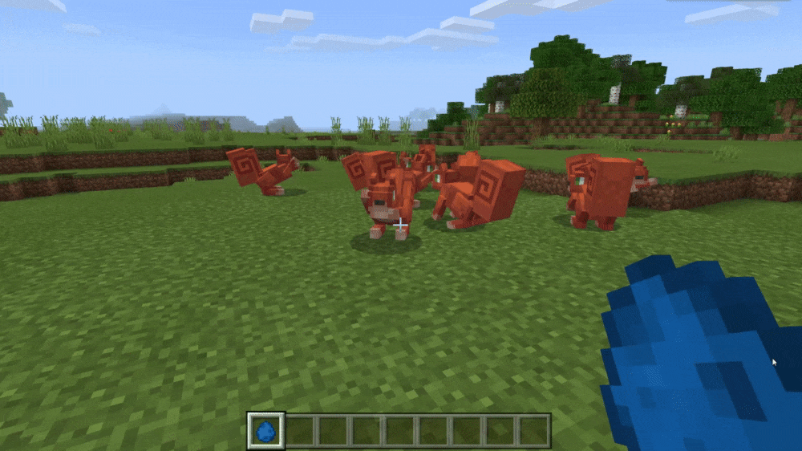
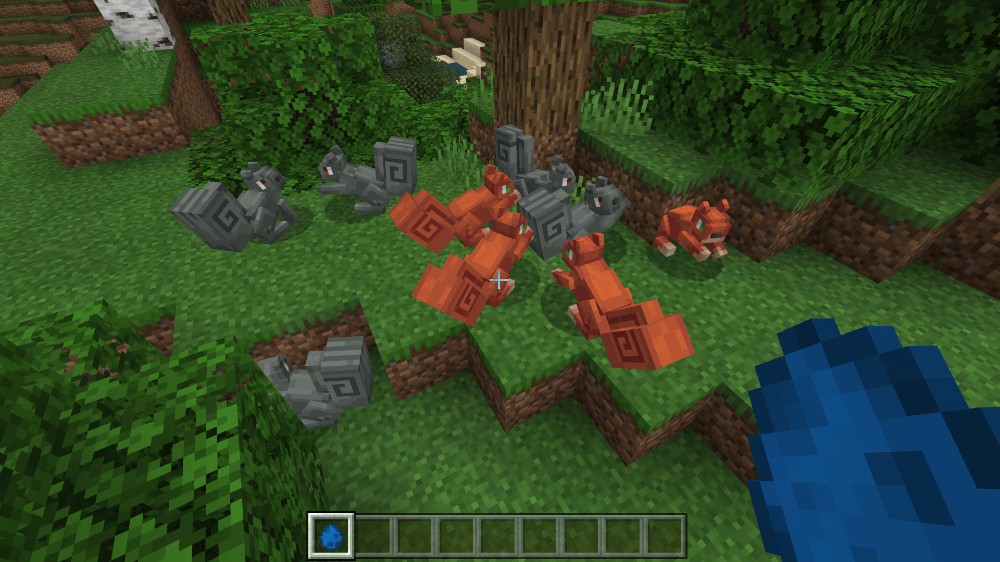

--- 
front: https://nie.res.netease.com/r/pic/20211104/69055361-2e7a-452f-8b1a-f23e1262a03a.jpg 
hard: Advanced 
time: 30 minutes 
--- 
# Customize squirrel entity behavior 

Next, let's make the squirrel's behavior. We open the squirrel's behavior package definition file and add some necessary behavior components to it one by one. 

```json 
{ 
"format_version": "1.12.0", 
"minecraft:entity": { 
"description": { 
"identifier": "tutorial_demo:squirrel", 
"is_experimental": false, 
"is_spawnable": true, 
"is_summonable": true 
}, 
"component_groups": { 

}, 
"components": { 
"minecraft:persistent": { 

} 
}, 
"events": { 

} 
} 
} 
``` 

As we can see, a component has been added with the creation of the editor, namely `minecraft:persistent`. The `minecraft:persistent` component is used to control whether the mob is **persistent** (**Persistent**, ***Persistently saved***). Persistent mobs will not be destroyed by the engine due to being too far away. In fact, we don't need this component. Because it is not an entity that must be stored like a painting, its existence will only increase the burden on the engine, so we delete it. 

## Add components 

Let's start adding a series of components. Here, we are just for demonstration, so we don't intend to introduce all the components, nor do we want to get entangled in whether the components of a creature are perfect. 

### Add regular components 

```json 
{ 
"format_version": "1.12.0", 
"minecraft:entity": { 
"description": { 
"identifier": "tutorial_demo:squirrel", 
"is_experimental": false,

      "is_spawnable": true,
      "is_summonable": true
    },
    "component_groups": {

    },
    "components": {
      "minecraft:hurt_on_condition": {
        "damage_conditions": [
          {
            "filters": {
              "test": "in_lava",
              "subject": "self",
              "operator": "==",
              "value": true
            },
            "cause": "lava",
            "damage_per_tick": 4
          }
        ]
      },
      "minecraft:pushable": {
        "is_pushable": true,
        "is_pushable_by_piston": true
      },
      "minecraft:experience_reward": {
        "on_death": "query.last_hit_by_player? Math.Random(0,1) : 0" 
}, 
"minecraft:breathable": { 
"total_supply": 15, 
"suffocate_time": 0 
}, 
"minecraft:physics": {} 
}, 
"events": { 

} 
} 
} 
``` 

We add some components that most creatures should have. `minecraft:hurt_on_condition` is to receive damage according to the condition. Here we set it to be damaged in lava. We know that we will receive two kinds of damage in lava at the same time, one is fire burns and the other is lava burns. Here we control the lava burns. `minecraft:pushable` represents whether our entity can be pushed. We set both being pushed by entities and being pushed by pistons to `true`. `minecraft:experience_reward` represents the experience reward dropped when killed. Molang expressions are used to calculate the dropped experience value. `minecraft:breathable` indicates the entity's ability to breathe in water. `minecraft:physics` indicates that the entity is affected by the physics engine. 

### Add navigation component 

```json 
{ 
"format_version": "1.12.0", 
"minecraft:entity": { 
"description": {

"identifier": "tutorial_demo:squirrel", 
"is_experimental": false, 
"is_spawnable": true, 
"is_summonable": true 
}, 
"component_groups": { 

}, 
"components": { 
// ... 
"minecraft:breathable": { 
"total_supply": 15, 
"suffocate_time": 0 
}, 
"minecraft:physics": {}, 
"minecraft:navigation.walk": { 
"can_path_over_water": true, 
"avoid_water": true 
} 
}, 
"events": { 

} 
} 
} 
``` 

We add a component prefixed with `navigation.`, which is called a navigation component. Every entity must have a navigation component in order for its pathfinding algorithm to work properly. Different navigation components will implement different pathfinding logic. Entities cannot have multiple navigation components, that is, each entity can only have one navigation component. Here, the `minecraft:navigation.walk` component means that the entity uses the "walking" pathfinding algorithm. 

### Add movement components 

```json 
{ 
"format_version": "1.12.0", 
"minecraft:entity": { 
"description": { 
"identifier": "tutorial_demo:squirrel", 
"is_experimental": false, 
"is_spawnable": true, 
"is_summonable": true 
}, 
"component_groups": { 

}, 
"components": { 
// ... 
"minecraft:physics": {}, 
"minecraft:navigation.walk": { 
"can_path_over_water": true, 
"avoid_water": true

}, 
"minecraft:movement.skip": {} 
}, 
"events": { 

} 
} 
} 
``` 

We then add a component prefixed with `movement.`, which is called a movement component. The movement component controls how the entity "moves". The movement here does not refer to how to find a path, but how to "reach the destination along the path given by the path-finding algorithm". To put it bluntly, it is the way the entity "walks", but the "walking" here does not necessarily mean walking. Of course, if the entity lacks this type of component, it will not have the ability to move. Here we expect the squirrel to "walk" in a way that the rabbit walks and jumps, that is, "jumping". So we use `minecraft:movement.skip`. Note that the slime and the magma monster use another movement component, called `minecraft:movement.jump`, which means walking only by jumping, which is different from the rabbit's "jumping" jumping method. 

### Add jump component

```json
{
  "format_version": "1.12.0",
  "minecraft:entity": {
    "description": {
      "identifier": "tutorial_demo:squirrel",
      "is_experimental": false,
      "is_spawnable": true,
      "is_summonable": true
    },
    "component_groups": {

    },
    "components": {
      // ...
      "minecraft:navigation.walk": {
        "can_path_over_water": true,
        "avoid_water": true
      },
      "minecraft:movement.skip": {},
      "minecraft:jump.static": {}
    },
    "events": {

    } } 
} 
``` 

There is another component prefixed with `jump.`, which we call a jump component. A jump component is a way to control the entity's jump. Note that this component only controls the way the entity jumps, and does not control when the entity jumps or whether the entity is jumping. However, if this component is missing, the entity will not be able to jump. Currently there are only two types of jump components, one is static jump `minecraft:jump.static`, which means that each jump remains exactly the same, and the other is dynamic jump `minecraft:jump.dynamic`, which means that each jump may change according to the entity's speed modifier, such as the height of the jump will change with the speed. 

### Add AI intention component 

```json 
{ 
"format_version": "1.12.0",

  "minecraft:entity": {
    "description": {
      "identifier": "tutorial_demo:squirrel",
      "is_experimental": false,
      "is_spawnable": true,
      "is_summonable": true
    },
    "component_groups": {

    },
    "components": {
      // ...
      "minecraft:movement.skip": {},
      "minecraft:jump.static": {},
      "minecraft:behavior.float": {
        "priority": 0
      },
      "minecraft:behavior.hurt_by_target": {
        "priority": 1
      },
      "minecraft:behavior.random_stroll": {
        "priority": 6,
        "speed_multiplier": 0.8,
        "xz_dist": 2, 
"y_dist": 1 
}, 
"minecraft:behavior.random_look_around": { 
"priority": 9 
}, 
"minecraft:behavior.look_at_player": { 
"priority": 11 
} 
}, 
"events": { 

} 
} 
} 
``` 

Next, we add the entity's AI Goal. The entity's AI Goals are all prefixed with `behavior.` and represent how much the entity "likes" a certain type of action. Each AI Goal has a Priority, which is an integer. When there is a conflict between goals, the one with the lower priority is more likely to be executed first, that is, the lower the priority value, the higher the priority. We added a floating intention `minecraft:behavior.float` with the highest priority for this entity, which means that as long as the entity is in the water, it will float on the water surface first. Then there is an intention `minecraft:behavior.hurt_by_target` that locks the target by damage, which means that as long as an entity causes damage to the squirrel, the squirrel will lock it as its target. Then we added a random stroll intention `minecraft:behavior.random_stroll` with a lower priority. Then we added a `minecraft:behavior.random_look_around` to look around randomly. Finally, we added a `minecraft:behavior.look_at_player` with the lowest priority to look at the player. 

### Adding Property Components 

The **Property** component is a special component that is generally used to control the properties of an entity instance. It often corresponds to some properties in the structure of the entity in memory, representing the "ability" or "nature" of an entity. 

```json
{
  "format_version": "1.12.0",
  "minecraft:entity": {

    "description": {
      "identifier": "tutorial_demo:squirrel",
      "is_experimental": false,
      "is_spawnable": true,
      "is_summonable": true
    },
    "component_groups": {

    },
    "components": {
      // ...
      "minecraft:behavior.random_look_around": {
        "priority": 9
      },
      "minecraft:behavior.look_at_player": {
        "priority": 11
      },
      "minecraft:type_family": {
        "family":["squirrel", "mob"]
      },
      "minecraft:can_climb": {},
      "minecraft:collision_box": {
        "width": 0.7,
        "height": 0.7
      } }, 
"events": { 

} 
} 
} 
``` 

Attribute components generally do not have special prefixes, so they are not easy to distinguish from regular components. We have added three attribute components. `minecraft:type_family` represents the attributes of the family of the entity's type, which is often used in conjunction with commands. `minecraft:can_climb` represents that the entity has the climbing attribute, and the entity can climb the ladder when encountering a ladder. `minecraft:collision_box` defines the collision box attribute of the entity, which is used to support the collision of the entity. 

### Add attribute components 

The **Attribute** component is another special component, which is often used to specify the specific properties of an entity or the "value" of the operation when performing a specific operation, such as attack value, health value, armor value, etc. Attributes are bound to the `Attributes` list in the entity NBT, and the defined attribute components will eventually act on the attributes defined in the `Attributes` list of this entity. 

```json
{
  "format_version": "1.12.0",
  "minecraft:entity": {
    "description": {
      "identifier": "tutorial_demo:squirrel",
      "is_experimental": false,
      "is_spawnable": true,
      "is_summonable": true
    },
    "component_groups": {


}, 
"components": { 
// ... 
"minecraft:can_climb": {}, 
"minecraft:collision_box": { 
"width": 0.7, 
"height": 0.7 
}, 
"minecraft:movement": { 
"value": 0.3 
}, 
"minecraft:health": { 
"value": 30, 
"max": 30 
} 
}, 
"events": { 

} 
} 
} 
``` 

Feature components generally do not have special prefixes. Here we add two feature components `minecraft:movement` and `minecraft:health`, which are used to define the value of the basic movement speed, basic and maximum health of the entity respectively. 

At this point, we have completed the component definition of the squirrel, and we can enter the game to view our behavior effects. 

 

### Use component groups and events to create variations 

So far, we have added components to the squirrel. In fact, the squirrel can behave normally at this time. However, we still remember that we once drew a gray texture map for the squirrel. Now we use component groups and events to control the gray texture variation. 

#### Add variant component group

```json
{
  "format_version": "1.12.0",
  "minecraft:entity": {
    "description": {
      "identifier": "tutorial_demo:squirrel",
      "is_experimental": false,
      "is_spawnable": true,
      "is_summonable": true
    },
    "component_groups": {
      "tutorial_demo:color_red": {
        "minecraft:variant": {
          "value": 0

} 
}, 
"tutorial_demo:color_gray": { 
"minecraft:variant": { 
"value": 1 
} 
} 
}, 
"components": { 
// ... 
}, 
"events": { 

} 
} 
} 
``` 

We use the `minecraft:variant` component to add a variant component group. The `minecraft:variant` component is a component specifically used to control variants. In the game, the values defined by it can be synchronized to the client, so we can use `query.variant` on the client to get its value. 

We define two component groups, one `tutorial_demo:color_red`, with variant ID 0; the other `tutorial_demo:color_gray`, with variant ID 1. No matter which component group is added to the global component, it will bring in a `minecraft:variant` component to determine the value obtained by `query.variant`.

#### Define variant spawning events 

We want to define the built-in event `minecraft:entity_spawned`. This event will be triggered by the engine automatically when the squirrel spawns naturally or when a spawn egg spawns. Therefore, we define the probability of spawning two variants in this event. 

```json
{
  "format_version": "1.12.0",
  "minecraft:entity": {
    "description": {
      "identifier": "tutorial_demo:squirrel",
      "is_experimental": false,
      "is_spawnable": true,
      "is_summonable": true
    },
    "component_groups": {
      "minecraft:color_red": {
        "minecraft:variant": {
          "value": 0
        }
      },
      "minecraft:color_gray": {
        "minecraft:variant": {
          "value": 1
        }
      }
    },
    "components": {
      // ...

}, 
"events": { 
"minecraft:entity_spawned": { 
"sequence": [ 
{ 
"randomize": [ 
{ 
"weight": 1, 
"add": { 
"component_groups": [ 
" tutorial_demo:color_red" 
] 
} 
}, 
{ 
"weight": 1, 
"add": { 
"component_groups": [ 
" tutorial_demo:color_gray" 
] 
} 
} 
] 
} 
] 
} 
} 
} 
} 
} 
``` 

We set the weights of both squirrels to 1, so that the two squirrels can be spawned in a 1:1 ratio. 

 

## Add the natural generation of squirrels 

After we customize the new creatures, we need to write a new natural generation mechanism for it in addition to the spawn egg generation. Otherwise, the player will not be able to experience the generation of entities in survival mode. The natural generation mechanism needs to be made using our generation rule definition file. We create a new `spawn_rules` folder in the behavior pack and create a new `squirrel.json` file in it as our generation rule definition file. 

```json 
{ 
"format_version": "1.8.0", 
"minecraft:spawn_rules": { 
"description": { 
"identifier": "tutorial_demo:squirrel", 
"population_control": "animal" 
}, 
"conditions": [ 
{ 
"minecraft:spawns_on_surface": {},

"minecraft:brightness_filter": { 
"min": 0, 
"max": 15, 
"adjust_for_weather": true 
}, 
"minecraft:weight": { 
"default": 12 
}, 
"minecraft:herd": { 
"min_size": 8, 
"max_size": 12 
}, 

"minecraft:biome_filter": [ 
{"test": "has_biome_tag", "operator":"==", "value": "giant"} 
] 
} 
] 
} 
} 
``` 

We want it to spawn on the surface of a biome with the `giant` tag, spawn in herds, control the population with `animal`, and adjust the spawn rate based on weather. We can write the above and then put it into our spawn rule definition file. 

## Add Equipment Components 

Remember that we enabled attachments for our squirrels before? Now we add a helmet equipment to the squirrel. To do this, we need to use the `minecraft:equipment` component in the behavior pack. The `minecraft:equipment` component accepts a loot table, so we need to make a loot table with only helmets. Let's make a loot table with only chain helmets. 

Find the `loot_tables` folder in the behavior pack and create a new `entities` folder in it, then create a `squirrel_equipment.json` file in it as our loot table. We write the following content to it to represent that there is only one chain helmet. 

```json 
{ 
"pools": [ 
{ 
"rolls": 1, 
"entries": [ 
{ 
"type": "item", 
"name": "minecraft:chainmail_helmet", 
"weight": 1 
} 
] 
} 
] 
} 
``` 

Then, we add `minecraft:equipment` to the entity behavior pack definition. `minecraft:equipment` is an attribute component. We put it together with `minecraft:type_family`, `minecraft:can_climb` and `minecraft:collision_box` to facilitate our debugging later. 

```json

{
  "format_version": "1.12.0",
  "minecraft:entity": {
    "description": {
      "identifier": "tutorial_demo:squirrel",
      "is_experimental": false,
      "is_spawnable": true,
      "is_summonable": true
    },
    "component_groups": {
      // ...
    },
    "components": {
      // ...
      "minecraft:behavior.look_at_player": {
        "priority": 11
      },
      "minecraft:equipment": {
        "table": "loot_tables/entities/squirrel_equipment.json"
      },
      "minecraft:type_family": {
        "family":["squirrel", "mob"]
      },
      "minecraft:can_climb": {}, "minecraft:collision_box": { 
"width": 0.7, 
"height": 0.7 
}, 
"minecraft:movement": { 
"value": 0.3 
} 
// ... 
}, 
"events": { 
// ... 
} 
} 
} 
``` 

After all of this is done, we can enter the game and test it ourselves. 

 

As you can see, our squirrels now have helmets! Of course, the helmets are a little "ill-fitting", but that's okay, this is just a demonstration. In practice, we can customize a helmet by customizing attachments. In the challenge of Chapter 9, we made custom armor. Referring to that step, by slightly adjusting the size of the model, we can create a customized helmet based on the squirrel's "head shape". As an exercise, this point is left to the developers to operate on their own.

Finally, we will show the content we have written in the behavior pack definition file so far, so that developers can have a macro experience of an entity with relatively complete components, component groups and events: 

```json 
{

  "format_version": "1.12.0",
  "minecraft:entity": {
    "description": {
      "identifier": "tutorial_demo:squirrel",
      "is_experimental": false,
      "is_spawnable": true,
      "is_summonable": true
    },
    "component_groups": {
      "minecraft:color_red": {
        "minecraft:variant": {
          "value": 0
        }
      },
      "minecraft:color_gray": {
        "minecraft:variant": {
          "value": 1
        }
      }
    },
    "components": {
      "minecraft:hurt_on_condition": {
        "damage_conditions": [
          {
            "filters": {
              "test": "in_lava",
              "subject": "self",
              "operator": "==",
              "value": true
            },
            "cause": "lava",
            "damage_per_tick": 4
          }
        ]
      },
      "minecraft:pushable": {
        "is_pushable": true,
        "is_pushable_by_piston": true
      },
      "minecraft:experience_reward": {
        "on_death": "query.last_hit_by_player ? Math.Random(0,1) : 0"
      },
      "minecraft:breathable": {
        "total_supply": 15,
        "suffocate_time": 0
      },
      "minecraft:physics": {},
	  "minecraft:navigation.walk": {
        "can_path_over_water": true,
        "avoid_water": true

      },
      "minecraft:movement.skip": {},
      "minecraft:jump.static": {},
      "minecraft:behavior.float": {
        "priority": 0
      },
      "minecraft:behavior.hurt_by_target": {
        "priority": 1
      },
      "minecraft:behavior.random_stroll": {
        "priority": 6,
        "speed_multiplier": 0.8,
        "xz_dist": 2,
        "y_dist": 1
      },
      "minecraft:behavior.random_look_around": {
        "priority": 9
      },
      "minecraft:behavior.look_at_player": {
        "priority": 11
      },
      "minecraft:equipment": {
        "table": "loot_tables/entities/squirrel_equipment.json"
      },
      "minecraft:type_family": {
        "family":["squirrel", "mob"]
      },
      "minecraft:can_climb": {},
      "minecraft:collision_box": {
        "width": 0.7,
        "height": 0.7
      },
      "minecraft:movement": {
        "value": 0.3
      },
      "minecraft:health": {
        "value": 30,
        "max": 30
      }
    },
    "events": {
      "minecraft:entity_spawned": {
        "sequence": [
          {
            "randomize": [
              {
                "weight": 1,
                "add": {
                  "component_groups": [                    "minecraft:color_red"

                  ]
                }
              },
              {
                "weight": 1,
                "add": {
                  "component_groups": [
                    "minecraft:color_gray"
                  ]
                }
              }
            ]
          }
        ]
      }
    }
  }
}
```