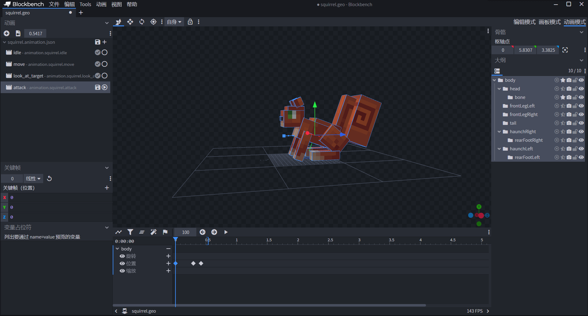
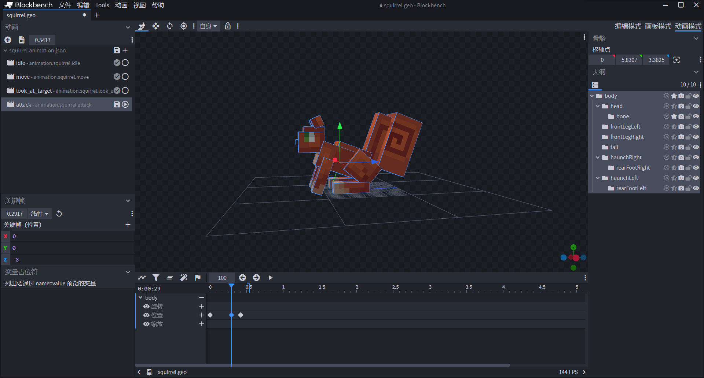
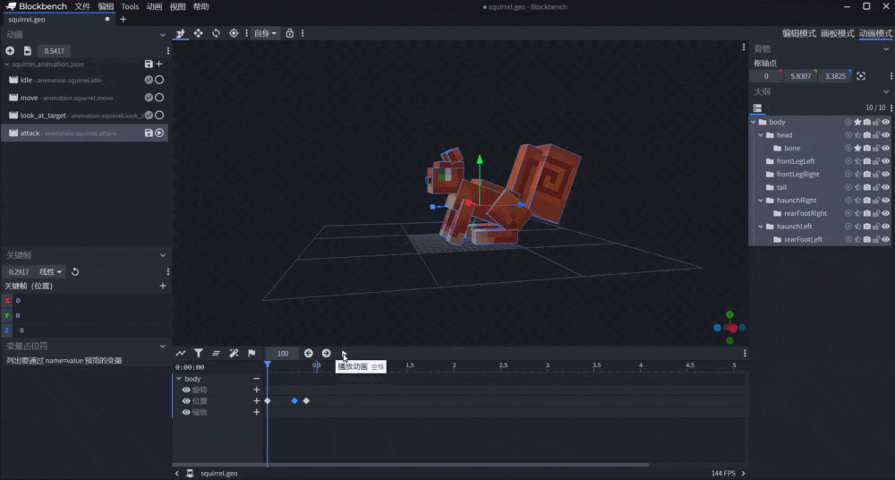
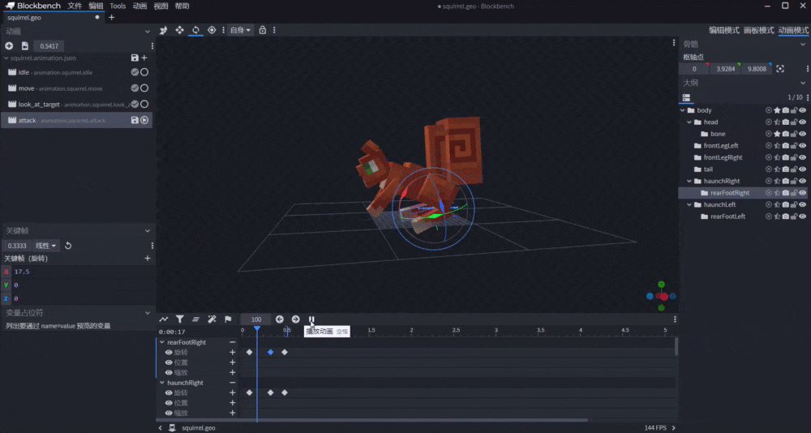

--- 
front: https://nie.res.netease.com/r/pic/20211104/69055361-2e7a-452f-8b1a-f23e1262a03a.jpg 
hard: Advanced 
time: 30 minutes 
--- 

# Combine entity animation with behavior 

In the entity behavior package component, some components can be combined with the entity's rendering frame. In this section, we take the entity's attack component as an example to explore how to combine entity animation with behavior. 

## Use keyframe animation to make attack animation 

Unlike the previous animations that used Molang, we now use keyframes to make an attack animation. We switch to animation mode in Blockbench and add a new animation called `attack`. 

 

As before, we first create a forward translation animation for the entire body, and then create rotation animations on each bone. We can use the "+" button to add more keyframes. 

 

Unlike using Molang, here we directly specify the value at the keyframe. After locating the keyframe, we can drag the coordinate axis in the preview window to change the value of a certain axis in real time. When dragging the coordinate axis, the value in the keyframe pane on the left will change accordingly. 

 

 

Finally, we add a keyframe for the position of the bone to connect this attack with the next attack. Next, we use the same principle to make the rotation of other bones. 

 

We can see that after a period of production, our squirrel has a basic attack animation. We save the animation for later use in linkage when making behaviors. The following is the animation JSON file after saving: 

```json 
{ 
"format_version": "1.8.0", 
"animations": { 
"animation.squirrel.idle": { 
// ... 
}, 
"animation.squirrel.move": { 
// ... 
}, 
"animation.squirrel.look_at_target": { 
// ... 
}, 
"animation.squirrel.attack": { 
"animation_length": 0.54167, 
"bones": { 
"body": { 
"position": {

            "0.0": [0, 0, 0],
            "0.2917": [0, 0, -8],
            "0.4167": [0, 0, 0]
          }
        },
        "head": {
          "rotation": {
            "0.0": [0, 0, 0],
            "0.25": [40, 0, 0],
            "0.4167": [0, 0, 0]
          }
        },
        "haunchLeft": {
          "rotation": {
            "0.0": [0, 0, 0],
            "0.25": [20, 0, 0],
            "0.4167": [0, 0, 0]
          }
        },
        "rearFootLeft": {
          "rotation": {
            "0.0": [0, 0, 0],
            "0.25": [17.5, 0, 0],
            "0.4167": [0, 0, 0]
          }
        },
        "frontLegLeft": {
          "rotation": {
            "0.0833": [0, 0, 0],
            "0.3333": [-32.5, 0, 0],
            "0.5417": [0, 0, 0]
          }
        },
        "frontLegRight": {
          "rotation": {
            "0.0": [0, 0, 0],
            "0.25": [-32.5, 0, 0],
            "0.4167": [0, 0, 0]
          }
        },
        "tail": {
          "rotation": {
            "0.0": [0, 0, 0],
            "0.25": [35, 0, 0],
            "0.4167": [0, 0, 0]
          }
        },
        "haunchRight": {
          "rotation": {
            "0.0833": [0, 0, 0],

"0.3333": [17.5, 0, 0], 
"0.5": [0, 0, 0] 
} 
}, 
"rearFootRight": { 
"rotation": { 
"0.0833": [0, 0, 0], 
"0.3333": [17.5, 0, 0], 
"0.5": [0, 0, 0] 
} 
} 
} 
} 
} 
``` 

## Combining Molang and Behavior to Implement Attack Animation 

We want the squirrel's attack to be played when the animation reaches a specific time, so we need to use a component that "delays" the attack. In fact, we do have such a component. We can see a component called `minecraft:behavior.delayed_attack` in the behavior definition of the ravager. This component controls the delayed attack of the ravager, so that the ravager's attack can be performed a certain time after the attack animation starts. The original delayed attack component of the ravager is as follows: 

```json 
"minecraft:behavior.delayed_attack": { 
"priority": 4, 
"reach_multiplier": 1.5, 
"attack_duration": 0.75, 
"hit_delay_pct": 0.5, 
"track_target": true, 
"sound_event": "attack.strong" 
} 
``` 

The `hit_delay_pct` field is the time the animation has been played when the attack causes damage. According to the animation we just made, we modify it to `0.25`, which is the time point at which the key frame of our head animation reaches the maximum rotation angle. Then, we add it to our squirrel behavior pack definition. 

```json 
{ 
"format_version": "1.12.0", 
"minecraft:entity": { 
"description": { 
"identifier": "tutorial_demo:squirrel", 
"is_experimental": false, 
"is_spawnable": true, 
"is_summonable": true 
}, 
"component_groups": { 
// ... 
}, 
"components": { 
// ... 
"minecraft:behavior.float": {

        "priority": 0
      },
      "minecraft:behavior.hurt_by_target": {
        "priority": 1
      },
      "minecraft:behavior.delayed_attack": {
        "priority": 4,
        "reach_multiplier": 1.5,
        "attack_duration": 0.75,
        "hit_delay_pct": 0.25,
        "track_target": true,
        "sound_event": "attack.strong"
      },
      "minecraft:behavior.random_stroll": {
        "priority": 6,
        "speed_multiplier": 0.8,
        "xz_dist": 2,
        "y_dist": 1
      },
      "minecraft:behavior.random_look_around": {
        "priority": 9 
}, 
"minecraft:behavior.look_at_player": { 
"priority": 11 
} 
// ... 
}, 
"events": { 
// ... 
} 
} 
} 
``` 

This `minecraft:behavior.delayed_attack` AI intent can make the squirrel delay attacking its **target** (**Target**). As we know, the `minecraft:behavior.hurt_by_target` AI intent can set the entity that attacks the squirrel as the squirrel's target. In this way, our squirrel has the ability to delay attacking the entity that attacks it after being attacked. However, at this time, our squirrel is only "able to attack" but "cannot attack". Why is this? Because we haven't set the attack power for the squirrel, so at this time, even if the squirrel attacks, it can only be regarded as "attacking in vain". We find the component `minecraft:attack` that sets the attack power by consulting the document. It is a feature component, so for easy maintenance, we add it to the feature component. For debugging, we set it to 1 to prevent us from being killed in two hits, causing inconvenience in testing. 

```json 
{ 
"format_version": "1.12.0", 
"minecraft:entity": { 
"description": { 
"identifier": "tutorial_demo:squirrel", 
"is_experimental": false, 
"is_spawnable": true, 
"is_summonable": true 
}, 
"component_groups": { 
// ... 
}, 
"components": {

// ... 
"minecraft:attack": { 
"damage": 1.0 
}, 
"minecraft:movement": { 
"value": 0.3 
}, 
"minecraft:health": { 
"value": 30, 
"max": 30 
} 
}, 
"events": { 
// ... 
} 
} 
} 
``` 

Now that we have set up the squirrel's attacking ability, we just need to correctly bind the attack animation to the entity resource pack definition file so that the squirrel can play the animation correctly when attacking. At this time, we need to use the Molang query function `query.is_delayed_attacking`. This query function returns 1.0 when the `minecraft:behavior.delayed_attack` AI intention is active, and returns 0.0 when it is not active. Therefore, we can use this query function to control the playback of the animation. Since the entity resource definition we are using is the old version of `1.8.0`, there is no way to directly conditionally control the animation playback. But don't worry, we can use an animation controller: 

```json 
{ 
"format_version" : "1.10.0", 
"animation_controllers" : { 
"controller.animation.squirrel.general" : { 
// ... 
}, 
"controller.animation.squirrel.attack" : { 
"initial_state" : "default", 
"states" : { 
"attacking" : { 
"animations" : [ "attack" ], 
"transitions" : [ 
{ 
"default" : "query.is_delayed_attacking == 0" 
} 
] 
}, 
"default" : { 
"transitions" : [ 
{ 
"attacking" : "query.is_delayed_attacking == 1" 
} 
] 
} 
} 
} 
} 
}


``` 

We bind the animation and animation controller to the entity resource pack definition: 

```json 
{ 
"format_version": "1.8.0", 
"minecraft:client_entity": { 
"description": { 
"identifier": "tutorial_demo:squirrel", 
"materials": { 
"default": "rabbit" 
}, 
"textures": { 
"red": "textures/entity/squirrel/red", 
"gray": "textures/entity/squirrel/gray" 
}, 
"geometry": { 
"default": "geometry.squirrel" 
}, 
"animations": { 
"walk": "animation.squirrel.move", 
"general": "animation.squirrel.idle", 
"look_at_target": "animation.squirrel.look_at_target", 
"attack": "animation.squirrel.attack" 
}, 
"animation_controllers": [ 
{ "general": "controller.animation.squirrel.general" }, 
{ "attack": "controller.animation.squirrel.attack" } 
], 
"render_controllers": [ 
"controller.render.squirrel" 
], 
"spawn_egg": { 
"base_color":"#1778D2", 
"overlay_color":"#1778D2" 
}, 
"enable_attachables": true 
} 
} 
} 
``` 

In this way, we can enter the game self-test to check the effect. We can use the command `/aigoals` to open the "AI Intention Display" to clearly view the activation of AI intentions. 

 

We can see that the squirrel's attack animation plays normally, and we are indeed attacked and lose blood when the animation is nearly halfway through. This shows that our custom attack animation and attack behavior are successfully combined. 
