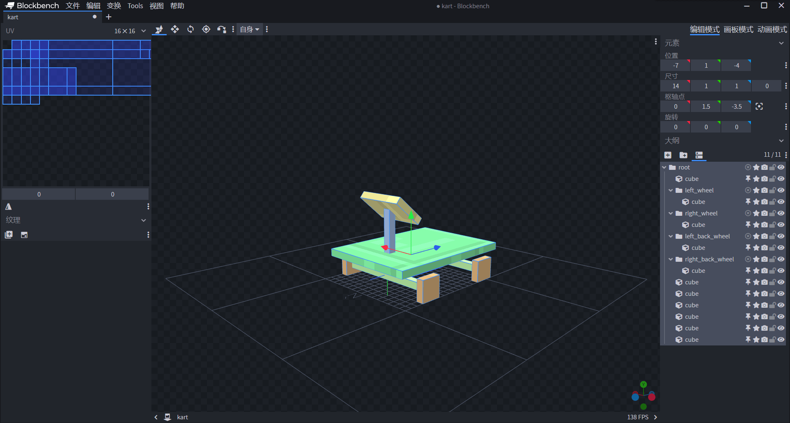
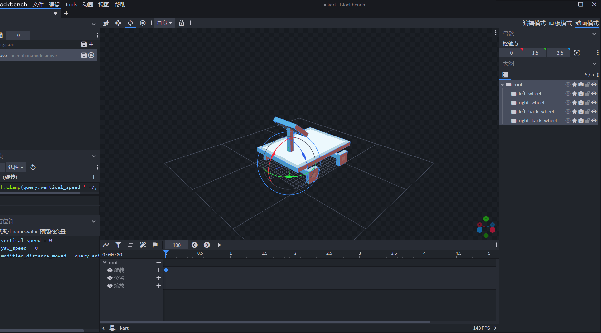
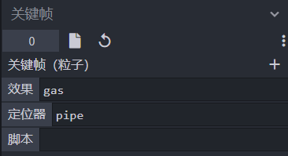

--- 
front: https://nie.res.netease.com/r/pic/20211104/69055361-2e7a-452f-8b1a-f23e1262a03a.jpg 
hard: Advanced 
time: 30 minutes 
--- 
# Challenge: Make a Kart 

In this section, let's make a kart. This challenge is mainly for Molang review and more complex application learning, so the refinement of the kart model itself is set as a secondary goal, and we will focus all our energy on the writing process of Molang related expressions. 

## Prepare the model 

 

We roughly draw a kart model, highlighting the four tire bones of the kart, and put all the bones in a root group. This will facilitate our subsequent operations. 

 

 

We quickly color the newly created texture map using the "Fill" function. After that, we can focus on the kart's animation. This is also the focus of our challenge in this section. 

## Designing movement, turning and undulation animations 

We move our focus to the wheels. Through observation in reality, we can know that when a kart moves, the tires will rotate, while the body of the car remains relatively stationary. When a kart turns, the rotation angle of the front wheels will be greater than the body of the car. When the kart flies up or down in the air, the body of the car will lean back or forward as a whole. We make the kart animation in our game based on these effects of the actual kart. 

### Movement animation 

For the movement animation, we only need to focus on the rotation of the four wheels. We just need the wheels to rotate as the distance traveled. 

 

By consulting the documentation, we can see that the query.modified_distance_moved query function can be used to return the total distance an entity has moved since entering the world. We can use this query to animate the wheels moving forward. We change the rotation angle of the $yOz$ face, which is the field represented by the X axis, for example, to `50 * query.modified_distance_moved`. We set the four tires to the same value, so that the four wheels rotate at the same speed. 

### Turning Animation 

When turning, we need to change the angle of the front wheel. Let's continue to focus on the rotation channel of the front wheel. 

 

 

We know from the documentation that when an entity moves left or right, it will have a yaw speed, which can be obtained through the query function `query.yaw_speed`. We can use this to make the wheels deflect left or right. We change the value of the Y axis to, for example, `math.clamp(query.yaw_speed * 35, -35, 35)`, so that it can rotate without turning too far. `math.clamp` can be used to **clamp** a value to a specified range. 

### Up and down animation 

Next, we make an up and down animation. We generally have this intuition about a kart falling: as the kart falls faster and faster while sliding in the air, the front of the car will get lower and lower. Therefore, we operate the rotation channel of the kart's `root` bone, which controls the entire bone, so that it rotates as the vertical speed changes. 

 


 

By consulting the documentation, we can learn that the vertical speed of an entity can be obtained using the query function `query.vertical_speed`. Therefore, we can use an expression similar to `math.clamp(query.vertical_speed * -7, -35, 35)` on the X-axis of the entire bone to control the fluctuation. However, it is worth noting that the direction of `query.vertical_speed` is consistent with the Y-axis direction of the world coordinates. In other words, when the kart falls, the direction of the vertical speed is downward. In order to make our bones turn forward, we need to multiply it by a negative number. 

In this way, we have completed the production of the basic animation of the kart. Next, we are not in a hurry to export the animation. We add particle effects to it on this basis. 

## Add exhaust and tire mark particles 

We prepare exhaust particles and tire mark particles, assuming that their short names are `gas` and `mark` respectively. In order to attach them to the entity, we need to set **locators** for them. A locator is a single point element in the model, representing a fixed position in the model. With a locator, we can attach other small components such as particles to specific positions in the model. 

 

We return to the "Edit" mode, select the bone we want to add the locator to in the "Outline" pane on the right, and right-click "Add locator". 

 

Like other elements, we can change the position of the locator by dragging the coordinate axis in the preview window. Here we put it at the bottom of the wheel, representing the starting position of the tire track particles. 

 

Soon, we added locators for the positions of the four wheels and the exhaust pipe. Now, we can add particle animation to it. Back to the "Animation" mode, we will look at the timeline pane below. 

 

Click the "Animation Effect" button, and we can see an additional animation subject in the timeline besides the skeleton, which is the effect subject that includes particles, sounds, and commands. We click the "+" button on the right side of the "Particle" channel to add a keyframe of `0.0` to it. 

### Exhaust Particles 

We click the keyframe and can see that in addition to "Script", there are two more properties, "Effect" and "Locator", in the "Keyframe" pane on the left. 

 

Among them, the locator can be selected by selecting from the drop-down menu. 

 

We will attach the short name of its particles to the `pipe` locator, so that the only thing missing is the short name definition of the exhaust particles in the entity definition file, and the exhaust particles are added. 

### Tire trace particles 

We click the "+" button on the right side of the "Keyframe" pane to add multiple effects at the same keyframe. 

 

By repeating the above process, the tire trace particles of the four tires can also be attached. Now, we can export geometry, textures, and animation files. Next, we will attach these resources to the entity client definition file. 

## Attaching kart entity resources 

We create an AddOn component in the Minecraft development workbench, and then create a `tutorial_demo:kart` entity through configuration. We export all the geometry, textures, and animations in our Blockbench project to the folder of our AddOn component. 


We complete the entity client definition file: 

```json 
{ 
"format_version": "1.8.0", 
"minecraft:client_entity": { 
"description": { 
"identifier": "tutorial_demo:kart", 
"materials": { 
"default": "entity_alphatest" 
}, 
"textures": { 
"default": "textures/entity/kart/kart" 
}, 
"geometry": { 
"default": "geometry.kart" 
}, 
"animations": { 
"move": "animation.kart.move" 
}, 
"animation_controllers": [ 
{ "move": "controller.animation.kart.move" 
} 
], 
"render_controllers": [ 
"controller.render.kart" 
], 
"particle_effects": { 
"mark": "tutorial_demo:mark", 
"gas": "tutorial_demo:gas" 
} 
} 
} 
} 
``` 

In addition, we need to create a separate animation controller for playing the `move` animation: 

```json 
{ 
"format_version" : "1.10.0", 
"animation_controllers" : { 
"controller.animation.kart.move" : { 
"initial_state" : "default", 
"states" : { 
"default" : { 
"animations" : [ 
"move" 
] 
} 
}

} 
} 
} 
``` 

You also need to make a basic rendering controller to make the entity render normally: 

```json 
{ 
"format_version": "1.8.0", 
"render_controllers": { 
"controller.render.kart": { 
"geometry": "Geometry.default", 
"materials": [ { "*": "Material.default" } ], 
"textures": [ 
"Texture.default" 
] 
} 
} 
} 
``` 

In addition, we also need to check the exported resource files to avoid mounting failures. First the geometry file:

```json
{
  "format_version": "1.12.0",
  "minecraft:geometry": [
    {
      "description": {
        "identifier": "geometry.kart",
        "texture_width": 128,
        "texture_height": 128,
        "visible_bounds_width": 3,
        "visible_bounds_height": 2.5,
        "visible_bounds_offset": [0, 0.75, 0]
      },
      "bones": [
        {
          "name": "root",
          "pivot": [0, 1.5, -3.5],
          "cubes": [
            {"origin": [-7, 1, -4], "size": [14, 1, 1], "uv": [0, 24]},            {"origin": [-7, 1, 7], "size": [14, 1, 1], "uv": [0, 21]},
            {"origin": [-7, 3.5, -7.5], "size": [14, 1, 19], "uv": [0, 0]},
            {"origin": [-0.5, 4.5, -3.5], "size": [1, 6, 1], "uv": [0, 27]},
            {"origin": [-3.5, 10.5, -5.5], "size": [7, 1, 5], "pivot": [0, 10.5, -3.5], "rotation": [-40, 0, 0], "uv": [26, 22]},
            {"origin": [-0.5, 2, -4], "size": [1, 1.5, 1], "uv": [11, 0]},
            {"origin": [-1, 2, 7], "size": [1, 1.5, 1], "uv": [6, 0]}
          ],

          "locators": {
            "pipe": [-2, 4, 11]
          }
        },
        {
          "name": "left_wheel",
          "parent": "root",
          "pivot": [7.5, 1.5, -3.5],
          "cubes": [
            {"origin": [7, 0, -5], "size": [1, 3, 3], "uv": [9, 11]}
          ],
          "locators": {
            "left_front": [7.5, 0, -3.5]
          }
        },
        {
          "name": "right_wheel",
          "parent": "root",
          "pivot": [-8, 1.5, -3.5],
          "cubes": [
            {"origin": [-8, 0, -5], "size": [1, 3, 3], "uv": [0, 8]}
          ],
          "locators": {
            "right_front": [-7.5, 0, -3.5]
          }
        },
        {
          "name": "left_back_wheel",
          "parent": "root",
          "pivot": [7.5, 1.5, 7.5],
          "cubes": [
            {"origin": [7, 0, 6], "size": [1, 3, 3], "uv": [6, 4]}
          ],
          "locators": {
            "left_back": [7.5, 0, 7.5]
          }
        },
        {
          "name": "right_back_wheel",
          "parent": "root",
          "pivot": [-7.5, 1.5, 7.5],
          "cubes": [
            {"origin": [-8, 0, 6], "size": [1, 3, 3], "uv": [0, 0]}
          ],
          "locators": {
            "right_back": [-7.5, 0, 7.5]
          }
        }
      ]
    }

  ]
}
```

Then the animation file:

```json
{
  "format_version": "1.8.0",
  "animations": {
    "animation.kart.move": {
      "loop": true,
      "bones": {
        "left_wheel": {
          "rotation": ["50 * query.modified_distance_moved", "math.clamp(query.yaw_speed * 35, -35, 35)", 0]
        },
        "right_wheel": {
          "rotation": ["50 * query.modified_distance_moved", "math.clamp(query.yaw_speed * 35, -35, 35)", 0]
        },
        "root": {
          "rotation": ["math.clamp(query.vertical_speed * -7, -35, 35)", 0, 0]
        },
        "left_back_wheel": {
          "rotation": ["50 * query.modified_distance_moved", 0, 0]
        },
        "right_back_wheel": {
          "rotation": ["50 * query.modified_distance_moved", 0, 0]
        }
      },
      "particle_effects": {
        "0.0": [
          {
            "effect": "gas",
            "locator": "pipe"
          },
          {
            "effect": "mark",
            "locator": "left_front"
          },
          {
            "effect": "mark",
            "locator": "right_front"
          },
          {
            "effect": "mark",
            "locator": "left_back"
          },
          {
            "effect": "mark",
            "locator": "right_back"

          }
        ]
      }
    }
  }
}
```

Finally there are two particles:

```json
{
	"format_version": "1.10.0",
	"particle_effect": {
		"description": {
			"identifier": "tutorial_demo:mark",
			"basic_render_parameters": {
				"material": "particles_alpha",
				"texture": "textures/particle/particles"
			}
		},
		"curves": {
			"variable.psize": {
				"type": "catmull_rom",
				"input": "variable.particle_age",
				"horizontal_range": "variable.particle_lifetime",
				"nodes": [1, 1, 0.83, 0, 0]
			}
		},		"components": {
			"minecraft:emitter_initialization": {
				"creation_expression": "variable.radius = 2.5;"
			},
			"minecraft:emitter_rate_instant": {
				"num_particles": 1
			},
			"minecraft:emitter_lifetime_looping": {
				"active_time": 2
			},
			"minecraft:emitter_shape_point": {},
			"minecraft:particle_lifetime_expression": {
				"max_lifetime": 1.5
			},
			"minecraft:particle_appearance_billboard": {
				"size": ["0.12 * variable.psize", "0.12 * variable.psize"],
				"facing_camera_mode": "emitter_transform_xz",
				"uv": {
					"texture_width": 128,
					"texture_height": 128,
					"uv": [56, 0],

					"uv_size": [8, 8]
				}
			},
			"minecraft:particle_appearance_tinting": {
				"color": [0.01176, 0.01176, 0.01176, 0.9098]
			}
		}
	}
}
```

```json
{
	"format_version": "1.10.0",
	"particle_effect": {
		"description": {
			"identifier": "tutorial_demo:gas",
			"basic_render_parameters": {
				"material": "particles_alpha",
				"texture": "textures/particle/particles"
			}
		},
		"curves": {
			"variable.psize": {
				"type": "catmull_rom",
				"input": "variable.particle_age",
				"horizontal_range": "variable.particle_lifetime",
				"nodes": [1, 1, 0.83, 0, 0]
			}
		},
		"components": {
			"minecraft:emitter_initialization": {
				"creation_expression": "variable.radius = 2.5;"
			},
			"minecraft:emitter_rate_instant": {
				"num_particles": 1
			},
			"minecraft:emitter_lifetime_looping": {
				"active_time": 2
			},
			"minecraft:emitter_shape_point": {},
			"minecraft:particle_lifetime_expression": {
				"max_lifetime": 1.5
			},
			"minecraft:particle_appearance_billboard": {
				"size": ["0.12 * variable.psize", "0.12 * variable.psize"],
				"facing_camera_mode": "lookat_xyz",
				"uv": {
					"texture_width": 128,
					"texture_height": 128,

"uv": [56, 0], 
"uv_size": [8, 8] 
} 
}, 
"minecraft:particle_appearance_tinting": { 
"color": [0.01176, 0.01176, 0.01176, 0.9098] 
} 
} 
} 
} 
``` 

This ensures that there will be no problems with the rendering of our kart. Next, we add entity behavior components to the kart. 

## Make Kart Entity Behavior 

Next, we add behaviors to the kart. The more important behaviors are `minecraft:physics`, which can make it affected by the physics engine, and `minecraft:rideable`, which makes it rideable. Add the following behavior:

```json
{
  "format_version": "1.12.0",
  "minecraft:entity": {
    "description": {
      "identifier": "tutorial_demo:kart",
      "is_experimental": false,
      "is_spawnable": false,
      "is_summonable": true
    },
    "component_groups": {

    },
    "components": {
      "minecraft:persistent": {},
      "minecraft:physics": {},
      "minecraft:rideable": {
        "seat_count": 1,
        "crouching_skip_interact": true,
        "interact_text": "action.interact.ride.kart",
        "family_types": [
          "player"
        ],
        "seats": [
          {
            "position": [              0,
              0.2,
              -0.3
            ],
            "min_rider_count": 1,
            "max_rider_count": 1

          }
        ]
      },
      "minecraft:pushable": {
        "is_pushable": false,
        "is_pushable_by_piston": true
      },
      "minecraft:movement.basic": {},
      "minecraft:jump.static": {},
      "minecraft:input_ground_controlled": {},
      "minecraft:collision_box": {
        "width": 1,
        "height": 1
      },
      "minecraft:type_family": {
        "family": [
          "kart",
          "inanimates"
        ]
      },
      "minecraft:health": {
        "value": 50
      },
      "minecraft:knockback_resistance": {
        "value": 1,
        "max": 1
      },
      "minecraft:movement": {
        "value": 0.5 
} 
}, 
"events": { 

} 
} 
} 
``` 

 

 

We can see that the behavior and animation of each part of the kart are as we expected, which shows that we have successfully added a kart entity!