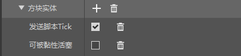

--- 
front: https://nie.res.netease.com/r/pic/20211104/69055361-2e7a-452f-8b1a-f23e1262a03a.jpg 
hard: Advanced 
time: 20 minutes 
--- 
# Understanding Block Entities 
In Chapter 10, we learned about custom blocks and learned how to customize a basic block through various examples. Among them, we learned how to give a block a custom model and how to use various components to control the behavior of the block. However, blocks defined in this way still have various shortcomings. This is because ordinary blocks have some inherent defects. 

As we all know, ordinary blocks or regular blocks operate in the world with the following mechanisms. First, blocks have various **Block States**, and each block state has one or more allowed values. Each block of this type in the world is generated by assigning a value from all the block states to one of the allowed values. In other words, each instance of a block in the world is a permutation of its block states. In the old version, we know that blocks have a property called special value, data value, damage value or **Aux Value**, which is actually equivalent to the current block state system. Each additional value corresponds to a combination of block states. A combination of each block state is called a **permutation** (or **permutation**, **Permutation**) of the block. This mode of block permutation composed of block states can only store combinations of basic values such as Boolean values or integers, but cannot store more advanced values such as strings in a block, so it has storage limitations. For example, if I want to store an item identifier in a block, this cannot be done with the definition of regular blocks alone. 

The second mechanism is the block tick mechanism. The **Tick** here can be roughly understood as an update, but it actually refers to an update that can be performed in an orderly manner as the game's system main tick cycle progresses. Conventional blocks cannot guarantee that they can tick every game tick (that is, every system main tick cycle). The dynamic one of the two liquid blocks is an exception, but even if it is an exception, it cannot guarantee the update of every tick for a long time, because once the dynamic liquid stops flowing, it will be converted into a static liquid. Conventional blocks can only tick once or add themselves to the **Pending Tick Queue** when their **Neighbor** changes or a **Random Tick** (also known as **Random Tick**) event occurs. In the community's words, it enters the **Planned Tick**. The blocks in the planned tick will be concentrated at the specified time position in the order of each system main tick cycle, which is a performance buffer mechanism. In short, regular blocks can hardly tick or update "autonomously", nor can they detect changes in other blocks or entities other than their own neighbors. This is a major flaw of regular blocks. 

The third flaw is that the model cannot be animated like an entity. The models of conventionally defined blocks are almost static, and will not change after definition. At most, the orientation of the model or the display of some bones will change slightly with the change of the block state, but complex animations cannot be completed. In order to make the model animated, we must find another high-level method. 

Therefore, similar to the relationship between attachments and items, we have a function that can attach client entities to blocks as a container of "resource controllers". This entity attached to the block with only client entity definitions is called **Block Entity** (also known as **Tile Entity**). Block entities can help us store large-scale data, tick autonomously, and play model animations. The chests, signs, furnaces, beacons, enchantment tables, beds, clocks, piston arms, etc. in the original game all have block entities. 

## Define a block entity 

After understanding so many theoretical mechanisms, how do we actually define a block entity? We can define a block entity through the `netease:block_entity` component in the server-side definition file of the block. We create a new block in the editor and add the "**Block Entity**" component to the server-side component. 

 

We can see its corresponding JSON component field 

```json 
"netease:block_entity": { 
"tick": true, 
"movable": false 
} 
``` 

The `tick` field determines whether the block entity will send a `ServerBlockEntityTickEvent` event to the script every tick. By cooperating with the script, the tick logic can be executed every tick. The `movable` field determines whether the block can be pulled back by a sticky piston. 

Once the `netease:block_entity` component is defined, a block has a basic block entity. Next, we need to cooperate with the module SDK to add the logic of the block entity. 

## Connecting to the module SDK 

We can manipulate the block entity through a series of interfaces in the module SDK. 

### Engine components 

We can modify the **Extra Data** of the block entity by creating a `blockEntityData` component on the server. Extra Data is a storage for the Chinese version of the custom block entity, which stores various data that developers can customize. We can get a reference to the extra data through the <a href="../../../mcdocs/1-ModAPI/接口/方块/方块实况.html#getblockentitydata" rel="noopenner"> `GetBlockEntityData` </a> method of the component, and then directly read the extra data or modify the value of the extra data on this reference.

### Events 

The <a href="../../../mcdocs/1-ModAPI/Events/Blocks.html#serverplaceblockentityevent" rel="noopenner"> `ServerPlaceBlockEntityEvent` </a> event can be used to trigger when a block entity is placed. The <a href="../../../mcdocs/1-ModAPI/Events/World.html#chunkgeneratedserverevent" rel="noopenner"> `ChunkGeneratedServerEvent` </a> event can be triggered when a chunk is generated, and contains a list of block entities in the data. The <a href="../../../mcdocs/1-ModAPI/Events/Blocks.html#serverblockentitytickevent" rel="noopenner"> `ServerBlockEntityTickEvent` </a> event can be triggered when a block entity ticks if ticking is enabled. These three events are all located on the server side. 

There are more block entity related module SDK interfaces in the document waiting for us to discover and use. Effective use of various interfaces will enable our block entities to have a variety of rich logic and functions!