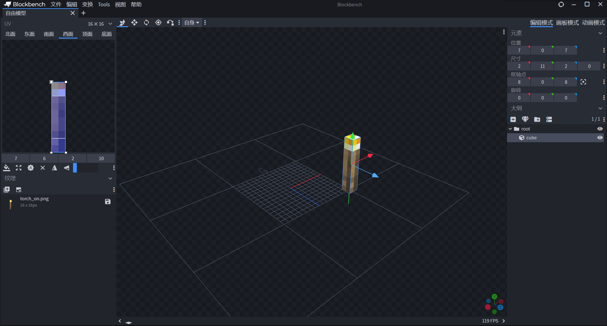
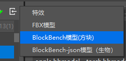
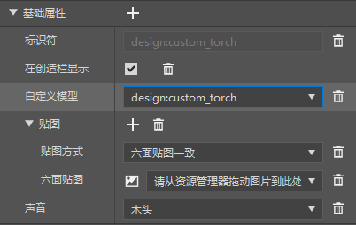
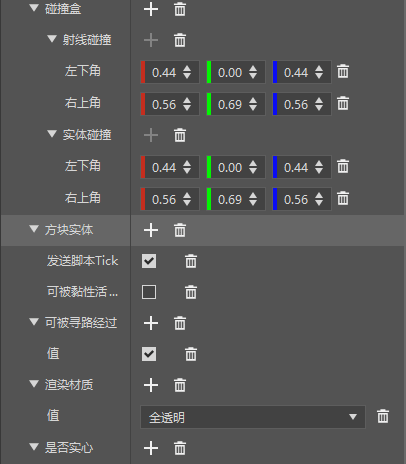

--- 
front: https://nie.res.netease.com/r/pic/20211104/69055361-2e7a-452f-8b1a-f23e1262a03a.jpg 
hard: Advanced 
time: 35 minutes 
--- 
# Make an accelerated torch 

In this section, we will learn how to make a block entity block by making an accelerated torch. 

## Prepare a torch model using Blockbench 

Our accelerated torch does not require skeletal animation or resource control, only a static torch model is needed. So we draw a torch model in Blockbench. 

 

## Import the model and configure the torch block using the editor 

 

We use the function of importing block models in the editor to import our torch model. 

 

Then create a new torch block and configure the model in the "Basic Properties", which is equivalent to configuring the `netease_model` field in `blocks.json`. 

 

Then add the "block entity" component to our torch. At the same time, in order to make the torch render normally, we adjust it to pathfinding, transparent material and non-solid, and set its collision box. 

We can also edit it in the JSON file. The server side of the block is defined as follows:

```json
{
  "format_version": "1.16.0",
  "minecraft:block": {
    "description": {
      "identifier": "design:custom_torch",
      "register_to_creative_menu": true
    },
    "components": {
      "minecraft:block_light_absorption": 0,
      "minecraft:block_light_emission": 1.0,
      "minecraft:destroy_time": 1.0,
      "netease:render_layer": {
        "value": "alpha"
      },
      "netease:aabb": {
        "collision": {
          "min": [0.4375, 0.0, 0.4375],

"max": [0.5625, 0.6875, 0.5625] 
}, 
"clip": { 
"min": [0.4375, 0.0, 0.4375], 
"max": [0.5625, 0.6875, 0.5625] 
} 
}, 
"netease:solid": { 
"value": false 
}, 
"netease:pathable": { 
"value": true 
}, 
"netease:block_entity": { 
"tick": true, 
"movable": false 
} 
} 
} 
} 
``` 

Client definition is as follows: 

```json 
{ 
"format_version": [ 1, 1, 0 ], 
"design:custom_torch": { 
"netease_model": "design:custom_torch", 
"sound": "wood" 
} 
} 
``` 

At the same time, we can also view the imported torch model file: 

```json 
{ 
"format_version": "1.13.0", 
"netease:block_geometry": { 
"description": { 
"identifier": "design:custom_torch", 
"textures": ["torch_on"], 
"use_ao": false 
}, 
"bones": [{ 
"name": "root", 
"pivot": [0, 0, 0], 
"rotation": [0, 0, 0], 
"cubes": [{

        "origin": [-9, 0, 7],
        "pivot": [-8, 0, 8],
        "rotation": [0, 0, 0],
        "size": [2, 11, 2],
        "uv": {
          "down": {
            "texture": 0,
            "uv": [7, 14],
            "uv_size": [2, 2]
          },
          "east": {
            "texture": 0,
            "uv": [7, 6],
            "uv_size": [2, 10]
          },
          "north": {
            "texture": 0,
            "uv": [7, 6],
            "uv_size": [2, 10]
          },
          "south": {
            "texture": 0,
            "uv": [7, 6],
            "uv_size": [2, 10] 
}, 
"up": { 
"texture": 0, 
"uv": [9, 8], 
"uv_size": [-2, -2] 
}, 
"west": { 
"texture": 0, 
"uv": [7, 6], 
"uv_size": [2, 10] 
} 
} 
}] 
}] 
} 
} 
``` 

## Listen for events and ripen crops 

Next we make the script part. We can listen to the ticks through the `ServerBlockEntityTickEvent` event. We use the editor to create a main module directory and a server control center in the behavior pack, and register the server system in the main module file: 

```python 
# -*- coding: UTF-8 -*- 
from mod.common.mod import Mod 
import mod.server.extraServerApi as serverApi


@Mod.Binding(name="CustomTorch", version="0.1")
class CustomTorch(object):

    def __init__(self):
        pass

    @Mod.InitClient()
    def initClient(self):
        pass

    @Mod.InitServer()
    def initServer(self):
        serverApi.RegisterSystem("CustomTorch", "CustomTorchServer", "CustomTorchScripts.ServerMgr.Main")

    @Mod.DestroyClient()
    def destroyClient(self):
        pass

    @Mod.DestroyServer()
    def destroyServer(self):
        pass

```

Then we write the server system in the `ServerMgr.py` file:

```python
# -*- coding: UTF-8 -*-
from mod.server.system.serverSystem import ServerSystem
import mod.server.extraServerApi as serverApi 

class Main(ServerSystem): 

def __init__(self, namespace, system_name): 
ServerSystem.__init__(self, namespace, system_name) 
namespace, system = serverApi.GetEngineNamespace(), serverApi.GetEngineSystemName() 
self.ListenForEvent(namespace, system, "ServerBlockEntityTickEvent", self, self.on_torch_grow) # Listen for ServerBlockEntityTickEvent events 

def on_torch_grow(self, event): 
x = event['posX'] # Get coordinate X 
y = event['posY'] # Get coordinate Y 
z = event['posZ'] # Get coordinate Z 
dim_id = event['dimension'] # Get dimension ID 
block_comp = serverApi.GetEngineCompFactory().CreateBlockInfo(serverApi.GetLevelId())
        block_state_comp = serverApi.GetEngineCompFactory().CreateBlockState(serverApi.GetLevelId())
        block_entity_comp = serverApi.GetEngineCompFactory().CreateBlockEntityData(serverApi.GetLevelId())
        block_entity_data = block_entity_comp.GetBlockEntityData(dim_id, (x, y, z)) # Get block data

tick = block_entity_data['tick'] # Get the tick count of the block 
if not tick: 
tick = 0 # Create a tick value if there is no tick attribute in the additional data 
tick += 1 # The speed torch block will increment the tick count every tick 
block_entity_data['tick'] = tick # Apply the tick attribute back 
if tick % 20 != 0: # 1 second = 20 ticks. When the refresh count modulo 20 is 0, one second has passed 
return 
# Use list comprehension to get [(x - 1, y, z - 1), (x, y, z - 1), (x + 1, y, z - 1), (x + 1, y, z + 1), (x, y, z), 
# (x - 1, y, z + 1), (x, y, z + 1), (x - 1, y, z), (x + 1, y, z)] 
grow_poses = [(x + x_offset, y, z + z_offset) for x_offset in xrange(-1, 2) for z_offset in xrange(-1, 2)] 
grow_poses.remove((x, y, z)) # Since the coordinate (x, y, z) is the acceleration torch, remove this coordinate 
for grow_pos in grow_poses: 
block = block_comp.GetBlockNew(grow_pos, dim_id) 
if block and block['name'] == 'minecraft:wheat': # If it is wheat 
block_state = block_state_comp.GetBlockStates(grow_pos, dim_id) 
if block_state['growth'] < 7: # And the wheat is not yet mature, that is, the growth value is less than 7 
block_state['growth'] += 1 # Increase the growth value by one level 
block_state_comp.SetBlockStates(grow_pos, block_state, dim_id) 

``` 

In this way, we have completed the production of the acceleration torch that can accelerate the wheat, which will accelerate the growth of wheat by one stage per second. Let's enter the game to check the effect. 

 

You can see that our acceleration torch has accelerated the surrounding wheat as expected!