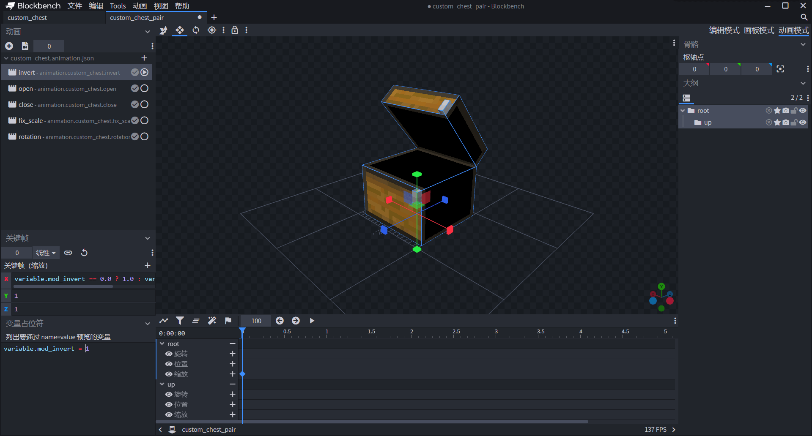
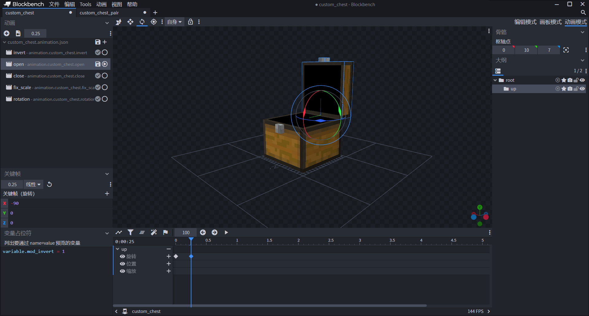
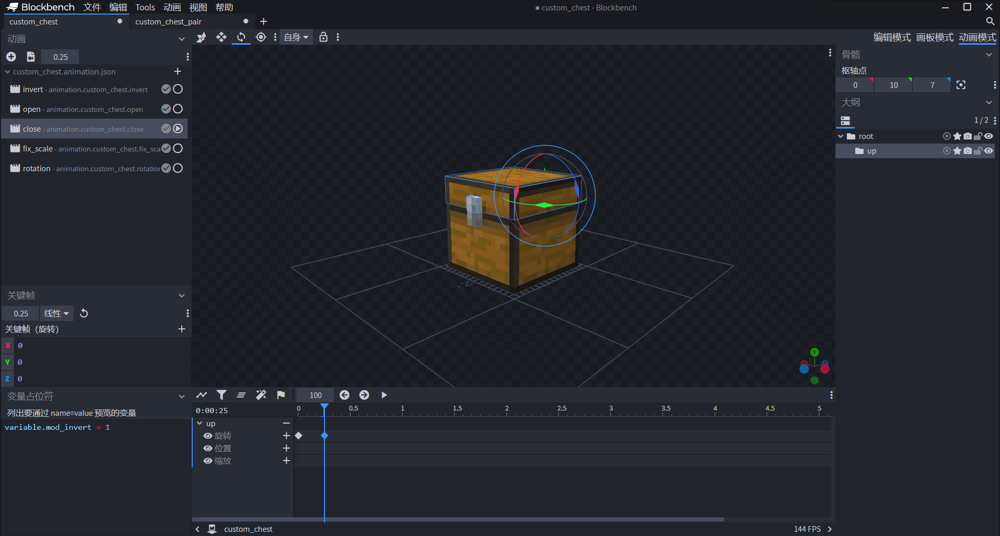

--- 
front: https://nie.res.netease.com/r/pic/20211104/69055361-2e7a-452f-8b1a-f23e1262a03a.jpg 
hard: Advanced 
time: 50 minutes 
--- 
# Challenge: Make a custom box (no storage version) 

In this section, let's complete a challenge together and use the block entity and the module API to complete a custom box. However, since we haven't explained the production of the UI yet, we will not make the storage function of the box at this stage. You can click the link: [Box Demo](https://g79.gdl.netease.com/addonguide-13.zip) to download the complete package. 

## Prepare the client entity and its resources 

We want our box to use a client entity as the carrier of its model and animation. We manually create a client entity definition file in the `entity` folder of the resource package.

```json 
{ 
"format_version": "1.10.0", 
"minecraft:client_entity": { 
"description": { 
"identifier": "tutorial_demo:custom_chest" 
} 
} 
} 
``` 

### Prepare resources 

Next, we will prepare the model, animation, controller and other resources in turn. 

#### Prepare the model 

 

We use Blockbench to make a box model according to the normal entity method. Note that we want the box to be openable, so the upper and lower parts of the box need to be divided into two bones. For the texture of the model, we directly use the original texture. Developers can change the texture at will if they have any needs. 

```json
{
  "format_version": "1.12.0",
  "minecraft:geometry": [
    {
      "description": {
        "identifier": "geometry.custom_chest",
        "texture_width": 32,
        "texture_height": 32,
        "visible_bounds_width": 3,
        "visible_bounds_height": 3.5,
        "visible_bounds_offset": [0, 1.25, 0]
      },
      "bones": [
        {

          "name": "root",
          "pivot": [0, 0, 0],
          "cubes": [
            {
              "origin": [-7, 0, -7],
              "size": [14, 10, 14],
              "uv": {
                "north": {"uv": [0, 21], "uv_size": [16, 11]},
                "east": {"uv": [0, 21], "uv_size": [16, 11]},
                "south": {"uv": [0, 21], "uv_size": [16, 11]},
                "west": {"uv": [0, 21], "uv_size": [16, 11]},
                "up": {"uv": [32, 32], "uv_size": [-16, -16]},
                "down": {"uv": [32, 16], "uv_size": [-16, -16]}
              }
            },
            {
              "origin": [-1, 8, -8],
              "size": [2, 2, 1],
              "uv": {
                "north": {"uv": [7, 5], "uv_size": [2, 2]},
                "east": {"uv": [7, 5], "uv_size": [1, 2]},
                "south": {"uv": [0, 0], "uv_size": [2, 4]},
                "west": {"uv": [7, 5], "uv_size": [1, 2]},
                "up": {"uv": [9, 6], "uv_size": [-2, -1]},
                "down": {"uv": [9, 7], "uv_size": [-2, -1]}
              }
            }
          ]
        },
        {
          "name": "up",
          "parent": "root",
          "pivot": [0, 10, 7],
          "cubes": [
            {
              "origin": [-7, 10, -7],
              "size": [14, 4, 14],
              "uv": {
                "north": {"uv": [0, 0], "uv_size": [16, 5]},
                "east": {"uv": [0, 16], "uv_size": [16, 5]},
                "south": {"uv": [0, 16], "uv_size": [16, 5]},
                "west": {"uv": [0, 15], "uv_size": [16, 6]},
                "up": {"uv": [32, 16], "uv_size": [-16, -16]},
                "down": {"uv": [32, 32], "uv_size": [-16, -16]}
              }
            },
            {
              "origin": [-1, 10, -8],
              "size": [2, 2, 1],
              "uv": {

                "north": {"uv": [7, 3], "uv_size": [2, 2]},
                "east": {"uv": [7, 3], "uv_size": [1, 2]},
                "south": {"uv": [0, 0], "uv_size": [2, 4]},
                "west": {"uv": [7, 3], "uv_size": [1, 2]},
                "up": {"uv": [9, 4], "uv_size": [-2, -1]},
                "down": {"uv": [9, 7], "uv_size": [-2, -1]}
              }
            }
          ]
        }
      ]
    } ] 
} 
``` 

 

At the same time, in order to prepare the model of the large box, we prepare a model of half of the large box. 

```json
{
  "format_version": "1.12.0",
  "minecraft:geometry": [
    {
      "description": {
        "identifier": "geometry.custom_chest_pair",
        "texture_width": 32,
        "texture_height": 32,
        "visible_bounds_width": 3,
        "visible_bounds_height": 3.5,
        "visible_bounds_offset": [0, 1.25, 0]
      },
      "bones": [
        {
          "name": "root",
          "pivot": [0, 0, 0],
          "cubes": [
            {
              "origin": [-7, 0, -7],
              "size": [15, 10, 14],
              "uv": {
                "north": {"uv": [0, 21], "uv_size": [15, 11]},
                "east": {"uv": [0, 21], "uv_size": [16, 11]},
                "south": {"uv": [1, 21], "uv_size": [15, 11]},
                "west": {"uv": [16, 17], "uv_size": [16, 15]},
                "up": {"uv": [32, 32], "uv_size": [-15, -16]},
                "down": {"uv": [32, 16], "uv_size": [-16, -16]}
              }
            },

            {
              "origin": [7, 8, -8],
              "size": [1, 2, 1],
              "uv": {
                "north": {"uv": [7, 5], "uv_size": [1, 2]},
                "east": {"uv": [7, 5], "uv_size": [1, 2]},
                "south": {"uv": [0, 0], "uv_size": [2, 4]},
                "west": {"uv": [7, 5], "uv_size": [1, 2]},
                "up": {"uv": [9, 6], "uv_size": [-2, -1]},
                "down": {"uv": [9, 7], "uv_size": [-2, -1]}
              }
            }
          ]
        },
        {
          "name": "up",          "parent": "root",
          "pivot": [0, 10, 7],
          "rotation": [-50, 0, 0],
          "cubes": [
            {
              "origin": [-7, 10, -7],
              "size": [15, 4, 14],
              "uv": {
                "north": {"uv": [0, 16], "uv_size": [15, 5]},
                "east": {"uv": [0, 16], "uv_size": [16, 5]},
                "south": {"uv": [1, 16], "uv_size": [15, 5]},
                "west": {"uv": [16, 15], "uv_size": [16, 6]},
                "up": {"uv": [32, 16], "uv_size": [-15, -16]},
                "down": {"uv": [32, 32], "uv_size": [-15, -16]}
              }
            },
            {
              "origin": [7, 10, -8],
              "size": [1, 2, 1],
              "uv": {
                "north": {"uv": [7, 3], "uv_size": [1, 2]},
                "east": {"uv": [7, 3], "uv_size": [1, 2]},
                "south": {"uv": [0, 0], "uv_size": [2, 4]},
                "west": {"uv": [7, 3], "uv_size": [1, 2]},
                "up": {"uv": [9, 4], "uv_size": [-2, -1]},                "down": {"uv": [9, 7], "uv_size": [-2, -1]}
              }
            }
          ]
        }
      ]
    }
  ]
}

``` 

#### Prepare the animations 

 

 

We want the large chest half to have both left and right positions so we can put it together. So we make an `invert` animation, where `variable.mod_invert` is defined in the entity definition file. 

 

 

We want the chest to have open and close animations, so we make `open` and `close` animations. 

 

We know that the block model must be displaced by (-8, 0, 8) to render properly, so we make a `fix_scale` animation. 

 

Our box can face any side, so we make a `rotation` animation for this purpose, where `variable.mod_rotation` is defined in the entity definition file. Although we can also use `netease:face_directional` in the behavior pack component of the block to complete multi-facing, for the convenience of subsequent production, we can still directly add a facing animation to the model entity, and at the same time make it controlled by a custom Molang variable in the entity definition. 

```json
{
  "format_version": "1.8.0",
  "animations": {
    "animation.custom_chest.invert": {
      "loop": true,
      "bones": {
        "root": {
          "scale": ["variable.mod_invert == 0.0 ? 1.0 : variable.mod_invert", 1.0, 1.0]
        }
      }
    },
    "animation.custom_chest.open": {
      "loop": "hold_on_last_frame",
      "animation_length": 0.25,
      "bones": {
        "up": {
          "rotation": {
            "0.0": [0, 0, 0],
            "0.25": [-90, 0, 0]
          }
        }
      }
    },    "animation.custom_chest.close": {
      "loop": "hold_on_last_frame",

      "animation_length": 0.25,
      "bones": {
        "up": {
          "rotation": {
            "0.0": [-90, 0, 0],
            "0.25": [0, 0, 0]
          }
        }
      }
    },
    "animation.custom_chest.fix_scale": {
      "loop": true,
      "bones": {
        "root": {
          "position": [-8, 0, 8]
        }
      }
    },
    "animation.custom_chest.rotation": {
      "loop": true,
      "bones": {
        "root": {
          "rotation": [0, "variable.mod_rotation * 90", 0]
        }
      }
    }
  }
}
```

#### Prepare the animation controller 

We manually create a new animation controller file to control the opening and closing of the box. 

```json 
{ 
"format_version": "1.10.0", 
"animation_controllers": { 
"controller.animation.custom_chest.general": { 
"initial_state": "default", 
"states": { 
"default": { 
"transitions": [ 
{ 
"open": "variable.mod_states" 
} 
] 
}, 
"open": { 
"animations": [

"open" 
], 
"transitions": [ 
{ 
"close": "!variable.mod_states" 
} 
] 
}, 
"close": { 
"animations": [ 
"close" 
], 
"transitions": [ 
{ 
"default": "query.any_animation_finished" 
} 
] 
} 
} 
} 
} 
``` 

Among them, `variable.mod_states` is used to control the opening and closing of the box. We can define it in the entity definition file and control it in the module SDK. 

#### Prepare the rendering controller 

We mainly want the rendering controller to control whether the entity should use the normal box model or the large box model, so we focus on the `geometry` field in the controller. 

```json 
{ 
"format_version": "1.8.0", 
"render_controllers": { 
"controller.render.chest_pair": { 
"geometry": "variable.mod_invert == 0.0 ? Geometry.default : Geometry.pair", 
"materials": [{"*": "Material.default"}], 
"textures": ["Texture.default"] 
} 
} 
} 
``` 

`variable.mod_invert` is the same variable as in our animation, which is defined by the entity definition file and controlled by the module SDK. We hope that when `variable.mod_invert` is equal to 0, it is a normal box, and when it is equal to 1 or -1, it is a positive or negative large box. 

### Attach resources 

Next, we will attach all resources to the entity definition file. 

```json

{
  "format_version": "1.10.0",
  "minecraft:client_entity": {
    "description": {
      "identifier": "tutorial_demo:custom_chest",
      "materials": {
        "default": "entity_alphatest"
      },
      "geometry": {
        "default": "geometry.custom_chest",
        "pair": "geometry.custom_chest_pair"
      },
      "textures": {
        "default": "textures/entity/custom_chest/custom_chest"
      },
      "animations": {
        "open": "animation.custom_chest.open",
        "close": "animation.custom_chest.close",
        "fix_scale": "animation.custom_chest.fix_scale",
        "rotation": "animation.custom_chest.rotation", "pair_invert": "animation.custom_chest.invert", 
"controller.general": "controller.animation.custom_chest.general" 
}, 
"scripts": { 
"initialize": [ 
"variable.mod_states = 0.0;", 
"variable.mod_invert = 0.0;", 
"variable.mod_rotation = 0.0;" 
], 
"animate": [ 
"fix_scale", 
"pair_invert", 
"rotation", 
"controller.general" 
] 
}, 
"render_controllers": [ 
"controller.render.chest_pair" 
] 
} 
} 
} 
``` 

At the same time, we define variables in `scripts/initialize`, which means that these variables will be initialized when the entity is initialized. Note that the expression here is an assignment expression, so it contains an equal sign. An expression with an equal sign will be considered a complex expression, so it must end with `;`. In this way, we have prepared a box entity. Next, we only need to attach the box entity to the block, and use the module SDK to control the values of the above three variables to achieve the changes of various box animations. 

## Create a block 

We create a new AddOn component in the Minecraft development workbench, and we might as well name it "Custom Box Module". We create a new block through configuration. Let's first focus on its resource pack definition file, and we attach the entity we just made above to it. We open the `blocks.json` file in the root directory of the resource pack. 


```json 
{ 
"format_version": [1, 1, 0], 
"tutorial_demo:custom_chest": { 
"sound": "stone", 
"client_entity": { 
"identifier": "tutorial_demo:custom_chest", 
"hand_model_use_client_entity": true 
} 
} 
} 
``` 

We attach the entity client file to the `client_entity` field of the block client file. In this way, our block has a block entity model. Of course, in order for the block to actually have a block entity, we also need to use the corresponding component in the block behavior pack definition to activate the block entity. 

```json
{
  "format_version": "1.10.0",
  "minecraft:block": {
    "description": {
      "identifier": "tutorial_demo:custom_chest",
      "register_to_creative_menu": true
    },
    "components": {
      "netease:listen_block_remove": {
        "value": true
      },
      "netease:solid": {
        "value": false
      },
      "netease:block_entity": {
        "tick": false,
        "movable": false
      },
      "netease:aabb": {
        "collision": {
          "min": [
            0.0625,
            0,
            0.0625
          ],
          "max": [
            0.9375,            0.875,
            0.9375
          ]
        },
        "clip": {
          "min": [
            0.0625,

0, 
0.0625 
], 
"max": [ 
0.9375, 
0.875, 
0.9375 
] 
} 
}, 
"minecraft:block_light_absorption": 0, 
"minecraft:destroy_time": 0.1 
} 
} 
} 
``` 

Among them, `netease:block_entity` is used to turn on the block entity. `netease:listen_block_remove` is used to enable the block removal listener in the module SDK. Imagine that when we destroy one side of a large box, we should need to change the model of the other side in time to make it return to the appearance of a normal box. Therefore, we need to enable the block removal listener in the module SDK. 

At present, we have defined the resource files and behavior files of the blocks, but such blocks have no functions in the world. They cannot turn according to the direction of the player's placement, nor can they automatically detect the surrounding blocks to determine whether to merge into a large box, nor can they be opened and closed. These functions require the cooperation of the module SDK to achieve. Next, we will use the module SDK to create these functions. 

## Write module SDK scripts 

We manually create Python script files and create a `BlockEntityScripts` folder. In addition to `__init__.py` and `modMain.py`, create `ServerSystem.py` and `ClientSystem.py` files respectively, and create `Main` classes in them respectively. 

We register two systems in `modMain.py` for later use:

```python
# -*- coding: UTF-8 -*-
from mod.common.mod import Mod
import mod.server.extraServerApi as serverApi
import mod.client.extraClientApi as clientApi


@Mod.Binding(name="LostWorld", version="0.2")
class TileEntityChest(object):

    def __init__(self):
        pass

    @Mod.InitClient()
    def initClient(self):
        clientApi.RegisterSystem('tutorial_demo', 'BlockEntityClient', 'BlockEntityScripts.ClientSystem.Main')

    @Mod.InitServer()
    def initServer(self):
        serverApi.RegisterSystem('tutorial_demo', 'BlockEntityServer', 'BlockEntityScripts.ServerSystem.Main')

    @Mod.DestroyClient()
    def destroyClient(self):

pass 

@Mod.DestroyServer() 
def destroyServer(self): 
pass 

``` 

### Make a box turn function 

As we know, the original box will change the orientation according to the player's orientation when placed. For our box, we try to simulate this process in our mind: 

> The orientation information of the box must be stored on the server, because if it is only stored on the client, other clients will not be able to obtain relevant information, resulting in the phenomenon of asynchronous views between players. Therefore, we can store the orientation information of the box in the block entity data of the box on the server. 
> 
> When the player tries to place a block, we can detect the context information at this time, and only allow the box to be placed when the player is facing a non-box top surface. At the moment when the player has just placed the box, we calculate the orientation of the box according to the player's current orientation, and then change the block entity data used by the box to store the orientation to the correct orientation. All of this should be done on the server side, because these operations all involve the state of the block itself, and the state of the block itself is stored on the server side. The client only synchronizes this data in real time and renders it. At this point, we know the last step: notify the client and request the client to modify the value of the variable `variable.mod_rotation` to adjust the rendering of the box. 

We write the following code in the server system: 

```python 
# -*- coding: UTF-8 -*- 
from mod.server.system.serverSystem import ServerSystem 
from mod.common.minecraftEnum import Facing 
import mod.server.extraServerApi as serverApi 

class Main(ServerSystem): 

def __init__(self, namespace, system_name): 
ServerSystem.__init__(self, namespace, system_name) 
namespace = serverApi.GetEngineNamespace() 
system_name = serverApi.GetEngineSystemName() 
# Listen to the ServerEntityTryPlaceBlockEvent event of the engine system, which will be triggered when the player tries to place it, to prevent some unnecessary placement situations, and bind the on_try_placed callback 
self.ListenForEvent(namespace, system_name, 'ServerEntityTryPlaceBlockEvent', self, self.on_try_placed) 
# Listen to the EntityPlaceBlockAfterServerEvent event of the engine system. It is triggered immediately after the block is placed. It is used to quickly update the various states of the block after the block is placed. Bind the on_placed callback 
self.ListenForEvent(namespace, system_name, 'EntityPlaceBlockAfterServerEvent', self, self.on_placed) 

def on_try_placed(self, event): 
# Get XYZ coordinates 
x = event['x'] 
y = event['y'] 
z = event['z'] 
# Get the ID of the block the player wants to place 
block_name = event['fullName'] 
# Get the dimension ID 
dimension_id = event['dimensionId'] 
# Get the face of the block pointed to by the player 
face = event['face'] 
# If the player points to the upper surface and the block in his hand is our box 
if face == Facing.Up and block_name == 'tutorial_demo:custom_chest': 
# We are going to place it, but in this case we have to make an exception, that is, we don't want to put the box on the box. We use the blockInfo engine component to get the coordinates of the block at the next grid.

block_data = serverApi.GetEngineCompFactory().CreateBlockInfo(serverApi.GetLevelId()).GetBlockNew((x, y - 1, z), dimension_id) 
# If this block is also a box 
if block_data['name'] == block_name: 
# Cancel placement 
event['cancel'] = True 

def on_placed(self, event): 
# Get dimension ID 
dimension_id = event['dimensionId'] 
# Get XYZ coordinates 
x = event['x'] 
y = event['y'] 
z = event['z'] 
# Get the ID of the placed block 
block_name = event['fullName'] 
# Get the entity ID of the block to be prevented, that is, our player ID 
player_id = event['entityId'] 
# If the placed box is our custom box 
if block_name == 'tutorial_demo:custom_chest': 
# Get the player's perspective through the rot engine component to prepare for setting the direction of the box according to the player's yaw angle value below 
player_rot = serverApi.GetEngineCompFactory().CreateRot(player_id).GetRot() 
# Get the block entity data of the placed box through the blockEntityData engine component 
block_data_comp = serverApi.GetEngineCompFactory().CreateBlockEntityData(serverApi.GetLevelId()) 
block_data = block_data_comp.GetBlockEntityData(dimension_id, (x, y, z)) 
# If the block entity data is obtained 
if block_data: 
# We use a custom function get_block_facing to get where the box should face and set it to the block entity data. The custom function is defined at the bottom of the script 
block_data['rotation'] = self.get_block_facing(player_rot) 
# At this time, the default box is a small box, set to the block entity data 
block_data['states'] = 0 
# At this time, the default box is not reversed, set to the block entity data 
block_data['invert'] = 0 
# In the end, we hope to inform the client of the various states of the box so that the client can update the Molang variables of the block entity and complete the rendering work. We prepare a dictionary here to store the data that needs to be posted 
post_data = {} 
# Get the extra data of the entire archive through the extraData engine component. We want to store all the block entities in the current world in the extra data of the entire archive, so that we can restore the various states of the current box when we open the archive next time 
level_data_comp = serverApi.GetEngineCompFactory().CreateExtraData(serverApi.GetLevelId()) 
data = level_data_comp.GetExtraData(block_name) 
# If there is no data with the block ID as the key name, create a new one 
if not data: 
data = {} 
# Store the various states of the block in the dictionary of the data to be posted 
post_data['{0},{1},{2}'.format(x, y, z)] = {'rotation': block_data['rotation'], 'invert': block_data['invert']} 
# Store various states of the block in the dictionary that will eventually be set to the world's extra data 
data['{0},{1},{2}'.format(x, y, z)] = {'rotation': block_data['rotation'], 'invert': block_data['invert']} 
# Set extra data for the world 
level_data_comp.SetExtraData(block_name, data) 
# Broadcast the posted data to each client with the event name InitChestRotation 
self.BroadcastToAllClient('InitChestRotation', post_data) 

def get_block_facing(self, rot):

# This is the function that returns the orientation of the box based on the player's yaw angle. We know that the player's yaw angle is the attitude angle perpendicular to the y-axis, rotating on the zOx plane, so the positive direction of the z-axis, that is, the south, is 0°, and the positive direction is the counterclockwise rotation of the positive direction of the x-axis. Our box faces north by default, which is the conjugate direction, so variable.mod_rotation should be 0 at this time. Therefore, we can use the following judgment to complete the conversion from the player's orientation to the block's orientation. 
if 135.0 < rot[1] <= 180.0: 
return 2.0 
elif 45.0 < rot[1] <= 135.0: 
return 1.0 
elif -45.0 < rot[1] <= 45.0: 
return 0.0 
elif -135.0 < rot[1] <= -45.0: 
return 3.0 
elif -180.0 < rot[1] <= -135.0: 
return 2.0 
else: 
return 0.0 

``` 

We write the following code in the client: 

```python 
# -*- coding: UTF-8 -*- 
from mod.client.system.clientSystem import ClientSystem 
import mod.client.extraClientApi as clientApi 
import time 

class Main(ClientSystem): 

def __init__(self, namespace, system_name): 
ClientSystem.__init__(self, namespace, system_name) 
# We listen to the InitChestRotation event of our module server and bind chest_rotation as the callback 
self.ListenForEvent('tutorial_demo', 'BlockEntityServer', 'InitChestRotation', self, self.chest_rotation) 
# A queue, which will be used below 
self.rotation_queue = [] 

def chest_rotation(self, event): 
# Reconstruct event into a readable form 
new_event = {tuple(map(int, k.split(','))): v for k, v in event.items()} 
# Prepare blockInfo engine component 
block_comp = clientApi.GetEngineCompFactory().CreateBlockInfo(clientApi.GetLevelId()) 
# Customize a function. The reason for customizing this function is that when the event is triggered, it may happen that the block is rendered on the client, but the block's Molang cannot be set. Therefore, we try to put the response of updating the block's Molang directly into the Update function, updating it once per script tick until it is updated at least twice. We pass this function to Update through a queue, that is, the rotation_queue defined above, and then pop this function out of the queue after at least two updates. 
def rotate_chest(): 
index = 0 
count = len(new_event.items()) 
# Respond to all blocks passed in by the current event 
for pos, data in new_event.items(): 
# Get its ID and data value 
block_data = block_comp.GetBlock(pos) 
# If the ID is our box 
if block_data[0] == 'tutorial_demo:custom_chest': 
# Set the values of various Molang variables

block_comp.SetBlockEntityMolangValue(pos, "variable.mod_rotation", data['rotation']) 
block_comp.SetBlockEntityMolangValue(pos, "variable.mod_invert", float(data['invert']) if data['invert'] != 0 else 0.0) 
index += 1 
if index == count: 
return True 
else: 
return False 
# If there is a block in the incoming data 
if new_event: 
# Put our update function in the queue 
self.rotation_queue.append([rotate_chest, 0]) 

def Update(self): 
# Record the index value of the function that is about to complete the task of setting the direction in the list 
_die = [] 
# For each function in the queue 
for index, value in enumerate(self.rotation_queue): 
# Execute it repeatedly until it is satisfied twice 
if value[0](): 
value[1] += 1 
if value[1] == 2: 
_die.append(index) 
# Set the element where the function that completes the task is located to None 
for i in _die: 
self.rotation_queue[i] = None 
# Filter out the list elements that use None as the placeholder 
if self.rotation_queue: 
self.rotation_queue = filter(None, self.rotation_queue) 
``` 

This completes the box's rotation function. 

 

### Make a box connection function 

The box connection function is that if two small boxes face the same direction and are placed side by side, they will automatically merge into a large box. We should pay attention to two points. The first point is the merging logic triggered when the second box is placed, and the second point is the recovery logic of the first box triggered when the second box is destroyed. 

> These logics still need to be run on the server first, and then tell the client to update the value of the Molang variable. We only need to determine whether there are boxes with the same orientation on the left and right sides of the box according to whether the box is placed east-west or north-south. If so, set your own and the other party's `variable.mod_invert` to 1 and -1 respectively, and then inform the client of this message to make it visually connected. 

We add the following code in the server system: 

```python 
# -*- coding: UTF-8 -*- 
from mod.server.system.serverSystem import ServerSystem 
from mod.common.minecraftEnum import Facing 
import mod.server.extraServerApi as serverApi 

class Main(ServerSystem):


    def __init__(self, namespace, system_name): 
ServerSystem.__init__(self, namespace, system_name) 
namespace = serverApi.GetEngineNamespace() 
system_name = serverApi.GetEngineSystemName() 
self.ListenForEvent(namespace, system_name, 'ServerEntityTryPlaceBlockEvent', self, self.on_try_placed) 
self.ListenForEvent(namespace, system_name, 'EntityPlaceBlockAfterServerEvent', self, self.on_placed) 
# Listen to the BlockRemoveServerEvent event of the engine system, which is triggered when the block is removed. It is used to restore the remaining box when a block is destroyed in the large box, and bind the block_removed callback 
self.ListenForEvent(namespace, system_name, 'BlockRemoveServerEvent', self, self.block_removed) 

def on_try_placed(self, event): 
        x = event['x']
        y = event['y']
        z = event['z']
        dimension_id = event['dimensionId']
        face = event['face']
        if face == Facing.Up and block_name == 'tutorial_demo:custom_chest':
            block_data = serverApi.GetEngineCompFactory().CreateBlockInfo(serverApi.GetLevelId()).GetBlockNew((x, y - 1, z), dimension_id)
            if block_data['name'] == block_name:
                event['cancel'] = True

    def on_placed(self, event):
        # Get dimension ID
        dimension_id = event['dimensionId']
        # Get XYZ coordinates
        x = event['x']
        y = event['y']
        z = event['z']
        # Get the ID of the block that has been placed 
block_name = event['fullName'] 
# Get the entity ID of the block to be prevented, that is, our player ID 
player_id = event['entityId'] 
# If our custom box has been placed 
if block_name == 'tutorial_demo:custom_chest': 
player_rot = serverApi.GetEngineCompFactory().CreateRot(player_id).GetRot() 
# Get the block entity data of the box that has been placed through the blockEntityData engine component 
block_data_comp = serverApi.GetEngineCompFactory().CreateBlockEntityData(serverApi.GetLevelId()) 
block_data = block_data_comp.GetBlockEntityData(dimension_id, (x, y, z)) 
# If the block entity data is obtained 
if block_data: 
block_data['rotation'] = self.get_block_facing(player_rot) 
block_data['states'] = 0 
block_data['invert'] = 0 
# Prepare blockInfo engine component 
block_info_comp = serverApi.GetEngineCompFactory().CreateBlockInfo(serverApi.GetLevelId()) 
# Create data to be posted 
post_data = {} 
# If the box is placed east-west, that is, facing north-south 
if block_data['rotation'] % 2 == 0.0: 
# Take between -1 and 1

for i in range(-1, 2, 2): 
# Get the information of the blocks with x coordinates ±1, that is, the blocks on the east and west sides, through the blockInfo engine component 
block_info_data = block_info_comp.GetBlockNew( 
(x + i, y, z), 
dimension_id 
) 
# If it is also a box 
if block_info_data['name'] == 'tutorial_demo:custom_chest': 
# Get its block entity data through the blockEntityData engine component 
connect_block_data = block_data_comp.GetBlockEntityData(dimension_id, (x + i, y, z)) 
# If invert is 0, it is also a small box 
if connect_block_data['invert'] == 0 and connect_block_data['rotation'] == block_data['rotation']: 
# Make it half of the big box, and turn yourself into the other half 
block_data['invert'] = i * int(block_data['rotation'] - 1) 
connect_block_data['invert'] = -i * int(block_data['rotation'] - 1) 
# Add this box to the data that needs to be posted, so that it can be passed to the client to update the Molang variable later 
post_data['{0},{1},{2}'.format(x + i, y, z)] = {'rotation': connect_block_data['rotation'], 'invert': connect_block_data['invert']} 
break 
# If the box is placed north-south, that is, facing east-west, the same applies 
if block_data['rotation'] % 2 == 1.0: 
for i in range(-1, 2, 2): 
block_info_data = block_info_comp.GetBlockNew( 
(x, y, z + i),
                            dimension_id
                        )
                        if block_info_data['name'] == 'tutorial_demo:custom_chest':
                            connect_block_data = block_data_comp.GetBlockEntityData(dimension_id, (x, y, z + i))
                            if connect_block_data['invert'] == 0 and connect_block_data['rotation'] == block_data['rotation']:
                                block_data['invert'] = i * int(block_data['rotation'] - 2)
                                connect_block_data['invert'] = -i * int(block_data['rotation'] - 2)
                                post_data['{0},{1},{2}'.format(x, y, z + i)] = {'rotation': connect_block_data['rotation'], 'invert': connect_block_data['invert']} 
break 
level_data_comp = serverApi.GetEngineCompFactory().CreateExtraData(serverApi.GetLevelId()) 
data = level_data_comp.GetExtraData(block_name) 
if not data: 
data = {} 
post_data['{0},{1},{2}'.format(x, y, z)] = {'rotation': block_data['rotation'], 'invert': block_data['invert']} 
data['{0},{1},{2}'.format(x, y, z)] = {'rotation': block_data['rotation'], 'invert': block_data['invert']} 
# Update the values in the extra data that needs to be stored in the collocation world with the values in the data that needs to be posted 
data.update(post_data) 
level_data_comp.SetExtraData(block_name, data) 
self.BroadcastToAllClient('InitChestRotation', post_data) 

def block_removed(self, event): 
# Get the ID of the removed block 
block_name = event['fullName'] 
# Get the XYZ coordinates 
x = event['x'] 
y = event['y'] 
z = event['z']

# Get the dimension ID 
dimension_id = event['dimension'] 
# If the removed box is ours 
if block_name == 'tutorial_demo:custom_chest': 
# Get its block entity data through the blockEntityData engine component 
block_data_comp = serverApi.GetEngineCompFactory().CreateBlockEntityData(serverApi.GetLevelId()) 
block_entity_data = block_data_comp.GetBlockEntityData(0, (x, y, z)) 
# Get the key-value pair storage value of our box in the archive's extra data through the extraData engine component and put it in data 
level_data_comp = serverApi.GetEngineCompFactory().CreateExtraData(serverApi.GetLevelId()) 
data = level_data_comp.GetExtraData(block_name) 
# Define an empty data that needs to be posted when broadcasting events to the client at the end 
post_data = {} 
# If the block was originally a big box 
if block_entity_data['invert'] != 0: 
# Prepare the blockInfo engine component 
block_info_comp = serverApi.GetEngineCompFactory().CreateBlockInfo(serverApi.GetLevelId()) 
# If the box was originally placed east-west, that is, facing north-south 
if block_entity_data['rotation'] % 2 == 0.0: 
# Check which side of the left and right sides is connected to the block 
for i in range(-1, 2, 2): 
block_info_data = block_info_comp.GetBlockNew( 
(x + i, y, z), 
dimension_id 
) 
if block_info_data['name'] == 'tutorial_demo:custom_chest': 
# Get its block entity data 
connect_block_data = block_data_comp.GetBlockEntityData(dimension_id, (x + i, y, z)) 
# If it is the block connected to it 
if connect_block_data['invert'] != 0 and connect_block_data['rotation'] == block_entity_data['rotation']: 
# Change back to the small box 
connect_block_data['invert'] = 0 
# Update the value in the world's additional data 
data['{0},{1},{2}'.format(x + i, y, z)] = {'rotation': connect_block_data['rotation'], 'invert': connect_block_data['invert']} 
# Add to the posted data 
post_data['{0},{1},{2}'.format(x + i, y, z)] = {'rotation': connect_block_data['rotation'], 'invert': connect_block_data['invert']}
                # Same reason
                if block_entity_data['rotation'] % 2 == 1.0:
                    for i in range(-1, 2, 2):
                        block_info_data = block_info_comp.GetBlockNew(
                            (x, y, z + i),
                            dimension_id
                        )
                        if block_info_data['name'] == 'tutorial_demo:custom_chest':
                            connect_block_data = block_data_comp.GetBlockEntityData(dimension_id, (x, y, z + i))
                            if connect_block_data['invert'] != 0 and connect_block_data['rotation'] == block_entity_data['rotation']:
                                connect_block_data['invert'] = 0 data['{0},{1},{2}'.format(x, y, z + i)] = {'rotation': connect_block_data['rotation'], 'invert': connect_block_data['invert']} 
post_data['{0},{1},{2}'.format(x, y, z + i)] = {'rotation': connect_block_data['rotation'], 'invert': connect_block_data['invert']} 
# Update the value of your own additional data in the world, but there is no need to add yourself to the posted data because you have been destroyed 
data = data.pop('{0},{1},{2}'.format(x, y, z), data)

level_data_comp.SetExtraData(block_name, data) 
# Tell the client to update the Molang variable 
self.BroadcastToAllClient('InitChestRotation', post_data) 

def get_block_facing(self, rot): 
if 135.0 < rot[1] <= 180.0: 
return 2.0 
elif 45.0 < rot[1] <= 135.0: 
return 1.0 
elif -45.0 < rot[1] <= 45.0: 
return 0.0 
elif -135.0 < rot[1] <= -45.0: 
return 3.0 
elif -180.0 < rot[1] <= -135.0: 
return 2.0 
else: 
return 0.0 

``` 

No changes are needed on the client side. In this way, we have completed the connection function. 

 

### Make the box opening and closing function 

Finally, let's see how to make the box opening and closing function. We still make the "intracerebral" assumption first. 

> First of all, we hope that the player does not operate the box too frequently, otherwise the animation will be discontinuous. Therefore, we should set a time threshold when the player uses the "use key" on the box. This logic should be executed on the client. Then the client tells the server that the player requests to open the box, and the server uses it to detect whether it can really be opened. The server detects whether there is air above. We believe that only when there is air above can the box be opened. If it can be opened, update the box's block entity data on the server. If it is a large box, the data of the other half of the box connected to it should also be updated. After that, tell the client which data has been updated, and the client can update the Molang variables to make the rendering correct. At the same time, if we have a UI, the client is also responsible for opening the UI, but we will not consider this function for now. 

We add the following content in the client: 

```python 
# -*- coding: UTF-8 -*- 
from mod.client.system.clientSystem import ClientSystem 
import mod.client.extraClientApi as clientApi 
import time 

class Main(ClientSystem): 

def __init__(self, namespace, system_name): 
ClientSystem.__init__(self, namespace, system_name) 
# Listen to the ClientBlockUseEvent event of the engine system, which is triggered when the player interacts with the block, that is, when the client player opens the box, bind the block_used callback 
self.ListenForEvent(namespace, system_name, 'ClientBlockUseEvent', self, self.block_used) 
# We listen to the OpenChestFinished event of our module server as the last event listener for updating Molang, and bind chest_opened as the callback 
self.ListenForEvent('tutorial_demo', 'BlockEntityServer', 'OpenChestFinished', self, self.chest_opened) 
self.ListenForEvent('tutorial_demo', 'BlockEntityServer', 'InitChestRotation', self, self.chest_rotation) 
# Define a variable as the cooldown time of box interaction 
self.block_interact_cooldown = {}

self.rotation_queue = [] 

def block_used(self, event): 
# Get the player ID 
player_id = event['playerId'] 
# Get the interacted block 
block_name = event['blockName'] 
# Get the XYZ coordinates 
x = event['x'] 
y = event['y'] 
z = event['z'] 
# If the interacted one is our chest 
if block_name == 'tutorial_demo:custom_chest': 
# The player is not in cooldown 
if player_id not in self.block_interact_cooldown: 
# Add a cooldown to the player 
self.block_interact_cooldown[player_id] = time.time() 
# Otherwise, if the time difference between the player and the last recorded time is too short 
elif time.time() - self.block_interact_cooldown[player_id] < 0.15: 
# Give up this interaction 
return 
# Otherwise, that is, when the time with the last interaction record is long enough 
else: 
# Update the timestamp recorded in the cooldown 
self.block_interact_cooldown[player_id] = time.time() 
# Use the game engine component to get the current dimension ID 
game_comp = clientApi.GetEngineCompFactory().CreateGame(clientApi.GetLevelId()) 
dimension_id = game_comp.GetCurrentDimension() 
# Tell the server that there is a player in this dimension who wants to interact with a block at a coordinate 
self.NotifyToServer('TryOpenChest', {'dimensionId': dimension_id, 'pos': [x, y, z]}) 

def chest_opened(self, event): 
# Get the posted data passed to the response in the event data. At this time, the interaction has been completed and the value of the Molang variable needs to be updated 
data = event['data'] 
# Prepare blockInfo engine component 
block_comp = clientApi.GetEngineCompFactory().CreateBlockInfo(clientApi.GetLevelId()) 
# Cycle blocks in data 
for block_data in data: 
# Get the coordinates of the current cycle block 
block_pos = tuple(block_data['pos']) 
# Set the Molang variable of the block through the blockInfo engine component 
block_comp.SetBlockEntityMolangValue(block_pos, "variable.mod_states", float(block_data['states'])) 

def chest_rotation(self, event): 
new_event = {tuple(map(int, k.split(','))): v for k, v in event.items()} 
block_comp = clientApi.GetEngineCompFactory().CreateBlockInfo(clientApi.GetLevelId()) 
def rotate_chest(): 
index = 0
            count = len(new_event.items())
            for pos, data in new_event.items():

                block_data = block_comp.GetBlock(pos)
                if block_data[0] == 'tutorial_demo:custom_chest':
                    block_comp.SetBlockEntityMolangValue(pos, "variable.mod_rotation", data['rotation'])
                    block_comp.SetBlockEntityMolangValue(pos, "variable.mod_invert", float(data['invert']) if data['invert'] != 0 else 0.0)
                    index += 1
                    if index == count:
                        return True
            else:
                return False
        if new_event:
            self.rotation_queue.append([rotate_chest, 0])

    def Update(self):
        _die = []
        for index, value in enumerate(self.rotation_queue):
            if value[0]():
                value[1] += 1
                if value[1] == 2:
                    _die.append(index)
        for i in _die:
            self.rotation_queue[i] = None
        if self.rotation_queue:
            self.rotation_queue = filter(None, self.rotation_queue)
```

Then we add the server content:

```python
# -*- coding: UTF-8 -*-
from mod.server.system.serverSystem import ServerSystem
from mod.common.minecraftEnum import Facing
import mod.server.extraServerApi as serverApi


class Main(ServerSystem):

    def __init__(self, namespace, system_name):
        ServerSystem.__init__(self, namespace, system_name)
        namespace = serverApi.GetEngineNamespace()
        system_name = serverApi.GetEngineSystemName()        self.ListenForEvent(namespace, system_name, 'ServerEntityTryPlaceBlockEvent', self, self.on_try_placed)
        self.ListenForEvent(namespace, system_name, 'EntityPlaceBlockAfterServerEvent', self, self.on_placed)
        self.ListenForEvent(namespace, system_name, 'BlockRemoveServerEvent', self, self.block_removed)
        # Listen to the TryOpenChest event of this module client and bind the try_open_chest callback
        self.ListenForEvent('tutorial_demo', 'BlockEntityClient', 'TryOpenChest', self, self.try_open_chest)

    def on_try_placed(self, event):
        x = event['x']
        y = event['y']
        z = event['z']

        dimension_id = event['dimensionId']
        face = event['face']
        if face == Facing.Up and block_name == 'tutorial_demo:custom_chest':
            block_data = serverApi.GetEngineCompFactory().CreateBlockInfo(serverApi.GetLevelId()).GetBlockNew((x, y - 1, z), dimension_id)
            if block_data['name'] == block_name:
                event['cancel'] = True

    def on_placed(self, event):
        dimension_id = event['dimensionId']
        x = event['x']
        y = event['y']
        z = event['z']
        block_name = event['fullName']
        player_id = event['entityId']
        if block_name == 'tutorial_demo:custom_chest':            player_rot = serverApi.GetEngineCompFactory().CreateRot(player_id).GetRot()
            block_data_comp = serverApi.GetEngineCompFactory().CreateBlockEntityData(serverApi.GetLevelId())
            block_data = block_data_comp.GetBlockEntityData(dimension_id, (x, y, z))
            if block_data:
                block_data['rotation'] = self.get_block_facing(player_rot)
                block_data['states'] = 0
                block_data['invert'] = 0
                block_info_comp = serverApi.GetEngineCompFactory().CreateBlockInfo(serverApi.GetLevelId())
                post_data = {}
                if block_data['rotation'] % 2 == 0.0:
                    for i in range(-1, 2, 2):
                        block_info_data = block_info_comp.GetBlockNew(
                            (x + i, y, z),
                            dimension_id
                        )
                        if block_info_data['name'] == 'tutorial_demo:custom_chest':
                            connect_block_data = block_data_comp.GetBlockEntityData(dimension_id, (x + i, y, z))
                            if connect_block_data['invert'] == 0 and connect_block_data['rotation'] == block_data['rotation']:
                                block_data['invert'] = i * int(block_data['rotation'] - 1)
                                connect_block_data['invert'] = -i * int(block_data['rotation'] - 1)
                                post_data['{0},{1},{2}'.format(x + i, y, z)] = {'rotation': connect_block_data['rotation'], 'invert': connect_block_data['invert']}
                                break
                if block_data['rotation'] % 2 == 1.0:
                    for i in range(-1, 2, 2):
                        block_info_data = block_info_comp.GetBlockNew(
                            (x, y, z + i),
                            dimension_id
                        )
                        if block_info_data['name'] == 'tutorial_demo:custom_chest':
                            connect_block_data = block_data_comp.GetBlockEntityData(dimension_id, (x, y, z + i))
                            if connect_block_data['invert'] == 0 and connect_block_data['rotation'] == block_data['rotation']:
                                block_data['invert'] = i * int(block_data['rotation'] - 2)
                                connect_block_data['invert'] = -i * int(block_data['rotation'] - 2)
                                post_data['{0},{1},{2}'.format(x, y, z + i)] = {'rotation': connect_block_data['rotation'], 'invert': connect_block_data['invert']}
                                break

                level_data_comp = serverApi.GetEngineCompFactory().CreateExtraData(serverApi.GetLevelId())
                data = level_data_comp.GetExtraData(block_name)
                if not data:
                    data = {}
                post_data['{0},{1},{2}'.format(x, y, z)] = {'rotation': block_data['rotation'], 'invert': block_data['invert']}
                data['{0},{1},{2}'.format(x, y, z)] = {'rotation': block_data['rotation'], 'invert': block_data['invert']}
                data.update(post_data)
                level_data_comp.SetExtraData(block_name, data)
                self.BroadcastToAllClient('InitChestRotation', post_data)

    def block_removed(self, event):
        block_name = event['fullName']
        x = event['x']
        y = event['y']
        z = event['z']
        dimension_id = event['dimension']
        if block_name == 'tutorial_demo:custom_chest':
            block_data_comp = serverApi.GetEngineCompFactory().CreateBlockEntityData(serverApi.GetLevelId())
            block_entity_data = block_data_comp.GetBlockEntityData(0, (x, y, z))
            level_data_comp = serverApi.GetEngineCompFactory().CreateExtraData(serverApi.GetLevelId())
            data = level_data_comp.GetExtraData(block_name)
            post_data = {}
            if block_entity_data['invert'] != 0:
                block_info_comp = serverApi.GetEngineCompFactory().CreateBlockInfo(serverApi.GetLevelId())
                if block_entity_data['rotation'] % 2 == 0.0:
                    for i in range(-1, 2, 2):
                        block_info_data = block_info_comp.GetBlockNew(
                            (x + i, y, z),
                            dimension_id
                        )
                        if block_info_data['name'] == 'tutorial_demo:custom_chest':
                            connect_block_data = block_data_comp.GetBlockEntityData(dimension_id, (x + i, y, z))
                            if connect_block_data['invert'] != 0 and connect_block_data['rotation'] == block_entity_data['rotation']:
                                connect_block_data['invert'] = 0
                                data['{0},{1},{2}'.format(x + i, y, z)] = {'rotation': connect_block_data['rotation'], 'invert': connect_block_data['invert']}
                                post_data['{0},{1},{2}'.format(x + i, y, z)] = {'rotation': connect_block_data['rotation'], 'invert': connect_block_data['invert']}
                if block_entity_data['rotation'] % 2 == 1.0:
                    for i in range(-1, 2, 2):
                        block_info_data = block_info_comp.GetBlockNew(
                            (x, y, z + i),
                            dimension_id                        )
                        if block_info_data['name'] == 'tutorial_demo:custom_chest':
                            connect_block_data = block_data_comp.GetBlockEntityData(dimension_id, (x, y, z + i))
                            if connect_block_data['invert'] != 0 and connect_block_data['rotation'] == block_entity_data['rotation']:
                                connect_block_data['invert'] = 0
                                data['{0},{1},{2}'.format(x, y, z + i)] = {'rotation': connect_block_data['rotation'], 'invert': connect_block_data['invert']}
                                post_data['{0},{1},{2}'.format(x, y, z + i)] = {'rotation': connect_block_data['rotation'], 'invert': connect_block_data['invert']}
            data = data.pop('{0},{1},{2}'.format(x, y, z), data)
            level_data_comp.SetExtraData(block_name, data)

self.BroadcastToAllClient('InitChestRotation', post_data) 

def try_open_chest(self, event): 
# Get the block coordinates transmitted by the data as a tuple 
pos = tuple(event['pos']) 
# Get the dimension ID transmitted by the data 
dimension_id = event['dimensionId'] 
# Prepare the blockEntityData engine component 
block_data_comp = serverApi.GetEngineCompFactory().CreateBlockEntityData(serverApi.GetLevelId()) 
# Prepare the blockInfo engine component 
block_info_comp = serverApi.GetEngineCompFactory().CreateBlockInfo(serverApi.GetLevelId()) 
# Get the data of the block above this block through the blockInfo engine component 
up_pos = (pos[0], pos[1] + 1, pos[2]) 
up_block_data = block_info_comp.GetBlockNew(up_pos, dimension_id) 
# If it is air 
if up_block_data['name'] != 'minecraft:air': 
# Do not open 
return 
# Get the block entity data of the block at this position through the blockEntityData engine component 
block_data = block_data_comp.GetBlockEntityData(dimension_id, pos) 
# Create a data to be posted 
post_data = [] 
# If it is closed, update it to open, and vice versa. In fact, we should set the logic to only open the operation, and the closing operation is triggered by closing the UI. However, we have not designed the UI yet. In order to keep it complete, we add the closing logic. 
if not block_data['states']: 
block_data['states'] = 1 
else: 
block_data['states'] = 0 
# Add the changed data information to the posted data 
post_data.append({'pos': list(pos), 'dimensionId': dimension_id, 'states': block_data['states']}) 
# If it is a box, take care of the blocks connected to it and add them to the posted data 
if block_data['invert'] != 0: 
connect_pos = list(pos) 
if block_data['rotation'] % 2 == 0.0: 
connect_pos[0] += block_data['invert'] * int(block_data['rotation'] - 1) 
if block_data['rotation'] % 2 == 1.0: 
connect_pos[2] += block_data['invert'] * int(block_data['rotation'] - 2) 
block_data_comp.GetBlockEntityData(dimension_id, tuple(connect_pos))['states'] = block_data['states'] 
post_data.append({'pos': connect_pos, 'dimensionId': dimension_id, 'states': block_data['states']}) 
# Broadcast the chest opening completion event to all clients, telling them to update Molang variables 
self.BroadcastToAllClient('OpenChestFinished', {'data': post_data}) 

def get_block_facing(self, rot): 
if 135.0 < rot[1] <= 180.0:
            return 2.0
        elif 45.0 < rot[1] <= 135.0:
            return 1.0
        elif -45.0 < rot[1] <= 45.0:
            return 0.0
        elif -135.0 < rot[1] <= -45.0:
            return 3.0

elif -180.0 < rot[1] <= -135.0: 
return 2.0 
else: 
return 0.0 

``` 

In this way, we have completed the production of the box opening and closing function. 

 

Finally, we also need to consider the data update and animation display of the box when the world with custom boxes is loaded. Here we release the complete code after adding this function, and interested developers can imitate and learn. 

Server script `ServerSystem.py`:

```python
# -*- coding: UTF-8 -*-
from mod.server.system.serverSystem import ServerSystem
from mod.common.minecraftEnum import Facing
import mod.server.extraServerApi as serverApi


class Main(ServerSystem):

    def __init__(self, namespace, system_name):
        ServerSystem.__init__(self, namespace, system_name)
        namespace = serverApi.GetEngineNamespace()
        system_name = serverApi.GetEngineSystemName()
        self.ListenForEvent(namespace, system_name, 'ServerEntityTryPlaceBlockEvent', self, self.on_try_placed)
        self.ListenForEvent(namespace, system_name, 'EntityPlaceBlockAfterServerEvent', self, self.on_placed)        self.ListenForEvent(namespace, system_name, 'BlockRemoveServerEvent', self, self.block_removed)
        self.ListenForEvent('tutorial_demo', 'BlockEntityClient', 'TryOpenChest', self, self.try_open_chest)
        self.ListenForEvent('tutorial_demo', 'BlockEntityClient', 'GetChestInit', self, self.init_chest_rotation)

    def on_try_placed(self, event):
        x = event['x']
        y = event['y']
        z = event['z']
        block_name = event['fullName']
        dimension_id = event['dimensionId']
        face = event['face']
        if face == Facing.Up and block_name == 'tutorial_demo:custom_chest':            block_data = serverApi.GetEngineCompFactory().CreateBlockInfo(serverApi.GetLevelId()).GetBlockNew((x, y - 1, z), dimension_id)
            if block_data['name'] == block_name:
                event['cancel'] = True

    def on_placed(self, event):
        dimension_id = event['dimensionId']
        x = event['x']
        y = event['y']

        z = event['z']
        block_name = event['fullName']
        player_id = event['entityId']
        if block_name == 'tutorial_demo:custom_chest':
            player_rot = serverApi.GetEngineCompFactory().CreateRot(player_id).GetRot()
            block_data_comp = serverApi.GetEngineCompFactory().CreateBlockEntityData(serverApi.GetLevelId())
            block_data = block_data_comp.GetBlockEntityData(dimension_id, (x, y, z))
            if block_data:
                block_data['rotation'] = self.get_block_facing(player_rot)
                block_data['states'] = 0
                block_data['invert'] = 0
                block_info_comp = serverApi.GetEngineCompFactory().CreateBlockInfo(serverApi.GetLevelId())
                post_data = {}
                if block_data['rotation'] % 2 == 0.0:
                    for i in range(-1, 2, 2):
                        block_info_data = block_info_comp.GetBlockNew(
                            (x + i, y, z),
                            dimension_id
                        )
                        if block_info_data['name'] == 'tutorial_demo:custom_chest':
                            connect_block_data = block_data_comp.GetBlockEntityData(dimension_id, (x + i, y, z))
                            if connect_block_data['invert'] == 0 and connect_block_data['rotation'] == block_data['rotation']:
                                block_data['invert'] = i * int(block_data['rotation'] - 1)
                                connect_block_data['invert'] = -i * int(block_data['rotation'] - 1)
                                post_data['{0},{1},{2}'.format(x + i, y, z)] = {'rotation': connect_block_data['rotation'], 'invert': connect_block_data['invert']}
                                break
                if block_data['rotation'] % 2 == 1.0:
                    for i in range(-1, 2, 2):
                        block_info_data = block_info_comp.GetBlockNew(
                            (x, y, z + i),
                            dimension_id
                        )
                        if block_info_data['name'] == 'tutorial_demo:custom_chest':
                            connect_block_data = block_data_comp.GetBlockEntityData(dimension_id, (x, y, z + i))
                            if connect_block_data['invert'] == 0 and connect_block_data['rotation'] == block_data['rotation']:
                                block_data['invert'] = i * int(block_data['rotation'] - 2)
                                connect_block_data['invert'] = -i * int(block_data['rotation'] - 2)
                                post_data['{0},{1},{2}'.format(x, y, z + i)] = {'rotation': connect_block_data['rotation'], 'invert': connect_block_data['invert']}
                                break
                level_data_comp = serverApi.GetEngineCompFactory().CreateExtraData(serverApi.GetLevelId())
                data = level_data_comp.GetExtraData(block_name)
                if not data:
                    data = {}
                post_data['{0},{1},{2}'.format(x, y, z)] = {'rotation': block_data['rotation'], 'invert': block_data['invert']}
                data['{0},{1},{2}'.format(x, y, z)] = {'rotation': block_data['rotation'], 'invert': block_data['invert']}
                data.update(post_data)
                level_data_comp.SetExtraData(block_name, data)
                self.BroadcastToAllClient('InitChestRotation', post_data)

    def block_removed(self, event):

        block_name = event['fullName']
        x = event['x']
        y = event['y']
        z = event['z']
        dimension_id = event['dimension']
        if block_name == 'tutorial_demo:custom_chest':
            block_data_comp = serverApi.GetEngineCompFactory().CreateBlockEntityData(serverApi.GetLevelId())
            block_entity_data = block_data_comp.GetBlockEntityData(0, (x, y, z))
            level_data_comp = serverApi.GetEngineCompFactory().CreateExtraData(serverApi.GetLevelId())
            data = level_data_comp.GetExtraData(block_name)
            post_data = {}
            if block_entity_data['invert'] != 0:
                block_info_comp = serverApi.GetEngineCompFactory().CreateBlockInfo(serverApi.GetLevelId())
                if block_entity_data['rotation'] % 2 == 0.0:
                    for i in range(-1, 2, 2):
                        block_info_data = block_info_comp.GetBlockNew(
                            (x + i, y, z),
                            dimension_id
                        )
                        if block_info_data['name'] == 'tutorial_demo:custom_chest':
                            connect_block_data = block_data_comp.GetBlockEntityData(dimension_id, (x + i, y, z))
                            if connect_block_data['invert'] != 0 and connect_block_data['rotation'] == block_entity_data['rotation']:
                                connect_block_data['invert'] = 0                                data['{0},{1},{2}'.format(x + i, y, z)] = {'rotation': connect_block_data['rotation'], 'invert': connect_block_data['invert']}
                                post_data['{0},{1},{2}'.format(x + i, y, z)] = {'rotation': connect_block_data['rotation'], 'invert': connect_block_data['invert']}
                if block_entity_data['rotation'] % 2 == 1.0:
                    for i in range(-1, 2, 2):
                        block_info_data = block_info_comp.GetBlockNew(
                            (x, y, z + i),
                            dimension_id
                        )
                        if block_info_data['name'] == 'tutorial_demo:custom_chest':                            connect_block_data = block_data_comp.GetBlockEntityData(dimension_id, (x, y, z + i))
                            if connect_block_data['invert'] != 0 and connect_block_data['rotation'] == block_entity_data['rotation']:
                                connect_block_data['invert'] = 0
                                data['{0},{1},{2}'.format(x, y, z + i)] = {'rotation': connect_block_data['rotation'], 'invert': connect_block_data['invert']}
                                post_data['{0},{1},{2}'.format(x, y, z + i)] = {'rotation': connect_block_data['rotation'], 'invert': connect_block_data['invert']}
            data = data.pop('{0},{1},{2}'.format(x, y, z), data)
            level_data_comp.SetExtraData(block_name, data)
            self.BroadcastToAllClient('InitChestRotation', post_data)

    def init_chest_rotation(self, event):
        player_id = event['playerId']
        level_data_comp = serverApi.GetEngineCompFactory().CreateExtraData(serverApi.GetLevelId())
        data = level_data_comp.GetExtraData('tutorial_demo:custom_chest')
        if data:
            self.NotifyToClient(player_id, 'InitChestRotation', data)

    def try_open_chest(self, event):
        pos = tuple(event['pos'])

        dimension_id = event['dimensionId']
        block_data_comp = serverApi.GetEngineCompFactory().CreateBlockEntityData(serverApi.GetLevelId())
        block_info_comp = serverApi.GetEngineCompFactory().CreateBlockInfo(serverApi.GetLevelId())
        up_pos = (pos[0], pos[1] + 1, pos[2])
        up_block_data = block_info_comp.GetBlockNew(up_pos, dimension_id)
        if up_block_data['name'] != 'minecraft:air':
            return
        block_data = block_data_comp.GetBlockEntityData(dimension_id, pos)
        post_data = []
        if not block_data['states']:
            block_data['states'] = 1
        else:            block_data['states'] = 0
        post_data.append({'pos': list(pos), 'dimensionId': dimension_id, 'states': block_data['states']})
        if block_data['invert'] != 0:
            connect_pos = list(pos)
            if block_data['rotation'] % 2 == 0.0:
                connect_pos[0] += block_data['invert'] * int(block_data['rotation'] - 1)
            if block_data['rotation'] % 2 == 1.0:
                connect_pos[2] += block_data['invert'] * int(block_data['rotation'] - 2)
            block_data_comp.GetBlockEntityData(dimension_id, tuple(connect_pos))['states'] = block_data['states']
            post_data.append({'pos': connect_pos, 'dimensionId': dimension_id, 'states': block_data['states']})
        self.BroadcastToAllClient('OpenChestFinished', {'data': post_data})

    def get_block_facing(self, rot):
        if 135.0 < rot[1] <= 180.0:
            return 2.0
        elif 45.0 < rot[1] <= 135.0:
            return 1.0
        elif -45.0 < rot[1] <= 45.0:
            return 0.0
        elif -135.0 < rot[1] <= -45.0:
            return 3.0
        elif -180.0 < rot[1] <= -135.0:
            return 2.0
        else:
            return 0.0

```

Client script `ClientSystem.py`:

```python
# -*- coding: UTF-8 -*-
from mod.client.system.clientSystem import ClientSystem
import mod.client.extraClientApi as clientApi
import time


class Main(ClientSystem):


    def __init__(self, namespace, system_name):
        ClientSystem.__init__(self, namespace, system_name)
        namespace = clientApi.GetEngineNamespace()
        system_name = clientApi.GetEngineSystemName()
        self.ListenForEvent(namespace, system_name, 'ClientBlockUseEvent', self, self.block_used)
        self.ListenForEvent(namespace, system_name, 'ChunkLoadedClientEvent', self, self.chunk_first_loaded)
        self.ListenForEvent(namespace, system_name, 'UiInitFinished', self, self.chunk_first_loaded)
        self.ListenForEvent('tutorial_demo', 'BlockEntityServer', 'OpenChestFinished', self, self.chest_opened)
        self.ListenForEvent('tutorial_demo', 'BlockEntityServer', 'InitChestRotation', self, self.chest_rotation)
        self.block_interact_cooldown = {}
        self.rotation_queue = []

    def block_used(self, event):
        player_id = event['playerId']
        block_name = event['blockName']
        x = event['x']
        y = event['y']
        z = event['z']
        if block_name == 'tutorial_demo:custom_chest':
            if player_id not in self.block_interact_cooldown:
                self.block_interact_cooldown[player_id] = time.time()
            elif time.time() - self.block_interact_cooldown[player_id] < 0.15:
                return
            else:
                self.block_interact_cooldown[player_id] = time.time()
            game_comp = clientApi.GetEngineCompFactory().CreateGame(clientApi.GetLevelId())
            dimension_id = game_comp.GetCurrentDimension()
            self.NotifyToServer('TryOpenChest', {'dimensionId': dimension_id, 'pos': [x, y, z]})

    def chest_opened(self, event):
        data = event['data']
        block_comp = clientApi.GetEngineCompFactory().CreateBlockInfo(clientApi.GetLevelId())
        for block_data in data:
            block_pos = tuple(block_data['pos'])
            block_comp.SetBlockEntityMolangValue(block_pos, "variable.mod_states", float(block_data['states']))

    def chunk_first_loaded(self, event):        self.NotifyToServer('GetChestInit', {'playerId': clientApi.GetLocalPlayerId()})

    def chest_rotation(self, event):
        print event
        new_event = {tuple(map(int, k.split(','))): v for k, v in event.items()}
        block_comp = clientApi.GetEngineCompFactory().CreateBlockInfo(clientApi.GetLevelId())

        def rotate_chest():
            index = 0
            count = len(new_event.items())
            for pos, data in new_event.items():
                block_data = block_comp.GetBlock(pos)

                if block_data[0] == 'tutorial_demo:custom_chest':
                    block_comp.SetBlockEntityMolangValue(pos, "variable.mod_rotation", data['rotation'])
                    block_comp.SetBlockEntityMolangValue(pos, "variable.mod_invert", float(data['invert']) if data['invert'] != 0 else 0.0)
                    index += 1
                    if index == count:
                        return True
            else:
                return False
        if new_event:
            self.rotation_queue.append([rotate_chest, 0])

    def Update(self):
        _die = []
        for index, value in enumerate(self.rotation_queue):
            if value[0]():
                value[1] += 1
                if value[1] == 2:                    _die.append(index)
        for i in _die:
            self.rotation_queue[i] = None
        if self.rotation_queue:
            self.rotation_queue = filter(None, self.rotation_queue)
```