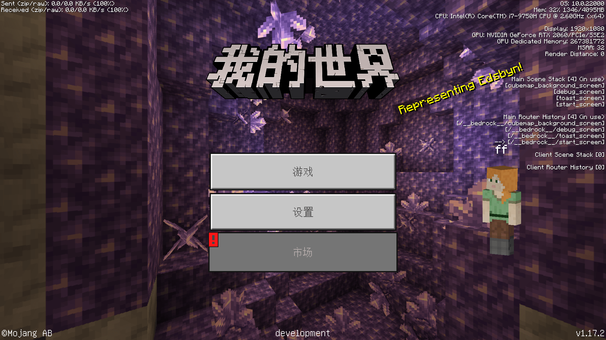
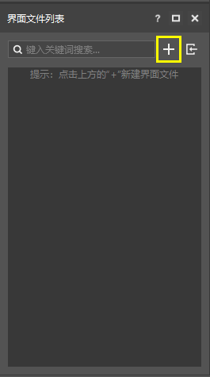
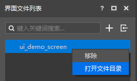
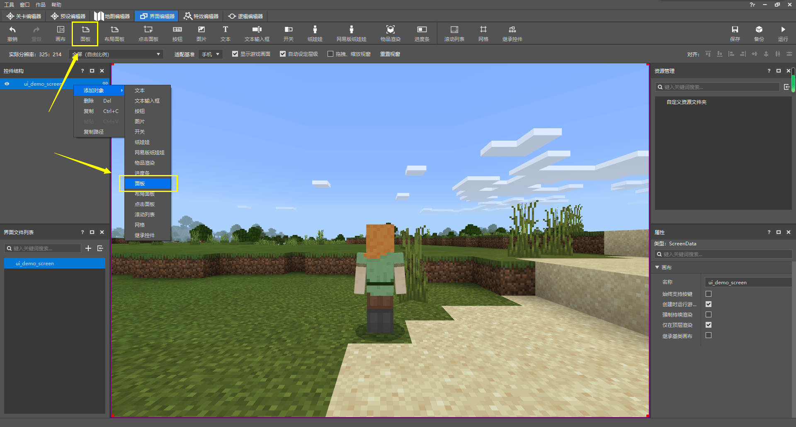
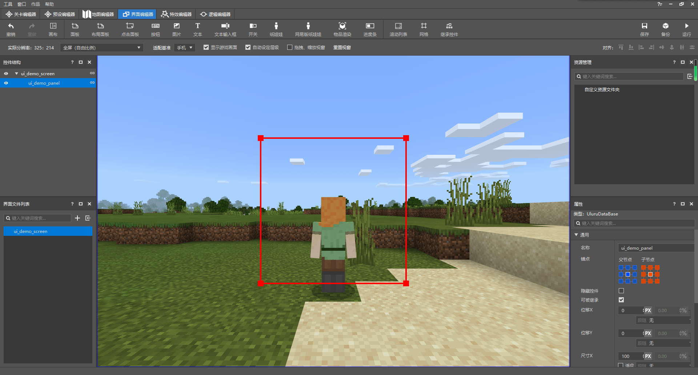
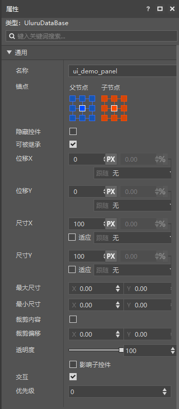
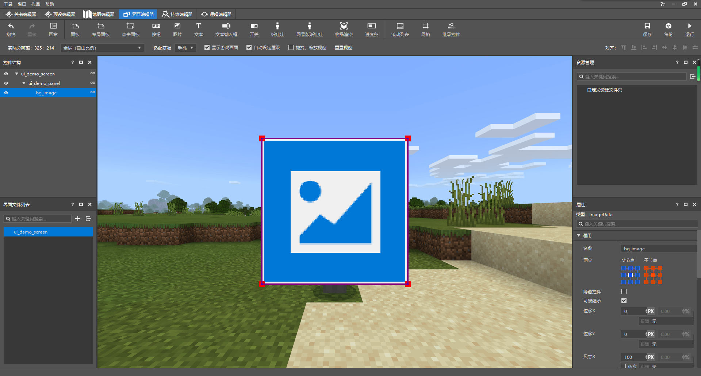
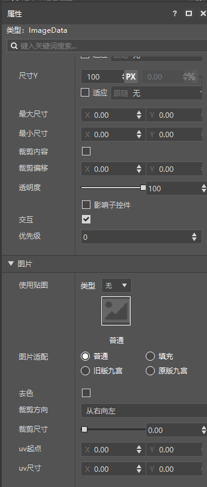
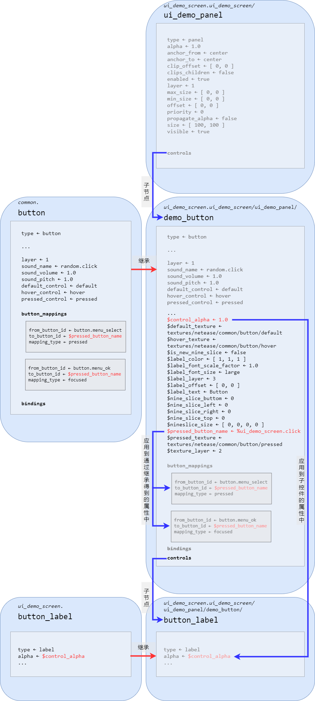

--- 
front: https://nie.res.netease.com/r/pic/20211104/69055361-2e7a-452f-8b1a-f23e1262a03a.jpg 
hard: Advanced 
time: 40 minutes 
--- 

# Understanding and creating JSON UI 

In the process of module production, we often encounter the need to draw a UI for a certain function. Knowing how to create and modify UI can enable us to create more exciting modules. In the current stage of Minecraft, most UIs still use a UI form that is driven by JSON file data and gives corresponding bindings and logic in the source code. We often call it **JSON UI**. In this section, we will understand and learn how to innovate and edit JSON UI. 

## Interface and Screen 

Before understanding the creation of JSON UI, we need to first understand what is **Interface** and **Screen**. Interface is also translated as **interface**, which generally refers to the "criticality" or "channel" of interaction between two individuals. For example, I have a book now, so the text is the interface between this book and me; I am eating an apple, so the taste buds are the interface between the apple and my nerves that feel sweetness; I have a set of module SDKs, so the module API is the interface (interface) between the game engine and the code of my module. Similarly, on electronic devices, the physical screen of the device often acts as the interface between the electronic device and us. This interface is generally called a **Graphical User Interface** (**Graphical User Interface**), often referred to as a **User Interface** (**User Interface**), and then referred to as **UI**. 

However, in addition to the physical screen of the device, in my world, we also have a virtual **Screen** (**Canvas***) concept. On the same device, there is only one interface, that is, the physical screen, and there are multiple screens. Each screen is an image that fills the entire interface, and each screen is superimposed on the interface in turn, forming the picture we see. We can use the debugging screen of the computer development version to help understand this. 

 

Press `F3` to open the debug screen. We can see the screen information on our current UI on the right side of the interface. There are four types of information representing the UI on the debug screen, namely **Main Scene Stack**, **Main Router History**, **Client Scene Stack**, **Client Router History**. Through the previous explanation, careful developers may have discovered that the screens in the Minecraft UI are controlled by a **Stack** mode. In other words, each screen is stacked vertically on the interface, and the top screen is the last to be stacked and is currently displayed on the top of the interface. For example, the start screen (`start_screen`) in the above picture. We focus on the main scene stack. You can see that the start screen is stacked at the top of the stack, followed by `toast_screen`, and then our debug screen (`debug_screen`). At the bottom is the cubemap background screen (`cubemap_backgroud_screen`) that serves as the background. 

 

We enter another world and start the game. Let's look at the information on the right. At this time, the words "**(in use)**" are transferred from the main scene stack to the client scene stack. This is because the client scene stack mainly displays the screen status when playing in the world, while the main scene stack displays the screen status starting from the game title menu, that is, when not playing in the world. At this time, we can see that there are only two screens on our interface, namely the HUD screen (`hud_screen`) at the top and the in-game play screen (`in_game_play_screen`) at the bottom. 

 

When we open the inventory, we can see that the inventory screen (`inventory_screen`) is **pushed** into the scene stack, and we can see that the inventory screen is indeed stacked at the top of the interface. When we close the inventory, the inventory screen is **popped** out of the scene stack as the top screen in the stack. 

At the same time, the router history information that changes with the scene stack can tell us whether the current screen is the screen defined by JSON UI. The calling path of each screen of Minecraft UI is called **route** (**Route**), for example, the route of the inventory screen in the figure above is `/__bedrock__/inventory_screen`. All screens defined and controlled by the Bedrock Engine, that is, the routes of the JSON UI screens are located under `/__bedrock__`. We can use this to determine that our screens come from JSON UI. Later, we will create our own screens through JSON UI, and the stack information of these screens can also be debugged through the information on the right side of the debug screen. 

## Create an interface through the interface editor 

 

The editor of the Minecraft development workbench has a set of tools built in that can help developers quickly and visually create and edit interfaces. This is our **Interface Editor**. We can switch to the editor by selecting "Interface Editor" in the switch tab at the top of the screen. The structure of the interface editor is also very simple. In addition to the central preview window, there are only four function panes. 

- **Interface File List**: Located in the lower left corner by default, it is a list of all interface engineering files in the current add-on pack. When developers create an interface through the editor, the editor will automatically generate an interface engineering file in the `.mcgui` format in the `ui` folder of the behavior pack, and at the same time generate a data file in the `.json` format that will eventually be applied to the game. This is where all the interface engineering files in the `ui` folder are displayed. 
- **Control Structure**: Located in the upper left corner by default, it displays the tree structure of the controls of the interface currently selected in the "Interface File List". Players can adjust the structure of the interface by clicking or dragging. 
- **Resource Management**: Located in the upper right corner by default, it is a list of all UI texture map resources currently imported into the editor. It supports applying to the corresponding UI controls by dragging. 
- **Properties**: The properties of the currently selected control. 

To create a new interface, we only need to click the "**+**" button in the "Interface File List". 

 

 

Then we enter the name of the UI we want to create, for example, here we name it `ui_demo_screen`. Note that the UI name here is a combination of letters, numbers and underscores. Other forms of names may cause reading errors, so please do not use them. 


At this point, we can see that our JSON UI file has been created, which automatically creates a screen (*canvas*) control `main` for us. Next, we can add other controls to this `main` screen to create the functions we want. When we need to display this screen in the game, we can push `main` into our screen scene stack through the module SDK. In this way, our custom screen can appear in the game. 

It is worth noting that we can see in the debug screen that the screens in the scene stack or in the router directly use the name of the screen without the file name or other identifiers (such as the UI name `ui_demo_screen` we created before), so our screen name `main` here may conflict with other people's screens, which is not conducive to our identification and debugging. 

 

We also change the screen name to `ui_demo_screen` in the property pane in the lower right corner. In this way, our screen will be displayed as `ui_demo_screen` after being pushed into the scene stack. 

Now, let's look at the specific JSON UI file content to understand our UI file structure. 

 

Right-click our UI in the "Interface File List" pane and click "**Open File Directory**". 

 

We can see that an Explorer window pops up with the `ui` folder of the resource pack in our add-on package opened. In the window, we can see the project file `ui_demo_screen.mcgui` of our `ui_demo_screen` UI and the JSON UI data driver file `ui_demo_screen.json` that will eventually work in the game, as well as the UI definition file `_ui_defs.json` that defines all JSON UIs including `ui_demo_screen.json`. In fact, when we edit the UI in the editor, the direct change is our project file `ui_demo_screen.mcgui`, and then `ui_demo_screen.json` will be automatically generated according to the project file. Therefore, we do not recommend directly modifying the `.json` file before we need to edit it in the editor. Although the editor can reapply the changes to the `.mcgui` file and regenerate the `.json` file after detecting the changes in the `.json` file, since our interface editor does not currently support all JSON UI content, during this modification process, the final display result of our `.json` file may change in a way we do not want. We recommend that developers use the interface editor to draw all the required interface elements first, and then manually modify the `.json` file for the second time, delete unnecessary redundant parts, and add the additional content we want to add. After the final manual UI modification step, back up and delete the `.mcgui` file to avoid the `.json` file being disordered after the editor reloads the file. 

Now, let's open the `ui_demo_screen.json` file to learn the JSON UI file structure: 

```json 
{ 
"namespace" : "ui_demo_screen", 
"ui_demo_screen" : { 
"type" : "screen", 
"absorbs_input" : true, 
"always_accepts_input" : false, 
"force_render_below" : false, 
"is_showing_menu" : true, 
"render_game_behind" : true, 
"render_only_when_topmost" : true, 
"should_steal_mouse" : false 
} 
} 
``` 

This is the entire content of our `ui_demo_screen.json` file. You can see that at the beginning we have a `namespace` field, which is the **namespace** (**Namespace**) of all the controls stored in this file. The JSON UI generated by the editor will generate the same file name and namespace. In fact, the file name and namespace can be different. For example, the namespace of the original `hud_screen.json` is `hud`. However, we still recommend to make the namespace and file name consistent, which is conducive to our identification of JSON UI files and enhance compatibility. 

Next, we have all the **Control** stored in this file. Each JSON UI file stores a series of various controls, such as the screen control `ui_demo_screen` that we just added and renamed. The structure of each control in JSON is an object. The key name of the object is the name of the control, and the value of the object is an object. The object specifies a series of **Property** of the control. 

The `type` attribute represents the type of a control. The controls are of the following types: button, custom, drop-down, edit_box, input_box, label, panel, scrollbar, scroll_track, scroll_view, selection_wheel, slider, slider_box, slider_box, stack_panel, and toggle. Among them, the italic words above are the memorable names of the control type displayed in the interface editor, and our `ui_demo_screen` screen uses the `screen` type control. All screens are of the `screen` type. In fact, a JSON UI file does not necessarily define only one screen control, but we may want to have a main screen for display on the screen, such as the `ui_demo_screen` here is the screen we want to display. 

In the Chinese version, we can also define the following types of controls: **combo box** (`combox`, *drop-down box*), **layout** (`layout`), **joystick** (`joystick`), **stack grid** (`stack_grid`), **rich text** (`rich_text`), **multi-line** (`mul_lines`), **16-9 layout** (`sixteen_nine_layout`), **animation progress bar** (`anim_porecess_bar`). 

In the JSON UI file, the full name of each control is composed of the namespace and the control name with a dot (`.`). The full reference name of `ui_demo_screen` is `ui_demo_screen.ui_demo_screen`. If you want to reference the name of the control elsewhere, you need to provide this full name reference. 

## Add more controls in the interface editor 




Next, we add controls to our UI in the editor, taking adding a panel as an example. Many kinds of controls can be attached to other controls as child controls, such as screen controls. We want to add a panel control to our `ui_demo_screen`, and we have two ways to add controls. We can right-click the screen control and select "**Add Object**->**Panel**", or select our screen control and click the "**Panel**" button in the upper ribbon. Both methods can successfully add a panel child control to our `ui_demo_screen` control, and we name the panel control `ui_demo_panel`. 

 

As you can see, when we select the panel in the "Control Structure" pane on the left, a red box appears in the picture, and a blue box appears on the edge of the preview window. The red box represents the currently selected control, that is, our panel control here, and the blue box represents the parent control of our currently selected control, that is, the entire interface screen control should be filled. The size of the screen control cannot be modified, but the size of the panel can be modified. Therefore, we usually recommend that developers add a panel to the screen first, and then edit it on the panel. This helps us control the position and size of elements on the screen. 

 

In the property pane on the right, we can see a "**Common**" property menu displayed. Here are the common properties of all controls. We can modify the control's **Anchor**, **Offset**, **Size**, **Clip**, **Alpha** and other properties here. These changes will also be synchronized to the JSON file. 

 

We can see that the panel is actually a transparent board that is invisible to the player. Following the same pattern, we add another image subcontrol to this panel, named `bg_image`, which serves as the background of the panel.

 

We can see that the image control has an additional "Picture" property menu compared to the panel control. We can modify the image displayed by the image control here. For example, we can modify the image to the native panel background image. 

 

Let's look at the JSON file of the UI again: 

```json 
{ 
"namespace" : "ui_demo_screen", 
"ui_demo_screen" : { 
"type" : "screen", 
"absorbs_input" : true, 
"always_accepts_input" : false, 
"force_render_below" : false, 
"is_showing_menu" : true, 
"render_game_behind" : true, 
"render_only_when_topmost" : true, 
"should_steal_mouse" : false, 
"controls" : [ 
{ 
"ui_demo_panel@ui_demo_screen.ui_demo_panel" : {} 
} 
    ]
  },
  "ui_demo_panel" : {
    "type" : "panel",
    "alpha" : 1.0,
    "anchor_from" : "center",
    "anchor_to" : "center",
    "clip_offset" : [ 0, 0 ],
    "clips_children" : false,
    "enabled" : true,
    "layer" : 1,

    "max_size" : [ 0, 0 ],
    "min_size" : [ 0, 0 ],
    "offset" : [ 0, 0 ],
    "priority" : 0,
    "propagate_alpha" : false,
    "size" : [ 100, 100 ],
    "visible" : true,
    "controls" : [
      {
        "bg_image@ui_demo_screen.bg_image" : {}
      }
    ]
  },
  "bg_image" : {
    "type" : "image",
    "alpha" : 1.0,
    "anchor_from" : "center",
    "anchor_to" : "center",
    "clip_direction" : "left",
    "clip_offset" : [ 0, 0 ],
    "clip_ratio" : 0.0,
    "clips_children" : false,
    "enabled" : true,
    "fill" : false,
    "grayscale" : false,
    "is_new_nine_slice" : false,
    "keep_ratio" : true,
    "layer" : 1,
    "max_size" : [ 0, 0 ],
    "min_size" : [ 0, 0 ],
    "nine_slice_buttom" : 0,
    "nine_slice_left" : 0,
    "nine_slice_right" : 0,
    "nine_slice_top" : 0,
    "nineslice_size" : [ 0, 0, 0, 0 ],
    "offset" : [ 0, 0 ], 
"priority" : 0, 
"propagate_alpha" : false, 
"size" : [ 100, 100 ], 
"texture" : "textures/ui/dialog_background_opaque", 
"uv" : [ 0, 0 ], 
"uv_size" : [ 0, 0 ], 
"visible" : true 
} 
} 
``` 

We can clearly see that there are two more control definitions in our JSON file, which are our `ui_demo_panel` and `bg_image`. Their full names with namespaces are `ui_demo_screen.ui_demo_panel` and `ui_demo_screen.bg_image`, and their types are determined by their respective `type` attributes, which are `panel` representing the panel and `image` representing the image. 


Another noticeable part is that there is an extra `controls` property in our screen `ui_demo_screen`, and it seems to reference our `ui_demo_panel` panel. In fact, this does mean that a panel is attached to the node of our screen. However, it should be noted that the writing here is called **Inherit**. The inherited control is a new control with the same properties as the source control. After inheritance, we can also rewrite some properties to overwrite the properties of the original control. This is equivalent to modifying the original control. However, rewriting the properties of the inherited control does not affect the source control, so this is very helpful for us to quickly create multiple similar controls. The general writing method of inheritance is `control_name@source_control_name`. `source_control_name` is the source control to be inherited from, and `control_name` is the name of the new control generated by inheritance. Although `control_name` can be omitted from the grammar, we do not recommend doing so because it will make it impossible for us to write logic in the module SDK later. 

Here, we attach a new control inherited from `ui_demo_screen.ui_demo_panel` under the screen `ui_demo_screen`, and name it `ui_demo_panel`, which is the same as the original control name. Therefore, we write `ui_demo_panel@ui_demo_screen.ui_demo_panel` here. At the same time, because of this, we can notice that this panel is not the `ui_demo_panel` panel defined in the root node of the JSON file, but a new panel renamed after copying `ui_demo_panel` intact. However, our new panel does not modify any properties of the source control, so we leave the object behind it blank and write `"ui_demo_panel@ui_demo_screen.ui_demo_panel" : {}`. 

Similarly, the panel `ui_demo_panel` control also has an image control named `bg_image` which is inherited from `ui_demo_screen.bg_image`. 

Although the new control obtained after inheritance has the same name as the source control, it is no longer the root node directly belonging to the `ui_demo_screen` namespace, so we can use another representation method: the **path** (**Path**) of the control to represent the control mounted under a control. For example, the `ui_demo_panel` control mounted under `ui_demo_screen` can be represented by `ui_demo_screen/ui_demo_panel`, and we know that the `ui_demo_panel` control itself will also have a `bg_image` control mounted, which will also be inherited when the `ui_demo_panel` control is inherited. Therefore, the path of the `bg_image` control mounted under the `ui_demo_panel` control mounted under the `ui_demo_screen` is `ui_demo_screen/ui_demo_panel/bg_image`. Sometimes, we want the path to be written relative to a screen. In this case, we no longer write the screen itself into the path. For the above example, we write `/ui_demo_panel/bg_image`. 

Back to inheritance, in fact, we do not necessarily have to use inheritance to write the control mounting relationship. We can directly write the control itself in the position of a control's child control, such as the modification example below: 

```json 
{ 
"namespace" : "ui_demo_screen", 
"ui_demo_screen" : { 
"type" : "screen", 
"absorbs_input" : true, 
"always_accepts_input" : false, 
"force_render_below" : false, 
"is_showing_menu" : true, 
"render_game_behind" : true, 
"render_only_when_topmost" : true, 
"should_steal_mouse" : false, 
"controls" : [ 
{ 
"ui_demo_panel" : { 
"type" : "panel", 
"alpha" : 1.0, 
"anchor_from" : "center", 
          "anchor_to" : "center",
          "clip_offset" : [ 0, 0 ],
          "clips_children" : false,
          "enabled" : true,
          "layer" : 1,
          "max_size" : [ 0, 0 ],
          "min_size" : [ 0, 0 ],
          "offset" : [ 0, 0 ],
          "priority" : 0,
          "propagate_alpha" : false,
          "size" : [ 100, 100 ],
          "visible" : true,
          "controls" : [
            {
              "bg_image" : {
                "type" : "image",
                "alpha" : 1.0,
                "anchor_from" : "center",
                "anchor_to" : "center",                "clip_direction" : "left",
                "clip_offset" : [ 0, 0 ],

                "clip_ratio" : 0.0,
                "clips_children" : false,
                "enabled" : true,
                "fill" : false,
                "grayscale" : false,
                "is_new_nine_slice" : false,
                "keep_ratio" : true,
                "layer" : 1,
                "max_size" : [ 0, 0 ],
                "min_size" : [ 0, 0 ],
                "nine_slice_buttom" : 0,
                "nine_slice_left" : 0,
                "nine_slice_right" : 0,
                "nine_slice_top" : 0,
                "nineslice_size" : [ 0, 0, 0, 0 ],
                "offset" : [ 0, 0 ], 
"priority" : 0, 
"propagate_alpha" : false, 
"size" : [ 100, 100 ], 
"texture" : "textures/ui/dialog_background_opaque", 
"uv" : [ 0, 0 ], 
"uv_size" : [ 0, 0 ], 
"visible" : true 
} 
} 
] 
} 
} 
] 
} 
} 
``` 

At this point, we no longer need inheritance. However, this also has two disadvantages. One is that when a control is used multiple times, we cannot make multiple changes through simple modifications, and there is no way to use the variable function we will talk about later to control the different performances of controls in different positions. The second is that when the number of controls is very large, the entire JSON UI file will become lengthy and complex, greatly reducing readability. Therefore, our editor also uses inheritance by default to create UI files. 

## Variables, bindings and button mappings 

 

In the editor, we can simply add another button to our panel through the "**button**" button and rename it to `demo_button`. Let's take a look at the JSON code for adding the button: 

```json 
{ 
"namespace" : "ui_demo_screen", 
"ui_demo_screen" : { 
"type" : "screen", 
"absorbs_input" : true, 
"always_accepts_input" : false, 
"force_render_below" : false, 
"is_showing_menu" : true,

    "render_game_behind" : true,
    "render_only_when_topmost" : true,
    "should_steal_mouse" : false,
    "controls" : [
      {
        "ui_demo_panel@ui_demo_screen.ui_demo_panel" : {}
      }
    ]
  },
  "ui_demo_panel" : {
    "type" : "panel",
    "alpha" : 1.0,
    "anchor_from" : "center",
    "anchor_to" : "center",
    "clip_offset" : [ 0, 0 ],
    "clips_children" : false,
    "enabled" : true,
    "layer" : 1,
    "max_size" : [ 0, 0 ],
    "min_size" : [ 0, 0 ],
    "offset" : [ 0, 0 ],
    "priority" : 0,
    "propagate_alpha" : false,
    "size" : [ 100, 100 ],
    "visible" : true,
    "controls" : [
      {
        "bg_image@ui_demo_screen.bg_image" : {}
      },
      {
        "demo_button@ui_demo_screen.demo_button" : {}
      }
    ]
  },
  "bg_image" : {
    "type" : "image",
    "alpha" : 1.0,
    "anchor_from" : "center",
    "anchor_to" : "center",
    "clip_direction" : "left",
    "clip_offset" : [ 0, 0 ],
    "clip_ratio" : 0.0,
    "clips_children" : false,
    "enabled" : true,
    "fill" : false,
    "grayscale" : false,
    "is_new_nine_slice" : false,
    "keep_ratio" : true,
    "layer" : 1,
    "max_size" : [ 0, 0 ],

    "min_size" : [ 0, 0 ],
    "nine_slice_buttom" : 0,
    "nine_slice_left" : 0,
    "nine_slice_right" : 0,
    "nine_slice_top" : 0,
    "nineslice_size" : [ 0, 0, 0, 0 ],
    "offset" : [ 0, 0 ],
    "priority" : 0,
    "propagate_alpha" : false,
    "size" : [ 100, 100 ],
    "texture" : "textures/ui/dialog_background_opaque",
    "uv" : [ 0, 0 ],
    "uv_size" : [ 0, 0 ],
    "visible" : true  },
  "default" : {
    "type" : "image",
    "alpha" : "$control_alpha",
    "is_new_nine_slice" : "$is_new_nine_slice",
    "layer" : "$texture_layer",
    "nine_slice_buttom" : "$nine_slice_buttom",
    "nine_slice_left" : "$nine_slice_left",
    "nine_slice_right" : "$nine_slice_right",
    "nine_slice_top" : "$nine_slice_top",
    "nineslice_size" : "$nineslice_size",
    "texture" : "$default_texture"
  },
  "hover" : {
    "type" : "image",
    "alpha" : "$control_alpha",
    "is_new_nine_slice" : "$is_new_nine_slice",
    "layer" : "$texture_layer",
    "nine_slice_buttom" : "$nine_slice_buttom",
    "nine_slice_left" : "$nine_slice_left",
    "nine_slice_right" : "$nine_slice_right",
    "nine_slice_top" : "$nine_slice_top",
    "nineslice_size" : "$nineslice_size",
    "texture" : "$hover_texture"
  },
  "pressed" : {
    "type" : "image",
    "alpha" : "$control_alpha",
    "is_new_nine_slice" : "$is_new_nine_slice",
    "layer" : "$texture_layer",
    "nine_slice_buttom" : "$nine_slice_buttom",
    "nine_slice_left" : "$nine_slice_left",
    "nine_slice_right" : "$nine_slice_right",
    "nine_slice_top" : "$nine_slice_top",
    "nineslice_size" : "$nineslice_size",
    "texture" : "$pressed_texture"

  },
  "button_label" : {
    "type" : "label",
    "alpha" : "$control_alpha",
    "color" : "$label_color",
    "font_scale_factor" : "$label_font_scale_factor",
    "font_size" : "$label_font_size",
    "font_type" : "smooth",
    "layer" : "$label_layer",
    "max_size" : [ "100%", "100%" ],
    "offset" : "$label_offset",
    "shadow" : false,
    "text" : "$label_text",
    "text_alignment" : "center"
  },
  "demo_button@common.button" : {
    "$control_alpha" : 1.0,
    "$default_texture" : "textures/netease/common/button/default",
    "$hover_texture" : "textures/netease/common/button/hover",
    "$is_new_nine_slice" : false,
    "$label_color" : [ 1, 1, 1 ],
    "$label_font_scale_factor" : 1.0,
    "$label_font_size" : "large",
    "$label_layer" : 3,
    "$label_offset" : [ 0, 0 ],
    "$label_text" : "Button",
    "$nine_slice_buttom" : 0,
    "$nine_slice_left" : 0,
    "$nine_slice_right" : 0,
    "$nine_slice_top" : 0,    "$nineslice_size" : [ 0, 0, 0, 0 ],
    "$pressed_button_name" : "%ui_demo_screen.click",
    "$pressed_texture" : "textures/netease/common/button/pressed",
    "$texture_layer" : 2,
    "alpha" : 1.0,
    "anchor_from" : "center",
    "anchor_to" : "center",
    "button_mappings" : [],
    "clip_offset" : [ 0, 0 ],
    "clips_children" : false,
    "draggable" : "not_draggable",
    "enabled" : true,
    "is_handle_button_move_event" : true,
    "layer" : 2,
    "max_size" : [0, 0],
    "min_size" : [ 0, 0 ],
    "offset" : [ 0, 0 ],
    "priority" : 0,
    "propagate_alpha" : false,
    "size" : [ 100, 50 ],

    "visible" : true,
    "bindings" : [
      {
        "binding_collection_name" : "",
        "binding_condition" : "always_when_visible",
        "binding_type" : "collection_details"
      }
    ],
    "controls" : [
      {
        "default@ui_demo_screen.default" : {}
      },
      {
        "hover@ui_demo_screen.hover" : {}
      },
      {
        "pressed@ui_demo_screen.pressed" : {}
      },
      {
        "button_label@ui_demo_screen.button_label" : {}
      }
    ]
  }
}
```

We can see that in JSON Five new controls appear on the root node of the UI file, namely `default`, `hover`, `pressed`, `button_label` and `demo_button`. If they are called with namespaces, they are `ui_demo_screen.default`, `ui_demo_screen.hover`, `ui_demo_screen.pressed`, `ui_demo_screen.button_label` and `ui_demo_screen.demo_button`. Among them, the first four controls listed here are inherited by the four sub-controls of the last `demo_button` button. 

We can see the types of the first four controls very clearly, three `image` types and one `label` type, but the last `demo_button` control, although it is a button from the name, we can't find its `type` attribute. Why is this? In fact, we can find that the `demo_button` control inherits the control named `common.button`. `common` is the namespace used by the original JSON UI file `ui_common.json`. We can open the `ui_common.json` file to view the definition of the original button control: 

```json 
{ 
"namespace": "common", 

//--------------------------------------------------------------------------- 
// Common controls 
//--------------------------------------------------------------------------- 

"button": { 
"type": "button", 

"$focus_id|default": "", 
"$focus_override_down|default": "", 
"$focus_override_up|default": "", 
"$focus_override_left|default": "", 
"$focus_override_right|default": "", 
"focus_identifier": "$focus_id", 
"focus_change_down": "$focus_override_down", 
"focus_change_up": "$focus_override_up", 
"focus_change_left": "$focus_override_left",

    "focus_change_right": "$focus_override_right",
    "focus_enabled": true,
    "focus_magnet_enabled": true,

    "$button_focus_precedence|default": 0,
    "default_focus_precedence": "$button_focus_precedence",

    "$button_tts_name|default": "accessibility.button.tts.title",
    "$button_tts_header|default": "",
    "$tts_section_header|default": "",
    "$button_tts_control_type_order_priority|default": 100,
    "$button_tts_index_priority|default": 150,

    "tts_name": "$button_tts_name",
    "tts_control_header": "$button_tts_header",    "tts_section_header": "$tts_section_header",
    "tts_control_type_order_priority": "$button_tts_control_type_order_priority",
    "tts_index_priority": "$button_tts_index_priority",

    "layer": 1,
    "sound_name": "random.click",
    "sound_volume": 1.0,
    "sound_pitch": 1.0,
    "locked_control": "",
    "default_control": "default",
    "hover_control": "hover",
    "pressed_control": "pressed",
    "button_mappings": [
      {
        "from_button_id": "button.menu_select",
        "to_button_id": "$pressed_button_name",
        "mapping_type": "pressed" 
}, 
{ 
"from_button_id": "button.menu_ok", 
"to_button_id": "$pressed_button_name", 
"mapping_type": "focused" 
} 
], 

"$button_bindings|default": [], 
"bindings": "$button_bindings" 
}, 

// ... 
} 
``` 

As you can see, the `"type": "button"` property is actually defined in the `common.button` control. We have said before that the inherited new control will have all the properties of the source control by default, although some properties can also be overwritten with new values (for example, we can see that both `ui_demo_screen.demo_button` and `common.button` have `layer` properties, and here the `"layer" : 2` property of `ui_demo_screen.demo_button` overrides the `"layer": 1` property defined in `common.button`), but the values that are not overwritten are naturally the same as the source control. Therefore, our `ui_demo_screen.demo_button` inherits the `"type": "button"` property defined in `common.button`, and naturally becomes a button control. 


### Variables 

 

Now, we turn our attention to all the strings that **start with `$`**, which are called **Variable**. For example, `$control_alpha`, `$default_texture`, `$hover_texture`, etc. under `ui_demo_screen.demo_button` are all variables. Variables are widely used. For example, developers can override the variables in the inherited source control in the inherited control to achieve customized changes to the source control function. In the `ui_demo_screen.demo_button` control, we assign the value `%ui_demo_screen.click` to the `$pressed_button_name` variable, and the control inherits a `button_mappings` attribute from the source control `common.button`. The `button_mappings` attribute will read the value of `$pressed_button_name`, and it will read `%ui_demo_screen.click`. If another control also inherits `common.button`, it can also assign a different value to `$pressed_button_name`, and its `button_mappings` will also read a different value from `ui_demo_screen.demo_button`, so as to achieve a different effect from `ui_demo_screen.demo_button`. 

Variables can also be defined in parent controls and used in child controls. This is often used when the same value is used multiple times in child controls. This allows you to modify certain properties of all child controls in the parent control with one click. For example, in the above example, the variable `$control_alpha` of `ui_demo_screen.demo_button` specifies a transparency value, and its child controls `default`, `hover`, `pressed`, and `button_label` all read the value of `$control_alpha` as the value of their own transparency `alpha` property through `"alpha" : "$control_alpha"`. 

It is worth noting that the life cycle of these variables is on the entire node chain rather than the inheritance chain. In other words, although `ui_demo_screen.demo_button` inherits from `common.button`, `$pressed_button_name` in `ui_demo_screen.demo_button` and `$pressed_button_name` in `common.button` are not the same variable. The former is just a variable with the same name copied from the latter during inheritance. Modifying the value of the variable in `ui_demo_screen.demo_button` will only affect the effect in `ui_demo_screen.demo_button`, but will not affect the effect in `common.button`. Similarly, `$control_alpha` in `ui_demo_screen.demo_button/default` and `$control_alpha` in `ui_demo_screen.default` are not essentially the same variable and will not affect each other. However, `$control_alpha` in `ui_demo_screen.demo_button` and `ui_demo_screen.demo_button/default` are indeed the same variable, that is, the variables with the same name in the parent node and the child node are essentially the same variable, which is why the value assigned to `$control_alpha` in `ui_demo_screen.demo_button` can be read in `ui_demo_screen.demo_button/default`. 

Variables can not only be read directly, but also read after participating in operations. For example, the value of `$some_var` is currently `some_value`, then `"some_property": "($some_var - '_value')"` means to remove `_value` from the end of `some_value` and provide `some` to the property `some_property`. When performing string operations, you need to add parentheses to the expression, and single straight quotes are needed on both sides of the "string" in the parentheses. Similarly, `+` can also append a new string to the end of the variable. 

In addition, variables can not only be passed as property values, but also written in the control key name as a control name or inherited control name. To illustrate this point, we slightly modify our `ui_demo_screen.ui_demo_screen` screen: 

```json 
{ 
"namespace" : "ui_demo_screen", 
"ui_demo_screen@common.base_screen" : { 
"$screen_content": "ui_demo_screen.ui_demo_panel" 
}, 
// ... The following content is unchanged 
} 
``` 

Then let's look at the definition of the `common.base_screen` control and its sub-controls in the original `ui_common.json` file. For easy observation, we have deleted some unnecessary parts: 

```json 
{ 
"namespace": "common", 

// ... 

//--------------------------------------------------------------------------- 
// Screens, survival inventory and crafting 
//--------------------------------------------------------------------------- 

"base_screen": { 
"type": "screen", 
    "vr_mode": "$is_holographic",
    "$screen_content|default": "common.base_screen_empty_panel",
    "$screen_bg_content|default": "common.base_screen_empty_panel",
    "$screen_animations|default": [
      "@common.screen_exit_animation_push_offset",
      "@common.screen_exit_animation_pop_offset",
      "@common.screen_entrance_animation_push_offset",
      "@common.screen_entrance_animation_pop_offset",
      "@common.screen_exit_animation_push_fade",
      "@common.screen_exit_animation_pop_fade",
      "@common.screen_entrance_animation_push_fade",      "@common.screen_entrance_animation_pop_fade"

    ],
    "$background_animations|default": [
      "@common.screen_exit_animation_push_alpha",
      "@common.screen_exit_animation_pop_alpha",
      "@common.screen_entrance_animation_push_alpha",
      "@common.screen_entrance_animation_pop_alpha"
    ],
    "$use_loading_bars|default": true,
    "$is_full_screen_layout|default": false,
    "$safezone_screen_matrix_layer|default": 2,
    "controls": [
      {
        "variables_button_mappings_and_controls": {
          "type": "input_panel",
          // ...
          "variables": [
            // ...
            }
          ],
          "button_mappings": [
            // ...
          ],          "controls": [
            {
              "bg_no_safezone_screen_panel@$screen_bg_content": {
                // ...
              }
            },
            {
              "safezone_screen_matrix@common.safezone_outer_matrix": {
                "anims": "$screen_animations",
                "animation_reset_name": "screen_animation_reset",
                "propagate_alpha": true,
                "disable_anim_fast_forward": true,
                "layer": "$safezone_screen_matrix_layer"
              }
            },
            {
              "screen_background@common_dialogs.full_screen_background": {
                // ...
              }
            }
          ]
        }
      },
      {
        "loading_bars_background": {
          "type": "image",
		  // ... 


          "controls": [
            {
              "loading_bars@common_store.progress_loading_bars": {
                // ...
              }
            }
          ],

          "anims": [
            "@common.loading_bar_init_animation_push",
            "@common.loading_bar_init_animation_pop"
          ]
        }
      }
    ]
  },

  // ...
  
  "safezone_inner_matrix": {
    "type": "stack_panel",
    "size": [ "fill", "100%" ],
    "orientation": "vertical",
    "$header_safezone_control|default": "common.empty_panel",
    "controls": [
      {
        "outer_top@common.top_safezone_vertical_buffer": {
          // ...
          "controls": [
            {
              "top_side_control@$header_safezone_control": {
                // ...
              }
            }
          ]
        }
      },
      {
        "inner_top@common.top_safezone_vertical_buffer": {
          // ...
          "controls": [
            {
              "top_side_control@$header_safezone_control": {
                // ...
              }
            }
          ]
        }
      },
      { "safezone_screen_panel@common.screen_panel": {} },

      {
        "inner_bottom@common.bottom_safezone_vertical_buffer": {
          // ...
        }
      },
      {
        "outer_bottom@common.bottom_safezone_vertical_buffer": {
          // ...
        }
      }
    ]
  },

  "safezone_outer_matrix": {
    "type": "stack_panel",
    "orientation": "horizontal",
    "size": [ "100%", "100%" ],
    "controls": [
      {
        "outer_left@common.left_safezone_horizontal_buffer": {
          // ...
          "controls": [
            {
              "outer_left_safe_zone_stack@common.safe_zone_stack": {}
            }
          ]
        }
      },      {
        "inner_left@common.left_safezone_horizontal_buffer": {
          // ...
          "controls": [
            {
              "inner_left_safe_zone_stack@common.safe_zone_stack": {}
            }
          ]
        }
      },
      { "inner_matrix@common.safezone_inner_matrix": {} },
      {
        "inner_right@common.right_safezone_horizontal_buffer": {
          // ...
          "controls": [
            {
              "inner_right_safe_zone_stack@common.safe_zone_stack": {}
            }
          ]
        }
      },
      {

        "outer_right@common.right_safezone_horizontal_buffer": {
          // ...
          "controls": [
            {
              "outer_right_safe_zone_stack@common.safe_zone_stack": {}
            }
          ]
        }
      }
    ]
  },

  "screen_panel": {
    "type": "panel",
    "size": [ "100%", "fill" ],
    "controls": [
      { "root_screen_panel@$screen_content": {} },
      {
        "popup_dialog_factory": {
          "type": "factory",
          "control_ids": {
            // ...
          }
        }
      }
    ]
  },

  // ... 
} 
``` 

At the beginning of `base_screen`, we can see a definition `"$screen_content|default": "common.base_screen_empty_panel"`. Here is the definition of the default value of `$screen_content`. `|default` means to define the **Default Value**. Each variable in each node chain can only have one default value, and the rest of the positions can be considered to rewrite the default value to another value. 

This `base_screen` control and its inherited sub-controls are relatively complex. We can use a node tree diagram to represent the structure of these controls in the JSON UI file: 

```shell 
ui_common.json|common 
├─button 
│ └─ # Other sub-controls 
├─base_screen 
│ ├─variables_button_mappings_and_controls 
│ │ ├─bg_no_safezone_screen_panel 
│ │ ├─safezone_screen_matrix # @common.safezone_outer_matrix 
│ │ └─screen_background 
│ └─loading_bars_background 
│ └─loading_bars 
├─safezone_inner_matrix 
│ ├─outer_top 
│ │ └─top_side_control

│ ├─inner_top
│ │ └─top_side_control
│ ├─safezone_screen_panel # @common.screen_panel
│ ├─inner_bottom
│ └─outer_bottom
├─safezone_outer_matrix
│ ├─outer_left
│ │ └─outer_left_safe_zone_stack
│ ├─inner_left
│ │ └─inner_left_safe_zone_stack
│ ├─inner_matrix # @common.safezone_inner_matrix
│ ├─inner_right
│ │ └─inner_right_safe_zone_stack
│ └─outer_right
│ └─outer_right_safe_zone_stack 
├─screen_panel 
│ ├─root_screen_panel # @$screen_content 
│ └─popup_dialog_factory 
└─ #Other controls 
``` 

According to the comments in the above figure, we can find the final application location of `$screen_content`, that is, we focus on the `base_screen/variables_button_mappings_and_controls/safezone_screen_matrix` control, which inherits from `common.safezone_outer_matrix`. Then we find the `safezone_outer_matrix` control, and find the `safezone_outer_matrix/inner_matrix` control under it, which inherits from `common.safezone_inner_matrix`. So we find `safezone_inner_matrix/safezone_screen_panel` under `safezone_inner_matrix`, which inherits from `common.screen_panel`. Finally, we find `screen_panel`. You can see that it uses a `"root_screen_panel@$screen_content": {}` writing method. In this way, when we assign a new value to the `$screen_content` variable, we need to use the control name to assign it, and at the same time, the variable will eventually be applied to the inheritance position of the `screen_panel/root_screen_panel` control. For example, in the above-mentioned modification example of the `ui_demo_screen.ui_demo_screen` screen, at the outermost, because `ui_demo_screen@common.base_screen`, that is, our `ui_demo_screen` inherits `common.base_screen`, it means that our `ui_demo_screen` has the same structure as `common.base_screen`. The `$screen_content` variable is passed down through layers, and finally applied as `root_screen_panel@ui_demo_screen.ui_demo_panel` at `ui_demo_screen/variables_button_mappings_and_controls/safezone_screen_matrix/inner_matrix/safezone_screen_panel/root_screen_panel` through `root_screen_panel@$screen_content`. 

Similarly, variables can be used not only after the `@` syntax used in inheritance, but also before the `@`. I will not go into details here. 

At the end of this section, we introduce another way to define variables: conditional definition. As the name suggests, we can define one or more variables when certain conditions are met. In fact, this definition exists in the `common.base_screen` we just saw. Let's extract it again and observe its usage. We still delete the unnecessary parts and only observe the definition of the variable: 

```json 
"base_screen": { 
"type": "screen", 
// ... 
"controls": [ 
{ 
"variables_button_mappings_and_controls": { 
"type": "input_panel", 
// ... 
"variables": [ 
// Screen sizes - you should be using one of these unless explicitly told otherwise - in which case that size should be added as a variable here 
// Win10 
{ 
//Desktop Texel Size: [376, 250] 
"requires": "$desktop_screen", 
"$narrow_screen_size": [ 280, "100% - 10px" ], // Realms Pending Invitations, Add Players
            "$play_screen_size": [ 282, "100% - 50px" ], // Play Screen
            "$tabbed_upsell_screen_size": [ 310, 173 ], // Trial Tabbed Upsell Screen
            "$realms_create_screen_size": [ 267, 240 ], // Realms Create
            "$large_screen_size": [ 317, "100% - 10px" ], // Multiplayer Invitations
            "$store_screen_size": [ "100% - 4px", "100% - 4px" ], // Store Home
            "$skin_pack_screen_size": [ "100% - 4px", "100% - 50px" ], // Skin Pack
            "$resource_pack_screen_size": [ "100% - 50px", "45%x + 65px" ], // Texture Pack

            "$upsell_screen_size": [ "177%y - 208.5px", "100% - 4px" ], // Skin Pack Upsell
            "$create_world_upsell_screen_size": [ 360, 183 ],
            "$create_realm_upsell_screen_size": [ 360, 183 ],
            "$create_realm_upsell_play_screen_size": [ 360, 213 ],
            "$max_create_world_upsell_screen_size": [ 360, "100% - 4px" ],
            "$min_resource_pack_screen_size": [ 372, 232.4 ],
            "$max_resource_pack_screen_size": [ 400, 246 ],
            "$max_upsell_screen_size": [ 250, 259.125 ],
            "$rating_prompt_screen_size": [ 250, 87 ],
            "$max_skin_pack_screen_size": [ 310, "56.25%x - 65.25px + 118.5px" ],
            "$extra_large_screen_size": [ "100% - 4px", "100% - 4px" ], // Skin Picker, Command Block screen
            "$extra_large_max_screen_size": [ 370, "100% - 50px" ],
            "$xbl_optional_signin_screen_size": [ 317, 158 ], // XBL Optional Signin Popup
            "$xbl_console_signin_screen_size": [ 316, 161 ], // XBL Console Signin Popup            "$xbl_console_signin_succeeded_screen_size": [ 230, "100% - 50px" ], // XBL Console Signin Succeeded Popup
            "$xbl_first_launch_screen_size": [ 317, 146 ], // XBL First Launch Popup, Trial Upsell
            "$xbl_gamer_profile_screen_size": [ 260, "100% - 50px" ], // XBL Console Signin Succeeded Popup
            "$modal_screen_size": [ 204, 140 ], // Pop-up dialogue boxes and modal progress screens
            "$tall_modal_screen_size": [ 204, 172 ],
            "$patch_notes_screen_size": [ 300, "100% - 4px" ], // Patch Notes Screen
            "$sign_screen_size": [ 185, 90 ], // Sign Screen
            "$mob_effect_screen_size": [ "90%", "90%" ], // Mob Effect Screen
            "$purchase_coin_screen_size": [ "90%", "17%x + 82px" ], //Coin Purchase Screen
            "$purchase_coin_screen_size_extended": [ "90%", "17%x + 117px" ], //Coin Purchase Screen, with FAQ
            "$purchase_coin_screen_size_not_enough": [ "90%", "17%x + 97px" ], //Coin Purchase Screen, when not enough coins for current purchase
            "$purchase_coin_screen_size_extended_not_enough": [ "90%", "17%x + 132px" ], //Coin Purchase Screen, when not enough coins for current purchase, with FAQ            "$choose_realm_screen_size": [ "70%", "85%" ], //Choose Realm Screen
            "$custom_templates_screen_size": [ "70%", "85%" ], //Custom Templates Screen
            "$world_modal_screen_size": [ 290, 100 ], // world convert and world loading modal progress screens
            "$day_one_experience_intro_screen_size": [ "60%", "85%" ], // Day One Experience intro popup
            "$day_one_experience_import_progress_screen_size": [ "80%", "90%" ], // Day One Experience import progress modal screen
            "$world_conversion_complete_screen_size": [ 290, 160 ], // World Conversion complete modal screen
            "$gamepad_disconnect_screen_size": [ 300, 100 ] //custom gamepad disconnected modal size, to contain all languages in title
          },
          // PE edition and VR
          {
            //Pocket Texel Size: [320, 210]
            "requires": "($pocket_screen or $is_holographic)",
            "$narrow_screen_size": [ "90.3225%", "100% - 4px" ], // Realms Pending Invitations, Add Players
            "$play_screen_size": [ "83.4375%", "100% - 4px" ], // Play Screen
            "$tabbed_upsell_screen_size": [ 310, 173 ], // Trial Tabbed Upsell Screen
            "$realms_create_screen_size": [ "71.2766%", "100% - 4px" ], // Realms Create            "$large_screen_size": [ "70.3215%", "100% - 4px" ], // Multiplayer Invitations
            "$store_screen_size": [ "100% - 4px", "100% - 4px" ], // Store Home, purchase Skin Pack
            "$skin_pack_screen_size": [ "100% - 4px", "100% - 4px" ], // Skin Pack
            "$resource_pack_screen_size": [ "100% - 50px", "45%x + 65px" ], // Texture Pack
            "$upsell_screen_size": [ "100% - 76px", "100% - 4px" ], // Skin Pack Upsell
            "$create_world_upsell_screen_size": [ "100% - 4px", 223 ],            "$create_realm_upsell_screen_size": [ "100% - 4px", 223 ],
            "$create_realm_upsell_play_screen_size": [ "100% - 4px", 219 ],

            "$max_create_world_upsell_screen_size": [ "100% - 4px", "100% - 4px" ],
            "$min_resource_pack_screen_size": [ 306, 202.7 ],
            "$max_resource_pack_screen_size": [ 313.3, 206 ],
            "$max_upsell_screen_size": [ "100% - 76px", "56.25%x + 118.5px" ],
            "$max_skin_pack_screen_size": [ "100% - 4px", "56.25%x - 65.25px + 118.5px" ],
            "$extra_large_screen_size": [ "100% - 4px", "100% - 4px" ], // Skin Picker, Command Block screen            "$extra_large_max_screen_size": [ 370, "100% - 50px" ],
            "$xbl_optional_signin_screen_size": [ 316, 153 ], // XBL Optional Signin Popup
            "$xbl_console_signin_screen_size": [ 316, 161 ], // XBL Console Signin Popup
            "$xbl_console_signin_succeeded_screen_size": [ 230, "100% - 4px" ], // XBL Console Signin Succeeded Popup
            "$xbl_first_launch_screen_size": [ 316, 146 ], // XBL First Launch Popup, Trial Upsell
            "$xbl_gamer_profile_screen_size": [ 316, "100% - 4px" ], // XBL Console Signin Succeeded Popup
            "$modal_screen_size": [ 204, 140 ], // Pop-up dialogue boxes and modal progress screens
            "$rating_prompt_screen_size": [ 250, 87 ],
            "$tall_modal_screen_size": [ 204, 172 ],
            "$patch_notes_screen_size": [ 300, "100% - 4px" ], // Patch Notes Screen
            "$sign_screen_size": [ 185, 90 ], // Sign Screen
            "$mob_effect_screen_size": [ "90%", "90%" ], // Mob Effect Screen
            "$purchase_coin_screen_size": [ "90%", "17%x + 82px" ], //Coin Purchase Screen            "$purchase_coin_screen_size_extended": [ "90%", "17%x + 117px" ], //Coin Purchase Screen, with FAQ
            "$purchase_coin_screen_size_not_enough": [ "90%", "17%x + 97px" ], //Coin Purchase Screen, when not enough coins for current purchase
            "$purchase_coin_screen_size_extended_not_enough": [ "90%", "17%x + 132px" ], //Coin Purchase Screen, when not enough coins for current purchase, with FAQ
            "$choose_realm_screen_size": [ "70%", "85%" ], //Choose Realm Screen
            "$custom_templates_screen_size": [ "70%", "85%" ], //Custom Templates Screen
            "$world_modal_screen_size": [ 290, 100 ], // world convert and world loading modal progress screens
            "$day_one_experience_intro_screen_size": [ "60%", "85%" ], // Day One Experience intro popup
            "$day_one_experience_import_progress_screen_size": [ "80%", "90%" ], // Day One Experience import progress modal screen
            "$world_conversion_complete_screen_size": [ 290, 160 ], // World Conversion complete modal screen
            "$gamepad_disconnect_screen_size": [ 300, 100 ] //custom gamepad disconnected modal size, to contain all languages in title
          }
        ],
        "button_mappings": [
          // ...
        ],
        "controls": [
          // ...
        ]
      }
    },
    // ... ] 
} 
``` 

We can observe the `variables` property of the `base_screen/variables_button_mappings_and_controls` control, where a series of variables are defined by conditions. In fact, these variables define the sizes of various different screens of the original version. We abstract it into the following structure: 

```json 
"variables": [ 
{ 
"requires": "$some_condition",

"$var1": [ 280, "100% - 10px" ], 
"$var2": [ 280, "100% - 50px" ] 
}, 
{ 
"requires": "/* logic expression */", 
"$var3": [ "90.3225%", "100% - 4px" ] 
} 
] 
``` 

`variables` is an array of objects. Each object has a `requires` field. "requires" literally means "need", which means the conditions that the variables defined in the object need to meet. When the value after `requires` is `true`, the variables following it will be defined or assigned. In the above abstract structure, when the `$some_condition` variable is `true`, `$var1` and `$var2` will be defined. The value of the `requires` field can also be a logical expression. Similar to string variables and numeric variables, which can use `+` and `-` to calculate a string or number, Boolean variables can use logical operators `and`, `or`, and `not` to calculate a new Boolean value. For example, `"requires": "($condition1 and $condition2)"` means that the variable definition in the object is executed when `$condition1` and `$condition2` are both `true`. In the above example, the definition of `$var3` is executed. In fact, the `=` operator can also be used to compare strings and numeric variables for inequality to obtain a Boolean value; numeric variables can also be compared for ordinal relations using `>` and `<`, which can also obtain a Boolean value. 

In the variables property of the base_screen/variables_button_mappings_and_controls control above, we can see that when the $desktop_screen variable is true, a series of desktop screen size variables will be defined; when ($pocket_screen or $is_holographic) is true, that is, when it is either a portable screen or a VR screen, a series of portable screen size variables will be defined. $desktop_screen, $pocket_screen and $is_holographic are different from ordinary variables. They are hard-coded variables defined by the game engine, so they can be directly called anywhere in the entire JSON UI. In other words, their life cycle is global. 

Of course, in addition to the game engine, we can also define a series of variables with a global life cycle, which we call **Global Variable**. Like the _ui_defs.json file that defines all the JSON UI files in this add-on, we have another technical UI file named _global_variables.json. Like `_ui_defs.json`, it is located in the `ui` folder of the resource package. However, this file defines all the global variables customized by the developer. The format is also very simple, as shown below: 

```json 
{ 
"$global_var1": "some_value", 
"$global_var2": "some_value", 
// ... 
} 
``` 

After that, variables such as `$global_var1` and `$global_var2` can be used directly anywhere in the UI. 

### Binding 

Let's go back to the `ui_demo_screen` we made with the interface editor. We will manually organize its format and copy its code here so that we can continue to explain it later. Since some properties have default values and we have not modified these values, we will delete the unaffected properties first to shorten the file length: 

```json 
{ 
"namespace" : "ui_demo_screen", 
"ui_demo_screen@common.base_screen" : { 
"$screen_content": "ui_demo_screen.ui_demo_panel" 
}, 
"ui_demo_panel" : { 
"type" : "panel", 
"size" : [ 100, 100 ], 
"controls" : [ 
{ 
"bg_image" : { 
"type" : "image", 
"size" : [ "100%", "100%" ], 
"texture" : "textures/ui/dialog_background_opaque" 
} 
}, 
{ 
"demo_button@ui_demo_screen.demo_button" : {} 
}

    ]
  },
  "demo_button@common.button" : {
    "$control_alpha" : 1.0,
    "$default_texture" : "textures/netease/common/button/default",
    "$hover_texture" : "textures/netease/common/button/hover",
    "$is_new_nine_slice" : false,
    "$label_color" : [ 1, 1, 1 ],
    "$label_font_scale_factor" : 1.0,
    "$label_font_size" : "large",
    "$label_layer" : 3,
    "$label_offset" : [ 0, 0 ],
    "$label_text" : "Button",
    "$nine_slice_buttom" : 0,    "$nine_slice_left" : 0,
    "$nine_slice_right" : 0,
    "$nine_slice_top" : 0,
    "$nineslice_size" : [ 0, 0, 0, 0 ],
    "$pressed_button_name" : "%ui_demo_screen.click",
    "$pressed_texture" : "textures/netease/common/button/pressed",
    "$texture_layer" : 2,
    "bindings" : [
      {
        "binding_collection_name" : "",
        "binding_condition" : "always_when_visible",
        "binding_type" : "collection_details"
      }
    ],
    "controls" : [
      {
        "default" : {          "type" : "image",
          "alpha" : "$control_alpha",
          "is_new_nine_slice" : "$is_new_nine_slice",
          "layer" : "$texture_layer",
          "nine_slice_buttom" : "$nine_slice_buttom",
          "nine_slice_left" : "$nine_slice_left",
          "nine_slice_right" : "$nine_slice_right",
          "nine_slice_top" : "$nine_slice_top",
          "nineslice_size" : "$nineslice_size",
          "texture" : "$default_texture"
        }
      },
      {
        "hover" : {
          "type" : "image",
          "alpha" : "$control_alpha",
          "is_new_nine_slice" : "$is_new_nine_slice",
          "layer" : "$texture_layer",
          "nine_slice_buttom" : "$nine_slice_buttom",

          "nine_slice_left" : "$nine_slice_left",
          "nine_slice_right" : "$nine_slice_right",
          "nine_slice_top" : "$nine_slice_top",
          "nineslice_size" : "$nineslice_size",
          "texture" : "$hover_texture"
        },
      },
      {
        "pressed" : {
          "type" : "image",
          "alpha" : "$control_alpha",
          "is_new_nine_slice" : "$is_new_nine_slice",
          "layer" : "$texture_layer",
          "nine_slice_buttom" : "$nine_slice_buttom",
          "nine_slice_left" : "$nine_slice_left",
          "nine_slice_right" : "$nine_slice_right",
          "nine_slice_top" : "$nine_slice_top",
          "nineslice_size" : "$nineslice_size",
          "texture" : "$pressed_texture"
        }
      },
      {
        "button_label" : {
          "type" : "label",
          "alpha" : "$control_alpha",
          "color" : "$label_color",
          "font_scale_factor" : "$label_font_scale_factor",
          "font_size" : "$label_font_size",
          "font_type" : "smooth",
          "layer" : "$label_layer",
          "max_size" : [ "100%", "100%" ], 
"offset" : "$label_offset", 
"shadow" : false, 
"text" : "$label_text", 
"text_alignment" : "center" 
} 
} 
] 
} 
} 
``` 

Now, let's continue to focus on the `demo_button` control. We can see that there is a `bindings` attribute under the control, which is where the **binding** of the control is defined. Binding actually refers to the binding of a control to the code that controls the logic of the control. The code here can be a callback function. For example, we can register a callback function in our Python script. When the binding takes effect, the content of the callback is executed to modify the logic of the control. The callback function sometimes returns some values, which are also passed back to the JSON UI as the "value" of the binding. The game engine also comes with a series of hard-coded bindings. The name of the binding is abbreviated as **Binding Name**, which generally **starts with `#`**. 

The `bindings` property of the button automatically generated by the editor is not complete, because the bindings generally need to be filled in by ourselves. Let's take the original binding as an example to learn. Let's first look at the `achievement.gamer_score_value_label` control in the original old version of the achievement screen UI file `achievement_screen.json`: 

```json 
{ 
"namespace": "achievement", 


// ... 

"gamer_score_value_label": { 
"type": "label", 
"size": [ "default", 10 ], 
"text": "#gamerscore_value", 
"color": "$achievement_text_color", 
"shadow": false, 
"bindings": [ 
{ 
"binding_name": "#gamerscore_value" 
} 
] 
}, 

// ... 
} 
``` 

This is a label control, that is, a control used to display a piece of text. There is only one binding object in `bindings`, and this binding has only one field `binding_name`, and its value is a binding. The name of this binding is `#gamerscore_value`, so there is a **binder** in the source code to execute the callback function of the binding name to execute the logic and get a return value. Here is the value of `#gamerscore_value`. Then, we can see that the `text` property of the control uses this value. The final effect is that the player's game score is displayed on the control. 

Of course, `binding_name` does not necessarily have to be followed by a single binding name, but can also be an expression containing one or more binding names. When it is an expression, the effect is to calculate the value of the entire expression. In this case, another field `binding_name_override` is often required for use. Let's look at the following example, still the achievement screen: 

```json 
{ 
"namespace": "achievement", 

// ----------------------------------------------- 
// 
// Screen Window and Border 
// 
// ----------------------------------------------- 

"main_content_panel": { 
"type": "panel", 
"size": [ "100%", "100%" ], 
"anchor_to": "top_left", 
"anchor_from": "top_left", 
"controls": [ 
// ... 
{ 
"scrolling_panel@common.scrolling_panel": { 
"anchor_to": "top_left", 
"anchor_from": "top_left", 
"$show_background": false, 
"size": [ "100%", "100%" ], 
"$scrolling_content": "achievement.inside_header_panel",
          "$scroll_size": [ 5, "100% - 4px" ],
          "$scrolling_pane_size": [ "100% - 4px", "100%" ],

"$scrolling_pane_offset": [ 2, 0 ], 
"$scroll_bar_right_padding_size": [ 0, 0 ], 
"bindings": [ 
{ 
"binding_name": "(not #loading_achievement_panel_visible)", 
"binding_name_override": "#visible" 
} 
] 
} 
} 
] 
}, 

// ... 
} 
``` 

`main_content_panel` is the first control defined in this file, and we focus on its child control `scrolling_panel`. A binding is defined here, which calculates the value of `(not #loading_achievement_panel_visible)` and then assigns the value to another binding name `#visible`. Some people may ask, why can the binding name be "assigned" a value? In fact, some binding names are called **Property Binding Name**, which can be used to "store values" and then act like ordinary properties to change the appearance or logic of the control. At the same time, because it is a binding itself, it can participate in the calculation of expressions like a variable. Here, `#visible` is a property binding name, which can be used to control whether the control is hidden and invisible. The meaning here is that if the value of `#loading_achievement_panel_visible` is `false`, `(not false)`, that is, `true`, is assigned to `#visible` to make the control visible; otherwise, the control is hidden. The meaning of `binding_name_override` is to overwrite the value of the binding name behind it with the value calculated by the previous `binding_name`. At the same time, some developers may see that some controls use a property called `property_bag` when looking for JSON UI files. `property_bag` is called **Property Bag**. The property bag is a place where one or more property binding names can be directly assigned values like variables. It is generally used to assign the initial value of the property binding name in the control. 

Let's go back to the binding of the button that we automatically generated with the interface editor. We will extract this part: 

```json 
"bindings" : [ 
{ 
"binding_collection_name" : "", 
"binding_condition" : "always_when_visible", 
"binding_type" : "collection_details" 
} 
] 
``` 

The reason why we said it was incomplete before is that this binding requires us to manually specify a `binding_collection_name` to work, but before that, let's look at two other properties we haven't seen before: `binding_type` and `binding_condition`. `binding_condition` is the condition and timing for enabling the binding, supporting six types: **none`, **once`, **always`, **always_when_visible`, **visible`, **visibility_changed`. `binding_type` is the type of binding, supporting five types: **none`, **global`, **collection`, **collection_details`, **view`. When the field does not exist, that is, the type is not specified, the default is the collection type. The scope of binding may be different under different types. Generally speaking, a binding is to calculate or assign values to this control, but under global binding, the calculated value can be applied globally. The fields in the binding are slightly different in different types. For example, in the collection and collection details types, we generally need to specify `binding_collection_name` to define the **Collection Name** of the binding. Collections are generally used by a grid control to control the template controls under it. In the original version, they are more common in development, sliders, and edit boxes. Of course, this does not mean that collections can only be used for these controls. When our button is called a grid template control, our button can also be controlled by the collection. Let's look at an original collection binding example, still the achievement screen: 

```json 
{ 
"namespace": "achievement", 

// ... 

"achievement_locked_title": { 
"type": "panel", 
"visible": "#is_locked", 
"bindings": [ 
{ 
"binding_name": "#is_locked", 
"binding_name_override": "#visible", 
"binding_type": "collection", 
"binding_collection_name": "achievement_list" 
} 
],

    "controls": [
      // ...
    ]
  },

  // ...

  "achievement_list_grid": {
    "type": "grid",
    "grid_item_template": "achievement.achievement_grid_item",
    "grid_dimension_binding": "#achievement_grid_dimension",
    "collection_name": "achievement_list",
    "anchor_to": "top_left",
    "anchor_from": "top_left",
    "size": [ "100%", "default" ],
    "$grid_size|default": [ "100%", 54 ],
    "bindings": [
      {
        "binding_name": "#achievement_grid_dimension",
        "binding_type": "global"
      }
    ]
  },

  // ... 
} 
``` 

The `achievement_locked_title` control is a typical collection binding. It performs the calculation of `#is_locked`. At this time, since it is a collection binding, the binder of this binding name will pass some data of the collection named `achievement_list` into the function when executing the callback function. With these data, the `#is_locked` value of the corresponding achievement is successfully calculated and assigned to the `#visible` attribute binding name. The `achievement_list_grid` grid control behind is actually the grid control that controls the data of the collection name. In this example, the grid control is used to store a series of achievements. Each achievement is a number of controls with the same definition (that is, the grid template `achievement.achievement_grid_item` and its child controls). They all use collection binding to distinguish each other's text, images, and logic. 

As the name suggests, the view (`view`) type binding is to view a property of a control and then assign it to one of its own properties. The properties viewed and assigned here are both property binding names. Let's look at a control under the JSON UI file `controls_section.json` of the control section in the settings screen: 

```json 
{ 
"namespace": "controls_section", 

// ... 

"keyboard_and_mouse_section": { 
"type": "stack_panel", 
"size": [ "100%", "100%c" ], 
"$keymapping_grid_dimension": "#keyboard_standard_grid_dimension", 
"$keymapping_collection": "keyboard_standard_collection", 
"anchor_from": "top_left", 
"anchor_to": "top_left", 
"bindings": [ 
{ 
"binding_type": "view", 
"source_control_name": "keyboard_and_mouse_button_toggle", 
"source_property_name": "#toggle_state",

"target_property_name": "#visible" 
} 
], 
"controls": [ 
// ... 
] 
}, 

// ... 
} 
``` 

Here, view binding is used. View binding does not have a `binding_name` field, but it has `source_control_name` and `source_property_name` fields. These two fields can be used together to view (calculate) a binding name of another control, and then assign its value to the binding name specified after `target_property_name` of this control. Here, the value of a property binding name `#toggle_state` of `controls_section.keyboard_and_mouse_button_toggle` is assigned to its own property binding name `#visible` to control its own (here is the keyboard and mouse control section) visibility. Of course, like `binding_name`, `source_property_name` is written as a property name, but you can still write an expression containing the binding name for slightly more complex calculations. 

Finally, we introduce a binding that can be used directly for control, that is, a binding that does not require a binding name. This kind of binding can be found in the button automatically generated by our editor. Let's focus on this line: 

```json 
"demo_button@common.button" : { 
// ... 
"$pressed_button_name" : "%ui_demo_screen.click", 
// ... 
"bindings" : [ 
// ... 
], 
"controls" : [ 
// ... 
] 
} 
``` 

Here, `%ui_demo_screen.click` is this kind of binding. This kind of binding **starts with `%`** and its format is `%python_module_file_name.method_name`. `python_module_file_name` refers to the **Proxy** module of the JSON UI in the module API, that is, the file name of the Python file where the `ScreenNode` class that controls the JSON UI logic is located, and `method_name` is the method name of the callback function method of the binder written in the `ScreenNode` class. This is equivalent to bypassing the binding name and directly specifying a callback function corresponding to a binding. This way of specifying bindings is also very useful and practical in the module API. Regarding this content, we will introduce and apply it in detail in the challenges in Section 3. 

### Button Mapping 

When the predecessor of Bedrock Edition, Pocket Edition, was first produced, the game only supported mobile devices. Therefore, in order to enable players to control, all controls were performed through buttons on the screen. Therefore, the game hard-coded a series of hard-coded binding names called **Button ID**, which are used to correspond to buttons with different functions. Most of them are prefixed with `button.`. Later, the game was adapted for multiple platforms, and the controllers were manipulated in various ways. Different button IDs are hard-coded to different physical keys or buttons of different controllers. For example, `button.menu_cancel` will be triggered when the player presses the `Esc` key on the keyboard or the `B` key on the controller. However, generally speaking, whether it is a button, a slider, a switch, an input panel or other controls, one function generally corresponds to only one binding. Then, in order to make multiple input methods perform one function, we need to map multiple input methods to the same binding that performs the main logical task. Generally speaking, this binding that performs the main logical task can also be a button ID, but it can also be a custom binding name starting with `#` or `%`. 

Let's take the `account_banned_screen` screen control in the original file `account_banned_screen.json` as an example: 

```json 
{ 
"namespace": "account_banned", 

// ... 

// ----------------------------------------------- 
// 
// screen 
// 
// ----------------------------------------------- 
"account_banned_screen@common.base_screen": {

// When the player hits Esc or exit button (menu_cancel button), they can exit the screen 
"button_mappings": [ 
{ 
"from_button_id": "button.menu_cancel", 
"to_button_id": "button.menu_exit", 
"mapping_type": "global" 
} 
], 
"$screen_content": "account_banned.screen_dialog" 
}, 

// ... 
} 
``` 

As you can see, here we map `button.menu_cancel` to `button.menu_exit`, and the mapping type is `global`, which means global mapping, that is, this mapping exists everywhere under the screen control. Then when we press the `Esc` key on the keyboard, the screen will close. The mapping type `mapping_type` can accept four types: **global** (`global`), **double_pressed` (`double_pressed`), **pressed** (`pressed`), **focused** (`focused`), which represent when or under what circumstances the mapping occurs. When this field is not specified, the default is pressed. 

In fact, when we mentioned `common.button` and variables before, we have already involved button mapping. Our `%ui_demo_screen.click` binding is passed into the button mapping along with the `$pressed_button_name` variable. `button.menu_select` is mapped to this binding when pressed, and `button.menu_ok` is mapped to this binding when focused. 

## Animation 

Careful developers may have noticed when we first showed the excerpt of the `common.base_screen` control that we specifically left an `anims` property under the `base_screen/loading_bars_background` control without deleting it. So, what are the things referenced in the `anims` attribute? In fact, in the JSON UI file, in addition to the controls that represent the interface elements, we can also define another object, that is, **Animation**. Unlike the `type` in the control, the `anim_type` is used to represent the type in the animation, which can be **transparency** (`alpha`), **clipping** (`clip`), **color** (`color`), **flip book animation** (`flip_book`), **Aseprite flip book animation** (`aseprite_flip_book`), **offset** (`offset`), **wait** (`wait`), **UV** (`uv`), and **size** (`size`). We can look at some animations defined in the original `ui_common.json` file: 

```json 
{ 
//... 

"loading_bar_init_animation_push": { 
"anim_type": "alpha", 
"easing": "out_cubic", 
"duration": 0.0, 
"from": 0.0, 
"to": 0.0, 
"play_event": "screen.exit_push", 
"next": "@common.loading_bar_wait_animation" 
}, 
"loading_bar_init_animation_pop@common.loading_bar_init_animation_push": { 
"play_event": "screen.exit_pop" 
}, 

"loading_bar_wait_animation": { 
"anim_type": "wait", 
"duration": "$loading_bar_transition",
    "next": "@common.loading_bar_fade_animation"
  },

  "loading_bar_fade_animation": {
    "anim_type": "alpha",
    "easing": "out_cubic",
    "duration": 1.0,

"from": 0.0, 
"to": 1.0 
}, 

"bar_animation": { 
"anim_type": "flip_book", 
"initial_uv": [ 0, 0 ], 
"frame_count": 10, 
"frame_step": 64, 
"fps": 10, 
"reversible": true, 
"easing": "linear" 
}, 

//... 
} 
``` 

We can see that animations can not only use the `next` property to specify the next animation after the animation, but also generate new animations through inheritance like controls. Animation can be specified in the corresponding type of control properties (for example, the above `loading_bar_init_animation_push` animation is of `alpha` type, then a control can use `"alpha": "@common.loading_bar_init_animation_push"` to make its transparency controlled by the animation), or it can be placed in the `anims` property as we said at the beginning. The `anims` property can prevent any type of animation, which is used to manipulate the changes of various properties of the control. 

It is worth noting that the `wait` type animation can make the animation wait for a period of time before continuing. Making good use of this type of animation can make the changes of the control more abundant. 

## Make secondary modifications to existing JSON UI 

Sometimes, we not only want to create a new UI, but also want to make secondary modifications to the existing UI. For example, we want to modify some of the controls on the original screen. At this time, we need to know how to properly modify the JSON UI file. In fact, it is not necessary to copy all the original UI code and then modify it to modify the JSON UI file. We only need to declare the corresponding control and then modify the corresponding properties. The parts that do not need to be modified can be skipped.

Let's assume that the JSON UI we have been using as an example in this section, that is, the JSON UI we created with the editor in this section, is an original JSON UI file, and then we try to modify this file again in our package. For the convenience of explanation, we simplify the file again and copy the code here: 

```json 
{ 
"namespace" : "ui_demo_screen", 
"ui_demo_screen@common.base_screen" : { 
"$screen_content": "ui_demo_screen.ui_demo_panel" 
}, 
"ui_demo_panel" : { 
"type" : "panel", 
"size" : [ 100, 100 ], 
"controls" : [ 
{ 
"bg_image" : { 
"type" : "image", 
"size" : [ "100%", "100%" ], 
"texture" : "textures/ui/dialog_background_opaque" 
} 
}, 
{ 
"demo_button@ui_demo_screen.demo_button" : {} 
} 
] 
},

  "demo_button@common.button" : {
    "$default_texture" : "textures/netease/common/button/default",
    "$hover_texture" : "textures/netease/common/button/hover",
    "$pressed_texture" : "textures/netease/common/button/pressed",
    "$label_color" : [ 1, 1, 1 ],
    "$label_font_scale_factor" : 1.0,
    "$label_font_size" : "large",
    "$label_layer" : 3,
    "$label_offset" : [ 0, 0 ],
    "$label_text" : "Button",
    "$pressed_button_name" : "%ui_demo_screen.click",
    "$texture_layer" : 2,
    "bindings" : [
      {
        "binding_collection_name" : "",
        "binding_condition" : "always_when_visible",
        "binding_type" : "collection_details"
      }
    ],
    "controls" : [
      {
        "default" : {
          "type" : "image",
          "layer" : "$texture_layer",
          "texture" : "$default_texture"
        }
      },
      {
        "hover" : {
          "type" : "image",
          "layer" : "$texture_layer",
          "texture" : "$hover_texture"
        },
      },
      {
        "pressed" : {
          "type" : "image",
          "layer" : "$texture_layer",          "texture" : "$pressed_texture"
        }
      },
      {
        "button_label" : {
          "type" : "label",
          "color" : "$label_color",
          "font_scale_factor" : "$label_font_scale_factor",
          "font_size" : "$label_font_size",
          "font_type" : "smooth",
          "layer" : "$label_layer",
          "max_size" : [ "100%", "100%" ],

"offset" : "$label_offset", 
"shadow" : false, 
"text" : "$label_text", 
"text_alignment" : "center" 
} 
} 
] 
} 
} 
``` 

Now we have assumed that the above code is the original UI code, and we want to modify the original `ui_demo_screen.json` file for the second time. We manually create a `ui_demo_screen.json` file with the same name in the `ui` folder of our resource package, and then we write the namespace into the file first: 

```json 
{ 
"namespace" : "ui_demo_screen" 
} 
``` 

Now we implement various modification functions in turn. First, we want to modify the size of the `ui_demo_panel` control. The previous size was 100px on the X and Y axes, and we want to change it to 200. We don't need to copy the entire `ui_demo_panel` control, we just need to do this: 

```json 
{ 
"namespace" : "ui_demo_screen", 
"ui_demo_panel" : { 
"size" : [ 200, 200 ] 
} 
} 
``` 

This is equivalent to changing the size of `ui_demo_panel` to 200px. 

Now, we want to change the font size of the text on our button from `large` to `noraml`. Then we just need to do this: 

```json 
{ 
"namespace" : "ui_demo_screen", 
"ui_demo_panel" : { 
"size" : [ 200, 200 ] 
}, 
"demo_button" : { 
"$label_font_size" : "normal" 
} 
} 
``` 

We noticed that although `demo_button` in our original file inherits `common.button`, we don't need to use `@` to name this in our secondary modified file. We just need to write `demo_button`, and the game engine will know which control we are modifying. 

Now we want to modify the font of `button_label`, a child control of `demo_button`, from `smooth` to `MinecraftTen`. We just need to do this: 


```json 
{ 
"namespace" : "ui_demo_screen", 
"ui_demo_panel" : { 
"size" : [ 200, 200 ] 
}, 
"demo_button" : { 
"$label_font_size" : "normal" 
}, 
"demo_button/button_label" : { 
"font_type" : "MinecraftTen" 
}, 
} 
``` 

As you can see, to modify the sub-control, we only need to give its path and then modify the corresponding properties. 

Finally, we want to add a new binding to the button binding. We know that if we directly override the `bindings` property, the previous binding must also be rewritten. When there are many bindings, this is not conducive to our concise secondary modification, and there will be a risk of losing compatibility. In fact, for arrays of all array types, we can use a property called `modifications` to achieve dynamic addition and deletion. For example, if we want to add a binding to the end of `bindings` of `demo_button`, we can do this: 

```json 
{ 
"namespace" : "ui_demo_screen", 
"ui_demo_panel" : { 
"size" : [ 200, 200 ] 
}, 
"demo_button" : { 
"$label_font_size" : "normal", 
"modifications" : [ 
{ 
"array_name": "bindings", 
"operation": "insert_back", 
"value": [ 
{ 
"binding_name": "#my_binding", 
"binding_type": "global" 
} 
] 
} 
] 
}, 
"demo_button/button_label" : { 
"font_type" : "MinecraftTen" 
}, 
} 
``` 

Similarly, we can use this method to add or delete child controls of a control. 

So far, we have learned the basic methods of creating and modifying UI. In the next section, we will use the editor to create a UI for the box we made before, and use the script SDK to push the UI into the scene stack of the UI at a specific moment (such as when the box is opened) to realize the function of displaying the custom UI in the world. Due to space constraints, we will not add bindings and assign logic to the new UI in the next section. We will implement the function of adding logic to the UI through binding in the challenge of the third section. 
