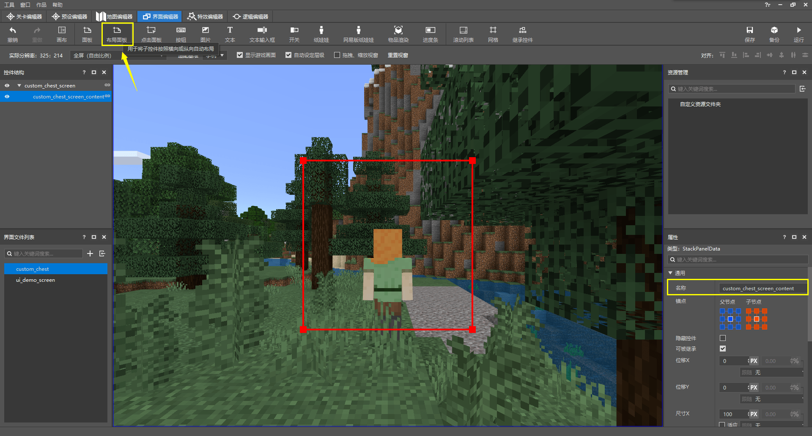
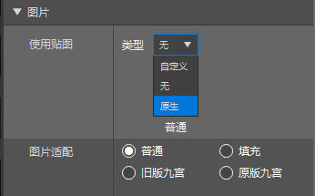
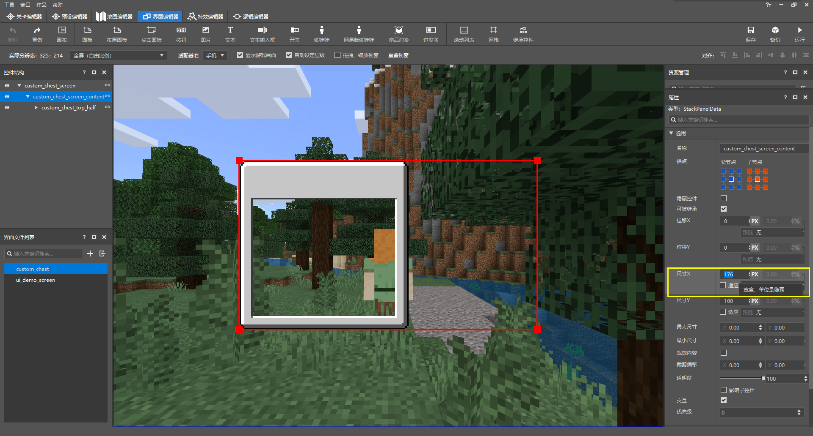
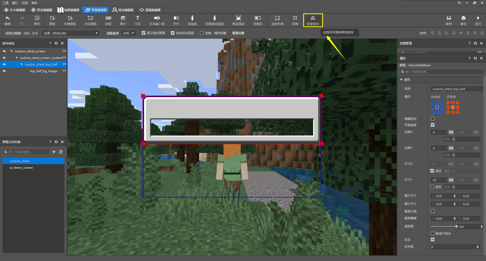
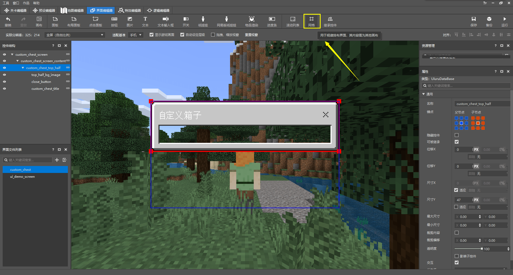
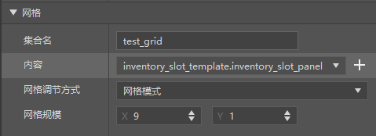
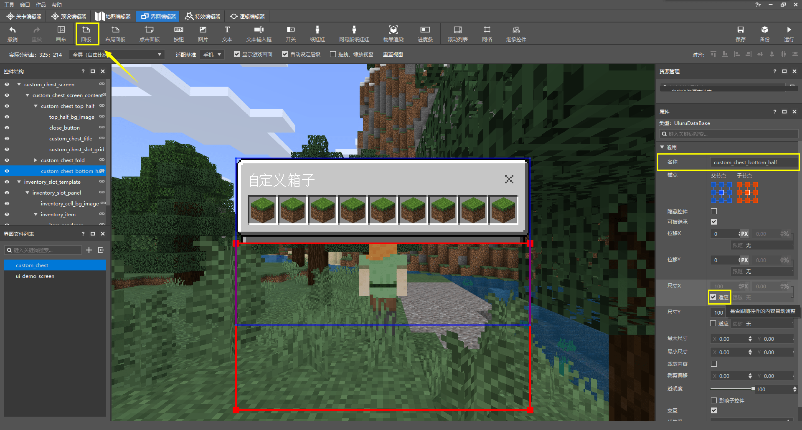
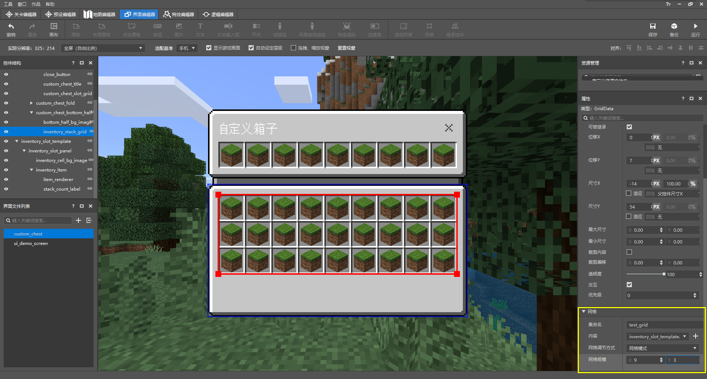
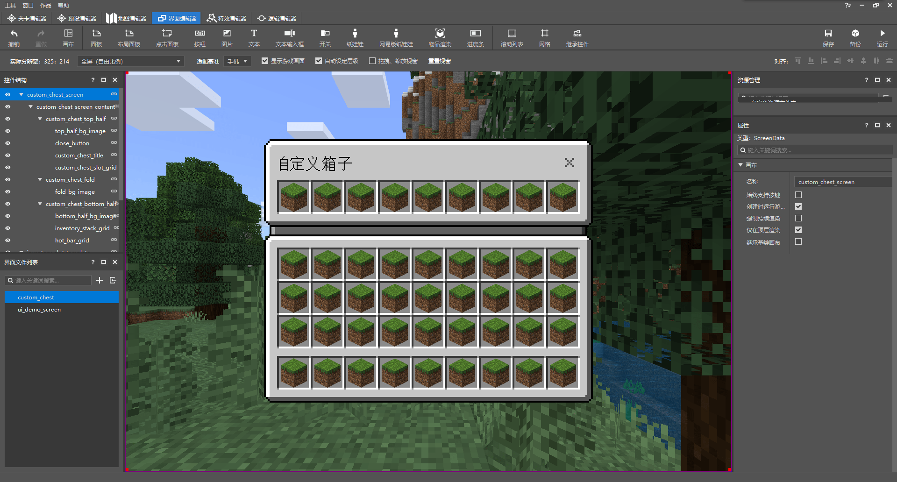

--- 
front: https://nie.res.netease.com/r/pic/20211104/69055361-2e7a-452f-8b1a-f23e1262a03a.jpg 
hard: Advanced 
time: 40 minutes 
--- 
# Draw an interface for a custom box 

Now, let's draw an interface for our custom box in Chapter 13. Due to space limitations, we will not introduce how to add logic to the interface here. However, it is also an indispensable skill to use the editor flexibly to draw the interface. Therefore, in this section, we focus on various methods of drawing a complex UI. At the end of this section, we will introduce how to display our UI in the game. 

## Create UI 

 

 

Open our editor and create a new UI file through the New UI File dialog box. Let's name it `custom_chest`. 

 

The editor automatically creates a `main` screen control for us. Let's rename it to a more memorable name `custom_chest_screen`. We can rename the control in the "Properties" pane on the right. 

Now, let's imagine the expected UI. We hope to make a UI divided into two parts, the upper panel is used to display the items in the box content, and the lower panel is used to display the items in the player's inventory. A small picture control can be used to connect them in the middle, just like the original inventory screen shows the craftable items on the left and the inventory or crafting grid on the right, with a small picture connecting them in the middle. Therefore, the main body of our UI is actually three main parts arranged from top to bottom. 

## Add controls to the UI 

Generally speaking, there is only one panel under a screen. We know that a panel is a technical control used to place various other controls. However, it is easy to think that on the root node of the screen, we actually only need one panel to place various controls under it. Therefore, unless there are special circumstances, more than two panels are redundant, which is why we are generally accustomed to placing only one panel under a screen, and then performing various operations or placing other controls on this panel. 

From our assumptions about the UI just now, we can know that we expect the main parts of the UI to be arranged vertically. Therefore, the stack panel is our preferred panel here. The stack panel can be a strict horizontal or vertical arrangement of the controls in it, without specifying their respective positions separately. 

 

We create a stack panel and rename it to `custom_chest_screen_content`. The default orientation of the stack panel is from top to bottom (vertical), so we don't need to change its **Orientation**, which corresponds to the `orientation` in the JSON file. 

### Top half 

 

Now, we add the top half panel to it. Here we use a normal panel because we don't need to arrange the top half panels in order. Let's rename it to `custom_chest_top_half`. The panel is still the default size at this time, and we should specify the size for it. But don't be so anxious, we can first make our top half background image, and then calculate and specify the panel size based on the size of the background image. 

 

We add an image control under this panel as the background image of our top half UI, and rename it to `top_half_bg_image`. However, the texture image used by the image control at this time is the default image, and we need to change it. 

 

We pull down to the bottom of the "Properties" pane and see the "Image" section. We can add images to the image control here. In order to use the original UI texture, we can select "**Native**" here. 

 


 

In the pop-up dialog box, we click into the `texture/ui` folder, and then we might as well select `dialog_backgroud_hollow_3.png` as our background image. In this way, a part of the top can be left for us to add the window title later. 

 

After the application is successful, we can see that our UI has a regular appearance. But at this time, we have a little doubt. From the texture image we selected, its shape is actually very different from what it shows in the editor after application. How can such a small image be applied to such a large background? In fact, this is due to a function called **Texture Nineslice** (**Texture Nineslice*, *Texture Nine Grid*). 

 

Microsoft provides a native data-driven method for adapting the nine-slice texture. We find the location of the original file of the UI texture and can see that there is a JSON file with the same name as the texture file. The game will first automatically detect whether there is such a JSON file with the same name in the folder where the texture is located. If there is, it will use the nine-slice method to stretch and deform the texture, and finally apply it to what we see. We open the `dialog_backgroud_hollow_3.json` file: 

```json 
{ 
"nineslice_size": [ 
8, 
23, 
8, 
8 
], 
"base_size": [ 
18, 
33 
] 
} 
``` 

As you can see, there are two attributes here, one is `nineslice_size`, which is the size of the nine slices; and the other is `base_size`, which literally means the base size, which is actually the size of the texture file itself. `nineslice_size` is the attribute that mainly specifies where the nine slices need to start from in the texture. Its four values represent the slicing points of the texture in four directions, in pixels (px). This example means slicing from 23 pixels above and 8 pixels in the other directions. 

 

The top, bottom, left, right, top left, top right, bottom left, and bottom right directions are all sliced with the pixel width we specified, and then the remaining parts are stretched to fit the size of the control. So, we see this in the game. Due to the existence of the texture nine slices, we also know where the last part of the control, the central part, starts in addition to the above eight parts. Generally speaking, we can put the rest of the controls on the panel in the central position to achieve a more beautiful UI style. Then, we can use the four sizes of the nine slices to calculate the position and offset of our central control. 

Let's now calculate what the size of our upper half of the panel should be. We don't want the box to store too many items at present. For example, we can only let the box store nine grid items, that is, only one row, a total of nine item slots. We know that the item itself should be set to 16×16 pixels. Then the size of the grid of the item should be larger than the item itself, that is, 1px larger in all directions, so the item slot itself should be 18×18 pixels. Then the width of the panel should be: 
$$ 
x=width=8+18\cross9+8=178 
$$ 
And the height of the panel is: 
$$ 
y=height=23+18+8=49 
$$ 
However, we hope that the circle of concave texture pixels at the edge of the inner frame of the background image coincides with the edge of our item slot at the border, so that our item slot will not appear to be "too deep" visually. So we subtract one from the calculated numbers of the background image borders: 
$$ 
x=width=7+18\cross9+7=176\\ 
y=height=22+18+7=47 
$$ 
 

Since we know that our outermost stack panel is arranged vertically, the width of the entire UI remains unchanged, so we directly apply 176 to the width of our outermost stack panel (**size X**). This corresponds to `"size" : [ 176, 100 ]` in JSON 


 

Then we set the width of our top panel to "**fit**" and the height (size Y) to the calculated height of 47. This corresponds to `"size" : [ "default", 47 ]` in JSON. `default` is equivalent to `100%` for controls such as panels and images, which inherits the corresponding value of its parent control. 

 

Finally, we set the width and height of the image control of the background image to "fit", which corresponds to `"size" : [ "default", "default" ]` in JSON. 

Now, we can continue to add other controls. Before adding the item stack slot, let's add the close button and title. 

 

We don't need to design our own close button, we can directly inherit an original close button control. We click the last button in the ribbon to add an inherited control in the editor. 

 

We keep the namespace in the "Properties" pane as `common`, and then change both names to `close_button`, which is equivalent to `close_button@common.close_button`. Then, we can see that a button that is the same as the original close button appears in the upper right corner. 

 

Now, we add a title to the upper part, and we might as well rename it to `custom_chest_title`. 

 

We find the "Text" section in the "Properties" pane and modify the content to what we want, let's change it to "Custom Box". In this way, our text becomes a "Custom Box". 

 

Then we set the position of the text to the appropriate position. First, we set the size of both axes to "Adapt", which is the default. For text, default does not mean adapting to the parent size, on the contrary, it means adapting to the minimum size of its own text, as shown in the figure above. Then, we modify the **Anchor** to move its position to the upper left corner of the panel. 

 

Anchor is a property of a parent control's child control to hook its own appropriate position to the appropriate position of the parent control. In the above picture, let's assume that the blue one is the parent control and the red one is the child control. There are nine anchor points on each of them, eight around the circle and one in the center. By default, the center anchor point of the child control is attached to the center anchor point of the parent control, as shown in the first picture. If we attach the anchor point in the upper left corner of the child control to the center anchor point of the parent control, it will look like the second picture. Finally, if we attach the upper left anchor point of the child control to the upper left anchor point of the parent control, it will look like the third picture here, which is also the way we want to attach our title text to the panel. The anchor point attributes correspond to the JSON file in two ways: `anchor_from` and `anchor_to`. As the name implies, `anchor_from` means "the anchor point from", which is the parent anchor point, and `anchor_to` means "the anchor point attached to", which is the child anchor point. 

However, we can see that our text cannot be attached only to the upper left corner of the parent control. If it is simply attached to the upper left corner, the text will be too close to the edge of the panel. We need to move it right and down to move it to the right position. As shown in the X and Y in the screenshot above, there is actually a coordinate system in the entire UI, and the positive direction of the X axis is from left to right, and the positive direction of the Y axis is from top to bottom. So if we want to move it to the right, it is equivalent to increasing the positive X coordinate; moving it down is equivalent to increasing the positive Y coordinate. So we set "**Displacement X**" and "**Displacement Y**" to positive 8 respectively, so that we successfully offset it to the right and down by 8 pixels. 

Now, let's start making the inventory of the box. 

 

We click "Grid" in the ribbon to create a grid control. The grid control is a control that can present a grid arrangement of elements in its template, which is very suitable for making interfaces composed of repeated elements. 

 

We might as well rename it to `custom_chest_slot_grid`. We can see that the current grid is composed of four default images and is very ugly. This is because we have not set a grid template for it. 

 

We pull down to the bottom of the "Properties" pane on the right, and you can see that the "Content" property shows that we must select a control of another screen (*canvas*) as the template for this grid. So, let's create a new screen in this JSON UI. Multiple screens can be created in a JSON UI, and each screen can function independently. However, the screen we create here is only to give our template a place to carry (this is because the current editor does not support the display of single independent controls, but only supports the display of controls mounted under the screen), so we are just creating a "technical screen" and not actually displaying it. 


 

We click on the "canvas" in the ribbon to create a new screen, let's name it `inventory_slot_template`. 

 

We create a panel below it, as the panel we intend to apply to the grid as a template, let's rename it `inventory_slot_panel`. At the same time, we change its size to 18×18. This is because our template is an item slot, and the size of the item slot we have calculated before is 18×18. 

 

We create an image control below it, rename it `inventory_cell_bg_image`, and set its size to "fit". 

 

We choose `textures/ui/cell_image.png` from the original resource pack as our texture, which also meets the nine-slice condition and is automatically stretched to look like the original item slot. 

 

Now, we add another panel to it, which is used to carry the panel of the two controls of the **renderer** (**Renderer**) of the item and the text label of the item quantity. The renderer is a property that is only required when the control type is custom (`custom`). To put it bluntly, it is a custom control that supports us to customize the rendering on it through a renderer. And there is a renderer `inventory_item_renderer` in the original version that can be used to render items. 

We rename the panel to `inventory_item`, and adjust the size of the two axes to "follow 100% of the parent control and then reduce 2px", because we want the size of the panel to be 16×16. This is equivalent to using this method in the JSON file: `"size" : [ "100% - 2px", "100% - 2px" ]`, where the spaces on both sides of the minus sign are optional. You can even write `"size" : [ "100% + -2px", "100% + -2px" ]`, and the spaces on both sides of the plus sign are also optional. So, what is the meaning of this method? In fact, the size of the control can be calculated as part of the calculation formula using the percentage of the corresponding size of the **parent control**, **sibling control** or **child control**, and then a final value is obtained. Directly using `%` will give you the percentage of the parent control, using `%c` will give you the percentage of the total size of the child control in the corresponding direction, `%cm` is the percentage of the size of the largest control in the corresponding direction among the child controls, and `%sm` is the percentage of the size of the largest control in the corresponding direction among the sibling controls. These percentages can be directly operated and changed in the editor. 

 

We can create a custom type control with a renderer `inventory_item_renderer` by clicking "Item Rendering" in the ribbon. Let's rename it to `item_renderer`. We set its size to "Adapt". 

 

Then we still plan to implement the text of the item quantity by inheriting an original control. 

 

We'll call it `stack_count_label` and make it inherit from `common.stack_count_label`. 

 

Back to our grid widget, we set the "Content" to our panel `inventory_slot_template/inventory_slot_panel`. Of course, the editor shows it with `.`, which does not affect our correct location of the widget. At the same time, we set the grid size to 9×1. 

 

Finally, we set the widget to be attached from the upper anchor point to the upper anchor point, and then offset downward by 22 pixels, and the size is set to `100% - 14px` for width and 18 for height. This is equivalent to writing the following properties in the JSON file: 

```json 
"anchor_from" : "top_middle", 
"anchor_to" : "top_middle", 
"offset" : [ 0, 22 ], 
"size" : [ "100% - 14px", 18 ] 
``` 

In this way, we have completed the production of the upper part.


### Fold 

We need a connection between the top and bottom halves. Let's make this connection, let's call it a fold. 

 

We create a new panel under our stack panel to store our fold, let's call it `custom_chest_fold`. According to the flow of the stack panel, it is naturally located below our top panel. 

 

Corresponding to the fold on the original inventory screen, we set its size to "fit" in width and 4 pixels in height. 

 

Now, let's add a background image to it. Let's create a new image control, let's rename it `fold_bg_image`. Then, we set its width to be narrower and its height to be taller than the original one. In this way, our image can achieve a more beautiful connection effect after application. 

 

That is, the connection effect we can see after applying the texture. At this time, we apply `textures/ui/recipe_back_panel.png`. It also uses nine-slice stretching. 

 

However, we can see that our control is located above the upper part of the control. So, how can we make it not cover the upper part of the control? We have two ways. One is to cancel the "automatic setting of the level" of the editor. By default, the editor will automatically set the **level** (**Layer**) of the control for us. Once we cancel the automatic setting of the level, the editor will require us to manually set the level for each control. The level represents the occlusion relationship between the controls. The upper control will cover the lower control. However, when we also want the editor to automatically set this function for us, we need to find another way. Another method does not require us to cancel the automatic setting of the level, that is the **Clip** function. 

 

We check "Clip content" to turn on the clipping function. Then, we set the width and height of the clipping on the X and Y axes. Here, we only need to clip on Y. So we set Y to 4. In this way, we can see that it is clipped just right, which corresponds to `"allow_clipping": true, "clips_children": true, "clip_offset" : [ 0.0, 4.0 ]` in JSON. 

### Lower part 

Now, we start to make the lower part. 

 

We create a panel for the bottom half, let's name it `custom_chest_buttom_half`. Set the width to "fit", and the height will be calculated later. 

 

We create an image control as our background image, let's rename it `buttom_half_bg_image`. Similarly, we set both the width and height to "fit". 

 

We set `textures/ui/dialog_backgroud_opaque.png` as the texture of the image control. Now, we can calculate the height of the entire bottom half based on the nine-slice data of the file. From the corresponding nine-slice JSON file, we can know that the width of the upper and lower slices of the control is 8 pixels. So, we calculate the height by the following formula: 
$$ 
y=height=7+18\cross3+4+18+7=90 
$$ 
 


We change the height of the lower panel to 90, and the height of the entire stack panel to the sum of the three parts, that is, 141. This way, the elements in our entire stack panel will be vertically centered. 

 

 

 

 

Finally, just like we added the inventory of the box in the upper part before, we use two grids to add the player's inventory and hotbar. We can still use our previous grid templates because they have no difference in style. 

### Check and modify 

So far, we have basically completed the drawing of the UI, but we need to develop the habit of checking. Because we are dealing with many variables during a UI drawing process, there may be some minor imperfections that we cannot see. For example, we can now see that the color of our title text can be further changed. 

 

We can change the title to black so that it will be more conspicuous. 

 

We can also specify collection names for each grid, and we can use different collection names with bindings to achieve interaction between different item stacking slots in different grids. Of course, we are not going to perfect this process in this example, so we can skip this point. 

 

Finally, we have completed the drawing of our UI. We can show the completed JSON file here: 

```json 
{ 
"bottom_half_bg_image" : { 
"alpha" : 1.0, 
"anchor_from" : "center", 
"anchor_to" : "center", 
"clip_direction" : "left", 
"clip_offset" : [ 0, 0 ], 
"clip_ratio" : 0.0, 
"clips_children" : false, 
"enabled" : true, 
"fill" : false, 
"grayscale" : false, 
"is_new_nine_slice" : false, 
"keep_ratio" : true, 
"layer" : 13, 
"max_size" : [ 0, 0 ], 
"min_size" : [ 0, 0 ],
    "nine_slice_buttom" : 0,
    "nine_slice_left" : 0,
    "nine_slice_right" : 0,

    "nine_slice_top" : 0,
    "nineslice_size" : [ 0, 0, 0, 0 ],
    "offset" : [ 0, 0 ],
    "priority" : 0,
    "propagate_alpha" : false,
    "size" : [ "default", "default" ],
    "texture" : "textures/ui/dialog_background_opaque",
    "type" : "image",
    "uv" : [ 0, 0 ],
    "uv_size" : [ 0, 0 ],
    "visible" : true
  },
  "custom_chest_bottom_half" : {
    "alpha" : 1.0,
    "anchor_from" : "center",
    "anchor_to" : "center",    "clip_offset" : [ 0, 0 ],
    "clips_children" : false,
    "controls" : [
      {
        "bottom_half_bg_image@custom_chest.bottom_half_bg_image" : {}
      },
      {
        "inventory_stack_grid@custom_chest.inventory_stack_grid" : {}
      },
      {
        "hot_bar_grid@custom_chest.hot_bar_grid" : {}
      }
    ],
    "enabled" : true,
    "layer" : 12,
    "max_size" : [ 0, 0 ],
    "min_size" : [ 0, 0 ],
    "offset" : [ 0, 0 ],
    "priority" : 0,
    "propagate_alpha" : false,
    "size" : [ "default", 90 ],
    "type" : "panel",
    "visible" : true
  },
  "custom_chest_fold" : {
    "alpha" : 1.0,
    "anchor_from" : "center",
    "anchor_to" : "center",
    "clip_offset" : [ 0, 0 ],
    "clips_children" : false,
    "controls" : [
      {
        "fold_bg_image@custom_chest.fold_bg_image" : {}
      }

    ],
    "enabled" : true,
    "layer" : 10,
    "max_size" : [ 0, 0 ],
    "min_size" : [ 0, 0 ],
    "offset" : [ 0, 0 ],
    "priority" : 0,
    "propagate_alpha" : false,
    "size" : [ "default", 4 ],
    "type" : "panel",
    "visible" : true
  },
  "custom_chest_screen" : {
    "absorbs_input" : true,
    "always_accepts_input" : false,
    "controls" : [
      {
        "custom_chest_screen_content@custom_chest.custom_chest_screen_content" : {}
      }
    ],    "force_render_below" : false,
    "is_showing_menu" : true,
    "render_game_behind" : true,
    "render_only_when_topmost" : true,
    "should_steal_mouse" : false,
    "type" : "screen"
  },
  "custom_chest_screen_content" : {
    "alpha" : 1.0,
    "anchor_from" : "center",
    "anchor_to" : "center",
    "clip_offset" : [ 0, 0 ],
    "clips_children" : false,
    "controls" : [
      {
        "custom_chest_top_half@custom_chest.custom_chest_top_half" : {}
      },
      {        "custom_chest_fold@custom_chest.custom_chest_fold" : {}
      },
      {
        "custom_chest_bottom_half@custom_chest.custom_chest_bottom_half" : {}
      }
    ],
    "enabled" : true,
    "layer" : 0,
    "max_size" : [ 0, 0 ],
    "min_size" : [ 0, 0 ],
    "offset" : [ 0, 0 ],
    "orientation" : "vertical",

    "priority" : 0,
    "propagate_alpha" : false,
    "size" : [ 176, 141 ],
    "type" : "stack_panel",
    "use_priority" : false,
    "visible" : true
  },
  "custom_chest_slot_grid" : {
    "alpha" : 1.0,
    "anchor_from" : "top_middle",
    "anchor_to" : "top_middle",
    "clip_offset" : [ 0, 0 ],
    "clips_children" : false,
    "collection_name" : "custom_chest_content_collection",
    "enabled" : true,
    "grid_dimensions" : [ 9.0, 1.0 ],
    "grid_item_template" : "custom_chest.inventory_slot_panel",
    "grid_rescaling_type" : "none",
    "layer" : 5,
    "max_size" : [ 0, 0 ],
    "maximum_grid_items" : 0,
    "min_size" : [ 0, 0 ],
    "offset" : [ 0, 22 ],
    "priority" : 0,
    "propagate_alpha" : true,
    "size" : [ "100.0%+-14.0px", 18 ],
    "type" : "grid",
    "visible" : true
  },
  "custom_chest_title" : {
    "alpha" : 1.0,
    "anchor_from" : "top_left",
    "anchor_to" : "top_left",
    "clip_offset" : [ 0, 0 ],
    "clips_children" : false,
    "color" : [ 0.0, 0.0, 0.0 ],
    "enabled" : true,
    "font_scale_factor" : 1.0,
    "font_size" : "normal",
    "font_type" : "smooth",
    "layer" : 4,
    "line_padding" : 0.0,
    "max_size" : [ 0, 0 ],
    "min_size" : [ 0, 0 ],
    "offset" : [ 8, 8 ],
    "priority" : 0,
    "propagate_alpha" : false,
    "shadow" : false,
    "size" : [ "default", "default" ], "text" : "Custom box",

    "text_alignment" : "center",
    "type" : "label",
    "visible" : true
  },
  "custom_chest_top_half" : {
    "alpha" : 1.0,
    "anchor_from" : "center",
    "anchor_to" : "center",
    "clip_offset" : [ 0, 0 ],
    "clips_children" : false,
    "controls" : [
      {
        "top_half_bg_image@custom_chest.top_half_bg_image" : {}
      },
      {
        "close_button@common.close_button" : {
          "layer" : 3
        }
      },
      {
        "custom_chest_title@custom_chest.custom_chest_title" : {}      },
      {
        "custom_chest_slot_grid@custom_chest.custom_chest_slot_grid" : {}
      }
    ],
    "enabled" : true,
    "layer" : 1,
    "max_size" : [ 0, 0 ],
    "min_size" : [ 0, 0 ],
    "offset" : [ 0, 0 ],
    "priority" : 0,
    "propagate_alpha" : false,
    "size" : [ "default", 47 ],
    "type" : "panel",
    "visible" : true
  },
  "fold_bg_image" : {
    "alpha" : 1.0,
    "anchor_from" : "center",
    "anchor_to" : "center",    "clip_direction" : "left",
    "clip_offset" : [ 0.0, 4.0 ],
    "clip_ratio" : 0.0,
    "clips_children" : true,
    "enabled" : true,
    "fill" : false,
    "grayscale" : false,
    "is_new_nine_slice" : false,
    "keep_ratio" : true,

    "layer" : 11,
    "max_size" : [ 0, 0 ],
    "min_size" : [ 0, 0 ],
    "nine_slice_buttom" : 0,
    "nine_slice_left" : 0,
    "nine_slice_right" : 0,
    "nine_slice_top" : 0,
    "nineslice_size" : [ 0, 0, 0, 0 ],
    "offset" : [ 0, 0 ],
    "priority" : 0,
    "propagate_alpha" : false,
    "size" : [ "100.0%+-6.0px", "100.0%+8.0px" ],
    "texture" : "textures/ui/recipe_back_panel",
    "type" : "image",
    "uv" : [ 0, 0 ],
    "uv_size" : [ 0, 0 ],
    "visible" : true
  },
  "hot_bar_grid" : {
    "alpha" : 1.0,
    "anchor_from" : "bottom_middle",
    "anchor_to" : "bottom_middle",
    "clip_offset" : [ 0, 0 ],
    "clips_children" : false,
    "collection_name" : "test_grid",
    "enabled" : true,
    "grid_dimensions" : [ 9.0, 1.0 ],
    "grid_item_template" : "custom_chest.inventory_slot_panel",
    "grid_rescaling_type" : "none",
    "layer" : 19,
    "max_size" : [ 0, 0 ],
    "maximum_grid_items" : 0,
    "min_size" : [ 0, 0 ],
    "offset" : [ 0, -7 ],
    "priority" : 0,
    "propagate_alpha" : true,
    "size" : [ "100.0%+-14.0px", 18 ],
    "type" : "grid",
    "visible" : true
  },
  "inventory_cell_bg_image" : {
    "alpha" : 1.0,
    "anchor_from" : "center",
    "anchor_to" : "center",
    "clip_direction" : "left",
    "clip_offset" : [ 0, 0 ],
    "clip_ratio" : 0.0,
    "clips_children" : false,
    "enabled" : true,
    "fill" : false,

    "grayscale" : false,
    "is_new_nine_slice" : false,
    "keep_ratio" : true,
    "layer" : 1,
    "max_size" : [ 0, 0 ],
    "min_size" : [ 0, 0 ],
    "nine_slice_buttom" : 0,
    "nine_slice_left" : 0,
    "nine_slice_right" : 0,
    "nine_slice_top" : 0,
    "nineslice_size" : [ 0, 0, 0, 0 ],
    "offset" : [ 0, 0 ],
    "priority" : 0,
    "propagate_alpha" : false,
    "size" : [ "default", "default" ],    "texture" : "textures/ui/cell_image",
    "type" : "image",
    "uv" : [ 0, 0 ],
    "uv_size" : [ 0, 0 ],
    "visible" : true
  },
  "inventory_item" : {
    "alpha" : 1.0,
    "anchor_from" : "center",
    "anchor_to" : "center",
    "clip_offset" : [ 0, 0 ],
    "clips_children" : false,
    "controls" : [
      {
        "item_renderer@custom_chest.item_renderer" : {}
      },
      {
        "stack_count_label@common.stack_count_label" : {
          "layer" : 4
        }      }
    ],
    "enabled" : true,
    "layer" : 2,
    "max_size" : [ 0, 0 ],
    "min_size" : [ 0, 0 ],
    "offset" : [ 0, 0 ],
    "priority" : 0,
    "propagate_alpha" : false,
    "size" : [ "100.0%+-2.0px", "100.0%+-2.0px" ],
    "type" : "panel",
    "visible" : true
  },
  "inventory_slot_panel" : {
    "alpha" : 1.0,

    "anchor_from" : "center",
    "anchor_to" : "center",
    "clip_offset" : [ 0, 0 ],
    "clips_children" : false,
    "controls" : [
      {
        "inventory_cell_bg_image@custom_chest.inventory_cell_bg_image" : {}
      },
      {
        "inventory_item@custom_chest.inventory_item" : {}
      }
    ],
    "enabled" : true,
    "layer" : 0,
    "max_size" : [ 0, 0 ],
    "min_size" : [ 0, 0 ],
    "offset" : [ 0, 0 ],
    "priority" : 0,
    "propagate_alpha" : false,    "size" : [ 18, 18 ],
    "type" : "panel",
    "visible" : true
  },
  "inventory_slot_template" : {
    "absorbs_input" : true,
    "always_accepts_input" : false,
    "controls" : [
      {
        "inventory_slot_panel@custom_chest.inventory_slot_panel" : {}
      }
    ],
    "force_render_below" : false,
    "is_showing_menu" : true,
    "render_game_behind" : true,
    "render_only_when_topmost" : true,
    "should_steal_mouse" : false,
    "type" : "screen"
  },  "inventory_stack_grid" : {
    "alpha" : 1.0,
    "anchor_from" : "top_middle",
    "anchor_to" : "top_middle",
    "clip_offset" : [ 0, 0 ],
    "clips_children" : false,
    "collection_name" : "test_grid",
    "enabled" : true,
    "grid_dimensions" : [ 9.0, 3.0 ],
    "grid_item_template" : "custom_chest.inventory_slot_panel",
    "grid_rescaling_type" : "none",
    "layer" : 14,

    "max_size" : [ 0, 0 ],
    "maximum_grid_items" : 0,
    "min_size" : [ 0, 0 ],
    "offset" : [ 0, 7 ],
    "priority" : 0,
    "propagate_alpha" : true,
    "size" : [ "100.0%+-14.0px", 54 ],
    "type" : "grid",
    "visible" : true
  },
  "item_renderer" : {
    "alpha" : 1.0,
    "anchor_from" : "center",
    "anchor_to" : "center",
    "clip_offset" : [ 0, 0 ],
    "clips_children" : false,
    "enabled" : true,
    "layer" : 3,
    "max_size" : [ 0, 0 ],
    "min_size" : [ 0, 0 ],
    "offset" : [ 0, 0 ],
    "priority" : 0,
    "propagate_alpha" : false,
    "property_bag" : {
      "#item_id_aux" : 131072
    },
    "renderer" : "inventory_item_renderer",
    "size" : [ "default", "default" ],
    "type" : "custom",
    "visible" : true
  },
  "namespace" : "custom_chest",
  "top_half_bg_image" : {
    "alpha" : 1.0,
    "anchor_from" : "center",
    "anchor_to" : "center",
    "clip_direction" : "left",
    "clip_offset" : [ 0, 0 ],
    "clip_ratio" : 0.0,
    "clips_children" : false,
    "enabled" : true,
    "fill" : false,
    "grayscale" : false,
    "is_new_nine_slice" : false,
    "keep_ratio" : true,
    "layer" : 2,
    "max_size" : [ 0, 0 ],
    "min_size" : [ 0, 0 ],
    "nine_slice_buttom" : 0,
    "nine_slice_left" : 0,

"nine_slice_right" : 0, 
"nine_slice_top" : 0, 
"nineslice_size" : [ 0, 0, 0, 0 ], 
"offset" : [ 0, 0 ], 
"priority" : 0, 
"propagate_alpha" : false, 
"size" : [ "default", "default" ], 
"texture" : "textures/ui/dialog_background_hollow_3", 
"type" : "image", 
"uv" : [ 0, 0 ], 
"uv_size" : [ 0, 0 ], 
"visible" : true 
} 
} 
``` 

Since this file is automatically generated by the editor, the controls are sorted in alphabetical order, which looks a bit messy. However, since we are not going to make secondary modifications at the JSON level, we do not need to pay attention to this. Next, we can display it in the game. We only need to know that the screen control we want to display is called `custom_chest.custom_chest_screen`. 

## Display custom UI in the game 

Now, based on the custom box we made in Chapter 13, let's make a function to display the JSON UI in the game. We know that the script of our previous custom box is located in the `BlockEntityScripts` folder of the behavior pack. In order to display the UI in the game, our custom UI must have a **Proxy Class** in the Python code to proxy the various functions of the UI. Even if our UI does not have any functions, it must require the existence of a proxy class to be displayed correctly. 

We create a new `ChestScreenNode.py` in this folder to proxy our screen node. Since our UI does not have any functions, we just need to simply enter the following content in it: 

```python 
# -*- coding: utf-8 -*- 
import mod.client.extraClientApi as clientApi 

ScreenNode = clientApi.GetScreenNodeCls() 

class Main(ScreenNode): 

def __init__(self, namespace, name, params): 
ScreenNode.__init__(self, namespace, name, params) 

def Create(self): 
pass 

``` 

Then, we need to register this class in our system to register it as a UI. In the game, all custom UIs must be registered after all in-game UIs are initialized, so we need to use an engine system event `UiInitFinished` here. In fact, we have already used this event in the previous function of making the block entity data of the storage box (the last exercise in the challenge of the previous chapter). We modify its callback `chunk_first_loaded` as follows: 

```python 
# -*- coding: UTF-8 -*- 
from mod.client.system.clientSystem import ClientSystem 
import mod.client.extraClientApi as clientApi 
import time 


class Main(ClientSystem):

    def __init__(self, namespace, system_name):
        ClientSystem.__init__(self, namespace, system_name)
        namespace = clientApi.GetEngineNamespace()
        system_name = clientApi.GetEngineSystemName()
        self.ListenForEvent(namespace, system_name, 'ClientBlockUseEvent', self, self.block_used)
        self.ListenForEvent(namespace, system_name, 'ChunkLoadedClientEvent', self, self.chunk_first_loaded)
        self.ListenForEvent(namespace, system_name, 'UiInitFinished', self, self.chunk_first_loaded)
        self.ListenForEvent('tutorial_demo', 'BlockEntityServer', 'OpenChestFinished', self, self.chest_opened)        self.ListenForEvent('tutorial_demo', 'BlockEntityServer', 'InitChestRotation', self, self.chest_rotation)
        self.block_interact_cooldown = {}
        self.rotation_queue = []

    def block_used(self, event):
        player_id = event['playerId']
        block_name = event['blockName']
        x = event['x']
        y = event['y']
        z = event['z']
        if block_name == 'tutorial_demo:custom_chest':
            if player_id not in self.block_interact_cooldown:
                self.block_interact_cooldown[player_id] = time.time()
            elif time.time() - self.block_interact_cooldown[player_id] < 0.15:
                return
            else:                self.block_interact_cooldown[player_id] = time.time()
            game_comp = clientApi.GetEngineCompFactory().CreateGame(clientApi.GetLevelId())
            dimension_id = game_comp.GetCurrentDimension()
            self.NotifyToServer('TryOpenChest', {'dimensionId': dimension_id, 'pos': [x, y, z]})

    def chest_opened(self, event):
        data = event['data']
        block_comp = clientApi.GetEngineCompFactory().CreateBlockInfo(clientApi.GetLevelId())
        for block_data in data:
            block_pos = tuple(block_data['pos'])
            block_comp.SetBlockEntityMolangValue(block_pos, "variable.mod_states", float(block_data['states']))

    def chunk_first_loaded(self, event): 
self.NotifyToServer('GetChestInit', {'playerId': clientApi.GetLocalPlayerId()}) 
# Register the screen of the custom chest as the UI in the script. The first parameter is the namespace of the registered UI, the second parameter is the key name of the registered UI, that is, the identifier, the third parameter is the path of the proxy class, and the fourth parameter is the screen control name in the JSON UI 
clientApi.RegisterUI('tutorial_demo', 'custom_chest', 'BlockEntityScripts.ChestScreenNode.Main', 'custom_chest.custom_chest_screen') 

def chest_rotation(self, event): 
print event 
new_event = {tuple(map(int, k.split(','))): v for k, v in event.items()} 
block_comp = clientApi.GetEngineCompFactory().CreateBlockInfo(clientApi.GetLevelId())

        def rotate_chest():
            index = 0

            count = len(new_event.items())
            for pos, data in new_event.items():
                block_data = block_comp.GetBlock(pos)
                if block_data[0] == 'tutorial_demo:custom_chest':
                    block_comp.SetBlockEntityMolangValue(pos, "variable.mod_rotation", data['rotation'])
                    block_comp.SetBlockEntityMolangValue(pos, "variable.mod_invert", float(data['invert']) if data['invert'] != 0 else 0.0)
                    index += 1
                    if index == count:
                        return True
            else:
                return False
        if new_event:
            self.rotation_queue.append([rotate_chest, 0])

    def Update(self):
        _die = []
        for index, value in enumerate(self.rotation_queue): 
if value[0](): 
value[1] += 1 
if value[1] == 2: 
_die.append(index) 
for i in _die: 
self.rotation_queue[i] = None 
if self.rotation_queue: 
self.rotation_queue = filter(None, self.rotation_queue) 
``` 

Then, we can use the `PushScreen` method in the additional API to push the UI into the scene stack when the box is opened. Of course, we can also use `CreateUI` to display it, but the latter method is to create the UI directly in the current scene stack screen and use a large hierarchy to display it at the top. And `PushScreen` is equivalent to pushing a new screen into the scene stack, and the two have different focuses. 

```python
# -*- coding: UTF-8 -*-
from mod.client.system.clientSystem import ClientSystem
import mod.client.extraClientApi as clientApi
import time


class Main(ClientSystem):

    def __init__(self, namespace, system_name):
        ClientSystem.__init__(self, namespace, system_name)
        namespace = clientApi.GetEngineNamespace()
        system_name = clientApi.GetEngineSystemName()
        self.ListenForEvent(namespace, system_name, 'ClientBlockUseEvent', self, self.block_used)
        self.ListenForEvent(namespace, system_name, 'ChunkLoadedClientEvent', self, self.chunk_first_loaded)
        self.ListenForEvent(namespace, system_name, 'UiInitFinished', self, self.chunk_first_loaded)        self.ListenForEvent('tutorial_demo', 'BlockEntityServer', 'OpenChestFinished', self, self.chest_opened)
        self.ListenForEvent('tutorial_demo', 'BlockEntityServer', 'InitChestRotation', self, self.chest_rotation)
        self.block_interact_cooldown = {}
        self.rotation_queue = []

    def block_used(self, event):
        player_id = event['playerId']
        block_name = event['blockName']
        x = event['x']
        y = event['y']
        z = event['z']
        if block_name == 'tutorial_demo:custom_chest':
            if player_id not in self.block_interact_cooldown:
                self.block_interact_cooldown[player_id] = time.time()
            elif time.time() - self.block_interact_cooldown[player_id] < 0.15:
                return
            else:
                self.block_interact_cooldown[player_id] = time.time()
            game_comp = clientApi.GetEngineCompFactory().CreateGame(clientApi.GetLevelId())
            dimension_id = game_comp.GetCurrentDimension() self.NotifyToServer('TryOpenChest', {'dimensionId': dimension_id, 'pos': [x, y, z]}) 

def chest_opened(self, event): 
data = event['data'] 
block_comp = clientApi.GetEngineCompFactory().CreateBlockInfo(clientApi.GetLevelId()) 
for block_data in data: 
block_pos = tuple(block_data['pos']) 
block_comp.SetBlockEntityMolangValue(block_pos, "variable.mod_states", float(block_data['states'])) 
# Push the registered screen into the scene stack. The third parameter is the parameter that can be passed to the proxy class. We do not pass any parameters here 
clientApi.PushScreen('tutorial_demo', 'custom_chest', {}) 
# The SimulateTouchWithMouse method of the game engine component can be used on the PC side to prevent the HUD screen from turning into touch input mode when exiting the screen 
clientApi.GetEngineCompFactory().CreateGame(clientApi.GetLocalPlayerId()).SimulateTouchWithMouse(False) 

def chunk_first_loaded(self, event): 
self.NotifyToServer('GetChestInit', {'playerId': clientApi.GetLocalPlayerId()}) 
clientApi.RegisterUI('tutorial_demo', 'custom_chest', 'BlockEntityScripts.ChestScreenNode.Main', 'custom_chest.custom_chest_screen') 

def chest_rotation(self, event): 
print event 
new_event = {tuple(map(int, k.split(','))): v for k, v in event.items()} 
        block_comp = clientApi.GetEngineCompFactory().CreateBlockInfo(clientApi.GetLevelId())

        def rotate_chest():
            index = 0
            count = len(new_event.items())
            for pos, data in new_event.items():
                block_data = block_comp.GetBlock(pos)
                if block_data[0] == 'tutorial_demo:custom_chest':
                    block_comp.SetBlockEntityMolangValue(pos, "variable.mod_rotation", data['rotation'])
                    block_comp.SetBlockEntityMolangValue(pos, "variable.mod_invert", float(data['invert']) if data['invert'] != 0 else 0.0)
                    index += 1
                    if index == count:
                        return True
            else:
                return False

if new_event: 
self.rotation_queue.append([rotate_chest, 0]) 

def Update(self): 
_die = [] 
for index, value in enumerate(self.rotation_queue): 
if value[0](): 
value[1] += 1 
if value[1] == 2: 
_die.append(index) 
for i in _die: 
self.rotation_queue[i] = None 
if self.rotation_queue: 
self.rotation_queue = filter(None, self.rotation_queue) 
``` 

 

We can see that the screen display is normal and in line with expectations! In the next section, we will take the original box as an example to add a box lock to the box, and make a set of JSON UI and scripts with complete logic and functions. We will use the binder to respond to the binding in the JSON UI in the proxy class and implement the functionality. 
