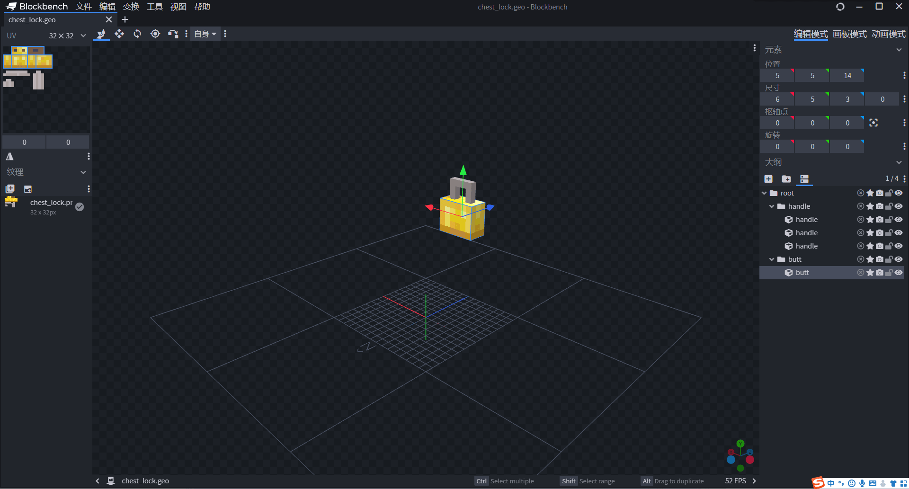
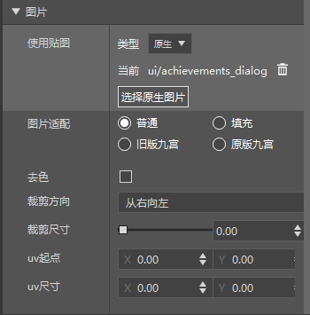
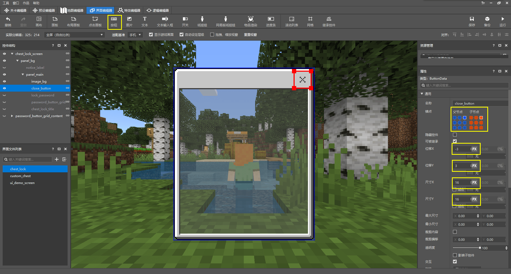
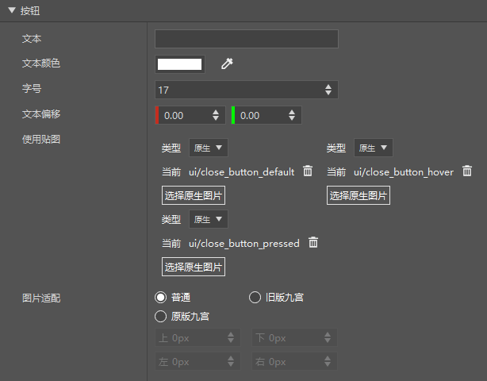

--- 
front: https://nie.res.netease.com/r/pic/20220408/77becd17-77ad-4cd6-a559-f75aca7e140d.png 
hard: Advanced 
time: 50 minutes 
selection: true 
--- 

# Challenge: Design a box lock 

In this section, we design a box lock together. Since our custom box is not yet complete, we will temporarily use the original box as an example. They are essentially the same. Now, let's start our challenge. You can click the link: [Box Lock Demo](https://g79.gdl.netease.com/addonguide-14.zip) to download the complete package. 

## Prepare resources 

 

We use the custom block entity in the custom block to complete the design of the box lock appearance. We design our chest lock model through Blockbench and export it as a JSON file: 

```json 
{ 
"format_version": "1.12.0", 
"minecraft:geometry": [ 
{ 
"description": { 
"identifier": "geometry.chest_lock", 
"texture_width": 32, 
"texture_height": 32, 
"visible_bounds_width": 4, 
"visible_bounds_height": 2.5, 
"visible_bounds_offset": [0, 0.75, 0] 
}, 
"bones": [ 
{ 
"name": "root", 
"pivot": [-9, 5, 15] 
}, 
{ 
"name": "handle", 
"parent": "root", 
"pivot": [-9, 5, 15],
					"cubes": [
						{"origin": [-10, 12, 15], "size": [4, 1, 1], "uv": [0, 9]},
						{"origin": [-7, 6, 15], "size": [1, 6, 1], "uv": [11, 9]},
						{"origin": [-10, 10, 15], "size": [1, 2, 1], "uv": [0, 12]}
					]
				},
				{
					"name": "butt",
					"parent": "root",
					"pivot": [-9, 5, 15],
					"cubes": [

{"origin": [-11, 5, 14], "size": [6, 5, 3], "uv": [0, 0]} 
] 
} 
] 
} 
] 
} 
``` 

At the same time, we make a client entity definition file for it: 

```json 
{ 
"format_version":"1.10.0", 
"minecraft:client_entity":{ 
"description":{ 
"identifier":"design:chest_lock", 
"materials":{ 
"default":"entity_alphatest" 
}, 
"textures":{ 
"default":"textures/entity/chest_lock" 
}, 
"geometry":{ 
"default":"geometry.chest_lock" 
}, 
"render_controllers":[ 
"controller.render.default" 
] 
} 
} 
} 
``` 

Next, we make custom blocks. Let's create the server-side block definition first: 

```json 
{ 
"format_version": "1.16", 
"minecraft:block": { 
"description": { 
"identifier": "design:chest_lock", 
"register_to_creative_menu": true, 
"category": "items" 
}, 
"components": { 
"minecraft:destroy_time": 2, 
"minecraft:explosion_resistance": 1000, 
"minecraft:block_light_absorption": 0, 
"netease:tier": {

                "digger": "pickaxe",
                "destroy_special": true,
                "level": 1
            },
            "netease:aabb": {
                "collision": {
                    "min": [0.3125, 0.3125, 0.875],
                    "max": [0.6875, 0.8125, 1.0]
                },
                "clip": {
                    "min": [0.3125, 0.3125, 0.875],
                    "max": [0.6875, 0.8125, 1.0]
                }
            },
            "netease:render_layer": {
                "value": "alpha"
            },
            "netease:solid": {
                "value": false
            },
            "netease:face_directional": { 
"type": "direction" 
}, 
"netease:block_entity": { 
"tick": false 
}, 
"netease:listen_block_remove": { 
"value": true 
} 
} 
} 
} 
``` 

We use `netease:block_entity` to set the block entity, and `netease:listen_block_remove` to enable its removal event to be listened by the module SDK. After that, we write the client block definition and attach our client entity: 

```json 
{ 
"format_version": [ 
1, 
1, 
0 
], 
"design:chest_lock": { 
"sound": "metal", 
"client_entity": { 
"identifier": "design:chest_lock", 
"block_icon": "design:chest_lock", 
"hand_model_use_client_entity": true 
}

} 
} 
``` 

Then we define our terrain atlas file: 

```json 
{ 
"resource_pack_name": "vanilla", 
"texture_name": "atlas.terrain", 
"texture_data": { 
"design:chest_lock": { 
"textures": "textures/blocks/chest_lock" 
} 
} 
} 
``` 

So far, our chest lock without UI and logic has been made. Now, we add UI to it. 

## Make UI 

Through the study of the first two sections, we have mastered the use of editors to make JSON UI. Now, let's take a brief look at how to make a UI for the chest lock. 

 

First, we create a stack panel under the screen. Since we want our final UI to be a row of prompts on the top and a lock panel on the bottom, we can use a stack panel to arrange them. We want the buttons in the lock panel to be a 9×9 grid, and a button occupies 40×40 pixels. We want to use `textures/ui/achievements_dialog.png` as the background image. According to the description of its corresponding nine-slice JSON file, our panel side margin is 6 pixels. So we calculate the width of the panel. Similarly, we calculate the height of the panel based on the assumption. 

 

We create the main panel of the lock with a width of "adaptive". The height can be set to the maximum child control size, that is, `100%cm`. In this way, we can keep its height as set for our background image control. 

 

 

We add a background to the main panel, with a width of "adapt" and a height that we calculated. 

 

 

We add a close button to the panel. Since we want to implement a function - for example, the screen can only be closed after the password is entered on the screen, the close button here is implemented by customization instead of inheriting the original button. We use the three close button textures of the original to achieve consistency with the close button of the original. 

 

 

We add an edit box control to display the password when we enter it. We enter the two bindings in the "text input box" part as we wish. Later, we will modify this through the script SDK. These two bindings need to bind the callback that needs to be executed when the edit box detects input and the calculation callback of the content that needs to be displayed in the part where the edit box displays text. 


 

 

We create a password button and set its width and height to our desired 40 pixels. 

 

 

We apply the button as a template to the grid control and set it to 3×3. At the same time, we set the collection name `password_grid` to the grid. The template control of this grid will be bound with this collection name. Here, we will display the text on the button (1, 2, 3, ..., 9) through the collection binding. 

 

At the end of the main panel, we add a title to it. 

 

Then, our main panel is complete. We add a notice label control above the main panel. 

 

Then we return to modify the height of the stack panel to make the entire panel return to the center state. In this way, our interface is initially drawn. Next, we need to manually modify the JSON UI file to match the logic we will create using the module API. This is also one of the parts we will focus on in this section. Let's first look at the JSON UI we just created through the editor: 

```json 
{ 
"button_label" : { 
"alpha" : "$control_alpha", 
"color" : "$label_color", 
"font_scale_factor" : "$label_font_scale_factor", 
"font_size" : "$label_font_size", 
"font_type" : "smooth", 
"layer" : "$label_layer", 
"max_size" : [ "100%", "100%" ], 
"offset" : "$label_offset", 
"shadow" : false, 
"text" : "$label_text", 
"text_alignment" : "center", 
"type" : "label" 
}, 
"chest_lock_screen" : { 
"absorbs_input" : true, 
      "always_accepts_input" : false,
      "controls" : [
         {
            "panel_bg@chest_lock.panel_bg" : {}
         }
      ],
      "force_render_below" : false,
      "is_showing_menu" : true,

      "render_game_behind" : true,
      "render_only_when_topmost" : true,
      "should_steal_mouse" : false,
      "type" : "screen"
   },
   "chest_lock_title" : {
      "alpha" : 1.0,
      "anchor_from" : "top_left",
      "anchor_to" : "top_left",
      "clip_offset" : [ 0, 0 ],
      "clips_children" : false,
      "color" : [ 0.0, 0.0, 0.0 ],
      "enabled" : true,
      "font_scale_factor" : 1.0,
      "font_size" : "normal",
      "font_type" : "smooth",
      "layer" : 14,      "line_padding" : 0.0,
      "max_size" : [ 0, 0 ],
      "min_size" : [ 0, 0 ],
      "offset" : [ 6, 6 ],
      "priority" : 0,
      "propagate_alpha" : false,
      "shadow" : false,
      "size" : [ "default", "default" ],
      "text" : "Golden Lock",
      "text_alignment" : "center",
      "type" : "label",
      "visible" : true
   },
   "close_button@common.button" : {
      "$control_alpha" : 1.0,
      "$default_texture" : "textures/ui/close_button_default",
      "$hover_texture" : "textures/ui/close_button_pressed",
      "$is_new_nine_slice" : false,
      "$label_color" : [ 1, 1, 1 ],
      "$label_font_scale_factor" : 1.0,
      "$label_font_size" : "large",
      "$label_layer" : 3,
      "$label_offset" : [ 0, 0 ],
      "$label_text" : "",
      "$nine_slice_buttom" : 0,
      "$nine_slice_left" : 0,
      "$nine_slice_right" : 0,
      "$nine_slice_top" : 0,
      "$nineslice_size" : [ 0, 0, 0, 0 ],      "$pressed_button_name" : "%chest_lock.click",
      "$pressed_texture" : "textures/ui/close_button_hover",
      "$texture_layer" : 2,
      "alpha" : 1.0,

      "anchor_from" : "top_right",
      "anchor_to" : "top_right",
      "bindings" : [
         {
            "binding_collection_name" : "",
            "binding_condition" : "always_when_visible",
            "binding_type" : "collection_details"
         }
      ],
      "button_mappings" : [],
      "clip_offset" : [ 0, 0 ],
      "clips_children" : false,
      "controls" : [
         {
            "default@chest_lock.default" : {}
         },
         {
            "hover@chest_lock.hover" : {}
         },
         {
            "pressed@chest_lock.pressed" : {}
         },
         {            "button_label@chest_lock.button_label" : {}
         }
      ],
      "draggable" : "not_draggable",
      "enabled" : true,
      "is_handle_button_move_event" : true,
      "layer" : 4,
      "max_size" : [ 0, 0 ],
      "min_size" : [ 0, 0 ],
      "offset" : [ -3, 3 ],
      "priority" : 0,
      "propagate_alpha" : false,
      "size" : [ 16, 16 ],
      "visible" : true
   },
   "default" : {
      "alpha" : "$control_alpha",
      "is_new_nine_slice" : "$is_new_nine_slice",
      "layer" : "$texture_layer",
      "nine_slice_buttom" : "$nine_slice_buttom",
      "nine_slice_left" : "$nine_slice_left",
      "nine_slice_right" : "$nine_slice_right",
      "nine_slice_top" : "$nine_slice_top",
      "nineslice_size" : "$nineslice_size",
      "texture" : "$default_texture",
      "type" : "image"
   },

   "edit_box_background_default" : {
      "is_new_nine_slice" : "$is_new_nine_slice",
      "nine_slice_buttom" : "$nine_slice_buttom",
      "nine_slice_left" : "$nine_slice_left",
      "nine_slice_right" : "$nine_slice_right",
      "nine_slice_top" : "$nine_slice_top",
      "nineslice_size" : "$nineslice_size",
      "texture" : "$edit_box_default_texture",
      "type" : "image"
   },
   "edit_box_background_hover" : {
      "is_new_nine_slice" : "$is_new_nine_slice",      "nine_slice_buttom" : "$nine_slice_buttom",
      "nine_slice_left" : "$nine_slice_left",
      "nine_slice_right" : "$nine_slice_right",
      "nine_slice_top" : "$nine_slice_top",
      "nineslice_size" : "$nineslice_size",
      "texture" : "$edit_box_hover_texture",
      "type" : "image"
   },
   "grid_button@common.button" : {
      "$control_alpha" : 1.0,
      "$default_texture" : "textures/ui/button_borderless_light",
      "$hover_texture" : "textures/ui/button_borderless_darkpressed",
      "$is_new_nine_slice" : false,
      "$label_color" : [ 1, 1, 1 ],
      "$label_font_scale_factor" : 0.9399999976158142,
      "$label_font_size" : "large",
      "$label_layer" : 3,
      "$label_offset" : [ 0, 0 ],
      "$label_text" : "",
      "$nine_slice_buttom" : 0,
      "$nine_slice_left" : 0,
      "$nine_slice_right" : 0,
      "$nine_slice_top" : 0,
      "$nineslice_size" : [ 0, 0, 0, 0 ],
      "$pressed_button_name" : "%chest_lock.click",
      "$pressed_texture" : "textures/ui/button_borderless_lighthover",
      "$texture_layer" : 2,
      "alpha" : 1.0,
      "anchor_from" : "center",
      "anchor_to" : "center",
      "bindings" : [
         {
            "binding_collection_name" : "",
            "binding_condition" : "always_when_visible",
            "binding_type" : "collection_details"
         }
      ],
      "button_mappings" : [],

      "clip_offset" : [ 0, 0 ],
      "clips_children" : false,
      "controls" : [
         {
            "default@chest_lock.default" : {}
         },
         {
            "hover@chest_lock.hover" : {}
         },
         {
            "pressed@chest_lock.pressed" : {}
         },
         {
            "button_label@chest_lock.button_label" : {}
         }
      ],
      "draggable" : "not_draggable",
      "enabled" : true,
      "is_handle_button_move_event" : true,
      "max_size" : [ 0, 0 ],
      "min_size" : [ 0, 0 ],
      "offset" : [ 0, 0 ],
      "priority" : 0,
      "propagate_alpha" : false,
      "size" : [ 40, 40 ],
      "visible" : true
   },
   "hover" : {
      "alpha" : "$control_alpha",
      "is_new_nine_slice" : "$is_new_nine_slice",
      "layer" : "$texture_layer",
      "nine_slice_buttom" : "$nine_slice_buttom",
      "nine_slice_left" : "$nine_slice_left",
      "nine_slice_right" : "$nine_slice_right",
      "nine_slice_top" : "$nine_slice_top",
      "nineslice_size" : "$nineslice_size",
      "texture" : "$hover_texture",
      "type" : "image"
   },
   "image_bg" : {
      "alpha" : 1.0,
      "anchor_from" : "center",
      "anchor_to" : "center",
      "clip_direction" : "left",
      "clip_offset" : [ 0, 0 ],
      "clip_ratio" : 0.0,
      "clips_children" : false,
      "enabled" : true,
      "fill" : false,
      "grayscale" : false,

      "is_new_nine_slice" : false,
      "keep_ratio" : true,
      "layer" : 3,
      "max_size" : [ 0, 0 ],
      "min_size" : [ 0, 0 ],
      "nine_slice_buttom" : 0,
      "nine_slice_left" : 0,
      "nine_slice_right" : 0,
      "nine_slice_top" : 0,
      "nineslice_size" : [ 0, 0, 0, 0 ],
      "offset" : [ 0, 0 ],
      "priority" : 0,
      "propagate_alpha" : false,
      "size" : [ "default", 162 ],
      "texture" : "textures/ui/achievements_dialog",
      "type" : "image",
      "uv" : [ 0, 0 ],
      "uv_size" : [ 0, 0 ],
      "visible" : true
   },
   "lock_password@common.text_edit_box" : {
      "$edit_box_default_texture" : "textures/ui/edit_box_indent",
      "$edit_box_hover_texture" : "textures/ui/edit_box_indent_hover",
      "$font_scale_factor" : 1.0,
      "$is_new_nine_slice" : false,
      "$nine_slice_buttom" : 0,
      "$nine_slice_left" : 0,
      "$nine_slice_right" : 0,
      "$nine_slice_top" : 0,
      "$nineslice_size" : [ 0, 0, 0, 0 ],
      "$place_holder_text" : "Please enter content",
      "$place_holder_text_color" : [ 0.50, 0.50, 0.50 ],
      "$text_background_default" : "chest_lock.edit_box_background_default",
      "$text_background_hover" : "chest_lock.edit_box_background_hover",
      "$text_box_name" : "%chest_lock.edit_password_str",
      "$text_box_text_color" : [ 1, 1, 1 ],
      "$text_edit_box_content_binding_name" : "#chest_lock.message_content_text_edit_box0",
      "alpha" : 1.0,
      "anchor_from" : "top_middle",
      "anchor_to" : "top_middle",
      "clip_offset" : [ 0, 0 ],
      "clips_children" : false,
      "draggable" : "not_draggable",
      "enabled" : false,
      "enabled_newline" : false,
      "layer" : 8,
      "max_length" : 512,
      "max_size" : [ 0, 0 ],
      "min_size" : [ 0, 0 ],
      "offset" : [ 0, 20 ],

      "priority" : 0,
      "propagate_alpha" : true,
      "size" : [ "100.0%+-12.0px", 16 ],
      "visible" : true
   },
   "namespace" : "chest_lock",
   "notice_label" : {
      "alpha" : 1.0,
      "anchor_from" : "center",
      "anchor_to" : "center",
      "clip_offset" : [ 0, 0 ],
      "clips_children" : false,
      "color" : [ 1, 1, 1 ],
      "enabled" : true,
      "font_scale_factor" : 0.9399999976158142,
      "font_size" : "large",
      "font_type" : "smooth", 
"layer" : 1, 
"line_padding" : 0.0, 
"max_size" : [ 0, 0 ], 
"min_size" : [ 0, 0 ], 
"offset" : [ 0, 0 ], 
"priority" : 0, 
"propagate_alpha" : false, 
"shadow" : true, 
"size" : [ "100.0%+0.0px", 36 ], 
"text" : "You must set a password before you can close the interface!", 
"text_alignment" : "center", 
"type" : "label", 
"visible" : true 
}, 
"panel_bg" : { 
"alpha" : 1.0, 
"anchor_from" : "center", 
"anchor_to" : "center",
      "clip_offset" : [ 0, 0 ],
      "clips_children" : false,
      "controls" : [
         {
            "notice_label@chest_lock.notice_label" : {}
         },
         {
            "panel_main@chest_lock.panel_main" : {}
         }
      ],
      "enabled" : true,
      "layer" : 0,
      "max_size" : [ 0, 0 ],
      "min_size" : [ 0, 0 ],
      "offset" : [ 0, 0 ],

      "orientation" : "vertical",
      "priority" : 0,
      "propagate_alpha" : false,
      "size" : [ 132, 198 ],
      "type" : "stack_panel",
      "use_priority" : false,
      "visible" : true
   },
   "panel_main" : {
      "alpha" : 1.0,
      "anchor_from" : "center",
      "anchor_to" : "center",
      "clip_offset" : [ 0, 0 ],
      "clips_children" : false,
      "controls" : [
         {
            "image_bg@chest_lock.image_bg" : {}
         },
         {
            "close_button@chest_lock.close_button" : {}         },
         {
            "lock_password@chest_lock.lock_password" : {}
         },
         {
            "password_button_grid@chest_lock.password_button_grid" : {}
         },
         {
            "chest_lock_title@chest_lock.chest_lock_title" : {}
         }
      ],
      "enabled" : true,
      "layer" : 2,
      "max_size" : [ 0, 0 ],
      "min_size" : [ 0, 0 ],
      "offset" : [ 0, 0 ],
      "priority" : 0,
      "propagate_alpha" : false,
      "size" : [ "default", "100.0%cm+0.0px" ],
      "type" : "panel",
      "visible" : true
   },
   "password_button_grid" : {
      "alpha" : 1.0,
      "anchor_from" : "top_middle",
      "anchor_to" : "top_middle",
      "clip_offset" : [ 0, 0 ],
      "clips_children" : false,
      "collection_name" : "test_grid",
      "enabled" : true,

      "grid_dimensions" : [ 3.0, 3.0 ],
      "grid_item_template" : "chest_lock.grid_button",
      "grid_rescaling_type" : "none",
      "layer" : 10,
      "max_size" : [ 0, 0 ],
      "maximum_grid_items" : 0,
      "min_size" : [ 0, 0 ],
      "offset" : [ 0, 36 ],
      "priority" : 0,
      "propagate_alpha" : true,
      "size" : [ "100.0%+-12.0px", 120 ],
      "type" : "grid",
      "visible" : true
   },
   "password_button_grid_content" : {
      "absorbs_input" : true,
      "always_accepts_input" : false,
      "controls" : [
         {
            "root@chest_lock.root" : {}
         }
      ],
      "force_render_below" : false,
      "is_showing_menu" : true,
      "render_game_behind" : true,
      "render_only_when_topmost" : true,
      "should_steal_mouse" : false,
      "type" : "screen"
   },
   "pressed" : {
      "alpha" : "$control_alpha",
      "is_new_nine_slice" : "$is_new_nine_slice",
      "layer" : "$texture_layer",
      "nine_slice_buttom" : "$nine_slice_buttom",
      "nine_slice_left" : "$nine_slice_left",
      "nine_slice_right" : "$nine_slice_right",
      "nine_slice_top" : "$nine_slice_top",
      "nineslice_size" : "$nineslice_size",
      "texture" : "$pressed_texture",
      "type" : "image"
   },
   "root" : {
      "alpha" : 1.0,
      "anchor_from" : "center",
      "anchor_to" : "center",
      "clip_offset" : [ 0, 0 ],
      "clips_children" : false,
      "controls" : [
         { "grid_button@chest_lock.grid_button" : {}

} 
], 
"enabled" : true, 
"layer" : 0, 
"max_size" : [ 0, 0 ], 
"min_size" : [ 0, 0 ], 
"offset" : [ 0, 0 ], 
"priority" : 0, 
"propagate_alpha" : false, 
"size" : [ "100.0%cm+100.0px", "100.0%cm+100.0px" ], 
"type" : "panel", 
"visible" : true 
} 
} 
``` 

Currently the controls are sorted in alphabetical order. Let's put it in a readable order first: 

```json 
{ 
"namespace" : "chest_lock", 
"chest_lock_screen" : { 
"absorbs_input" : true, 
"always_accepts_input" : false, 
"controls" : [ 
{ 
"panel_bg@chest_lock.panel_bg" : {} 
} 
], 
"force_render_below" : false, 
"is_showing_menu" : true, 
"render_game_behind" : true, 
"render_only_when_topmost" : true, 
"should_steal_mouse" : false, 
"type" : "screen" 
}, 
"panel_bg" : { 
"alpha" : 1.0, 
      "anchor_from" : "center",
      "anchor_to" : "center",
      "clip_offset" : [ 0, 0 ],
      "clips_children" : false,
      "controls" : [
         {
            "notice_label@chest_lock.notice_label" : {}
         },
         {
            "panel_main@chest_lock.panel_main" : {}
         }
      ],

      "enabled" : true,
      "layer" : 0,
      "max_size" : [ 0, 0 ],
      "min_size" : [ 0, 0 ],
      "offset" : [ 0, 0 ],
      "orientation" : "vertical",
      "priority" : 0,
      "propagate_alpha" : false,
      "size" : [ 132, 198 ],
      "type" : "stack_panel",
      "use_priority" : false,
      "visible" : true
   },
   "notice_label" : {
      "alpha" : 1.0,
      "anchor_from" : "center",
      "anchor_to" : "center",
      "clip_offset" : [ 0, 0 ],      "clips_children" : false,
      "color" : [ 1, 1, 1 ],
      "enabled" : true,
      "font_scale_factor" : 0.9399999976158142,
      "font_size" : "large",
      "font_type" : "smooth",
      "layer" : 1,
      "line_padding" : 0.0,
      "max_size" : [ 0, 0 ],
      "min_size" : [ 0, 0 ],
      "offset" : [ 0, 0 ],
      "priority" : 0,
      "propagate_alpha" : false,
      "shadow" : true,
      "size" : [ "100.0%+0.0px", 36 ],
      "text" : "You must set a password before you can close the interface!", 
"text_alignment" : "center", 
"type" : "label", 
"visible" : true 
}, 
"panel_main" : { 
"alpha" : 1.0, 
"anchor_from" : "center", 
"anchor_to" : "center", 
"clip_offset" : [ 0, 0 ], 
"clips_children" : false, 
"controls" : [ 
{ 
"image_bg@chest_lock.image_bg" : {} 
}, 
{ 
"close_button@chest_lock.close_button" : {}

         },
         {
            "lock_password@chest_lock.lock_password" : {}
         },
         {
            "password_button_grid@chest_lock.password_button_grid" : {}
         },
         {
            "chest_lock_title@chest_lock.chest_lock_title" : {}
         }
      ],
      "enabled" : true,
      "layer" : 2,
      "max_size" : [ 0, 0 ],
      "min_size" : [ 0, 0 ],
      "offset" : [ 0, 0 ],
      "priority" : 0,
      "propagate_alpha" : false,
      "size" : [ "default", "100.0%cm+0.0px" ],
      "type" : "panel",
      "visible" : true
   },
   "image_bg" : {
      "alpha" : 1.0,
      "anchor_from" : "center",
      "anchor_to" : "center",
      "clip_direction" : "left",
      "clip_offset" : [ 0, 0 ],
      "clip_ratio" : 0.0,
      "clips_children" : false,
      "enabled" : true,
      "fill" : false,
      "grayscale" : false,
      "is_new_nine_slice" : false,
      "keep_ratio" : true,
      "layer" : 3,
      "max_size" : [ 0, 0 ],
      "min_size" : [ 0, 0 ],      "nine_slice_buttom" : 0,
      "nine_slice_left" : 0,
      "nine_slice_right" : 0,
      "nine_slice_top" : 0,
      "nineslice_size" : [ 0, 0, 0, 0 ],
      "offset" : [ 0, 0 ],
      "priority" : 0,
      "propagate_alpha" : false,
      "size" : [ "default", 162 ],
      "texture" : "textures/ui/achievements_dialog",
      "type" : "image",
      "uv" : [ 0, 0 ],

      "uv_size" : [ 0, 0 ],
      "visible" : true
   },
   "default" : {
      "alpha" : "$control_alpha",
      "is_new_nine_slice" : "$is_new_nine_slice",
      "layer" : "$texture_layer",
      "nine_slice_buttom" : "$nine_slice_buttom",
      "nine_slice_left" : "$nine_slice_left",
      "nine_slice_right" : "$nine_slice_right",
      "nine_slice_top" : "$nine_slice_top",
      "nineslice_size" : "$nineslice_size",
      "texture" : "$default_texture",
      "type" : "image"   },
   "hover" : {
      "alpha" : "$control_alpha",
      "is_new_nine_slice" : "$is_new_nine_slice",
      "layer" : "$texture_layer",
      "nine_slice_buttom" : "$nine_slice_buttom",
      "nine_slice_left" : "$nine_slice_left",
      "nine_slice_right" : "$nine_slice_right",
      "nine_slice_top" : "$nine_slice_top",
      "nineslice_size" : "$nineslice_size",
      "texture" : "$hover_texture",
      "type" : "image"
   },
   "pressed" : {
      "alpha" : "$control_alpha",      "is_new_nine_slice" : "$is_new_nine_slice",
      "layer" : "$texture_layer",
      "nine_slice_buttom" : "$nine_slice_buttom",
      "nine_slice_left" : "$nine_slice_left",
      "nine_slice_right" : "$nine_slice_right",
      "nine_slice_top" : "$nine_slice_top",
      "nineslice_size" : "$nineslice_size",
      "texture" : "$pressed_texture",
      "type" : "image"
   },
   "button_label" : {
      "alpha" : "$control_alpha",
      "color" : "$label_color",
      "font_scale_factor" : "$label_font_scale_factor",
      "font_size" : "$label_font_size",
      "font_type" : "smooth",
      "layer" : "$label_layer",
      "max_size" : [ "100%", "100%" ],
      "offset" : "$label_offset",
      "shadow" : false,
      "text" : "$label_text",

      "text_alignment" : "center",
      "type" : "label"
   },
   "close_button@common.button" : {
      "$control_alpha" : 1.0,
      "$default_texture" : "textures/ui/close_button_default",
      "$hover_texture" : "textures/ui/close_button_pressed",
      "$is_new_nine_slice" : false,
      "$label_color" : [ 1, 1, 1 ],
      "$label_font_scale_factor" : 1.0,
      "$label_font_size" : "large",
      "$label_layer" : 3,
      "$label_offset" : [ 0, 0 ],
      "$label_text" : "",
      "$nine_slice_buttom" : 0,
      "$nine_slice_left" : 0,
      "$nine_slice_right" : 0,
      "$nine_slice_top" : 0,
      "$nineslice_size" : [ 0, 0, 0, 0 ],
      "$pressed_button_name" : "%chest_lock.click",
      "$pressed_texture" : "textures/ui/close_button_hover",
      "$texture_layer" : 2,
      "alpha" : 1.0,
      "anchor_from" : "top_right",
      "anchor_to" : "top_right",
      "bindings" : [
         {
            "binding_collection_name" : "",
            "binding_condition" : "always_when_visible",
            "binding_type" : "collection_details"
         }
      ],
      "button_mappings" : [],
      "clip_offset" : [ 0, 0 ],
      "clips_children" : false,
      "controls" : [
         {
            "default@chest_lock.default" : {}
         },
         {
            "hover@chest_lock.hover" : {}
         },
         {
            "pressed@chest_lock.pressed" : {}
         },
         {
            "button_label@chest_lock.button_label" : {}
         }
      ],
      "draggable" : "not_draggable",

      "enabled" : true,
      "is_handle_button_move_event" : true,
      "layer" : 4,
      "max_size" : [ 0, 0 ],
      "min_size" : [ 0, 0 ],
      "offset" : [ -3, 3 ],
      "priority" : 0,
      "propagate_alpha" : false,
      "size" : [ 16, 16 ],
      "visible" : true
   },
   "edit_box_background_default" : {
      "is_new_nine_slice" : "$is_new_nine_slice",
      "nine_slice_buttom" : "$nine_slice_buttom",
      "nine_slice_left" : "$nine_slice_left",      "nine_slice_right" : "$nine_slice_right",
      "nine_slice_top" : "$nine_slice_top",
      "nineslice_size" : "$nineslice_size",
      "texture" : "$edit_box_default_texture",
      "type" : "image"
   },
   "edit_box_background_hover" : {
      "is_new_nine_slice" : "$is_new_nine_slice",
      "nine_slice_buttom" : "$nine_slice_buttom",
      "nine_slice_left" : "$nine_slice_left",
      "nine_slice_right" : "$nine_slice_right",
      "nine_slice_top" : "$nine_slice_top",
      "nineslice_size" : "$nineslice_size",
      "texture" : "$edit_box_hover_texture",
      "type" : "image"
   },
   "lock_password@common.text_edit_box" : {
      "$edit_box_default_texture" : "textures/ui/edit_box_indent",
      "$edit_box_hover_texture" : "textures/ui/edit_box_indent_hover",
      "$font_scale_factor" : 1.0,
      "$is_new_nine_slice" : false,
      "$nine_slice_buttom" : 0,
      "$nine_slice_left" : 0,
      "$nine_slice_right" : 0,      "$nine_slice_top" : 0,
      "$nineslice_size" : [ 0, 0, 0, 0 ],
      "$place_holder_text" : "Please enter content",
      "$place_holder_text_color" : [ 0.50, 0.50, 0.50 ],
      "$text_background_default" : "chest_lock.edit_box_background_default",
      "$text_background_hover" : "chest_lock.edit_box_background_hover",
      "$text_box_name" : "%chest_lock.edit_password_str",
      "$text_box_text_color" : [ 1, 1, 1 ],
      "$text_edit_box_content_binding_name" : "#chest_lock.message_content_text_edit_box0",
      "alpha" : 1.0,
      "anchor_from" : "top_middle",

      "anchor_to" : "top_middle",
      "clip_offset" : [ 0, 0 ],
      "clips_children" : false,
      "draggable" : "not_draggable",
      "enabled" : false,
      "enabled_newline" : false,
      "layer" : 8,
      "max_length" : 512,
      "max_size" : [ 0, 0 ],
      "min_size" : [ 0, 0 ],
      "offset" : [ 0, 20 ],
      "priority" : 0,
      "propagate_alpha" : true,
      "size" : [ "100.0%+-12.0px", 16 ],
      "visible" : true
   },
   "password_button_grid" : {
      "alpha" : 1.0,
      "anchor_from" : "top_middle",
      "anchor_to" : "top_middle",
      "clip_offset" : [ 0, 0 ],
      "clips_children" : false,
      "collection_name" : "test_grid",
      "enabled" : true,
      "grid_dimensions" : [ 3.0, 3.0 ],
      "grid_item_template" : "chest_lock.grid_button",
      "grid_rescaling_type" : "none",
      "layer" : 10,
      "max_size" : [ 0, 0 ],
      "maximum_grid_items" : 0,
      "min_size" : [ 0, 0 ],
      "offset" : [ 0, 36 ],
      "priority" : 0,
      "propagate_alpha" : true,
      "size" : [ "100.0%+-12.0px", 120 ],
      "type" : "grid",
      "visible" : true
   },
   "chest_lock_title" : {
      "alpha" : 1.0,
      "anchor_from" : "top_left",
      "anchor_to" : "top_left",
      "clip_offset" : [ 0, 0 ],
      "clips_children" : false,
      "color" : [ 0.0, 0.0, 0.0 ],
      "enabled" : true,
      "font_scale_factor" : 1.0,
      "font_size" : "normal",
      "font_type" : "smooth",
      "layer" : 14,

      "line_padding" : 0.0,
      "max_size" : [ 0, 0 ],
      "min_size" : [ 0, 0 ],
      "offset" : [ 6, 6 ],
      "priority" : 0,
      "propagate_alpha" : false,
      "shadow" : false,
      "size" : [ "default", "default" ],
      "text" : "Golden Lock",
      "text_alignment" : "center",
      "type" : "label",
      "visible" : true
   },
   
   "password_button_grid_content" : {
      "absorbs_input" : true,
      "always_accepts_input" : false,
      "controls" : [
         {
            "root@chest_lock.root" : {}
         }
      ],
      "force_render_below" : false,
      "is_showing_menu" : true,
      "render_game_behind" : true,
      "render_only_when_topmost" : true,
      "should_steal_mouse" : false,
      "type" : "screen"
   },
   "root" : {
      "alpha" : 1.0,
      "anchor_from" : "center",
      "anchor_to" : "center",
      "clip_offset" : [ 0, 0 ],
      "clips_children" : false,
      "controls" : [
         {
            "grid_button@chest_lock.grid_button" : {}
         }
      ],
      "enabled" : true,
      "layer" : 0,
      "max_size" : [ 0, 0 ],
      "min_size" : [ 0, 0 ],
      "offset" : [ 0, 0 ],
      "priority" : 0,
      "propagate_alpha" : false,
      "size" : [ "100.0%cm+100.0px", "100.0%cm+100.0px" ],
      "type" : "panel",
      "visible" : true

   },
   "grid_button@common.button" : {
      "$control_alpha" : 1.0,
      "$default_texture" : "textures/ui/button_borderless_light",
      "$hover_texture" : "textures/ui/button_borderless_darkpressed",
      "$is_new_nine_slice" : false,
      "$label_color" : [ 1, 1, 1 ],
      "$label_font_scale_factor" : 0.9399999976158142,
      "$label_font_size" : "large",
      "$label_layer" : 3,
      "$label_offset" : [ 0, 0 ],
      "$label_text" : "",
      "$nine_slice_buttom" : 0,
      "$nine_slice_left" : 0,
      "$nine_slice_right" : 0,
      "$nine_slice_top" : 0,
      "$nineslice_size" : [ 0, 0, 0, 0 ],
      "$pressed_button_name" : "%chest_lock.click",
      "$pressed_texture" : "textures/ui/button_borderless_lighthover",
      "$texture_layer" : 2,
      "alpha" : 1.0,
      "anchor_from" : "center",
      "anchor_to" : "center",
      "bindings" : [
         {
            "binding_collection_name" : "",
            "binding_condition" : "always_when_visible",
            "binding_type" : "collection_details"
         }
      ],
      "button_mappings" : [],
      "clip_offset" : [ 0, 0 ],
      "clips_children" : false,
      "controls" : [
         {
            "default@chest_lock.default" : {}
         },
         {
            "hover@chest_lock.hover" : {}
         },
         {
            "pressed@chest_lock.pressed" : {}
         },
         {
            "button_label@chest_lock.button_label" : {}
         }
      ],
      "draggable" : "not_draggable",
      "enabled" : true,
      "is_handle_button_move_event" : true,

"max_size" : [ 0, 0 ], 
"min_size" : [ 0, 0 ], 
"offset" : [ 0, 0 ], 
"priority" : 0, 
"propagate_alpha" : false, 
"size" : [ 40, 40 ], 
"visible" : true 
} 
} 
``` 

We modify our controls one by one. 

```json 
"chest_lock_screen@common.base_screen" : { 
"$screen_content": "chest_lock.panel_bg" 
} 
``` 

First, we can modify our screen control to inherit from the original `common.base_screen`. We mentioned in the first section that this modification will help our screen adapt to different types of special-shaped screens. Then, we start adding bindings to the controls. 

```json
"close_button@common.button" : {
   "$control_alpha" : 1.0,
   "$default_texture" : "textures/ui/close_button_default",
   "$hover_texture" : "textures/ui/close_button_pressed",
   "$is_new_nine_slice" : false,
   "$label_color" : [ 1, 1, 1 ],
   "$label_font_scale_factor" : 1.0,
   "$label_font_size" : "large",
   "$label_layer" : 3,
   "$label_offset" : [ 0, 0 ],
   "$label_text" : "",
   "$nine_slice_buttom" : 0,
   "$nine_slice_left" : 0, 
"$nine_slice_right" : 0, 
"$nine_slice_top" : 0, 
"$nineslice_size" : [ 0, 0, 0, 0 ], 
"$pressed_button_name" : "#on_close", // Add a #on_close binding for our close button. Of course, we can also use bindings starting with "%" 
"$pressed_texture" : "textures/ui/close_button_hover", 
"$texture_layer" : 2, 
"alpha" : 1.0, 
"anchor_from" : "top_right", 
"anchor_to" : "top_right", 
// Delete bindings and button_mappings that are not used here 
"button_mappings" : [], 
"clip_offset" : [ 0, 0 ], 
"clips_children" : false, 
"controls" : [ 
{

         "default@chest_lock.default" : {}
      },
      {
         "hover@chest_lock.hover" : {}
      },
      {
         "pressed@chest_lock.pressed" : {}
      },
      {
         "button_label@chest_lock.button_label" : {}
      }
   ],
   "draggable" : "not_draggable",
   "enabled" : true,
   "is_handle_button_move_event" : true,
   "layer" : 4,
   "max_size" : [ 0, 0 ],
   "min_size" : [ 0, 0 ],
   "offset" : [ -3, 3 ],
   "priority" : 0,
   "propagate_alpha" : false,
   "size" : [ 16, 16 ], 
"visible" : true 
} 
``` 

We added a binding for the close button, and we also want to add a few button mappings, but not to the buttons. 

```json 
"chest_lock_screen@common.base_screen" : { 
"$screen_content": "chest_lock.panel_bg", 
"button_mappings": [ 
{ 
"from_button_id": "button.menu_inventory_cancel", 
"to_button_id": "#on_close", 
"mapping_type": "global" 
}, 
{ 
"from_button_id": "button.menu_cancel", 
"to_button_id": "#on_close", 
"mapping_type": "global" 
} 
] 
} 
``` 

We hope to put the mapping in the screen control through global mapping. The writing here means that we will be able to exit this screen through the return key such as Esc. 

```json 
"lock_password@common.text_edit_box" : {

"$edit_box_default_texture" : "textures/ui/edit_box_indent", 
"$edit_box_hover_texture" : "textures/ui/edit_box_indent_hover", 
"$font_scale_factor" : 1.0, 
"$is_new_nine_slice" : false, 
"$nine_slice_buttom" : 0, 
"$nine_slice_left" : 0, 
"$nine_slice_right" : 0, 
"$nine_slice_top" : 0, 
"$nineslice_size" : [ 0, 0, 0, 0 ], 
"$place_holder_text" : "Click the button below to enter the password", // Slightly change the input box prompt text 
"$place_holder_text_color" : [ 0.50, 0.50, 0.50 ], 
"$text_background_default" : "chest_lock.edit_box_background_default", 
"$text_background_hover" : "chest_lock.edit_box_background_hover", 
"$text_box_name" : "%ChestLock.edit_password_str", // Specifies the binding name of the text box in the edit box 
"$text_box_text_color" : [ 1, 1, 1 ], 
"$text_edit_box_binding_condition": "always_when_visible", // Specifies the condition for the text edit box content binding to occur, which is always bound when visible 
"$text_edit_box_content_binding_name" : "#chest_lock.message_content_text_edit_box0", // Specifies the binding name of the text edit box content 
"alpha" : 1.0, 
   "anchor_from" : "top_middle",
   "anchor_to" : "top_middle",
   "clip_offset" : [ 0, 0 ],
   "clips_children" : false,
   "draggable" : "not_draggable",
   "enabled" : false,
   "enabled_newline" : false,
   "layer" : 8,
   "max_length" : 512,
   "max_size" : [ 0, 0 ],
   "min_size" : [ 0, 0 ],
   "offset" : [ 0, 20 ],
   "priority" : 0,
   "propagate_alpha" : true,
   "size" : [ "100.0%+-12.0px", 16 ],
   "visible" : true 
} 
``` 

We add two binding names to the edit box, which are used to execute input logic and display input content respectively. 

```json 
"password_button_grid" : { 
"alpha" : 1.0, 
"anchor_from" : "top_middle", 
"anchor_to" : "top_middle", 
"clip_offset" : [ 0, 0 ], 
"clips_children" : false, 
"$password_collection": "password_grid", // Change password_grid to use variable storage 
"collection_name" : "$password_collection", // Then apply the variable to its own collection_name and the collection binding of all template controls 
"enabled" : true, 
"grid_dimensions" : [ 3.0, 3.0 ],

"grid_item_template" : "chest_lock.grid_button", 
"grid_rescaling_type" : "none", 
"layer" : 10, 
"max_size" : [ 0, 0 ], 
"maximum_grid_items" : 0, 
"min_size" : [ 0, 0 ], 
"offset" : [ 0, 36 ], 
"priority" : 0, 
"propagate_alpha" : true, 
"size" : [ "100.0%+-12.0px", 120 ], 
"type" : "grid", 
"visible" : true 
} 
``` 

We slightly modify the collection name property of the input keyboard grid to make it easier to bind to the template control. 

```json
"grid_button@common.button" : {
   "$control_alpha" : 1.0,
   "$default_texture" : "textures/ui/button_borderless_light",
   "$hover_texture" : "textures/ui/button_borderless_darkpressed",
   "$is_new_nine_slice" : false,
   "$label_color" : [ 1, 1, 1 ],
   "$label_font_scale_factor" : 1.0,
   "$label_font_size" : "large",
   "$label_layer" : 3,
   "$label_offset" : [ 0, 0 ],
   "$label_text" : "",
   "$nine_slice_buttom" : 0,
   "$nine_slice_left" : 0, 
"$nine_slice_right" : 0, 
"$nine_slice_top" : 0, 
"$nineslice_size" : [ 0, 0, 0, 0 ], 
"$pressed_button_name" : "#click", // Add a #click binding for our close button. Of course, we can also use bindings starting with "%" 
"$pressed_texture" : "textures/ui/button_borderless_lighthover", 
"$texture_layer" : 2, 
"alpha" : 1.0, 
"anchor_from" : "center", 
"anchor_to" : "center", 
"bindings" : [ 
{ 
"binding_collection_name" : "$password_collection", // Specify the variable where the collection name is located 
"binding_condition" : "always_when_visible", 
"binding_type" : "collection_details" 
} 
], 
// Delete button_mappings that are not used here 
"clip_offset" : [ 0, 0 ], 
"clips_children" : false,

"controls" : [ 
{ 
"default@chest_lock.default" : {} 
}, 
{ 
"hover@chest_lock.hover" : {} 
}, 
{ 
"pressed@chest_lock.pressed" : {} 
}, 
{ 
"button_label@chest_lock.button_label" : { 
"text": "#text", 
"bindings": [ 
{ 
"binding_condition": "visible", 
"binding_collection_name": "$password_collection", 
"binding_type": "collection", 
"binding_name_override": "#text", 
"binding_name": "#password_number" 
} 
] // Here, the button_label control is modified for the second time after inheritance, and a collection binding is added to assign different button texts to the label later 
} 
} 
], 
"draggable" : "not_draggable", 
"enabled" : true, 
"is_handle_button_move_event" : true, 
"max_size" : [ 0, 0 ], 
"min_size" : [ 0, 0 ], 
"offset" : [ 0, 0 ], 
"priority" : 0, 
"propagate_alpha" : false, 
"size" : [ 40, 40 ], 
"visible" : true 
} 
``` 

We added a collection binding to the button that can be used to respond to pressing the button, and also added a collection binding to the button's text to display the text on the button. At this point, we have completed the secondary modification of the JSON UI file. The complete JSON file after modification is as follows: 

```json 
{ 
"namespace" : "chest_lock", 
"chest_lock_screen@common.base_screen" : { 
"$screen_content": "chest_lock.panel_bg", 
"button_mappings": [ 
{ 
"from_button_id": "button.menu_inventory_cancel", 
"to_button_id": "#on_close", 
"mapping_type": "global"

         },
         {
            "from_button_id": "button.menu_cancel",
            "to_button_id": "#on_close",
            "mapping_type": "global"
         }
      ]
   },
   "panel_bg" : {
      "alpha" : 1.0,
      "anchor_from" : "center",
      "anchor_to" : "center",
      "clip_offset" : [ 0, 0 ],
      "clips_children" : false,
      "controls" : [
         {
            "notice_label@chest_lock.notice_label" : {}
         },
         {
            "panel_main@chest_lock.panel_main" : {}
         }
      ],
      "enabled" : true,
      "layer" : 0,      "max_size" : [ 0, 0 ],
      "min_size" : [ 0, 0 ],
      "offset" : [ 0, 0 ],
      "orientation" : "vertical",
      "priority" : 0,
      "propagate_alpha" : false,
      "size" : [ 132, 198 ],
      "type" : "stack_panel",
      "use_priority" : false,
      "visible" : true
   },
   "notice_label" : {
      "alpha" : 1.0,
      "anchor_from" : "center",
      "anchor_to" : "center",
      "clip_offset" : [ 0, 0 ],
      "clips_children" : false,
      "color" : [ 1, 1, 1 ],
      "enabled" : true,
      "font_scale_factor" : 1.0,
      "font_size" : "large",
      "font_type" : "smooth",
      "layer" : 1,
      "line_padding" : 0.0,
      "max_size" : [ 0, 0 ],
      "min_size" : [ 0, 0 ],

"offset" : [ 0, 0 ], 
"priority" : 0, 
"propagate_alpha" : false, 
"shadow" : true, 
"size" : [ "100.0%+0.0px", 36 ], 
"text" : "You must set a password before closing the interface!", 
"text_alignment" : "center", 
"type" : "label", 
"visible" : true 
}, 
"panel_main" : { 
"alpha" : 1.0, 
"anchor_from" : "center", 
"anchor_to" : "center", 
"clip_offset" : [ 0, 0 ], 
"clips_children" : false, 
"controls" : [ 
{ 
"image_bg@chest_lock.image_bg" : {}
         },
         {
            "close_button@chest_lock.close_button" : {}
         },
         {
            "lock_password@chest_lock.lock_password" : {}
         },
         {
            "password_button_grid@chest_lock.password_button_grid" : {}
         },
         {
            "chest_lock_title@chest_lock.chest_lock_title" : {}
         }
      ],
      "enabled" : true,
      "layer" : 2,
      "max_size" : [ 0, 0 ],
      "min_size" : [ 0, 0 ],
      "offset" : [ 0, 0 ],
      "priority" : 0,
      "propagate_alpha" : false,
      "size" : [ "default", "100.0%cm+0.0px" ],
      "type" : "panel",
      "visible" : true
   },
   "image_bg" : {
      "alpha" : 1.0,
      "anchor_from" : "center",
      "anchor_to" : "center",
      "clip_direction" : "left",
      "clip_offset" : [ 0, 0 ],

      "clip_ratio" : 0.0,
      "clips_children" : false,
      "enabled" : true,
      "fill" : false,
      "grayscale" : false,
      "is_new_nine_slice" : false,
      "keep_ratio" : true,
      "layer" : 3,
      "max_size" : [ 0, 0 ],
      "min_size" : [ 0, 0 ],
      "nine_slice_buttom" : 0,
      "nine_slice_left" : 0,
      "nine_slice_right" : 0,
      "nine_slice_top" : 0,
      "nineslice_size" : [ 0, 0, 0, 0 ],
      "offset" : [ 0, 0 ],
      "priority" : 0,
      "propagate_alpha" : false,
      "size" : [ "default", 162 ],
      "texture" : "textures/ui/achievements_dialog",
      "type" : "image",
      "uv" : [ 0, 0 ],
      "uv_size" : [ 0, 0 ],
      "visible" : true
   },
   "default" : {
      "alpha" : "$control_alpha",
      "is_new_nine_slice" : "$is_new_nine_slice",
      "layer" : "$texture_layer",
      "nine_slice_buttom" : "$nine_slice_buttom",
      "nine_slice_left" : "$nine_slice_left",      "nine_slice_right" : "$nine_slice_right",
      "nine_slice_top" : "$nine_slice_top",
      "nineslice_size" : "$nineslice_size",
      "texture" : "$default_texture",
      "type" : "image"
   },
   "hover" : {
      "alpha" : "$control_alpha",
      "is_new_nine_slice" : "$is_new_nine_slice",
      "layer" : "$texture_layer",
      "nine_slice_buttom" : "$nine_slice_buttom",
      "nine_slice_left" : "$nine_slice_left",
      "nine_slice_right" : "$nine_slice_right",      "nine_slice_top" : "$nine_slice_top",
      "nineslice_size" : "$nineslice_size",
      "texture" : "$hover_texture",
      "type" : "image"
   },
   "pressed" : {

      "alpha" : "$control_alpha",
      "is_new_nine_slice" : "$is_new_nine_slice",
      "layer" : "$texture_layer",
      "nine_slice_buttom" : "$nine_slice_buttom",
      "nine_slice_left" : "$nine_slice_left",
      "nine_slice_right" : "$nine_slice_right",
      "nine_slice_top" : "$nine_slice_top",
      "nineslice_size" : "$nineslice_size",
      "texture" : "$pressed_texture",
      "type" : "image"
   },
   "button_label" : {
      "alpha" : "$control_alpha",
      "color" : "$label_color",
      "font_scale_factor" : "$label_font_scale_factor",
      "font_size" : "$label_font_size",
      "font_type" : "smooth",
      "layer" : "$label_layer",
      "max_size" : [ "100%", "100%" ],
      "offset" : "$label_offset",
      "shadow" : false,
      "text" : "$label_text",
      "text_alignment" : "center",
      "type" : "label"
   },
   "close_button@common.button" : {
      "$control_alpha" : 1.0,
      "$default_texture" : "textures/ui/close_button_default",
      "$hover_texture" : "textures/ui/close_button_pressed",
      "$is_new_nine_slice" : false,
      "$label_color" : [ 1, 1, 1 ],
      "$label_font_scale_factor" : 1.0,
      "$label_font_size" : "large",
      "$label_layer" : 3,
      "$label_offset" : [ 0, 0 ],
      "$label_text" : "",
      "$nine_slice_buttom" : 0,
      "$nine_slice_left" : 0,
      "$nine_slice_right" : 0,
      "$nine_slice_top" : 0,
      "$nineslice_size" : [ 0, 0, 0, 0 ],      "$pressed_button_name" : "#on_close",
      "$pressed_texture" : "textures/ui/close_button_hover",
      "$texture_layer" : 2,
      "alpha" : 1.0,
      "anchor_from" : "top_right",
      "anchor_to" : "top_right",
      "button_mappings" : [],
      "clip_offset" : [ 0, 0 ],
      "clips_children" : false,

      "controls" : [
         {
            "default@chest_lock.default" : {}
         },
         {
            "hover@chest_lock.hover" : {}
         },
         {
            "pressed@chest_lock.pressed" : {}
         },
         {
            "button_label@chest_lock.button_label" : {}
         }
      ],
      "draggable" : "not_draggable",
      "enabled" : true,
      "is_handle_button_move_event" : true,
      "layer" : 4,
      "max_size" : [ 0, 0 ],
      "min_size" : [ 0, 0 ],
      "offset" : [ -3, 3 ],
      "priority" : 0,      "propagate_alpha" : false,
      "size" : [ 16, 16 ],
      "visible" : true
   },
   "edit_box_background_default" : {
      "is_new_nine_slice" : "$is_new_nine_slice",
      "nine_slice_buttom" : "$nine_slice_buttom",
      "nine_slice_left" : "$nine_slice_left",
      "nine_slice_right" : "$nine_slice_right",
      "nine_slice_top" : "$nine_slice_top",
      "nineslice_size" : "$nineslice_size",
      "texture" : "$edit_box_default_texture",
      "type" : "image"
   },   "edit_box_background_hover" : {
      "is_new_nine_slice" : "$is_new_nine_slice",
      "nine_slice_buttom" : "$nine_slice_buttom",
      "nine_slice_left" : "$nine_slice_left",
      "nine_slice_right" : "$nine_slice_right",
      "nine_slice_top" : "$nine_slice_top",
      "nineslice_size" : "$nineslice_size",
      "texture" : "$edit_box_hover_texture",
      "type" : "image"
   },
   "lock_password@common.text_edit_box" : {
      "$edit_box_default_texture" : "textures/ui/edit_box_indent",
      "$edit_box_hover_texture" : "textures/ui/edit_box_indent_hover",
      "$font_scale_factor" : 1.0,

      "$is_new_nine_slice" : false,
      "$nine_slice_buttom" : 0,
      "$nine_slice_left" : 0,
      "$nine_slice_right" : 0,
      "$nine_slice_top" : 0,
      "$nineslice_size" : [ 0, 0, 0, 0 ],
      "$place_holder_text" : "Click the button below to enter your password",
      "$place_holder_text_color" : [ 0.50, 0.50, 0.50 ],
      "$text_background_default" : "chest_lock.edit_box_background_default",
      "$text_background_hover" : "chest_lock.edit_box_background_hover",
      "$text_box_name" : "%ChestLock.edit_password_str",
      "$text_box_text_color" : [ 1, 1, 1 ],
      "$text_edit_box_binding_condition": "always_when_visible",
      "$text_edit_box_content_binding_name" : "#chest_lock.message_content_text_edit_box0",
      "alpha" : 1.0,
      "anchor_from" : "top_middle",
      "anchor_to" : "top_middle",
      "clip_offset" : [ 0, 0 ],
      "clips_children" : false,
      "draggable" : "not_draggable",
      "enabled" : false,
      "enabled_newline" : false,
      "layer" : 8,
      "max_length" : 512,      "max_size" : [ 0, 0 ],
      "min_size" : [ 0, 0 ],
      "offset" : [ 0, 20 ],
      "priority" : 0,
      "propagate_alpha" : true,
      "size" : [ "100.0%+-12.0px", 16 ],
      "visible" : true
   },
   "password_button_grid" : {
      "alpha" : 1.0,
      "anchor_from" : "top_middle",
      "anchor_to" : "top_middle",
      "clip_offset" : [ 0, 0 ],
      "clips_children" : false,
      "$password_collection": "password_grid",
      "collection_name" : "$password_collection",
      "enabled" : true,
      "grid_dimensions" : [ 3.0, 3.0 ],
      "grid_item_template" : "chest_lock.grid_button",
      "grid_rescaling_type" : "none",
      "layer" : 10,
      "max_size" : [ 0, 0 ],
      "maximum_grid_items" : 0,
      "min_size" : [ 0, 0 ],
      "offset" : [ 0, 36 ],
      "priority" : 0,

      "propagate_alpha" : true,
      "size" : [ "100.0%+-12.0px", 120 ],
      "type" : "grid",
      "visible" : true
   },
   "chest_lock_title" : {
      "alpha" : 1.0,
      "anchor_from" : "top_left",
      "anchor_to" : "top_left",
      "clip_offset" : [ 0, 0 ],
      "clips_children" : false,
      "color" : [ 0.0, 0.0, 0.0 ],
      "enabled" : true,
      "font_scale_factor" : 1.0,
      "font_size" : "normal",
      "font_type" : "smooth",
      "layer" : 14,      "line_padding" : 0.0,
      "max_size" : [ 0, 0 ],
      "min_size" : [ 0, 0 ],
      "offset" : [ 6, 6 ],
      "priority" : 0,
      "propagate_alpha" : false,
      "shadow" : false,
      "size" : [ "default", "default" ],
      "text" : "Golden Lock",
      "text_alignment" : "center",
      "type" : "label",
      "visible" : true
   },
   
   "password_button_grid_content" : {
      "absorbs_input" : true,
      "always_accepts_input" : false,
      "controls" : [
         {
            "root@chest_lock.root" : {}
         }
      ],
      "force_render_below" : false,
      "is_showing_menu" : true,
      "render_game_behind" : true,
      "render_only_when_topmost" : true,
      "should_steal_mouse" : false,
      "type" : "screen"
   },
   "root" : {
      "alpha" : 1.0,
      "anchor_from" : "center",
      "anchor_to" : "center",

      "clip_offset" : [ 0, 0 ],
      "clips_children" : false,
      "controls" : [
         {
            "grid_button@chest_lock.grid_button" : {}
         }
      ],
      "enabled" : true,
      "layer" : 0,
      "max_size" : [ 0, 0 ],
      "min_size" : [ 0, 0 ],
      "offset" : [ 0, 0 ],
      "priority" : 0,
      "propagate_alpha" : false,
      "size" : [ "100.0%cm+100.0px", "100.0%cm+100.0px" ],
      "type" : "panel",
      "visible" : true
   },   "grid_button@common.button" : {
      "$control_alpha" : 1.0,
      "$default_texture" : "textures/ui/button_borderless_light",
      "$hover_texture" : "textures/ui/button_borderless_darkpressed",
      "$is_new_nine_slice" : false,
      "$label_color" : [ 1, 1, 1 ],
      "$label_font_scale_factor" : 1.0,
      "$label_font_size" : "large",
      "$label_layer" : 3,
      "$label_offset" : [ 0, 0 ],
      "$label_text" : "",
      "$nine_slice_buttom" : 0,
      "$nine_slice_left" : 0,      "$nine_slice_right" : 0,
      "$nine_slice_top" : 0,
      "$nineslice_size" : [ 0, 0, 0, 0 ],
      "$pressed_button_name" : "#click",
      "$pressed_texture" : "textures/ui/button_borderless_lighthover",
      "$texture_layer" : 2,
      "alpha" : 1.0,
      "anchor_from" : "center",
      "anchor_to" : "center",
      "bindings" : [
         {
            "binding_collection_name" : "$password_collection",
            "binding_condition" : "always_when_visible",
            "binding_type" : "collection_details"
         }
      ],      "clip_offset" : [ 0, 0 ],
      "clips_children" : false,
      "controls" : [

         {
            "default@chest_lock.default" : {}
         },
         {
            "hover@chest_lock.hover" : {}
         },
         {
            "pressed@chest_lock.pressed" : {}
         },
         {
            "button_label@chest_lock.button_label" : {
               "text": "#text",
               "bindings": [
                  {
                     "binding_condition": "visible",
                     "binding_collection_name": "$password_collection",
                     "binding_type": "collection",
                     "binding_name_override": "#text",
                     "binding_name": "#password_number"
                  }
               ]
            }
         }
      ],
      "draggable" : "not_draggable",
      "enabled" : true, "is_handle_button_move_event" : true, 
"max_size" : [ 0, 0 ], 
"min_size" : [ 0, 0 ], 
"offset" : [ 0, 0 ], 
"priority" : 0, 
"propagate_alpha" : false, 
"size" : [ 40, 40 ], 
"visible" : true 
} 
} 
``` 

## Write logic 

Next, we use the module API to write the logic of the box lock. First, we introduce a module management method. We arrange the script folders and files as follows: 

```shell 
ChestLockBeh 
├─ChestLockScripts 
│ │ __init__.py 
│ │ modMain.py 
│ │ 
│ ├─client 
│ │ │ __init__.py

│ │ └─ listener.py 
│ ├─server 
│ │ │ __init__.py 
│ │ └─ listener.py 
│ ├─common 
│ │ │ __init__.py 
│ │ └─ ChestLock.py 
│ └─config 
│ │ __init__.py 
│ │ helper.py 
│ └─ sys.py 
└─ #Other folders 
``` 

Our `modMain.py` is written as follows: 

```python 
# -*- coding: utf-8 -*- 
import mod.client.extraClientApi as clientApi 
import mod.server.extraServerApi as serverApi 
from mod.common.mod import Mod 

from ChestLockScripts.config.sys import MOD_NAME, MOD_VERSION, MOD_CLIENT_SYSTEM, MOD_SERVER_SYSTEM


# MOD_NAME and MOD_VERSION of config come from sys.py under the config file
@Mod.Binding(name=MOD_NAME, version=MOD_VERSION)
class ModMain(object):

    def __init__(self):
        pass

    @Mod.InitServer()
    def init_server(self):
        for data in MOD_SERVER_SYSTEM:
            mod_name = data[0]
            system_name = data[1]
            system_cls_path = data[2]
            serverApi.RegisterSystem(mod_name, system_name, system_cls_path)

    @Mod.DestroyServer()
    def destroy_server(self):
        pass

    @Mod.InitClient()
    def init_client(self):
        for data in MOD_CLIENT_SYSTEM:
            mod_name = data[0]
            system_name = data[1]
            system_cls_path = data[2]

clientApi.RegisterSystem(mod_name, system_name, system_cls_path) 

@Mod.DestroyClient() 
def destroy_client(self): 
pass 

``` 

Among them, our various constants come from the `ChestLockScripts.config.sys` module. This method of controlling various common configuration properties through constants is also another better programming method we want to introduce. Developing this habit will help you become more handy in the programming process. 

We can first write constants in `sys.py`: 

```python 
# -*- coding: utf-8 -*- 

""" 
The benefits of using global variables are: 
① Other files only access variables, and the assigned values are concentrated in one file, which is easy to manage and can affect the whole system if one file is modified 
""" 

# Mod name 
MOD_NAME = "design:chest_lock" 
# Mod version 
MOD_VERSION = "1.0.0" 

# Ui key 
MOD_UI_NAME = 'ChestLockUi' 

# UI Class 
MOD_UI_CLS_PATH = 'ChestLockScripts.common.ChestLock.Main' 

# Listener system-system name 
MOD_LISTENER_SYSTEM_NAME = 'ListenerSystem' 

# 
MOD_INIT_LOCK_EVENT = 'ChestLockInitPassword' 

# Event triggered when saving the gold lock password 
MOD_PASSWORD_SAVE_EVENT = 'ChestLockSavePassword' 

# 
MOD_LOCK_CACHE_SAVE_EVENT = 'ClientCacheLockData' 

# Event triggered when checking the gold lock password 
MOD_PASSWORD_CHECK_EVENT = 'ChestLockPasswordCheck' 

# Client custom system 
MOD_CLIENT_SYSTEM = [ 
(MOD_NAME, MOD_LISTENER_SYSTEM_NAME, 'ChestLockScripts.client.listener.ListenerSystem') 
]


# Custom server system 
MOD_SERVER_SYSTEM = [ 
(MOD_NAME, MOD_LISTENER_SYSTEM_NAME, 'ChestLockScripts.server.listener.ListenerSystem') 
] 

``` 

Next, we will write `client/listener.py` and `server/listener.py`. First the client:

```python
# -*- coding: utf-8 -*-
import mod.client.extraClientApi as clientApi
import ChestLockScripts.config.helper as helper
import time
from ChestLockScripts.config.sys import MOD_NAME, MOD_UI_NAME, MOD_UI_CLS_PATH, MOD_LISTENER_SYSTEM_NAME, MOD_LOCK_CACHE_SAVE_EVENT, MOD_INIT_LOCK_EVENT

ClientSystem = clientApi.GetClientSystemCls()
comp_factory = clientApi.GetEngineCompFactory()


class ListenerSystem(ClientSystem):

    def __init__(self, namespace, system_name):
        ClientSystem.__init__(self, namespace, system_name)
        self.engine_namespace = clientApi.GetEngineNamespace()
        self.engine_system_name = clientApi.GetEngineSystemName()
        self.ListenForEvent(self.engine_namespace, self.engine_system_name, 'UiInitFinished', self, self.ui_init)
        comp_factory.CreateItem(clientApi.GetLevelId()).GetUserDataInEvent('ClientItemUseOnEvent')
        # "*" represents any additional value
        comp_factory.CreateBlockUseEventWhiteList(clientApi.GetLevelId()).AddBlockItemListenForUseEvent('minecraft:chest:*')
        self.ListenForEvent(self.engine_namespace, self.engine_system_name, 'ClientItemUseOnEvent', self, self.on_item_use_on)
        self.ListenForEvent(self.engine_namespace, self.engine_system_name, 'PlayerTryDestroyBlockClientEvent', self, self.destroy_block_before)
        self.ListenForEvent(self.engine_namespace, self.engine_system_name, 'ClientBlockUseEvent', self, self.on_interact_block)
        self.ListenForEvent(MOD_NAME, MOD_LISTENER_SYSTEM_NAME, MOD_LOCK_CACHE_SAVE_EVENT, self, self.cache_lock)
        self.ListenForEvent(MOD_NAME, MOD_LISTENER_SYSTEM_NAME, MOD_INIT_LOCK_EVENT, self, self.init_lock)
        self.player_id = clientApi.GetLocalPlayerId()
        self.local_lock_cache = {}

    def ui_init(self, event):
        clientApi.RegisterUI(MOD_NAME, MOD_UI_NAME, MOD_UI_CLS_PATH, 'chest_lock.chest_lock_screen')

    def on_item_use_on(self, event):
        item_dict = event['itemDict']
        block_name = event['blockName']
        face = event['face']
        pos = (event['x'], event['y'], event['z'])
        if item_dict and item_dict['newItemName'] == 'design:chest_lock':
            if block_name != 'minecraft:chest':
                event['ret'] = True

            else:
                block_data = comp_factory.CreateBlockInfo(clientApi.GetLevelId()).GetBlock(pos)
                if block_data[1] != face:
                    event['ret'] = True

    def destroy_block_before(self, event):
        full_name = event['blockName']
        pos = (event['x'], event['y'], event['z'])
        aux_data = event['auxData']
        if full_name == 'minecraft:chest':
            offset_pos = helper.get_real_lock_pos(pos, aux_data)
            block_data = comp_factory.CreateBlockInfo(clientApi.GetLevelId()).GetBlock(offset_pos)
            if block_data and block_data[0] == 'design:chest_lock':
                event['cancel'] = True

    def on_interact_block(self, event): 
player_id = event['playerId'] 
block_name = event['blockName'] 
pos = (event['x'], event['y'], event['z']) 
if block_name == 'minecraft:chest': 
dimension_id = comp_factory.CreateGame(self.player_id).GetCurrentDimension() 
# The box's block rotation data value range is between 2 and 5 
for i in xrange(2, 6): 
offset_pos = helper.get_real_lock_pos(pos, i) 
block_data = comp_factory.CreateBlockInfo(clientApi.GetLevelId()).GetBlock(offset_pos) 
if block_data and block_data[0] == 'design:chest_lock': 
# When the tenant player first enters the host game 
if pos in self.local_lock_cache:
                        owner = self.local_lock_cache[pos]['owner']
                        if owner != player_id:
                            if dimension_id == self.local_lock_cache[pos]['dimension_id']:
                                guests = self.local_lock_cache[pos]['guests']
                                if player_id not in guests:
                                    event['cancel'] = True
                    else:
                        event['cancel'] = True
                    break

    def cache_lock(self, event):
        owner = event['owner']
        pos = event['pos']
        dimension_id = event['dimensionId']
        guests = event.get('guests', [])
        key = event.get('key', '')
        if tuple(pos) not in self.local_lock_cache:
            self.local_lock_cache[tuple(pos)] = {'owner': owner, 'guests': set(), 'dimension_id': dimension_id}
        self.local_lock_cache[tuple(pos)]['owner'] = owner
        self.local_lock_cache[tuple(pos)]['guests'].update(guests)
        if key:
            screen = clientApi.GetTopScreen()

            if screen and getattr(screen, 'my_ui_name') and screen.my_ui_name == 'chest_lock':
                clientApi.PopScreen()

    def init_lock(self, event):
        dimension_id = event['dimensionId']
        pos = event['pos']
        face = event['face']
        self.create_chest_lock_ui(
            {
                'dimension': dimension_id,
                'pos': pos,
                'client': self,
                'face': face,
                'ui_name': 'chest_lock'
            }
        )

    #Create a custom box password interface
    def create_chest_lock_ui(self, params):
        clientApi.PushScreen(MOD_NAME, MOD_UI_NAME, params)        comp_factory.CreateGame(self.player_id).SimulateTouchWithMouse(False)

```

Then the server side:

```python
# -*- coding: utf-8 -*-
import mod.server.extraServerApi as serverApi
from mod.common.minecraftEnum import ItemPosType
import ChestLockScripts.config.helper as helper
from ChestLockScripts.config.sys import MOD_NAME, MOD_LISTENER_SYSTEM_NAME, MOD_PASSWORD_SAVE_EVENT, MOD_LOCK_CACHE_SAVE_EVENT, MOD_PASSWORD_CHECK_EVENT, MOD_INIT_LOCK_EVENT

ServerSystem = serverApi.GetServerSystemCls()
comp_factory = serverApi.GetEngineCompFactory()


class ListenerSystem(ServerSystem): 

def __init__(self, namespace, system_name): 
ServerSystem.__init__(self, namespace, system_name) 
self.engine_namespace = serverApi.GetEngineNamespace() 
self.engine_system_name = serverApi.GetEngineSystemName() 
self.ListenForEvent(self.engine_namespace, self.engine_system_name, 'CommandEvent', self, self.on_command) 
comp_factory.CreateItem(serverApi.GetLevelId()).GetUserDataInEvent('ServerItemUseOnEvent') 
# Put the original block into the interactive block event 
comp_factory.CreateBlockUseEventWhiteList(serverApi.GetLevelId()).AddBlockItemListenForUseEvent('minecraft:chest:*') 
# Listen for the event of placing a gold lock 
        self.ListenForEvent(self.engine_namespace, self.engine_system_name, 'ServerItemUseOnEvent', self, self.on_item_use_on)
        self.ListenForEvent(self.engine_namespace, self.engine_system_name, 'ServerPlayerTryDestroyBlockEvent', self, self.destroy_block_before)

        # Listen to block interaction events
        self.ListenForEvent(self.engine_namespace, self.engine_system_name, 'ServerBlockUseEvent', self, self.on_interact_block)
        self.ListenForEvent(MOD_NAME, MOD_LISTENER_SYSTEM_NAME, MOD_PASSWORD_SAVE_EVENT, self, self.password_saved)
        self.ListenForEvent(MOD_NAME, MOD_LISTENER_SYSTEM_NAME, MOD_PASSWORD_CHECK_EVENT, self, self.password_checked)
        self.chest_lock_guest_cache = {}

    def on_item_use_on(self, event):
        player_id = event['entityId']
        item_dict = event['itemDict']
        block_name = event['blockName']
        dimension_id = event['dimensionId'] 
face = event['face'] 
pos = (event['x'], event['y'], event['z']) 
if item_dict and item_dict['newItemName'] == 'design:chest_lock': 
tip_comp = comp_factory.CreateGame(serverApi.GetLevelId()) 
if block_name != 'minecraft:chest': 
tip_comp.SetOneTipMessage(player_id, 'The gold lock must be placed on the front of the box!') 
event['ret'] = True 
else: 
# Get the turning block data of the box 
chest_state = comp_factory.CreateBlockState(serverApi.GetLevelId()).GetBlockStates(pos, dimension_id) 
if chest_state['facing_direction'] != face: 
tip_comp.SetOneTipMessage(player_id, 'The gold lock can only be placed on the front of the box!')
                    event['ret'] = True
                else:
                    self.NotifyToClient(player_id, MOD_INIT_LOCK_EVENT, {'face': face, 'pos': pos, 'dimensionId': dimension_id})

    def destroy_block_before(self, event):
        full_name = event['fullName']
        pos = (event['x'], event['y'], event['z'])
        dimension = event['dimensionId']
        player_id = event['playerId']
        if full_name == 'minecraft:chest':
            chest_state = comp_factory.CreateBlockState(serverApi.GetLevelId()).GetBlockStates(pos, dimension)
            offset_pos = helper.get_real_lock_pos(pos, chest_state['facing_direction'])
            block_data = comp_factory.CreateBlockInfo(serverApi.GetLevelId()).GetBlockNew(offset_pos, dimension)
            if block_data and block_data['name'] == 'design:chest_lock':
                event['cancel'] = True
        if full_name == 'design:chest_lock':
            block_entity_data_comp = comp_factory.CreateBlockEntityData(serverApi.GetLevelId())
            block_entity_data = block_entity_data_comp.GetBlockEntityData(dimension, pos)
            if block_entity_data['password'] and block_entity_data['owner']:
                if player_id != block_entity_data['owner']:
                    event['cancel'] = True
                else:
                    connect_pos = block_entity_data['connect_pos']
                    del self.chest_lock_guest_cache[tuple(connect_pos)]

    def on_interact_block(self, event):
        player_id = event['playerId']

        block_name = event['blockName']
        pos = (event['x'], event['y'], event['z'])
        dimension_id = event['dimensionId']
        if block_name == 'minecraft:chest':
            face = comp_factory.CreateBlockState(serverApi.GetLevelId()).GetBlockStates(pos, dimension_id)['facing_direction']
            offset_pos = helper.get_real_lock_pos(pos, face)
            block_dict = comp_factory.CreateBlockInfo(serverApi.GetLevelId()).GetBlockNew(offset_pos, dimension_id)
            if block_dict and block_dict['name'] == 'design:chest_lock':
                # Get the block data of the golden lock next to the box
                block_entity_data = comp_factory.CreateBlockEntityData(serverApi.GetLevelId()).GetBlockEntityData(dimension_id, offset_pos)
                if player_id != block_entity_data['owner']:
                    if pos not in self.chest_lock_guest_cache or player_id not in self.chest_lock_guest_cache[pos]:
                        event['cancel'] = True
                        self.NotifyToClient(player_id, MOD_INIT_LOCK_EVENT,
                                            {'face': -1, 'pos': offset_pos, 'dimensionId': dimension_id})
                else:
                    if pos not in self.chest_lock_guest_cache:
                        self.chest_lock_guest_cache[pos] = []

    def password_saved(self, event):
        player_id = event['playerId']
        dimension_id = event['dimension']
        # The coordinates here are the coordinates of the connected boxes
        pos = event['pos']
        face = event['face']
        block_entity_data_comp = comp_factory.CreateBlockEntityData(serverApi.GetLevelId())
        block_entity_data = block_entity_data_comp.GetBlockEntityData(dimension_id, helper.get_real_lock_pos(pos, face))
        block_entity_data['password'] = event['password']
        block_entity_data['owner'] = player_id
        block_entity_data['connect_pos'] = pos
        self.BroadcastToAllClient(MOD_LOCK_CACHE_SAVE_EVENT, {'pos': pos, 'owner': player_id, 'dimensionId': dimension_id})

    def password_checked(self, event):
        player_id = event['playerId']
        dimension_id = event['dimension']
        # The coordinates here are the coordinates of Jinsuozi
        pos = event['pos']
        password = event['password']
        block_entity_data_comp = comp_factory.CreateBlockEntityData(serverApi.GetLevelId())
        block_entity_data = block_entity_data_comp.GetBlockEntityData(dimension_id, tuple(pos))
        if password == block_entity_data['password']:
            chest_pos = block_entity_data['connect_pos']
            if tuple(chest_pos) not in self.chest_lock_guest_cache:
                self.chest_lock_guest_cache[tuple(chest_pos)] = [player_id]
            else:                self.chest_lock_guest_cache[tuple(chest_pos)].append(player_id)
            self.BroadcastToAllClient(MOD_LOCK_CACHE_SAVE_EVENT,
                                  {'pos': chest_pos, 'owner': player_id, 'dimensionId': dimension_id, 'guests': self.chest_lock_guest_cache[tuple(chest_pos)],
                                   'key': player_id})

# Event binding: trigger chat input text starting with / 
def on_command(self, event): 
entity_id = event['entityId'] 
command = event['command'] 
if command.startswith('/lock '): 
command_args = command.split(' ') 
tip_comp = comp_factory.CreateGame(serverApi.GetLevelId()) 
if len(command_args) == 2 and command_args[1].isdigit(): 
if len(command_args[1]) != 4: 
tip_comp.SetOneTipMessage(entity_id, '/lock command execution failed, the gold lock password must be 4 digits!') 
event['cancel'] = True 
return 
item_comp = comp_factory.CreateItem(entity_id) 
carried_item = item_comp.GetEntityItem(ItemPosType.CARRIED, 0, True) 
if carried_item and carried_item['newItemName'] == 'design:chest_lock': 
item_comp.SetCustomName(carried_item, command_args[1]) 
item_comp.SpawnItemToPlayerCarried(carried_item, entity_id) 
tip_comp.SetOneTipMessage(entity_id, '/lock command executed successfully, the password of the gold lock key has been changed to: {}'.format(command_args[1])) 
else: 
tip_comp.SetOneTipMessage(entity_id, '/lock command failed to execute, the key password must be 4 digits. Command example: /lock 0123') 
event['cancel'] = True 

``` 

In these two files, we mainly want to implement the three basic functions of the box lock, namely: the "lock" logic triggered when the lock owner uses the box lock block item on the box block through the client's `ClientItemUseOnEvent` (`self.on_item_use_on`) and the server's `ServerItemUseOnEvent` (`self.on_item_use_on`), the client's `PlayerTryDestroyBlockClientEvent` (`self.destroy_block_before re`) and the server's `ServerPlayerTryDestroyBlockEvent` (`self.destroy_block_before`) implement the destruction logic of releasing various information of the lock when destroying the lock, and the client's `ClientBlockUseEvent` (`self.on_interact_block`) and the server's `ServerBlockUseEvent` (`self.on_interact_block`) implement the logic that other non-host players must enter the correct password to "unlock" when they right-click the box (using the box block). 

Then, the client's `UiInitFinished` (`self.ui_init`), `MOD_LOCK_CACHE_SAVE_EVENT`, which is our custom event name `ChestLockPasswordCheck` (`self.cache_lock`), and `MOD_INIT_LOCK_EVENT`, which is `ChestLockInitPassword` (`self.init_lock`), are used to control the display of the UI screen on the client and set the cache of players who can currently access the box. The cache is set up so that when players use the box blocks, we hope to intercept those players who "cannot use" the box blocks directly on the client. Otherwise, due to the certain delay in network transmission, the players on the client may see the box being used and then the data packets sent back by the server to stop the use caused by screen fluctuations. 

The server's `MOD_PASSWORD_SAVE_EVENT`, namely `ChestLockSavePassword` (`self.password_saved`) and `MOD_PASSWORD_CHECK_EVENT`, namely `ChestLockPasswordCheck` (`self.password_checked`) are used to save the password on the server and check whether the password is correct. Saving the password to the server and checking it directly on the server helps prevent cheating by client players. 

We can see that both the client and the server have used `get_real_lock_pos` under `helper` many times. This is a way to register commonly used functions in a file separately, which is convenient for importing and using in various other classes. `helper.py`: 

```python 
# -*- coding: utf-8 -*- 

def get_real_lock_pos(pos, face): 
""" 
Get the coordinates of the gold lock through the coordinates of the box and the face of the box where the gold lock is placed 
:param pos: box coordinates 
:param face: face of the box clicked 
:return: Tuple of gold lock coordinates 
""" 
face_offset_position = { 
2: [0, 0, -1], # The box faces the north of the world 
3: [0, 0, 1], # The box faces the south of the world 
4: [-1, 0, 0], # The box faces the west of the world 
5: [1, 0, 0] # The box faces the east of the world 
}

offset = face_offset_position[face] 
return pos[0] + offset[0], pos[1], pos[2] + offset[2] 
``` 

Our focus in this section is on the client UI. We can see the registration of our custom UI in the `ui_init` method of the client system, and then push the UI screen into the scene stack in the `init_lock` method, and finally implement the pop-up of the UI screen in the scene stack in the `cache_lock` method. Among them, when pushing the screen, we can see that our client system sends a lot of parameters to the UI proxy class (that is, the parameters in the dictionary in the third parameter `params`). Let's take a look at how our proxy class handles these parameters and how to bind to the JSON UI system. Proxy class `ChestLock.py`: 

```python 
# -*- coding: utf-8 -*- 
import mod.client.extraClientApi as clientApi 
from ChestLockScripts.config.sys import MOD_PASSWORD_SAVE_EVENT, MOD_PASSWORD_CHECK_EVENT 

ScreenNode = clientApi.GetScreenNodeCls() 
ViewBinder = clientApi.GetViewBinderCls() 
ViewRequest = clientApi.GetViewViewRequestCls() 

# All custom interfaces that inherit base_screen carry a long path 
ROOT_PANEL = '/variables_button_mappings_and_controls/safezone_screen_matrix/inner_matrix/safezone_screen_panel/root_screen_panel' 

class Main(ScreenNode): 

def __init__(self, namespace, name, param):
        ScreenNode.__init__(self, namespace, name, param)
        self.password = []
        self.client_sys = param['client']
        self.dimension = param['dimension']
        self.pos = param['pos']
        self.face = param['face']
        self.my_ui_name = param['ui_name']

    @ViewBinder.binding(ViewBinder.BF_EditChanged | ViewBinder.BF_EditFinished)
    def edit_password_str(self, event):
        text = event['Text']
        password = [int(i) for i in list(text)]
        self.password = password
        return ViewRequest.Refresh

    @ViewBinder.binding(ViewBinder.BF_BindString, '#chest_lock.message_content_text_edit_box0') 
def return_password_str(self): 
return ''.join(self.password) 

@ViewBinder.binding_collection(ViewBinder.BF_BindString, 'password_grid', '#password_number') 
def return_password_number(self, index): 
return '{}'.format(index + 1) 

# Bind callback function: click to close the UI button 
@ViewBinder.binding(ViewBinder.BF_ButtonClickUp, '#on_close') 
def close(self, event): 
if len(self.password) == 4: 
# Determine whether the player has placed the gold lock for the first time by judging whether the clicked surface exists

            if self.face != -1:
                self.client_sys.NotifyToServer(MOD_PASSWORD_SAVE_EVENT, {'pos': list(self.pos), 'dimension': self.dimension,
                                                                         'face': self.face, 'playerId': clientApi.GetLocalPlayerId(),
                                                                         'password': self.password})
                clientApi.PopScreen()
            else:
                self.client_sys.NotifyToServer(MOD_PASSWORD_CHECK_EVENT,
                                               {'pos': list(self.pos), 'dimension': self.dimension,
                                                'playerId': clientApi.GetLocalPlayerId(),
                                                'password': self.password})
        return ViewRequest.Refresh

    # Bind callback function: click the 9-key button @ViewBinder.binding(ViewBinder.BF_ButtonClickUp, '#click') 
def click(self, event): 
""" 
:param event: dict({'#collection_index': press the grid button, return its collection position number}) 
:return: 
""" 
# When pressing a number button, only 4 elements can be saved in the password list 
if len(self.password) < 4: 
self.password.append(str(event['#collection_index'] + 1)) 
return ViewRequest.Refresh 

def Create(self): 
if self.face == -1: 
self.GetBaseUIControl(ROOT_PANEL + '/notice_label').asLabel().SetText('Please enter the correct password to open the golden lock!') 

``` 

We can see that all our bindings need to be implemented here before they can have certain functions. Each callback function where the binding is located must have a binder modifier function, namely `ViewBinder.binding` or `ViewBinder.binding_collection`. Let's first look at the two bindings of the edit box. Since the text box binding name is the callback function `edit_password_str` that we directly specify, there is no need to mention the binding name starting with `#` in the modifier here. `edit_password_str` specifies the **binding flag** (**Bind Flag**) `BF_EditChanged`** or **`BF_EditFinished` in the first parameter of the modifier, which means that the callback will be triggered every time the text box is input or the input is completed. An event data `event` is passed in here, which is a dictionary. It has a `Text` field that is used to store the text that has been entered in the input box so far. We store this text in a member of the proxy class, and finally return a `ViewRequest.Refresh` to request a refresh of the player's view. The `return_password_str` callback function binds `#chest_lock.message_content_text_edit_box0` through the binder, and uses the string's `BF_BindString` binding flag. The string flag is a calculation binding flag, and it will always calculate the value as long as the binding conditions allow. Here, the password text string stored in our proxy class is returned for display on the UI. 

The `return_password_number` callback function binds a binding `#password_number` under the `password_grid` collection through the collection binder, which is exactly the binding used by the text label of our password button. Here we can specify different texts for different buttons in the collection through the event data given by the collection binding. In fact, if only collection binding is used instead of collection detail binding, then the event data itself only has an index number of an element in the collection, that is, we can only get the number of the current element in the collection in the callback function, but this is enough. The serial number starts from 0, and we return it after adding one. Since we also use the string binding flag here, we can return the value as the key text on the button. 

The `close` callback function is the callback function bound to our close button. The `BF_ButtonClickUp` flag is used here, which is triggered when the button is pressed. Here we widely use the parameter information sent by the client when the UI is called up. First, we use the `face` parameter to determine whether it is the first UI to place a box lock. Because there is an essential difference between the event of item use and the event of block use, that is, the block use event will not return the use face of the block. This is also natural, because when the block is used, we focus on the block itself, and we don’t care from which direction the block is used. From which direction the block is used is what the interaction between the block and the item should care about. Therefore, the block's usage event data does not contain the block's orientation. We can use this distinction to notify the server of different events in the two cases, so that the server can call different callbacks. Here, we send the parameter information from the client to the server when the UI is closed, so that the server can store the password or verify the correctness of the password. 

The `click` callback function is the callback executed when the button representing each password key in our collection is pressed. Since we have written a collection detail binding without a binding name to the button, we can enable other bindings of the button to obtain more detailed event data, including the data stored in the `#collection_index` attribute binding name in the attribute bag. This data is actually the same as the event data obtained by our `#password_number` binding above, which is the index number of the element. We add one to the number and append it to our password text to realize the number input by pressing the button. 

Finally, we determine whether it is not the first time to open the box lock in the `Create` lifecycle function. If it is not the first time, we change the text of the `notice_label` control to adapt to different scenarios. We just need to note that since we use the inheritance of `common.base_screen`, as described in the first section, the path of our `notice_label` control has changed, and the code here also illustrates this. It should also be noted that the path used when using the control object API to obtain the base UI control is relative to the screen, so the control name of the screen itself does not appear in the control. After all, the proxy class itself is the proxy class of the screen, and we do not need to pass in the control name of the screen. 

 

We put a box lock on the box in the game, and you can see that our box lock screen is successfully opened. 

 

We set a password for it, and then we can use the close button on the upper right to close it. 

 


At this point, we know that our password has been saved to the server. 

 

At this point, we can open the box, and we might as well place an item in the box. Next, we test the performance after the player who is not the owner of the box joins. 

 

We can manually open an instance of the PC development version through the "ModPC Development Kit" button in the "Toolbox" in the Minecraft Development Workbench. We switch to the "Friends" tab. You can see that there is another game with our opened instance in the LAN. In this way, we can implement a "pseudo" online test. But such an online test is essentially no different from a real online test. 

 

After entering the game with a new development kit instance, we try to open the box. We can see that we are blocked by the box lock screen, and the text above has changed.

 

We entered the correct password, and the box opened as expected! So far, from the block itself to the block entity to the UI, we have completed the production of a complete box lock. Developers can try and digest it by themselves after class, and learn to use more powerful functions of JSON UI by reading more original JSON UI code and the API documentation of the UI module API! 
