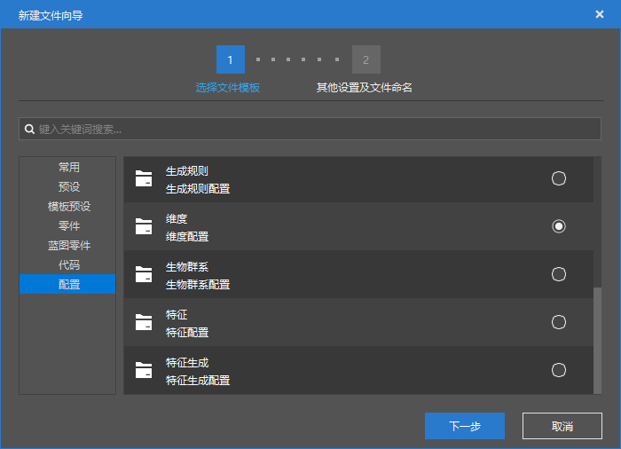
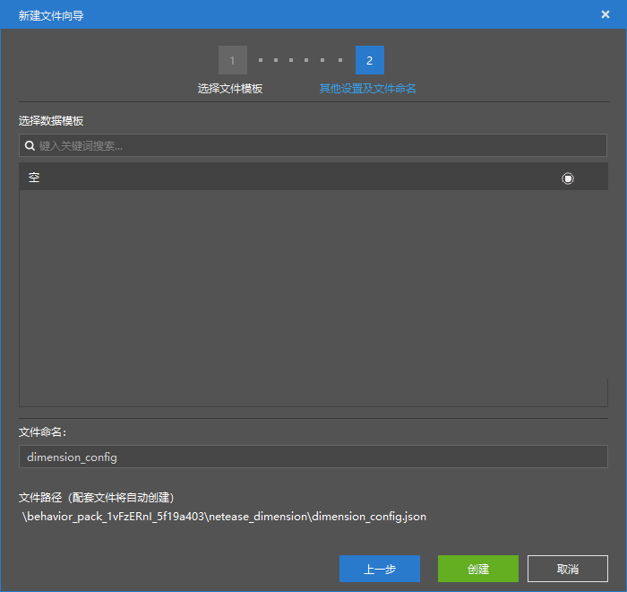
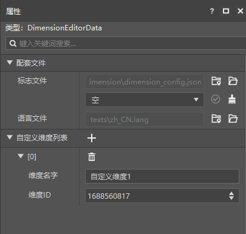

--- 
front: https://nie.res.netease.com/r/pic/20211104/69055361-2e7a-452f-8b1a-f23e1262a03a.jpg 
hard: Advanced 
time: 10 minutes 
--- 
# Start creating a new dimension 

**Dimension** is an important part of the world. In a world, we often have multiple dimensions. In the original game, the main world, the netherworld, and the end are the three native dimensions. Each dimension is independent of each other, and the players, entities, blocks, and various logics in it do not interfere with each other. We can think of a dimension as an independent "world", and a player can travel back and forth between these "worlds" in various ways. 

In module development, if developers can add some new custom dimensions to the game, the playability of the module will be greatly enhanced. In this section, we will create a new dimension using the editor of the Minecraft Development Workbench. 

## Use the editor to configure a new dimension 

 

 

We open the editor and find "**Dimension**" in the creation configuration to create a **Dimension Configuration File**. This file will tell the editor and the game which dimensions our mod has customized. 

 

We can see that this dimension configuration file contains a list of dimensions created by the current mod and a **Dimension Identifier** (**Dimension Identifier**, referred to as **Dimension ID**). A dimension has been automatically created for us in the list. We can modify the dimension information by modifying the dimension name and dimension ID. The JSON content of the file is as follows: 

```json 
{ 
"netease:dimension": { 
"modId": "tutorial_demo", 
"modDimensionId": [ 
1688560817 
] 
} 
} 
``` 

In the editor, every time we add a dimension using the "+" button, the editor will create a `dm<dimension id>.json` file in the `netease_dimension` folder of the behavior pack, where `<dimension id>` represents the numerical ID of the dimension, such as 1688560817 above. The editor automatically creates a blank dimension file when creating a dimension configuration file. For example, in the above demonstration, the editor creates a `dm1688560817.json` file in addition to the `dimension_config.json` file. Dimensions use a numerical ID as their unique identifier, so if different modules use the same numerical ID, it will cause conflicts between archives and generators. Therefore, the editor will try to randomly generate a dimension ID when creating a dimension. Currently, the dimension ID range that players can customize is [22, 2147483647]. 

Files similar to `dm1688560817.json` are our **Dimension Info File**. Each dimension information file stores the necessary information data for a dimension. The dimension information data is stored in the form of components. Let's take a look at the `dm1688560817.json` file automatically generated by the editor for us here: 

```json 
{ 
"format_version": "1.14.0", 
"netease:dimension_info": { 
"components": { 
"netease:dimension_type": "minecraft:overworld", 
"netease:generator_noise": {} 
} 
} 
} 
```


We can see that the format version is `1.14.0` and the mode identifier is `netease:dimension_info`. In the component, we can fill in the following main components: 

- `netease:dimension_type`: string type, the type of the vanilla dimension inherited by the dimension. If the file is modifying the vanilla dimension, this component is invalid. You can fill in `minecraft:overworld`, `minecraft:nether` or `minecraft:the_end` here. 
- `netease:generator_noise`, `netease:generator_flat` or `netease:generator_legacy`: empty object, the type of the world **Terrain Generator**, which is the noise generator for infinite worlds, the flat generator for flat worlds, and the legacy generator for old worlds. We can only fill in one of the three generators at most. If the file is modifying the vanilla dimension, this component is also invalid. 
- `netease:ban_vanilla_feature`: empty object, prevents the generation of vanilla features. If you do not want to block, do not fill in this object. 
- `netease:spawn_biomes`: string array, a list of identifiers of biomes in this dimension that players are allowed to spawn. 
- `netease:biome_source`: object, used to define the **Biome Source** of this dimension. Dimensions with defined biome sources will automatically start the generation process of the Chinese version of custom biomes. If no biome source is defined, the international version of the vanilla biome generation process that relies on climate and noise will be used. 

Currently, the world's terrain generator can only define the use of the vanilla generator, that is, the noise, flat and old version generators listed above. It is not possible to customize the terrain generator, nor can it further customize the noise of the basic terrain generator. However, we still briefly mention the concept of noise-generated terrain here, so that developers can have a deeper understanding of dimensions. 

The original terrain is generated using **Noise**, in particular, fractal **Perlin noise** (**Perlin Noise**, also translated as **Berlin noise**). The basic principle of Perlin noise is to use **lattice** (**Lattice**), which can also be understood as generating a series of random numbers as the **Gradient** of the point on the integer grid of the coordinate system. Then, the gradient values on the adjacent grid points (4 in two-dimensional and 8 in three-dimensional) are used to interpolate at other points to obtain a noise value. In fact, the vertices of the grid here are not necessarily integer points, but points that meet the step sampling requirements. The fractal Perlin noise uses the superposition of multiple different "sampled" noise values to reach the final value. In the fractal process, multiple single noises under the same seed will be generated. The frequency of each single noise is twice that of the previous one when it is generated, and the amplitude is half of the previous one. Therefore, each single noise is called an **octave** (**Octave**). Finally, all the octaves are superimposed to get our final noise. 

The original version used a 3D noise and a 2D noise to generate the basic terrain. The 3D noise was used to generate the vertical structure of the terrain, while the 2D noise was also called **Heightmap Noise**, which was used to generate the undulations of the terrain. 

In fact, noise is not only used to generate basic terrain, but also requires additional noise for biome mapping and feature generation. Although we cannot currently customize the noise algorithm when generating basic terrain in a dimension, we can customize the noise parameters when customizing biomes or features in the future. 

So far, we have successfully customized a dimension. In the next section, we will make a portal block for it to enter the dimension.