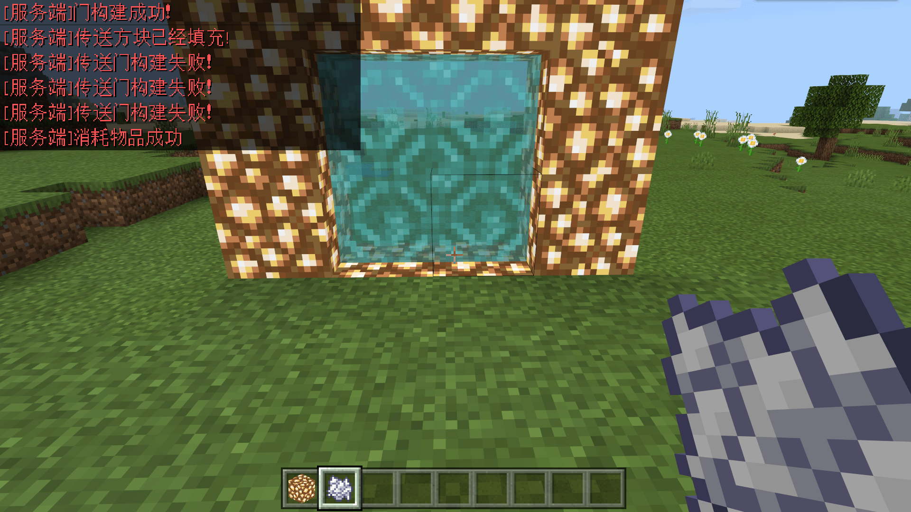

--- 
front: https://nie.res.netease.com/r/pic/20211104/69055361-2e7a-452f-8b1a-f23e1262a03a.jpg 
hard: Advanced 
time: 30 minutes 
--- 
# Designing a dimension portal 

In this section, we design a portal for the dimension. We need to use custom blocks and module SDK to complete this logic. 

## Custom portal block 

The portal block is a required block for custom portals. We can use a custom block with `base_block` as `portal` and `netease:portal` component to complete this configuration. We create two new blocks in the editor, one for transferring to our corresponding dimension and the other for transferring back to the main world. The behavior pack definitions for these two blocks are set as follows: 

```json 
{ 
"format_version": "1.10", 
"minecraft:block": { 
"description": { 
"identifier": "tutorial_demo:custom_dim_gate", 
"register_to_creative_menu": true, 
"base_block": "portal" 
}, 
"components": { 
"minecraft:destroy_time": { 
"value": 9999 
}, 
"minecraft:loot": { 
"table": "loot_tables/empty.json" 
}, 
"minecraft:block_light_emission": { 
"emission": 1.0 
}, 
"netease:portal": { 
"target_dimension": 1688560817, 
"particle_east_west": "minecraft:portal_east_west",
        "particle_north_south": "minecraft:portal_north_south"
      },
      "netease:listen_block_remove": {
        "value": true
      }
    }
  }
}
```

```json
{
  "format_version": "1.10",
  "minecraft:block": {

    "description": {
      "identifier": "tutorial_demo:custom_dim_gate_back",
      "register_to_creative_menu": true,
      "base_block": "portal"
    },
    "components": {
      "minecraft:destroy_time": {
        "value": 9999
      },
      "minecraft:loot": {
        "table": "loot_tables/empty.json"
      },
      "minecraft:block_light_emission": {
        "emission": 1.0
      },
      "netease:portal": {
        "target_dimension": 0,
        "particle_east_west": "minecraft:portal_east_west",
        "particle_north_south": "minecraft:portal_north_south"
      }, "netease:listen_block_remove": { 
"value": true 
} 
} 
} 
} 
``` 

In which, `target_dimension` in `netease:portal` is set to our custom dimension ID and the original main world dimension ID (0), respectively. `particle_east_west` and `particle_north_south` are the particles emitted by the east-west portal block and the particles emitted by the north-south portal block. We might as well set them to the original international version portal block particles. In order to cooperate with the module SDK, we will turn on `netease:listen_block_remove`. 

## Design the portal structure 

For this part of the code, refer to the code in the demonstration sample package portalGateDemo, and replace the corresponding block ID and dimension ID with our own ID. Then let's analyze the portal code together. In fact, if we want to design a portal structure, we only need to use the `DetectStructure` method of the `portal` engine component to determine whether it is the structure we need before generating the portal. If it is our structure, we will replace the air in the portal with our portal block. If not, nothing will be done. The example we use here is to use bone meal on the glowstone frame to activate the portal, and all the logic is executed on the server. 

```python 
# -*- coding: utf-8 -*- 
import time 
import math 
import mod.server.extraServerApi as serverApi 
from mod_log import engine_logger as logger 
ServerSystem = serverApi.GetServerSystemCls() 
compFactory = serverApi.GetEngineCompFactory() 

# Server class 
# Handle portal logic 
class Main(ServerSystem): 
def __init__(self, namespace, system): 
ServerSystem.__init__(self, namespace, system) 
# Custom dimension 1688560817 
self.TARGET_DIMENSION_ID = 1688560817

# From the main world to the custom dimension custom block 
self.telePortBlockName = 'tutorial_demo:custom_dim_gate' 
# From the custom dimension back to the main world custom block 
self.backPortBlockName = 'tutorial_demo:custom_dim_gate_back' 
# portal forcer function constant 
self.PORTAL_SEARCH_RADIUS = 128 
self.PORTAL_CREATION_RADIUS = 16 
self.PORTAL_RECORDS_KEY = 'tutorial_demo' 
self.PORTAL_RECORD_DIMID = 'DimId' 
self.PORTAL_RECORD_SPAN = 'Span' 
self.PORTAL_RECORD_TPX = 'TpX' 
self.PORTAL_RECORD_TPY = 'TpY' 
self.PORTAL_RECORD_TPZ = 'TpZ' 

# Portal structure block shape 
self.pattern = [ 
'####', 
'#**#', 
'#**#', 
'####', 
] 
#Portal shape parameters 
self.defines = { 
'#': 'minecraft:glowstone', 
'*': 'minecraft:air' 
} 

# Set the position where the portal border can be activated 
self.touchPos =[(3,1), (3,2)] 

self.ListenForEvent(serverApi.GetEngineNamespace(), serverApi.GetEngineSystemName(), 'ServerItemUseOnEvent', self, self.OnServerItemUseOnEvent) 
self.ListenForEvent(serverApi.GetEngineNamespace(), serverApi.GetEngineSystemName(), 'DimensionChangeFinishServerEvent', self, self.OnPortalForcerServerEvent)
		self.ListenForEvent(serverApi.GetEngineNamespace(), serverApi.GetEngineSystemName(), 'BlockRemoveServerEvent', self, self.OnBlockRemoveServerEvent)
		self.ShowMsg("Portal Main init!")

	#region function
	def ShowMsg(self, msg, color='RED', isServer=True):
		customComp = compFactory.CreateGame(serverApi.GetLevelId())
		text = ("[Server]" if isServer else "[Client]") + msg
		customComp.SetNotifyMsg(text, serverApi.GenerateColor(color))

	def SetBlock(self, playerID, blockPos, blockName):
		block = compFactory.CreateBlockInfo(playerID)
		return block.SetBlockNew(blockPos, {'name': blockName, 'aux': 0})

	def AddPostion(self, origin, offset):
		return tuple(map(sum, zip(origin, offset)))

	def MulPostion(self, origin, step):
		return tuple(step * x for x in origin)

#end region function 

#region build portal function 

# fill portal fill portal block 
def FillGateAirBlock(self, playerID, originPos, horizontalDir): 
""" 
param playerID: player ID 
param originPos: portal start position (upper left/upper right corner) 
param horizontalDir: portal direction, such as (-1,0,0) 
""" 
logger.info("FillGameAirBlock pos:({},{},{}) dir:({},{},{})".format(originPos[0], originPos[1], originPos[2], horizontalDir[0], horizontalDir[1], horizontalDir[2])) 
comp = compFactory.CreateDimension(playerID) 
dimensionId = comp.GetEntityDimensionId() 
blockName = self.backPortBlockName if dimensionId == self.TARGET_DIMENSION_ID else self.telePortBlockName
		bottomLeftPos = originPos
		linePos = originPos
		for line in self.pattern:
			for i in range(len(line)):
				name = self.defines.get(line[i], 'minecraft:air')
				pos = self.AddPostion(linePos, self.MulPostion(horizontalDir, i))
				if (pos[0] == bottomLeftPos[0] and pos[1] <= bottomLeftPos[1] and pos[2] <= bottomLeftPos[2]) or \
					pos[2] == bottomLeftPos[2] and pos[1] <= bottomLeftPos[1] and pos[0] <= bottomLeftPos[0]:
						# The point with minimum Y and minimum X (or minimum Z) 
bottomLeftPos = pos 
logger.info("FillGameAirBlock cur pos:({},{},{})".format(pos[0], pos[1], pos[2])) 
if name == 'minecraft:air': 
self.SetBlock(playerID, pos, blockName) 
linePos = self.AddPosition(linePos, (0, -1, 0)) 
# Save the portal to the archive 
self.AddPortalRecord(dimensionId, bottomLeftPos, self.getSpan()) 

# Use bone meal to activate the portal 
def OnServerItemUseOnEvent(self, eventData): 
itemName = eventData['itemName'] 
auxValue = eventData['auxValue'] 
playerID = eventData['entityId'] 
if itemName == "minecraft:dye" and auxValue == 15: 
# Bone meal activates the portal 
pos = (eventData['x'], eventData['y'], eventData['z']) 
# Detect the structure of the custom door 
portalComp = compFactory.CreatePortal(playerID) 
ret = portalComp.DetectStructure(playerID, self.pattern, self.defines, self.touchPos, pos) 
if ret[0]: 
self.ShowMsg('Door built successfully!') 
self.FillGateAirBlock(playerID, ret[1], ret[2]) 
self.ShowMsg('The teleportation block has been filled!') 
#Consume item "bone meal" 
def consumeDye(): 
itemComp = compFactory.CreateItem(playerID)

item = itemComp.GetPlayerItem(serverApi.GetMinecraftEnum().ItemPosType.CARRIED, 0) 
item["count"] = item["count"] - 1 
newRet = itemComp.SpawnItemToPlayerCarried(item, playerID) 
if newRet: 
self.ShowMsg("Consumption of items successful") 
else: 
self.ShowMsg("Consumption of items failed") 
comp = compFactory.CreateGame(serverApi.GetLevelId()) 
comp.AddTimer(0.1, consumeDye) 
else: 
self.ShowMsg('Portal construction failed!') 

def OnBlockRemoveServerEvent(self, args): 
dimension = args['dimension'] 
blockName = args['fullName'] 
# Find and delete the portal record with "bottom leftmost point" as key 
self.RemovePortalRecord(dimension, args['x'], args['y'], args['z'], blockName) 

# Save portal data to level extraData 
def AddPortalRecord(self, dimensionId, pos, span): 
logger.info("add portal record dim:{} pos:({},{},{})".format(dimensionId, pos[0], pos[1], pos[2])) 
entitycomp = compFactory.CreateExtraData(serverApi.GetLevelId()) 
portalsRecordDict = entitycomp.GetExtraData(self.PORTAL_RECORDS_KEY) 
if not portalsRecordDict: 
portalsRecordDict = {} 
if dimensionId not in portalsRecordDict: 
portalsRecordDict[dimensionId] = [] 
# Store the portal with the 'leftmost point at the bottom' as the key 
record = { 
self.PORTAL_RECORD_DIMID: dimensionId, 
self.PORTAL_RECORD_TPX: pos[0], 
self.PORTAL_RECORD_TPY: pos[1], 
self.PORTAL_RECORD_TPZ: pos[2], 
self.PORTAL_RECORD_SPAN: span, 
} 
portalsRecordDict[dimensionId].append(record) 
entitycomp.SetExtraData(self.PORTAL_RECORDS_KEY, portalsRecordDict) 
return record 

# Delete the data saved in level extraData with the 'leftmost point at the bottom' as the key 
def RemovePortalRecord(self, dimensionId, x, y, z, blockName):
		name = self.backPortBlockName if dimensionId == self.TARGET_DIMENSION_ID else self.telePortBlockName
		defines = {
			'#': 'minecraft:glowstone',
			'*': name
		}
		
		if blockName != name:
			return False
		patternLen = len(self.pattern)

		portalPosArray = []
		for i in xrange(patternLen): # height
			line = self.pattern[i]
			for j in range(len(line)): # Width
				name = defines.get(line[j], 'minecraft:air')
				if name == blockName:
					bottomLeftMostPos = (x - j, y + i - patternLen + 1, z)
					if self.RemoveAndSavePortalRecordAt(bottomLeftMostPos, dimensionId):
						return True
					bottomLeftMostPos = (x, y + i - patternLen + 1, z - j)
					if self.RemoveAndSavePortalRecordAt(bottomLeftMostPos, dimensionId):
						return True
		return False

	def RemoveAndSavePortalRecordAt(self, pos, dimensionId):
		entitycomp= compFactory.CreateExtraData(serverApi.GetLevelId())
		portalsRecordDict = entitycomp.GetExtraData(self.PORTAL_RECORDS_KEY)
		if not portalsRecordDict or dimensionId not in portalsRecordDict:
			return False
		records = portalsRecordDict[dimensionId]
		for rec in records:
			if rec[self.PORTAL_RECORD_TPX] == pos[0] and \
					rec[self.PORTAL_RECORD_TPY] == pos[1] and \
					rec[self.PORTAL_RECORD_TPZ] == pos[2]:
				records.remove(rec)
				entitycomp.SetExtraData(self.PORTAL_RECORDS_KEY, portalsRecordDict)
				self.ShowMsg("Portal information successfully deleted")
				return True
		return False #end region build portal function 
``` 

## Generate a return portal at the end of the teleportation 

Our portal cannot go out without returning, so we also need to generate a return portal at the end point after the player enters the corresponding dimension. Regarding this function, we actually consider two situations. The first is that there is no existing portal around the target point, then we should find an empty point near the target point to generate a portal, and then move the player to the location where the portal is generated. The other situation is that there is a portal near the target point, and we only need to move the player's position to the portal. Let's check the complete server script file. 

```python
# -*- coding: utf-8 -*-
import time
import math
import mod.server.extraServerApi as serverApi
from mod_log import engine_logger as logger
ServerSystem = serverApi.GetServerSystemCls()
compFactory = serverApi.GetEngineCompFactory()

# Server class
# Process the portal logic
class Main(ServerSystem):
	def __init__(self, namespace, system):
		ServerSystem.__init__(self, namespace, system)

# Custom dimension 23333 
self.TARGET_DIMENSION_ID = 23333 
# Customize blocks from the main world to the custom dimension 
self.telePortBlockName = 'portalGateDemo:gateProtal' 
# Customize blocks from the custom dimension back to the main world 
self.backPortBlockName = 'portalGateDemo:gateProtalBack' 
# Portal forcer function constant 
self.PORTAL_SEARCH_RADIUS = 128 
self.PORTAL_CREATION_RADIUS = 16 
self.PORTAL_RECORDS_KEY = 'ModPortalRecords' 
self.PORTAL_RECORD_DIMID = 'DimId' 
self.PORTAL_RECORD_SPAN = 'Span' 
self.PORTAL_RECORD_TPX = 'TpX' 
self.PORTAL_RECORD_TPY = 'TpY' 
self.PORTAL_RECORD_TPZ = 'TpZ' 

# Portal structure block shape 
self.pattern = [ 
'####', 
'#**#', 
'#**#', 
'####', 
] 
#Portal shape parameters 
self.defines = { 
'#': 'minecraft:glowstone', 
'*': 'minecraft:air' 
} 

# Set the position where the portal border can be activated 
self.touchPos =[(3,1), (3,2)] 

self.ListenForEvent(serverApi.GetEngineNamespace(), serverApi.GetEngineSystemName(), 'ServerItemUseOnEvent', self, self.OnServerItemUseOnEvent) 
		self.ListenForEvent(serverApi.GetEngineNamespace(), serverApi.GetEngineSystemName(), 'DimensionChangeFinishServerEvent', self, self.OnPortalForcerServerEvent)
		self.ListenForEvent(serverApi.GetEngineNamespace(), serverApi.GetEngineSystemName(), 'BlockRemoveServerEvent', self, self.OnBlockRemoveServerEvent)
		self.ShowMsg("Portal Main init!")

	#region function
	def ShowMsg(self, msg, color='RED', isServer=True):
		customComp = compFactory.CreateGame(serverApi.GetLevelId())
		text = ("[Server]" if isServer else "[Client]") + msg
		customComp.SetNotifyMsg(text, serverApi.GenerateColor(color))

	def SetBlock(self, playerID, blockPos, blockName):
		block = compFactory.CreateBlockInfo(playerID)
		return block.SetBlockNew(blockPos, {'name': blockName, 'aux': 0})

	def AddPostion(self, origin, offset):
		return tuple(map(sum, zip(origin, offset)))

def MulPosion(self, origin, step): 
return tuple(step * x for x in origin) 
#end region function 

#region build portal function 

# Fill the portal fill the portal block 
def FillGateAirBlock(self, playerID, originPos, horizontalDir): 
""" 
param playerID: player ID 
param originPos: portal starting position (upper left/upper right corner) 
param horizontalDir: portal direction, such as (-1,0,0) 
""" 
logger.info("FillGameAirBlock pos:({},{},{}) dir:({},{},{})".format(originPos[0], originPos[1], originPos[2], horizontalDir[0], horizontalDir[1], horizontalDir[2])) 
comp = compFactory.CreateDimension(playerID)
		dimensionId = comp.GetEntityDimensionId()
		blockName = self.backPortBlockName if dimensionId == self.TARGET_DIMENSION_ID else self.telePortBlockName
		bottomLeftPos = originPos
		linePos = originPos
		for line in self.pattern:
			for i in range(len(line)):
				name = self.defines.get(line[i], 'minecraft:air')
				pos = self.AddPostion(linePos, self.MulPostion(horizontalDir, i))
				if (pos[0] == bottomLeftPos[0] and pos[1] <= bottomLeftPos[1] and pos[2] <= bottomLeftPos[2]) or \
					pos[2] == bottomLeftPos[2] and pos[1] <= bottomLeftPos[1] and pos[0] <= bottomLeftPos[0]: 
# The point with minimum Y and minimum X (or minimum Z) 
bottomLeftPos = pos 
logger.info("FillGameAirBlock cur pos:({},{},{})".format(pos[0], pos[1], pos[2])) 
if name == 'minecraft:air': 
self.SetBlock(playerID, pos, blockName) 
linePos = self.AddPosition(linePos, (0, -1, 0)) 
# Save the portal to the save file 
self.AddPortalRecord(dimensionId, bottomLeftPos, self.getSpan()) 

# Use bone meal to activate the portal 
def OnServerItemUseOnEvent(self, eventData): 
itemName = eventData['itemName'] 
auxValue = eventData['auxValue'] 
playerID = eventData['entityId'] 
if itemName == "minecraft:dye" and auxValue == 15: 
# Bone meal activates the portal 
pos = (eventData['x'], eventData['y'], eventData['z']) 
# Detect the structure of the custom door 
portalComp = compFactory.CreatePortal(playerID) 
ret = portalComp.DetectStructure(playerID, self.pattern, self.defines, self.touchPos, pos) 
if ret[0]: 
self.ShowMsg('Door built successfully!') 
self.FillGateAirBlock(playerID, ret[1], ret[2]) 
self.ShowMsg('The teleportation block has been filled!') 
#Consume item "bone meal"

def consumeDye(): 
itemComp = compFactory.CreateItem(playerID) 
item = itemComp.GetPlayerItem(serverApi.GetMinecraftEnum().ItemPosType.CARRIED, 0) 
item["count"] = item["count"] - 1 
newRet = itemComp.SpawnItemToPlayerCarried(item, playerID) 
if newRet: 
self.ShowMsg("Consumption of items successful") 
else: 
self.ShowMsg("Consumption of items failed") 
comp = compFactory.CreateGame(serverApi.GetLevelId()) 
comp.AddTimer(0.1, consumeDye) 
else: 
self.ShowMsg('Portal construction failed!') 

def OnBlockRemoveServerEvent(self, args): 
dimension = args['dimension'] 
blockName = args['fullName'] 
# Use "bottom leftmost point" as key to find and delete the portal record 
self.RemovePortalRecord(dimension, args['x'], args['y'], args['z'], blockName) 

def OnPortalForcerServerEvent(self, args): 
logger.info("OnPortalForcerServerEvent:{}".format(args)) 
entityId = args['playerId'] 
toDimensionId = args['toDimensionId'] 
self.PortalForcer(entityId, toDimensionId) 

# portal forcer instance 
def PortalForcer(self, entityId, toDimensionId): 
pos = compFactory.CreatePos(entityId).GetPos() 
if not pos: 
return False 
ret = self.FindPortal(toDimensionId, pos, self.PORTAL_SEARCH_RADIUS) 
if ret[0]: 
self.TravelPlayerToPortal(entityId, ret[1], toDimensionId) 
self.ShowMsg("Find a portal near the player ({}) and move the player from {} to the vicinity of the portal".format(ret[1], pos)) 
return 

record = self.CreatePortal(entityId, toDimensionId, self.PORTAL_CREATION_RADIUS) 
target = self.FindClosestBlockPosToPortal(entityId, record) 
self.TravelPlayerToPortal(entityId, target, toDimensionId) 
self.ShowMsg("Create a portal near the player and successfully store the portal information in the archive") 

# Find a nearby location to set up a portal 
def FindNearPosAndSetPortal(self, entityId, dimensionId, pos):
		defines = {
			'#': 'minecraft:glowstone',
			'*': self.backPortBlockName if dimensionId == self.TARGET_DIMENSION_ID else self.telePortBlockName
		}
		blockComp = compFactory.CreateBlockInfo(entityId)

for line in self.pattern: # height 
for i in range(len(line)): # width 
blockName = defines.get(line[i], 'minecraft:air') 
blockPos = (pos[0] + i, pos[1], pos[2]) 
logger.info("create portal with pos:{}".format(blockPos)) 
blockComp.SetBlockNew(blockPos, {'name': blockName, 'aux': 0}) 
# Decrement coordinates 
pos[1] -= 1 
# Return the "bottom leftmost point" of the portal 
return pos 
def GetPortalHeight(self): 
return len(self.pattern) 

def GetPortalWidth(self): 
width = 0 
for line in self.pattern: 
if len(line) > width: 
width = len(line) 
return width 

# Find a portal near the player, return whether there is a portal and the coordinates of the portal 
def FindPortal(self, dimensionId, centerBlockPos, radius): 
closest = -1 # closest distance 
targetBlockPos = (0, 0, 0) 
entitycomp = compFactory.CreateExtraData(serverApi.GetLevelId()) 
# Read portal information in the archive 
portalsRecordDict = entitycomp.GetExtraData(self.PORTAL_RECORDS_KEY) 
if not portalsRecordDict: 
portalsRecordDict = {} 
if dimensionId not in portalsRecordDict: 
# There is no portal in the stored information 
return False, targetBlockPos 

for rec in portalsRecordDict[dimensionId]: 
# "bottom leftmost point" as key 
baseBlockPos = (rec[self.PORTAL_RECORD_TPX], rec[self.PORTAL_RECORD_TPY], rec[self.PORTAL_RECORD_TPZ])
			for span in xrange(0, rec[self.PORTAL_RECORD_SPAN]):
				recordBlockPos = (baseBlockPos[0] + span, baseBlockPos[1] + span, baseBlockPos[2])
				# search area x by y (at all heights)
				xd = abs(recordBlockPos[0] - centerBlockPos[0])
				zd = abs(recordBlockPos[1] - centerBlockPos[1])
				if xd <= radius and zd <= radius:
					# Select the latest point based on Euler distance
					dist = self.EuclideanDistance(recordBlockPos, centerBlockPos)
					if closest < 0 or dist < closest:
						closest = dist
						targetBlockPos = recordBlockPos

		return closest >= 0, targetBlockPos


	#Create portal
	def CreatePortal(self, entityId, dimensionId, radius):
		entityPos = compFactory.CreatePos(entityId).GetPos()
		entityBlockPos =[math.floor(entityPos[0]) - self.GetPortalWidth() / 2, math.floor(entityPos[1]) - 2 + self.GetPortalHeight(), math.floor(entityPos[2])]
		logger.info("player current position:{} portal begin position:{}".format(entityPos, entityBlockPos))
		entityBlockPos = self.FindNearPosAndSetPortal(entityId, dimensionId, entityBlockPos)
		return self.AddPortalRecord(dimensionId, entityBlockPos, self.getSpan())

	# Save portal data to level extraData
	def AddPortalRecord(self, dimensionId, pos, span):
		logger.info("add portal record dim:{} pos:({},{},{})".format(dimensionId, pos[0], pos[1], pos[2]))
		entitycomp = compFactory.CreateExtraData(serverApi.GetLevelId())
		portalsRecordDict = entitycomp.GetExtraData(self.PORTAL_RECORDS_KEY)
		if not portalsRecordDict:
			portalsRecordDict = {}
		if dimensionId not in portalsRecordDict:
			portalsRecordDict[dimensionId] = []
		# Use the 'leftmost point at the bottom' as the key to store the portal
		record = {
			self.PORTAL_RECORD_DIMID: dimensionId,
			self.PORTAL_RECORD_TPX: pos[0], 
self.PORTAL_RECORD_TPY: pos[1], 
self.PORTAL_RECORD_TPZ: pos[2], 
self.PORTAL_RECORD_SPAN: span, 
} 
portalsRecordDict[dimensionId].append(record) 
entitycomp.SetExtraData(self.PORTAL_RECORDS_KEY, portalsRecordDict) 
return record 

# Get the position where the player is relatively close to the portal 
def FindClosestBlockPosToPortal(self, entityId, record): 
pos = (record[self.PORTAL_RECORD_TPX], record[self.PORTAL_RECORD_TPY], record[self.PORTAL_RECORD_TPZ]) 
# The developer can set this position as needed 
# Note that this position may not be air, so you need to pay attention when choosing the position 
return tuple((x + 2 for x in pos))

	def LengthSquared(self, pos):
		return pos[0] * pos[0] + pos[1] * pos[1] + pos[2] * pos[2]

	#Set the player's position near the portal
	def TravelPlayerToPortal(self, entityId, targetBlockPos, dimensionId):
		entityTargetPos = tuple((x + 0.5 for x in targetBlockPos))
		originRot = compFactory.CreateRot(entityId).GetRot()
		entityRotY = originRot[1]
		if dimensionId == self.TARGET_DIMENSION_ID:
			entityRotY += 90
		else:
			entityRotY -= 90
		newRot = (originRot[0], entityRotY)

compFactory.CreateRot(entityId).SetRot(newRot) 
compFactory.CreatePos(entityId).SetPos(entityTargetPos) 
logger.info("set position:({}, {})".format(entityTargetPos[0], entityTargetPos[1])) 

# Calculate the Euler distance between two points 
def EuclideanDistance(self, pos1, pos2): 
dx = pos1[0] - pos2[0] 
dy = pos1[1] - pos2[1] 
dz = pos1[2] - pos2[2] 
return dx * dx + dy * dy + dz * dz 

# Customize the maximum width of the portal 
def getSpan(self): 
span = 1 
for line in self.pattern: 
if len(line) > span: 
span = len(line) 
return span 

# Delete the data saved in level extraData with "bottom leftmost point" as key 
def RemovePortalRecord(self, dimensionId, x, y, z, blockName): 
name = self.backPortBlockName if dimensionId == self.TARGET_DIMENSION_ID else self.telePortBlockName 
defines = { 
'#': 'minecraft:glowstone', 
'*': name 
} 

if blockName != name: 
return False 
patternLen = len(self.pattern) 
portalPosArray = [] 
for i in xrange(patternLen): # height 
line = self.pattern[i] 
for j in range(len(line)): # width 
name = defines.get(line[j], 'minecraft:air') 
if name == blockName:
					bottomLeftMostPos = (x - j, y + i - patternLen + 1, z)
					if self.RemoveAndSavePortalRecordAt(bottomLeftMostPos, dimensionId):
						return True
					bottomLeftMostPos = (x, y + i - patternLen + 1, z - j)
					if self.RemoveAndSavePortalRecordAt(bottomLeftMostPos, dimensionId):
						return True
		return False

	def RemoveAndSavePortalRecordAt(self, pos, dimensionId):
		entitycomp = compFactory.CreateExtraData(serverApi.GetLevelId())
		portalsRecordDict = entitycomp.GetExtraData(self.PORTAL_RECORDS_KEY)
		if not portalsRecordDict or dimensionId not in portalsRecordDict:
			return False
		records = portalsRecordDict[dimensionId]

		for rec in records:
			if rec[self.PORTAL_RECORD_TPX] == pos[0] and \
					rec[self.PORTAL_RECORD_TPY] == pos[1] and \
					rec[self.PORTAL_RECORD_TPZ] == pos[2]:
				records.remove(rec)
				entitycomp.SetExtraData(self.PORTAL_RECORDS_KEY, portalsRecordDict)
				self.ShowMsg("Portal information successfully deleted")
				return True
		return False
	#end region Build a portal function 
``` 

 

 

 

This is how we design a portal. Next, let's design portals of different styles for more dimensions!