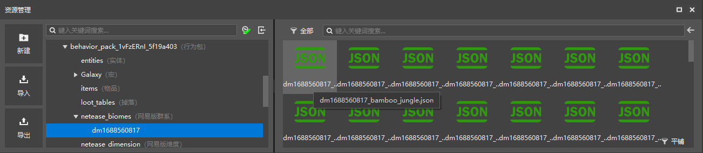
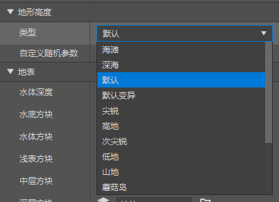

--- 
front: https://nie.res.netease.com/r/pic/20211104/69055361-2e7a-452f-8b1a-f23e1262a03a.jpg 
hard: Advanced 
time: 30 minutes 
--- 
# Change the biome of a dimension 
**Biome** is an area in a dimension that controls various geographical elements such as topography, vegetation, atmospheric environment, and ruins. There are often multiple biomes in a dimension, and a biome can be converted into multiple sub-biomes, which makes the environment of the dimension very rich. 

In this section, let's learn how to customize the biome. 

## Create Biomes 

Among the features provided by the international version, we can enable experimental gameplay to modify the original biomes or customize new biomes in the main world, but this feature is very unstable and requires the support of experimental gameplay. NetEase's development team developed the Chinese version of the custom biome system based on the international version biome interface, and the implementation is slightly different from the international version. Currently, the custom biomes in the Chinese version are bound to the dimension. Each dimension, including the original dimension and the custom dimension, must have its own independent set of biomes, and each set of biomes must only be implemented by modifying the original biomes. In other words, we cannot currently add a completely new biome to the Chinese version of the custom biome like the international version of the biome, all biomes must inherit and cover a vanilla biome, and each vanilla biome can only be inherited and covered by a new biome. To put it more bluntly, a new custom dimension in the Chinese version will copy and use a set of biomes from the original main world by default, and what we can do is to modify their various properties based on this set of biomes that are the same as the main world, including various terrain layer blocks, generation noise parameters, climate, temperature and humidity, etc., to modify them into biomes that look like new biomes. 

For each dimension, we have two ways to create a biome for it. 

### Use scripts to batch generate biomes in a dimension 

As we learned above, we can and can only modify the various properties of biomes based on the types of original biomes. But how does this process work? For each dimension, all identifiers of biomes that can be modified are actually fixed, that is, biomes with the prefix `dm<dimension id>_` corresponding to all original biomes. For example, the identifier of the biome in the dimension with the digital ID 1688560817 that inherits the `desert` biome is `dm1688560817_desert`. Although we can also manually create all the biomes we need for each dimension, it will take a lot of work. We have a method that can quickly generate all the biomes in a certain dimension using a script. 

We find the CustomBiomesMod module in the demo package, and we can find the `tools` folder under the behavior pack. This folder is our script for batch generating biomes. We can find `remake.py` in this folder. We execute this file to automatically generate a copy of the biome for a specific dimension ID. For example, we generate a set of biomes for the dimension with ID 1688560817. 

```shell 
python .\remake.py dm1688560817 
``` 

By executing this command, a set of biomes for this dimension will be generated. The biome file will be automatically named with the prefix `dm1688560817_`, the biome identifier will also be named with the prefix `dm1688560817_`, and the biome will be labeled with `dm1688560817`. 

### Create a biome using the editor 

 

We select "**Biome**" in the configuration to create a new biome. 

 

Currently, we can only create an empty biome in the New File Wizard, which is okay, we can bind the biome to the dimension later. 

 

 

We can see that we can modify a variety of properties in the biome. At this point we can view the JSON content of the newly created file: 

```json 
{ 
"format_version": "1.14.0", 
"minecraft:biome": {

        "description": {
            "identifier": "dm_desert",
            "inherits": "desert"
        },
        "components": {
            "minecraft:overworld_generation_rules": {
                "generate_for_climates": [
                    [
                        "frozen",
                        0
                    ],
                    [
                        "cold",
                        0
                    ],
                    [
                        "medium",
                        0
                    ],
                    [
                        "lukewarm",
                        0
                    ],
                    [
                        "warm",
                        0
                    ]
                ],
                "hills_transformation": "dm_desert",
                "mutate_transformation": "dm_desert"
            },
            "minecraft:overworld_height": {
                "noise_type": "default"
            }, "minecraft:surface_parameters": { 
"foundation_material": "minecraft:iron_block", 
"mid_material": "minecraft:gold_block", 
"sea_floor_depth": 7, 
"sea_floor_material": "minecraft:emerald_block", 
"sea_material": "minecraft:water", 
"top_material": "minecraft:diamond_block" 
}, 
"dm": {} 
} 
} 
} 
``` 

At this point, our biome is not bound to a specific dimension, and all `dm<dimension id>_` prefixes appear as `dm_`. We select our dimension binding in the editor. 


 

We select the dimension we need to bind in "**Applicable Dimension**" of "**Basic Properties**". Then the editor will automatically modify our dimension file and create a set of original dimensions just like the one we created using the script method. 

 

 

This set of dimensions will be automatically added and deleted as our custom biome is bound or not, and the corresponding biome file will also be changed synchronously as we use the editor to change this file in the external root directory. Let's take a look at the contents of the JSON file at this time: 

```json 
{ 
"format_version": "1.14.0", 
"minecraft:biome": { 
"description": { 
"identifier": "dm1688560817_desert", 
"inherits": "desert" 
}, 
"components": { 
"minecraft:overworld_generation_rules": { 
"generate_for_climates": [ 
[ 
"frozen", 
0 
], 
[ 
"cold", 
0 
], 
[ 
"medium", 
0 
], 
[ 
"lukewarm", 
0 
], 
[ 
"warm", 
0 
] 
], 
"hills_transformation": "dm1688560817_desert",
        "mutate_transformation": "dm1688560817_desert"
      },
      "minecraft:overworld_height": {
        "noise_type": "default"
      },
      "minecraft:surface_parameters": {
        "foundation_material": "minecraft:iron_block",

"mid_material": "minecraft:gold_block", 
"sea_floor_depth": 7, 
"sea_floor_material": "minecraft:emerald_block", 
"sea_material": "minecraft:water", 
"top_material": "minecraft:diamond_block" 
}, 
"dm1688560817": {} 
} 
} 
} 
``` 

At this point, our biome file is created. After that, we only need to modify the contents of the JSON file in the editor or manually to customize the properties of the biome. 

## Modify biome properties 

By combining the "Properties" pane in the analysis editor and the JSON file of the biome, let's learn how to write a biome. We can see that the biome currently uses the format version of `1.14.0` and the pattern identifier of `minecraft:biome`. In fact, we can also use the old `1.12.0` or `1.13.0` format versions, but due to version iteration, the syntax of these format versions is different from `1.14.0`. We do not recommend using them, and we will not introduce and learn them here. 

### Behavior Pack Components 

 

The "**Terrain Height**" property corresponds to the `minecraft:overworld_height` component, which is used to modify the height compensation of the noise terrain in the main world. We can modify the height effect of the noise terrain by modifying the preset value of the noise and the parameters of the noise. Since our custom dimension is inherited from the main world biome, we can use this component to control the average height of the biome, that is, the height distribution. 

 

"**Surface**" corresponds to the `minecraft:surface_parameters` component, which is used to specify the **Material** parameters of the seafloor depth and each surface layer. "Underwater blocks" are the `sea_floor_material` field, which is used to specify **Sea Floor Material**; "Water blocks" are the `sea_material` field, which is used to specify **Sea Material**; "Shallow blocks" are the `top_material` field, which is used to specify **Top Material**; "Middle blocks" are the `mid_material` field, which is used to specify **Middle Material**; "Deep blocks" are the `foundation_material` field, which is used to specify **Foundation Material**. 

 

 

"Generation Rules" corresponds to the `minecraft:overworld_generation_rules` component. This component is used to define the **Generation Rule** of the Overworld biome. However, as mentioned before, this component can also be used in custom dimensions in the Chinese version to imitate the generation rules of the Overworld. The generation rules are divided into two parts, namely **Transformation** rules and **Climate** generation rules. Transformation is an operation that increases the diversity of biomes. When defining biomes, we tend to define a group of biomes of the same type at the same time, and only one of them will define the `generate_for_climates` field, which is the generation rule for climate, called the **Base Biome**. The other biomes will be obtained by transforming the biome after the base biome is generated according to the transformation rules. We call a base biome and its transformed biome system an Association. Currently, we can define multiple transformations, namely Hills Transformation, Mutate Transformation, River Transformation, and Shore Transformation. We can select the corresponding transformed biome in the editor or directly enter it in the JSON file as the value of the field. For example, the vanilla jungle base biome only generates in neutral climates, has a weight of 1 (which means 100% when there is only one), and transforms into jungle hills and jungle variants, and its JSON component is written like this: 

```json 
"minecraft:overworld_generation_rules": { 
"hills_transformation": "jungle_hills", 
"mutate_transformation": "jungle_mutated", 
"generate_for_climates": [ 
[ "medium", 1 ] 
] 
} 
``` 

Jungle hills and jungle variants do not undergo other transformations and do not generate as base biomes, and therefore do not have a `minecraft:overworld_generation_rules` component. In fact, jungle biomes may also be hard-coded to transform into jungle edge or bamboo jungle. Jungle edge does not generate as a base biome, but is converted to a jungle edge variant, with the following JSON component: 

```json 
"minecraft:overworld_generation_rules": { 
"mutate_transformation": "jungle_edge_mutated" 
}

``` 

Bamboo Jungle will not generate as a base biome, but will be converted to Bamboo Jungle Hills. Its JSON component content is: 

```json 
"minecraft:overworld_generation_rules": { 
"hills_transformation": "bamboo_jungle_hills" 
} 
``` 

Jungle Edge variants and Bamboo Jungle Hills will no longer convert to other biomes. Although river biomes can be controlled through JSON components, there is still a hardcoded part, that is, if you do not specify a biome for the river to convert to, the `river` biome will automatically be used as the biome for the river to convert to. All of the above biomes have a default `river` river conversion. This is the entire generation chain of jungle clusters. 

In addition to the parameters that can be adjusted in the editor, there are many components that can be manually written in the JSON file. For example, the `minecraft:climate` component is used to specify the values of various climate parameters of the biome, such as temperature, rainfall, snow, etc. `minecraft:forced_features` is used to generate **Forced Features**. `minecraft:ignore_automatic_features` is used to ignore the generation of **Automatic Features** (i.e. non-mandatory features) and only generate the mandatory features specified in the previous component. Mandatory features are also called **Explicit Features**, while automatic features are also called **Implicit Features**. In addition, there is the `minecraft:surface_material_adjustments` component for fine-tuning surface materials, the `minecraft:legacy_world_generation_rules` component for specifying legacy finite world generation rules, etc. These components, including the old format versions, can be found in the [biome documentation hosted on bedrock.dev](https://bedrock.dev/zh/b/Biomes) for more detailed usage.

In addition to these components, there are some exclusive components in the Chinese version, such as `netease:no_spawn_end_dragon`, which is used to cancel the generation of the ender dragon and its related logic in the biome of the custom end. And it should be noted that if the biome source, that is, the `netease:biome_source` component, is enabled in the dimension bound to the biome, then the biomes under it will no longer use the biome generation rules of the international version to generate, that is, the `minecraft:overworld_generation_rules` component of the biome will be invalid, and the generation process we described above will also be invalid. Everything will be generated according to the rules defined by the `netease:biome_source` component in the dimension. 

### Biome Tags 

In the behavior pack definition file of the biome, in addition to the behavior pack components, we can also define the biome **Tag**. The biome tag is a function used to mark the biome, which can be queried in Molang using `query.has_biome_tag`. We define a tag by directly defining an empty object in the `minecraft:biome/components` object. The value of the empty object is the value of the tag. 

For example, in the above example, the editor automatically adds the `dm1688560817` tag for our new custom biome through configuration for our later use. The specific code is as follows 

```json 
{ 
"format_version": "1.14.0", 
"minecraft:biome": { 
"description": { 
"identifier": "dm1688560817_desert", 
"inherits": "desert" 
}, 
"components": { 
// ... 
"dm1688560817": {} 
} 
} 
} 
``` 

We can add multiple tags to a biome, such as the original jungle biome, which adds the tags `animal`, `jungle`, `monster`, `overworld`, and `rare`. These tags, combined with features, entity generation rules, and some hard-coded content, can allow animals to spawn, allow jungle temples to spawn, allow monsters to spawn, allow spawning in the main world of infinite worlds and finite worlds, and spawn as a rare biome in a neutral climate. 

At this point, we have completed the definition of a biome. Developers can modify more biomes according to their wishes!