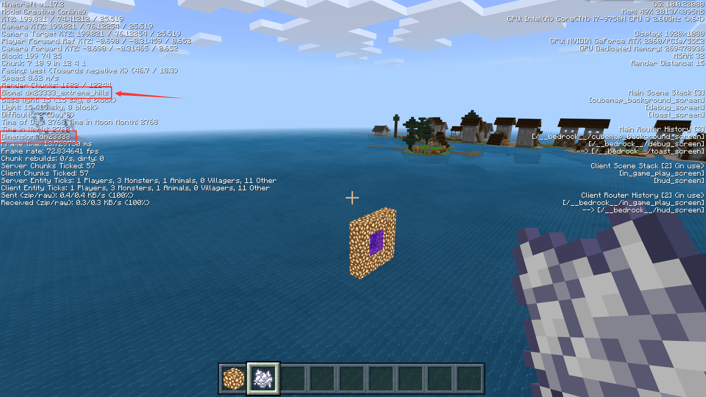

--- 
front: https://nie.res.netease.com/r/pic/20211104/69055361-2e7a-452f-8b1a-f23e1262a03a.jpg 
hard: Advanced 
time: 15 minutes 
--- 
# Challenge: Ocean World 
In this section, we will make an ocean world. Ocean world, as the name implies, is a world that is almost entirely sea. In order to make such a world, we have two options. The first option is to turn off all the climate generation rules of other base biomes except the ocean, that is, set the weight to 0; the second option is to adjust the height of all land biomes to the same height as the ocean, and still make an ocean world. We will demonstrate the second operation mode below. 

## Modify the height of the land biome 

 

If our biome is created from the editor, we can adjust the "Type" in the "Terrain Height" and set it to "Ocean". This is equivalent to setting the `noise_type` field to `ocean` in the `minecraft:overworld_height` component of the JSON. 

Of course, in addition to the biomes configured in the editor, we also have other default biomes. We use a text editor to modify or add the following components to them all: 

```json 
"minecraft:overworld_height": { 
"noise_type": "ocean" 
} 
``` 

In this way, all biomes will generate terrain below sea level when noise generates terrain, just like the original ocean. In this way, our ocean world is complete. 

 

We enter the game to test it, and we can see that except for the hard-coded features (also translated as landforms) generated on the water surface, such as the village, all the blocks are submerged below the water surface. This shows that our custom ocean world is successful! 
