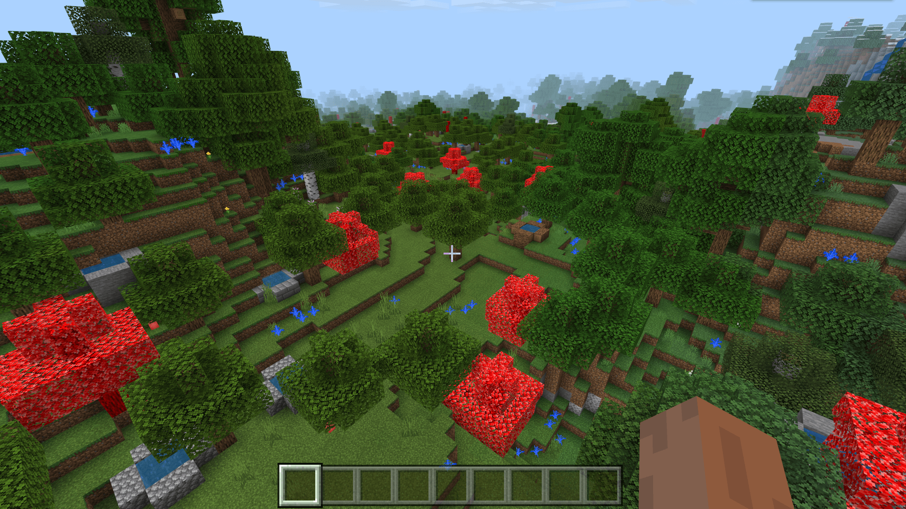

--- 
front: https://nie.res.netease.com/r/pic/20211104/69055361-2e7a-452f-8b1a-f23e1262a03a.jpg 
hard: Advanced 
time: 15 minutes 
--- 
# Understanding Tree Feature Rules 

Finally, we come to tree features. We make a red oak feature, modeled after the vanilla oak tree, and place it in the world. 

## Configuring a custom tree stump block using the editor 

 

We prepare a texture asset for the red oak log, create it in the editor, and set it to solid opaque. 

## Use the editor to configure a custom leaf block 

 

Similarly, we prepare the texture resource of the red oak leaves, create it in the editor, and set it to non-entity transparent. 

## Design custom trees using tree features 

We manually create the `red_oak_tree_feature.json` file and write it like the original `minecraft:oak_tree_feature` as follows: 

```json 
{ 
"format_version": "1.13.0", 
"minecraft:tree_feature": { 
"description": { 
"identifier": "tutorial_demo:red_oak_tree_feature" 
}, 
"trunk": { 
"trunk_height": { 
"range_min": 4, 
"range_max": 7 
}, 
"trunk_block": "tutorial_demo:red_oak_log" 
}, 
"canopy": { 
"canopy_offset": { 
"min": -3, 
"max": 0 
}, 
"variation_chance": [ 
{ 
          "numerator": 1,
          "denominator": 2
        },

        {
          "numerator": 1,
          "denominator": 2
        },
        {
          "numerator": 1,
          "denominator": 2
        },
        {
          "numerator": 1,
          "denominator": 1
        }
      ],
      "leaf_block": "tutorial_demo:red_oak_leaves"
    },
    "base_block": [
      "minecraft:dirt",
      {
        "name": "minecraft:dirt",
        "states": {
          "dirt_type": "coarse"
        }
      }
    ],
    "may_grow_on": [
      "minecraft:dirt",
      "minecraft:grass",
      "minecraft:podzol",
      "minecraft:dirt_with_roots",
      "minecraft:moss_block",
      {        "name": "minecraft:dirt",
        "states": {
          "dirt_type": "coarse"
        }
      },
      {
        "name": "minecraft:farmland",
        "states": {
          "moisturized_amount": 0
        }
      },
      {
        "name": "minecraft:farmland",
        "states": {
          "moisturized_amount": 1
        }
      },
      {
        "name": "minecraft:farmland",

        "states": {
          "moisturized_amount": 2
        }
      },
      {
        "name": "minecraft:farmland",
        "states": {
          "moisturized_amount": 3
        }
      },
      {
        "name": "minecraft:farmland",
        "states": {
          "moisturized_amount": 4
        }
      },
      {
        "name": "minecraft:farmland",
        "states": {
          "moisturized_amount": 5
        }
      },
      {
        "name": "minecraft:farmland",
        "states": {
          "moisturized_amount": 6
        }
      },
      {
        "name": "minecraft:farmland",
        "states": {
          "moisturized_amount": 7        }
      }
    ],
    "may_replace": [
      "minecraft:air",
      {
        "name": "minecraft:leaves",
        "states": {
          "old_leaf_type": "oak"
        }
      },
      {
        "name": "minecraft:leaves",
        "states": {
          "old_leaf_type": "spruce"
        }
      },
      {

        "name": "minecraft:leaves",
        "states": {
          "old_leaf_type": "birch"
        }
      },
      {
        "name": "minecraft:leaves",
        "states": {
          "old_leaf_type": "jungle"
        }
      },
      {
        "name": "minecraft:leaves2",
        "states": {
          "new_leaf_type": "acacia"
        }
      },
      {
        "name": "minecraft:leaves2",
        "states": {
          "new_leaf_type": "dark_oak"
        }
      },
	  "tutorial_demo:red_oak_leaves"
    ],
    "may_grow_through": [
      "minecraft:dirt",
      "minecraft:grass",
      { "name": "minecraft:dirt", 
"states": { 
"dirt_type": "coarse" 
} 
} 
] 
} 
} 
``` 

This means that our tree will have `tutorial_demo:red_oak_log` as the trunk and `tutorial_demo:red_oak_leaves` as the leaves. At the same time, it is required that the ground under the feet must be soil or sand. When the leaves are generated, they can replace the positions of other types of leaves, and the trunk can be generated on soil, grass or sand. 

The tree feature will be judged as successful when the tree is successfully generated, and it will fail in other cases. 

## Connection feature rules 

We create a new `overworld_red_oak_tree_feature.json` file with the following content: 

```json 
{ 
"format_version": "1.13.0",

  "minecraft:feature_rules": {
    "description": {
      "identifier": "tutorial_demo:overworld_red_oak_tree_feature",
      "places_feature": "tutorial_demo:red_oak_tree_feature"
    },
    "conditions": {
      "placement_pass": "surface_pass",
      "minecraft:biome_filter": [
        {
          "any_of": [
            {
              "test": "has_biome_tag",
              "operator": "==",
              "value": "overworld"
            },
            {
              "test": "has_biome_tag",
              "operator": "==",
              "value": "overworld_generation"
            }
          ]
        }
      ]
    },
    "distribution": {
      "iterations": 1,
      "x": { "distribution": "uniform", 
"extent": [ 0, 16 ] 
}, 
"y": "query.heightmap(variable.worldx, variable.worldz)", 
"z": { 
"distribution": "uniform", 
"extent": [ 0, 16 ] 
} 
} 
} 
} 
``` 

 

Enter the game and you can see that, as expected, each block generates an average of one tree feature!