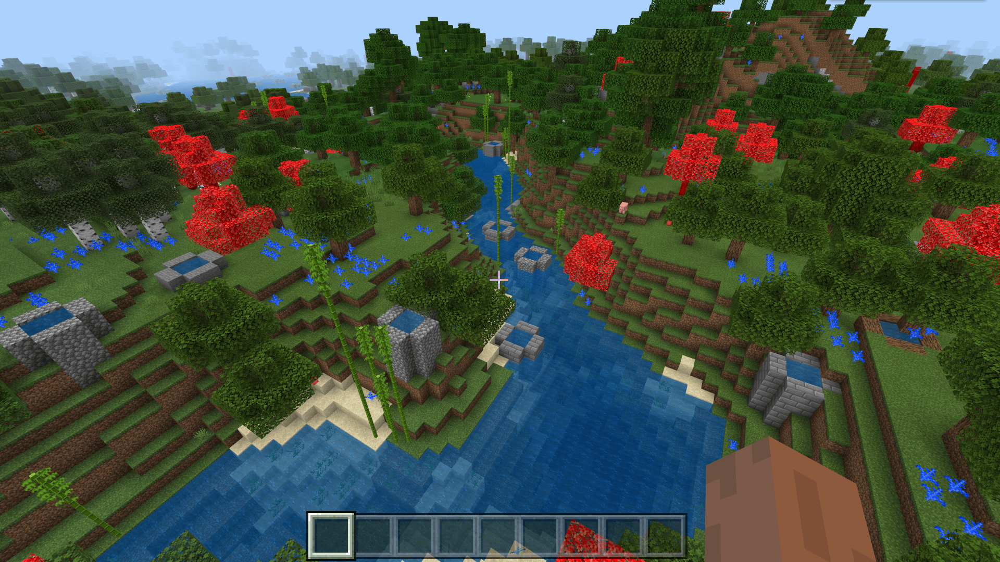

--- 
front: https://nie.res.netease.com/r/pic/20211104/69055361-2e7a-452f-8b1a-f23e1262a03a.jpg 
hard: Advanced 
time: 20 minutes 
--- 
# Challenge: Make a plant feature growing along the river 

In practice, we often divide features into multiple types. Generally speaking, we can divide features into **Content Feature**, **Proxy Feature**, **Scene Feature**, and **Carver Feature**. As the name implies, content features are features used to fill content (blocks), while proxy features, as the name implies, are features that "place other features on their behalf". In other words, proxy features are often used to place a sub-feature, but some logic is often executed before placement. The structural features, ore features, single block features, and tree features we learned earlier are all content features, while scattered planting features, aggregation features, sequence features, and random weighted features are all proxy features. Generally speaking, proxy features are placed in conjunction with content features. In this section, we will strengthen the learning of content features and proxy features by making a bamboo feature that can be generated along the riverside. 

## Production idea 

We hope to make a feature that can make bamboo grow along the riverside. However, based on the feature types we have learned so far, this idea may be difficult to achieve if only one feature is used. We hope to use some proxy features in conjunction with some content features to accomplish this. In fact, in this process, we only need to complete two key points. The first key point is to find a water block, and the second key point is to place some of our bamboos on the solid blocks adjacent to the water block, such as grass blocks. 

There are actually two ways to implement the first key point. The first is to use the search feature. When the search feature searches on the horizontal plane, the first water block found means that it is a block adjacent to the shore. The second is to perform multiple iterations in the feature rules, and there will always be some iterations that will select the water blocks adjacent to the shore. However, no matter the first or second solution, how can we ensure that the selected blocks are water? Here we need the attachment and replacement placement rules of the single block feature. In fact, we only need to make a single block feature of "water that can only be placed by replacing water". As long as such a feature is successfully placed, it can be guaranteed that it is placed in the water. However, we have to pay attention to one thing. The replacement of a single block feature by itself cannot be judged as successful, so we cannot replace water with water. However, I wonder if all developers still remember the static water and flowing water we talked about in the last section of Chapter 5? We can replace still water with flowing water to replace water successfully without changing the original water. 

The second point is also relatively simple and needs to be split into two points. The first is to use the scattered plant feature to place our plants, and the second is that the plant feature itself needs to have a judgment that there must be a solid block under it, such as a grass block. This judgment can often be achieved using the attachment rules of a single block feature. Fortunately, the bamboo feature `minecraft:bamboo_feature` that we are currently in hard-coded has this judgment, so we don't need to add unnecessary details. 

We choose the second solution of the first point, and use the ideas of the two points to create a feature hierarchy tree: 

```shell 
Feature rules 
└─Sequence feature (agent) 
├─Water replaces water feature (content) 
└─Scattered bamboo feature (agent) 
└─Bamboo feature (content) 
``` 

## Make water replace water feature 

We create a new `replace_water_feature.json` file with the following content: 

```json 
{ 
"format_version": "1.13.0", 
"minecraft:single_block_feature": { 
"description": { 
"identifier": "tutorial_demo:replace_water_feature" 
}, 
"places_block": "minecraft:flowing_water", 
"enforce_survivability_rules": false, 
"enforce_placement_rules": true, 
"may_replace": [ 
"minecraft:water" 
] 
} 
} 
``` 

## Making scattered bamboo features


We create a `bamboo_scatter_feature.json` file with the following content: 

```json 
{ 
"format_version": "1.13.0", 
"minecraft:scatter_feature": { 
"description": { 
"identifier": "tutorial_demo:bamboo_scatter_feature" 
}, 
"places_feature": "minecraft:bamboo_feature", 
"iterations": 8, 
"scatter_chance": 100, 
"coordinate_eval_order": "zxy", 
"project_input_to_floor": true, 
"x": { 
"distribution": "uniform", 
"extent": [ -1, 1 ] 
}, 
"y": "1", 
"z": { 
"distribution": "uniform", 
"extent": [ -1, 1 ] 
} 
} 
} 
``` 

Note that we have enabled `project_input_to_floor`, which projects the input point to the floor. This means that the Y coordinate of the scattered feature can be located at the top of the terrain like `query.heightmap(variable.worldx, variable.worldz)` in the feature rule. Since `variable.worldx` and `variable.worldz` are not accessible in the scope of the feature, `project_input_to_floor` is also a very common alternative. 

## Make sequence features to connect them together 

We create a `water_then_bamboo_scatter_feature.json` file and fill it with the following content: 

```json 
{ 
"format_version": "1.13.0", 
"minecraft:sequence_feature": { 
"description": { 
"identifier": "tutorial_demo:water_then_bamboo_scatter_feature" 
}, 
"features": [ 
"tutorial_demo:replace_water_feature", 
"tutorial_demo:bamboo_scatter_feature" 
] 
} 
} 
``` 

## Connect feature rules


Finally, we hook up the feature rules. We create the `overworld_bamboo_near_water_feature.json` file:

```json
{
  "format_version": "1.13.0",
  "minecraft:feature_rules": {
    "description": {
      "identifier": "tutorial_demo:overworld_bamboo_near_water_feature",
      "places_feature": "tutorial_demo:water_then_bamboo_scatter_feature"
    },
    "conditions": {
      "placement_pass": "surface_pass",
      "minecraft:biome_filter": [
        {
          "any_of": [
            {
              "test": "has_biome_tag",
              "operator": "==",
              "value": "overworld"
            },
            {
              "test": "has_biome_tag",
              "operator": "==",
              "value": "overworld_generation"
            }
          ]
        }
      ]
    },
    "distribution": {
      "iterations": 20,
      "x": {
        "distribution": "uniform",
        "extent": [
          0,
          16
        ]
      },
      "y": "query.heightmap(variable.worldx, variable.worldz)-1",
      "z": {
        "distribution": "uniform",
        "extent": [
          0,
          16
        ]
      },
      "scatter_chance": 100
    }
  }

} 
``` 

 

As you can see, bamboo has been generated by the river as expected! 
