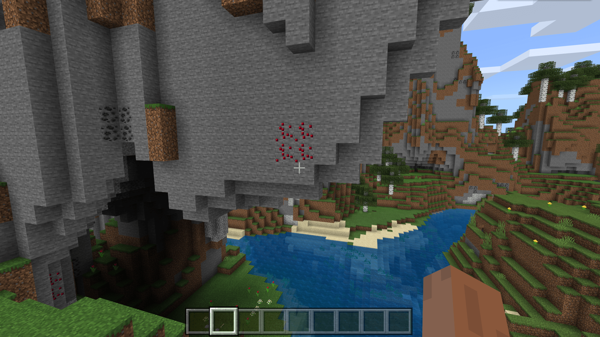

--- 
front: https://nie.res.netease.com/r/pic/20211104/69055361-2e7a-452f-8b1a-f23e1262a03a.jpg 
hard: Advanced 
time: 10 minutes 
--- 
# Understand the rules of custom ore features 

Ore features are often used to generate ores of a mineral or blocks generated in a vein-like manner like ores. In this section, we will configure the vein features of a ruby ore. 

## Configure a custom ruby block using an editor 

 

We prepare a ruby ore block texture map using an image editor such as Photoshop. For example, we can use the hue of the emerald ore texture to get a ruby ore texture. 

 

We create a new block through the editor and give it our texture. We use this block `tutorial_demo:ruby_ore` as the basic block for generating ruby ore veins. 

## Set up the Ruby Ore feature 

We create a new JSON file in the behavior pack's `netease_features` folder and write the following content 

```json 
{ 
"format_version": "1.13.0", 
"minecraft:ore_feature": { 
"description": { 
"identifier": "tutorial_demo:ruby_ore_feature" 
}, 
"count": 8, 
"replace_rules": [ 
{ 
"places_block": "tutorial_demo:ruby_ore", 
"may_replace": [ 
"minecraft:stone" 
] 
} 
] 
} 
} 
``` 

We name the file `ruby_ore_feature.json`. Note that the file names of the feature and feature rule files must match the identifiers themselves without namespaces. For example, if the namespace identifier we assign here is `tutorial_demo:ruby_ore_feature`, then our file name must be `ruby_ore_feature`, otherwise the feature may fail to load. 

We set `places_block` to the block `tutorial_demo:ruby_ore` we need to place, and set it to replace the block with the original stone `minecraft:stone`. This means that when the feature is placed, a replacement area in the shape of a vein will be generated at the **input position** according to the vein logic, and the stone in the replacement area will be replaced with our ruby ore block. 

Each feature has an **input position** (**Input Position**) and an **output position** (**Output Position**). In Minecraft, the term **position** (**Pos** for short) generally refers to a three-dimensional or two-dimensional coordinate tuple, where the world position is often a floating-point triple, and the block position is often an integer triple. The input position and output position of the feature are both block positions, that is, a set of coordinates with each component being an integer. Each feature will start placing blocks at its input position and end at its output position. The output position is often the position where a feature places the last block. 


Our Ruby Ore feature uses the Ore feature, which will **Succeed** when at least one ore block is replaced successfully, and **Fail** when all ores fail to be placed. The success and failure of the feature generally do not affect the player's gameplay level, but may be checked by some other features as a judgment standard for placement. 

## Attaching feature rules 

We create a new `overworld_underground_ruby_ore_feature.json` file in the `netease_feature_rules` folder of the behavior pack, and then fill in the following feature rules to complete the feature to feature rule attachment. 

```json
{
  "format_version": "1.13.0",
  "minecraft:feature_rules": {
    "description": {
      "identifier": "tutorial_demo:overworld_underground_ruby_ore_feature",
      "places_feature": "tutorial_demo:ruby_ore_feature"
    },
    "conditions": {
      "placement_pass": "underground_pass",
      "minecraft:biome_filter": [
        {
          "any_of": [
            {
              "test": "has_biome_tag",
              "operator": "==",
              "value": "overworld"
            },
            {
              "test": "has_biome_tag",
              "operator": "==",
              "value": "overworld_generation"
            }
          ]
        }
      ]
    },    "distribution": {
      "iterations": 50,
      "coordinate_eval_order": "zyx",
      "x": {
        "distribution": "uniform",
        "extent": [ 0, 16 ]
      },
      "y": {
        "distribution": "gaussian",
        "extent": [ 32, 481 ]
      },
      "z": {
        "distribution": "uniform",
        "extent": [ 0, 16 ]
      }
    }
  }

} 

``` 

`overworld` and `overworld_generation` are biome tags for all overworld biomes. To be precise, in the overworld biome, each biome will have one of `overworld` and `overworld_generation`. `overworld` represents the terrain of the overworld and the old version of the world, while `overworld_generation` represents the terrain generation of the overworld only. 

 

We can also make feature rules in the editor. However, at this stage, we recommend not to mount the feature types provided by the international version in the editor. This is due to two considerations. First, the current editor does not support the feature mounting of the feature types provided by the international version. Second, not only does the editor not support the mounting of these features, but it will also delete the mounting relationship in the feature rules that have already mounted the international version features. As shown in the figure above, due to the opening of the editor, the mounting we manually made in JSON was deleted. 

But in any case, our ruby ore feature is completed. Obviously, this is an implicit feature, let's enter the world to see the effect. 

 

As you can see, ruby ore is generated as expected!