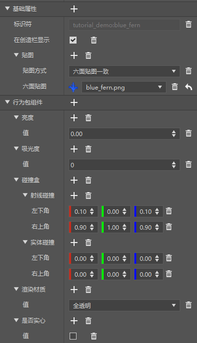
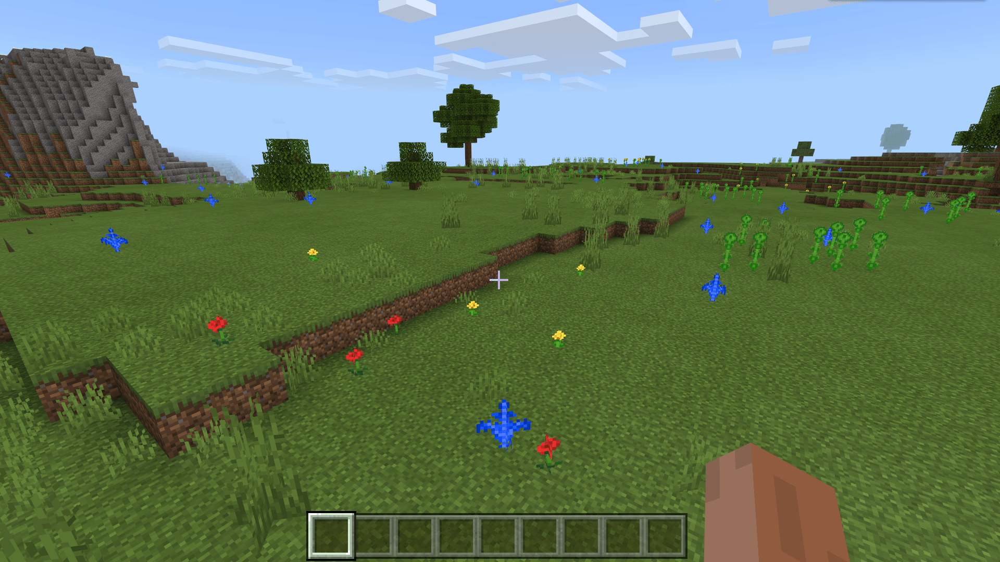

--- 
front: https://nie.res.netease.com/r/pic/20211104/69055361-2e7a-452f-8b1a-f23e1262a03a.jpg 
hard: Advanced 
time: 15 minutes 
--- 
# Understand the rules for custom single-block features 

In this section, we continue to look at another type of feature, that is, the generation of single-block features. We make a blue fern block for demonstration. 

## Configure fern blocks using the editor 

 

We configure a blue fern in the editor. Note that we need to configure it to be non-solid, transparent, and non-absorbing, and have a clipping volume but no collision volume. We set its identifier to `tutorial_demo:blue_fern`. 

Then, in order to make it have the shape of a fern, we need to use the original block shape to do this. We manually configure it in the resource pack's `blocks.json` as follows: 

```json 
{ 
"format_version": [1, 1, 0], 
"tutorial_demo:blue_fern": { 
"blockshape": "cross_texture", 
"textures": "tutorial_demo:blue_fern" 
} 
} 
``` 

In this way, we successfully use the cross-texture block shape to make it have the cross shape of blocks such as grass and saplings in the original. 

## Set up the fern single block feature 

We create a new `blue_fern_feature.json` file in the feature folder and fill it in as follows: 

```json 
{ 
"format_version": "1.13.0", 
"minecraft:single_block_feature": { 
"description": { 
"identifier": "tutorial_demo:blue_fern_feature" 
}, 
"places_block": "tutorial_demo:blue_fern", 
"enforce_survivability_rules": true, 
"enforce_placement_rules": true, 
"may_attach_to": { 
"auto_rotate": false, 
"min_sides_must_attach": 1, 
"bottom": [ 
"minecraft:grass", 
"minecraft:dirt"

] 
}, 
"may_replace": [ 
"minecraft:air" 
] 
} 
} 
``` 

We want our blue fern to only be generated on dirt and grass blocks, and only replace air. This is because we want to avoid it being generated in the air or water or directly replacing other blocks that should not be replaced, such as tree trunk blocks. So we modify `may_attach_to` and `may_replace` to achieve this effect. 

The input and output positions of the single block feature are the same coordinates. At the same time, if the block is successfully placed, it is judged as a success, and if the block fails to be placed, it is judged as a failure. 

## Attach feature rules 

We create the `overworld_first_blue_fern_feature.json` file in the feature rule folder, and then write: 

```json 
{ 
"format_version": "1.13.0", 
"minecraft:feature_rules": { 
"description": { 
"identifier": "tutorial_demo:overworld_first_blue_fern_feature", 
"places_feature": "tutorial_demo:blue_fern_feature" 
}, 
"conditions": { 
"placement_pass": "first_pass", 
"minecraft:biome_filter": [ 
{ 
"any_of": [ 
{ 
"test": "has_biome_tag", 
"operator": "==", 
"value": "overworld" 
}, 
{ 
"test": "has_biome_tag", 
"operator": "==",
              "value": "overworld_generation"
            }
          ]
        }
      ]
    },
    "distribution": {
      "iterations": 1,
      "x": {
        "distribution": "uniform",
        "extent": [ 0, 16 ]
      },

"y": "query.heightmap(variable.worldx, variable.worldz)", 
"z": { 
"distribution": "uniform", 
"extent": [ 0, 16 ] 
} 
} 
} 
} 
``` 

It is customary to name feature rules with the location of generation, such as the main world or which biome, first, then the generation stage in the middle, the name of the generated object after the stage, and finally the name of the feature at the end. However, each developer has his own naming habits, and there is no need to stick to the naming habits of the original Minecraft. 

We generate one of our blue fern blocks in each chunk to test the effect. So we set the number of iterations to 1. 

 

As you can see, our blue fern is indeed generated as we hoped!