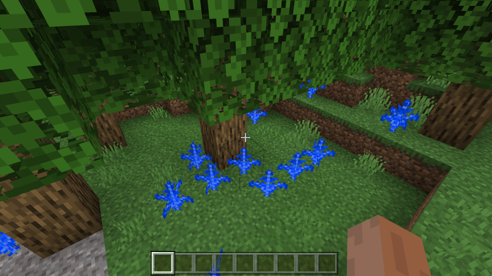

--- 
front: https://nie.res.netease.com/r/pic/20211104/69055361-2e7a-452f-8b1a-f23e1262a03a.jpg 
hard: Advanced 
time: 15 minutes 
--- 
# Understand the custom aggregation feature rules 

We inherit the previous blue fern scattered planting feature. We hope to combine this feature with the oak tree to generate an oak tree with a blue fern cluster under the shade. At this time, we need to use the aggregation feature. 

## Use aggregate features to connect ferns and trees 

We create the `oak_tree_with_blue_fern_cluster_feature.json` file and fill it in as follows: 

```json 
{ 
"format_version": "1.13.0", 
"minecraft:aggregate_feature": { 
"description": { 
"identifier": "tutorial_demo:oak_tree_with_blue_fern_cluster_feature" 
}, 
"early_out": "first_failure", 
"features": [ 
"minecraft:oak_tree_feature", 
"tutorial_demo:blue_fern_cluster_feature" 
] 
} 
} 
``` 

Aggregate features will cause all features in the list to use the same starting point as the input point, that is, to place multiple features with their own input point as the input point. For example, here we place the oak tree feature and the blue fern cluster feature based on the same point. The input point of the oak tree is at the root of the tree, and the scattered planting feature is scattered around the input point multiple times, so we can create an oak tree with a blue fern cluster under the shade. 

`early_out` specifies when to exit this feature placement, and `first_failure` means that this placement will be exited when the first feature that fails to be judged appears in the list. But this does not mean that the placement of this aggregate feature will also fail. The judgment of the aggregate feature is that as long as at least one feature in the list is successfully placed, it is successful. Note that the order of the placement list of aggregate features is not necessarily the order of actual placement, and its order cannot be guaranteed. 

## Attachment feature rules 

We create the `overworld_oak_tree_with_blue_fern_cluster_feature.json` file. 

```json
{
  "format_version": "1.13.0",
  "minecraft:feature_rules": {
    "description": {
      "identifier": "tutorial_demo:overworld_oak_tree_with_blue_fern_cluster_feature",
      "places_feature": "tutorial_demo:oak_tree_with_blue_fern_cluster_feature"
    },
    "conditions": {
      "placement_pass": "surface_pass",
      "minecraft:biome_filter": [
        {

          "any_of": [
            {
              "test": "has_biome_tag",
              "operator": "==",
              "value": "overworld"
            },
            {
              "test": "has_biome_tag",
              "operator": "==",
              "value": "overworld_generation"
            }
          ]
        }
      ]
    },
    "distribution": {
      "iterations": 5,
      "x": {
        "distribution": "uniform",
        "extent": [ 0, 16 ]
      },
      "y": "query.heightmap(variable.worldx, variable.worldz)",
      "z": {
        "distribution": "uniform",
        "extent": [ 0, 16 ]
      }
    }
  }
}
```

And enter the game to see the effect.

 

We can see that there are indeed a lot of blue ferns generated with oak trees!