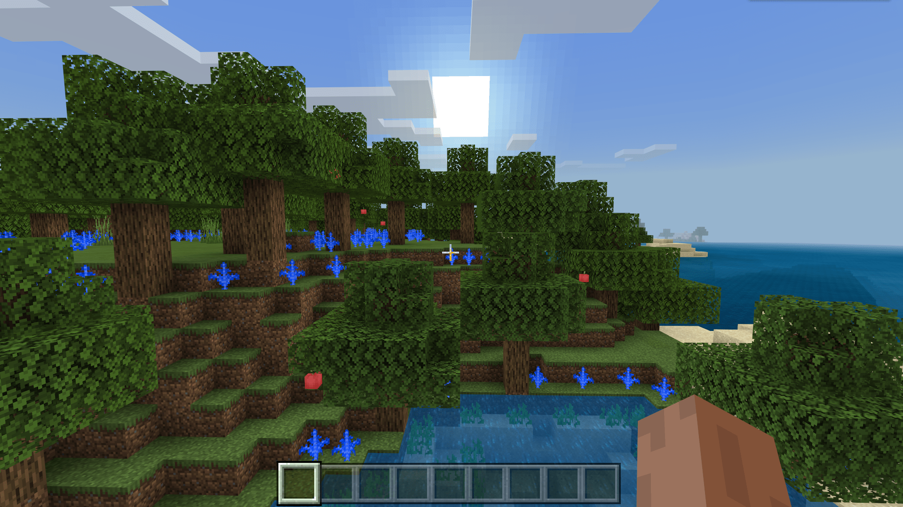

--- 
front: https://nie.res.netease.com/r/pic/20211104/69055361-2e7a-452f-8b1a-f23e1262a03a.jpg 
hard: Advanced 
time: 10 minutes 
--- 
# Understanding Sequence Feature Rules 

In this section, we use sequence features to hang the apples from the previous section on the oak tree. 

## Use sequence rules to connect apple features 

We create a new file `oak_tree_then_apple_feature.json`: 

```json 
{ 
"format_version": "1.13.0", 
"minecraft:sequence_feature": { 
"description": { 
"identifier": "tutorial_demo:oak_tree_then_apple_feature" 
}, 
"features": [ 
"minecraft:oak_tree_feature", 
"tutorial_demo:apple_search_feature" 
] 
} 
} 
``` 

The placement order of features in the sequence feature list is fixed, from the first feature in the list to the last one, and the output position of the previous feature will become the input position of the next feature. The output position of the tree feature is at the top of the tree, so our apple search feature needs to search from top to bottom, otherwise it will not find a satisfactory position. 

Unlike aggregate features, sequence features require all features in the list to be placed before they are considered successful. If a feature fails to be placed in the middle, the entire feature will be considered failed. However, the features that have been placed in the list will not disappear, but all features after the failed features will be skipped and no longer placed. 

 

We can see that our oak tree is indeed hung with apples.