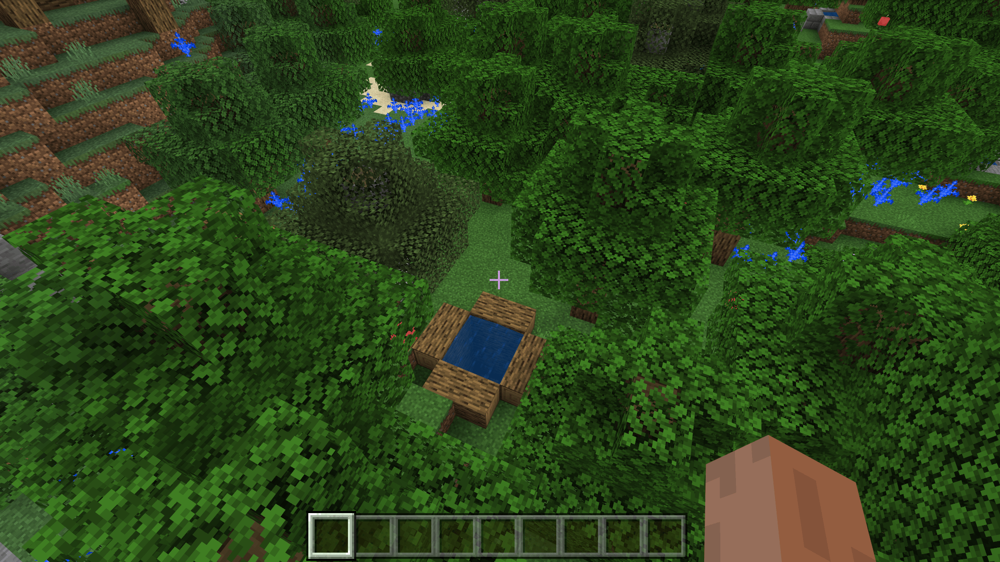

--- 
front: https://nie.res.netease.com/r/pic/20211104/69055361-2e7a-452f-8b1a-f23e1262a03a.jpg 
hard: Advanced 
time: 10 minutes 
--- 
# Understand the weighted random feature rules 

Weighted random features can be used to generate multiple features by weight. We use weighted random features to generate some wells of various styles. 

## Export multiple well structures using the editor 

 

We make multiple wells in the map editor and export them. The exported structure will automatically go into the `structures/<namespace>` folder of the behavior pack. Here, since the namespace we set in the editor is `tutorial_demo`, our structure will be placed in the `structures/tutorial_demo` folder. 

## Use structural features to configure water wells 

We use the Chinese version of structural features to create the features of four types of water wells. 

```json
{
  "format_version": "1.14.0",
  "netease:structure_feature": {
    "description": {
      "identifier": "tutorial_demo:woodwell_structure_feature"
    },
    "places_structure": "tutorial_demo:woodwell"
  }
}
```

```json
{
  "format_version": "1.14.0",
  "netease:structure_feature": {
    "description": {
      "identifier": "tutorial_demo:stonewell_structure_feature"
    },
    "places_structure": "tutorial_demo:stonewell"
  }
}
```

```json
{
  "format_version": "1.14.0",
  "netease:structure_feature": {
    "description": {      "identifier": "tutorial_demo:cobblestonewell_structure_feature"

}, 
"places_structure": "tutorial_demo:cobblestonewell" 
} 
} 
``` 

```json 
{ 
"format_version": "1.14.0", 
"netease:structure_feature": { 
"description": { 
"identifier": "tutorial_demo:stonebrickswell_structure_feature" 
}, 
"places_structure": "tutorial_demo:stonebrickswell" 
} 
} 
``` 

Since our structure is in the `tutorial_demo` folder, the namespace is `tutorial_demo`. We hook it into `places_structure` to make the structure feature. 

## Use weighted random features to assign well weights 

We create a new `random_well_feature.json` file: 

```json 
{ 
"format_version": "1.13.0", 
"minecraft:weighted_random_feature": { 
"description": { 
"identifier": "tutorial_demo:random_well_feature" 
}, 
"features": [ 
["tutorial_demo:woodwell_structure_feature", 1], 
["tutorial_demo:stonewell_structure_feature", 1], 
["tutorial_demo:cobblestonewell_structure_feature", 1], 
["tutorial_demo:stonebrickswell_structure_feature", 1] 
] 
} 
} 
``` 

We set the weight of all wells to 1, so that each well has a probability of $\frac{1}{1+1+1+1}=\frac{1}{4}$. When the selected well is successfully generated, the feature will be judged as successful, otherwise it will be judged as failed. 

## Attach feature rules 

We create the `overworld_well_structure_feature.json` file and write the following: 

```json 
{ 
"format_version": "1.13.0",

  "minecraft:feature_rules": {
    "description": {
      "identifier": "tutorial_demo:overworld_well_structure_feature",
      "places_feature": "tutorial_demo:random_well_feature"
    },
    "conditions": {
      "placement_pass": "surface_pass",
      "minecraft:biome_filter": [
        {
          "any_of": [
            {
              "test": "has_biome_tag",
              "operator": "==",
              "value": "overworld"
            },
            {
              "test": "has_biome_tag",
              "operator": "==",
              "value": "overworld_generation"
            }
          ]
        }
      ]
    },
    "distribution": {
      "iterations": 1,
      "x": {
        "distribution": "uniform", 
"extent": [ 
0, 
16 
] 
}, 
"y": "query.heightmap(variable.worldx, variable.worldz)-3", 
"z": { 
"distribution": "uniform", 
"extent": [ 
0, 
16 
] 
}, 
"scatter_chance": 100 
} 
} 
} 
``` 

 

We can see that the well feature was generated as expected.


 

Of course, although our feature rules are set to place a weighted random feature once per block, there is still a chance that this triple well situation will appear. This means that our feature placement is very successful!