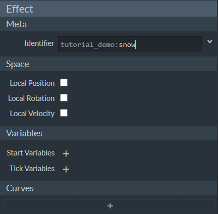

--- 
front: https://nie.res.netease.com/r/pic/20211104/69055361-2e7a-452f-8b1a-f23e1262a03a.jpg 
hard: Advanced 
time: 30 minutes 
--- 

# Start making snow particles 

In this section, we will learn how to make an international version of particles. We use the well-known particle creation software **Snowstorm** to make particles. 

## Get to know Snowstorm 

In Chapter 3, we introduced how to open the Snowstorm software. Let's open Snowstorm and observe its interface. 

 

We can see that the interface of Snowstorm is very simple and is divided into two parts, left and right. The left part is the **property panel**, which records the editable properties of the particle; the right part is the **preview window**, which can be used to preview the editing results in real time. 

We have learned before that the custom particles in the international version are not essentially a single particle, but a **particle system** with a particle emitter. Below, we will introduce this concept in more detail. 

As divided in the Snowstorm property panel, a particle can be roughly divided into three parts. The first part is the definition of the particle, including the definition of its own metadata (that is, the definition of its own name), various Molang variables and curves to be used later. 

The second part is used to define an **emitter** (**Emitter**). An emitter can be understood as a source or area of **emit** (**Emit**) or **burst** (**Burst**) particles. While the emitter has a shape and position, the emitter itself can also have a particle emission logic, which includes the emitter emission mode, emission time, and whether to loop and other properties. This is usually called the **lifetime** (**Lifetime**) property of the emitter, which determines the survival and disappearance of the emitter.

The third part is to define the properties of **Particle**, where particles are often called **Particle Instance**, which is what we call a single particle. A single particle is a basic unit used by the emitter to emit, and often has properties such as **texture**, **material**, **facing** (**Facing** or **Orientation**), **motion** (**Motion**) mode, and of course also has a **lifecycle**. 

An international version of a particle can be understood as a particle system, in which there is a particle emitter, and the emitter is used to emit the particle instance defined in the particle system. Each emitted particle controls when it dies through the life cycle, and the emitter itself also has the life cycle of the emitter to control when it is destroyed. A particle system can show its effect in the world through the process from generation to destruction. 

 

Click the **Code** button in the upper right corner of Snowstorm to switch from **Preview** mode to Code mode. In Code mode, we can view the source code of the current particle. This greatly facilitates our learning process of each particle component. 

We can see that the particle mode identifier does not have a namespace, it is simply a `particle_effect`. The default particle format version produced by Snowstorm is `1.10.0`. 

 

Snowstorm provides some preset examples, which we can find in the top menu bar. 

## Make snow particles 

Next, we will step by step make a snow particle with the same effect as the preset snow particle provided by Snowstorm. 

### Set particle definition 

 

We find the **Meta** column in the **Effect** column group and fill in the **Identifier** of our particle. We might as well fill it in as `tutroial_demo:snow`. This means that we have made the following changes to the JSON file: 

```json 
{

"format_version": "1.10.0", 
"particle_effect": { 
"description": { 
"identifier": "tutroial_demo:snow", 
} 
} 
} 
``` 

Since we don't need to set other variables, we will ignore the other option columns for now. 

### Setting up the particle emitter 

 

Compared to particles, particle emitters are relatively simple. Let's first set up the particle emitter for our particles. The **Emitter** (**Emitter**) column group is used to set the position of the emitter. 

Let's imagine what shape our particle emitter should be. We want to make a snowy particle effect. So the particle emitter should spray a large number of single snowflake particles above our heads, so our particle emitter can be a cube, but we can allow it to have no thickness. Next, we want the snow to keep falling instead of ending at a specific time, so we can set it to loop. Finally, we want it to spray out particles stably, rather than all at once. 

Therefore, we can set the **Mode** to **Steady** instead of **Instant** in the **Rate** column, and adjust the **Rate** and **Maximum** number of particles to be sprayed. 

In the **Emitter Lifetime** column, set **Mode** to **Looping**, and **Active Time** to 1. This, combined with the above stable mode, means that a maximum of 4,000 particles can be sprayed out stably at a rate of 80/second in 1 second. Of course, due to our short activation time, the maximum number of particles is far from being achieved. Since we don't want the particles to have an interval between sprays, we leave **Sleep Time** unfilled, which is equivalent to filling it in as 0. 

In the **Shape** column, set **Mode** to **Box** to give the particle emitter a cubic emission area. We set the Y coordinate of **Box Size** to 0, and set the Y coordinate of **Offset** to positive 20, which means that the particle emitter will emit 20 grids above the generated position, and the emission area is a 36×36 plane. In fact, our shape mode has many other options that are not used here, such as **Point**, **Sphere**, **Disc**, and **Entity Bounding Box**. 

The above operations are equivalent to the following additions in the JSON file: 

```json 
{ 
"format_version": "1.10.0", 
"particle_effect": { 
"description": { 
"identifier": "tutroial_demo:snow" 
}, 
"components": { 
"minecraft:emitter_rate_steady": { 
"spawn_rate": 80, 
"max_particles": 4000 
}, // Components of emitter rate stabilization mode 
"minecraft:emitter_lifetime_looping": { 
"active_time": 1 
}, // Components of emitter life cycle mode 
"minecraft:emitter_shape_box": { 
"offset": [0, 20, 0], 
"half_dimensions": [36, 0, 36] 
} // Components for emitter shape cube mode 
} 
} 
} 
```


In this way, we have completed the production of the particle emitter. Next, we only need to make the snowflake particles and assemble them into a snowing particle emitter. 

### Make particle appearance and texture 

 

Let's first select the texture of the particle. We find the **Texture** column in the **Particle** column group. We can see that this is a panel for setting textures. We select the texture map we need in **Texture**. We can use the original `particles.png` file, that is, the original particle texture atlas file as our particle texture map. We can select the **Sprite** of the 10th row of particles in this atlas as our snowflake particle. This can be achieved by specifying the **UV** on the image. 

UV is simply the value of U coordinates and V coordinates. The $uOv$ coordinate system is a coordinate system used to specify a specific position on a screen or image. Although it is similar to the $xOy$ coordinate system we usually use, the direction of the coordinates is opposite. The origin of the $uOv$ coordinate system is in the upper left corner of an image. The U coordinate represents the horizontal axis, with the right direction being the positive direction, and the V coordinate represents the vertical axis, with the downward direction being the positive direction. Here we can see that the size of each sprite in our particle texture is 8×8 pixels. In order to locate it to the 10th row, we specify 72, which is 9 times 8, in the V coordinate of **UV Start** (**UV starting point**), and then specify 8 in the V coordinate of **UV Size** (**UV size**). In other words, we specify particles with V coordinates from 9 times 8 to 10 times 8, thus representing the particle sprite texture of the 10th row. 

 

For each input box in Snowstorm, we can click the arrow button on the right to expand it, which is convenient for us to write Molang expressions. At present, we don't want to learn Molang expressions in depth in this section. We only need to know that the starting point of the U coordinate is selected from 0 times 8 to 7 times 8. This ensures that the particles selected each time are in the first 8 columns of this row. 

 

Next, we set **Appearance**. **Size** is the size of the particle. We still use Molang expressions to represent a dynamic size. **Material** is the material used by the particle. We choose **Alpha** here. **Facing** is the camera-facing mode of the particle. We have quite a lot of choices. Here we choose **Rotate XYZ**, which means to rotate in all three axes XYZ and then generate. 

So far, our operations are equivalent to adding the following content to JSON: 

```json 
{ 
"format_version": "1.10.0", 
"particle_effect": { 
"description": { 
"identifier": "tutroial_demo:snow", 
"basic_render_parameters": { 
"material": "particles_alpha", 
"texture": "textures/particle/particles" 
} // This field is required and is used to set materials and texture maps 
}, 
"components": { 
"minecraft:emitter_rate_steady": { 
"spawn_rate": 80, 
"max_particles": 4000 
}, 
"minecraft:emitter_lifetime_looping": { 
"active_time": 1 
}, 
"minecraft:emitter_shape_box": { 
"offset": [0, 20, 0],
        "half_dimensions": [36, 0, 36]
      },
      "minecraft:particle_appearance_billboard": {
        "size": ["0.07+variable.particle_random_1/6", "0.07+variable.particle_random_1/6"],
        "facing_camera_mode": "rotate_xyz",
        "uv": {
          "texture_width": 128,
          "texture_height": 128,

"uv": ["math.floor(variable.particle_random_2*8)*8", 72], 
"uv_size": [8, 8] 
} 
} // The particle's texture UV, size, and orientation are all set in the particle appearance billboard mode component 
} 
} 
} 
``` 

### Set up particle motion 

 

Next, we set the particle's **Motion**. In order to make the particle have a real-world motion trajectory, we set **Mode** to **Dynamic**. In this way, we can specify dynamic parameters for the particle. In a particle system, once the dynamic motion mode is selected, it means that the particle will **Simulate** according to the differential equation $\dot{x}=f(x,t)$, and then calculate the physical quantity according to the Euler method. Particle simulation refers to the process of calculating and assigning velocity to particle instances when they are generated and in each subsequent frame. If particle effects are to be presented to players, they must go through the simulation and rendering stages, so particle simulation is a very important part. Here we can fill in some dynamic parameters to enable particles to be simulated correctly. 

We use **Direction** to set the initial direction vector components of the particles on the three axes. Here we use random numbers to make the initial directions of the particles different. Then we use **Speed** to set the initial velocity of the particles. The subsequent velocity of the particles will be simulated by the Euler method according to the values set by **Acceleration** and **Air Drag**, so we only need to set the initial values of direction, velocity and acceleration. 

At this point, our JSON file has been supplemented with the following content: 

```json 
{ 
"format_version": "1.10.0", 
"particle_effect": { 
"description": { 
"identifier": "tutroial_demo:snow", 
"basic_render_parameters": { 
"material": "particles_alpha", 
"texture": "textures/particle/particles" 
} 
}, 
"components": { 
"minecraft:emitter_rate_steady": { 
"spawn_rate": 80, 
"max_particles": 4000 
}, 
"minecraft:emitter_lifetime_looping": { 
"active_time": 1 
}, 
"minecraft:emitter_shape_box": { 
"offset": [0, 20, 0], 
"half_dimensions": [36, 0, 36], 
"direction": ["Math.random(-1, 1)", "-1.2-Math.random(0, 1)", "Math.random(-1, 1)"] // The initial direction of the particle is actually managed by the emitter, so it is filled in the emitter's component 
}, 
"minecraft:particle_initial_speed": 1, // Particle initial speed component 
"minecraft:particle_motion_dynamic": { 
"linear_acceleration": [0, -0.2, 0] 
}, // Particle motion dynamic mode component 
"minecraft:particle_appearance_billboard": { 
"size": ["0.07+variable.particle_random_1/6", "0.07+variable.particle_random_1/6"], 
"facing_camera_mode": "rotate_xyz",

"uv": { 
"texture_width": 128, 
"texture_height": 128, 
"uv": ["math.floor(variable.particle_random_2*8)*8", 72], 
"uv_size": [8, 8] 
} 
} 
} 
} 
``` 

## Setting the particle lifecycle 

 

We set the particle's **Lifetime**, which specifies when the particle exists and dies. We change it to **Time** mode in **Mode**, and then change it to 25 seconds in **Max Age**. This way, our particle will die after 25 seconds. 

```json
{
  "format_version": "1.10.0",
  "particle_effect": {
    "description": {
      "identifier": "tutroial_demo:snow",
      "basic_render_parameters": {
        "material": "particles_alpha",
        "texture": "textures/particle/particles"
      }
    },
    "components": {
      "minecraft:emitter_rate_steady": {
        "spawn_rate": 80,
        "max_particles": 4000
      },
      "minecraft:emitter_lifetime_looping": {
        "active_time": 1
      },
      "minecraft:emitter_shape_box": {
        "offset": [0, 20, 0],
        "half_dimensions": [36, 0, 36], 
"direction": ["Math.random(-1, 1)", "-1.2-Math.random(0, 1)", "Math.random(-1, 1)"] 
}, 
"minecraft:particle_lifetime_expression": { 
"max_lifetime": 25 
}, // The time mode actually shares a component with the termination expression, namely the particle life cycle expression mode component 
"minecraft:particle_initial_speed": 1, 
"minecraft:particle_motion_dynamic": { 
"linear_acceleration": [0, -0.2, 0] 
}, 
"minecraft:particle_appearance_billboard": {

"size": ["0.07+variable.particle_random_1/6", "0.07+variable.particle_random_1/6"], 
"facing_camera_mode": "rotate_xyz", 
"uv": { 
"texture_width": 128, 
"texture_height": 128, 
"uv": ["math.floor(variable.particle_random_2*8)*8", 72], 
"uv_size": [8, 8] 
} 
} 
} 
} 
} 
``` 

## Set the particle color 

 

Our snowflakes should be white, so we don't need to change the settings in the **Color & Light** section, and similarly, our JSON file will not be modified. 

## Set particle rotation 

 

Finally, we set the particle's **Rotation**. In **Dynamic** mode, we also use Molang to randomize **Start Rotation**. The following parameters will affect the particle's angular velocity, but we don't need to fill them in for this particle. 

This means our final JSON file is:

```json
{
  "format_version": "1.10.0",
  "particle_effect": {
    "description": {
      "identifier": "snowstorm:snow",
      "basic_render_parameters": {
        "material": "particles_alpha",
        "texture": "textures/particle/particles"
      }
    },
    "components": {
      "minecraft:emitter_rate_steady": {
        "spawn_rate": 80,
        "max_particles": 4000
      },
      "minecraft:emitter_lifetime_looping": {
        "active_time": 1
      },
      "minecraft:emitter_shape_box": {
        "offset": [0, 20, 0],
        "half_dimensions": [36, 0, 36],

"direction": ["Math.random(-1, 1)", "-1.2-Math.random(0, 1)", "Math.random(-1, 1)"] 
}, 
"minecraft:particle_lifetime_expression": { 
"max_lifetime": 25 
}, 
"minecraft:particle_initial_spin": { 
"rotation": "variable.particle_random_3*360" 
}, // Set the initial rotation angle through the particle initial spin component 
"minecraft:particle_initial_speed": 1, 
"minecraft:particle_motion_dynamic": { 
"linear_acceleration": [0, -0.2, 0] 
}, 
"minecraft:particle_appearance_billboard": { 
"size": ["0.07+variable.particle_random_1/6", "0.07+variable.particle_random_1/6"], 
"facing_camera_mode": "rotate_xyz", 
"uv": { 
"texture_width": 128, 
"texture_height": 128, 
"uv": ["math.floor(variable.particle_random_2*8)*8", 72], 
"uv_size": [8, 8] 
} 
} 
} 
} 
``` 

In this way, we have completed the production of snow particles! We can preview the final effect directly in Snowstorm: 

 

You can see that the produced particles are still very beautiful and realistic! 
