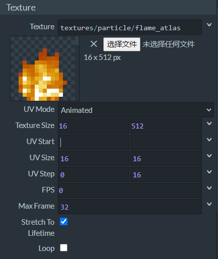
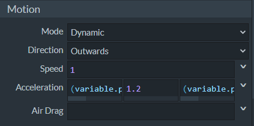

--- 
front: https://nie.res.netease.com/r/pic/20211104/69055361-2e7a-452f-8b1a-f23e1262a03a.jpg 
hard: Advanced 
time: 20 minutes 
--- 
# Start making particles with flipbook animation 

In Snowstorm, we can not only make particles with static textures, but also make dynamic texture particles with **Flipbook Animation**. Similar to the Chinese version of sequence frame animation, flipbook animation is a texture animation mode supported by the international version through frame transformation, which can be applied to blocks, items, particles and other functions. In this section, we will learn how to make a fire particle that is the same as the original fire particle preset that comes with Snowstorm. 

## Set the flipbook texture 

 

The flipbook texture requires a dynamic sprite as an atlas, and the original `flame_atlas.png` happens to be our atlas file. We set the **UV Mode** to **Animated**, and then you can see that there is an extra **UV Step** below, which we set to the size of a sprite in `flame_atlas.png`, that is, the U step is 0 and the V step is 16. Then we turn on **Stretch To Lifetime**, which means that the entire animation time will be stretched to the same as the life cycle. Because of this, we don't need to set **FPS**, because it will be set automatically, we can just keep it at 0. 

## Setting Local Space 

 

In the **Space** column at the top, we can set **Local Space** properties for the particle. The word "local" actually describes the **Simulation Space** of the particle. As we said in the previous section, the simulation of a particle refers to the process of calculating the velocity that the particle should have at the moment before or after it is generated. Generally speaking, the simulation of particles is relative to the world, that is, absolute coordinates, so the particles will move relative to the entire world after they are generated. However, sometimes we want the particles to move with the entity or locator to which they are attached, so we have to set the simulation space to **Local**. The three options here can set the particle position simulation, rotation simulation, and velocity simulation to local space respectively. 

## Setting Other Properties 

 

We set the life cycle to a random number through Molang. This way different fire particle instances will maintain different burning speeds.

 

We set the orientation to **Look at XYZ**, which means that the three axes of the particle will always face the entity looking at it. 

 

We set the particle movement direction to **Outwards**, with a constant initial acceleration on the Y axis and random initial accelerations on the other two axes. This will create an outward "spreading" effect 

 

Configure the emitter and set it to **Dics** (**disc**) shape, **Radius** (**radius**) set to 1.2 meters; loop; stable emission. 

So we get the final JSON file: 

```json 
{ 
"format_version": "1.10.0", 
"particle_effect": { 
"description": { 
"identifier": "tutorial_demo:fire", 
"basic_render_parameters": { 
"material": "particles_alpha",

        "texture": "textures/particle/flame_atlas"
      }
    },
    "components": {
      "minecraft:emitter_local_space": {
        "position": true,
        "rotation": true,
        "velocity": true
      },
      "minecraft:emitter_rate_steady": {
        "spawn_rate": 20,
        "max_particles": 1000
      },
      "minecraft:emitter_lifetime_looping": {
        "active_time": 1
      },
      "minecraft:emitter_shape_disc": {
        "offset": [0, 0.4, 0],
        "radius": 1.2,
        "direction": "outwards"
      },
      "minecraft:particle_lifetime_expression": {
        "max_lifetime": "Math.random(1, 1.4)"
      },
      "minecraft:particle_initial_speed": 1,
      "minecraft:particle_motion_dynamic": {
        "linear_acceleration": ["(variable.particle_random_1-0.5)", 1.2, "(variable.particle_random_1-0.5)"]
      },
      "minecraft:particle_appearance_billboard": {
        "size": [0.4, 0.4],
        "facing_camera_mode": "lookat_xyz",
        "uv": {
          "texture_width": 16,
          "texture_height": 512,
          "flipbook": {
            "base_UV": [0, 0],
            "size_UV": [16, 16],
            "step_UV": [0, 16],
            "max_frame": 32,
            "stretch_to_lifetime": true
          }
        }
      }
    }
  }
}
```


We will see the final effect in the Snowstorm preview window, which is very ideal.