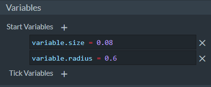
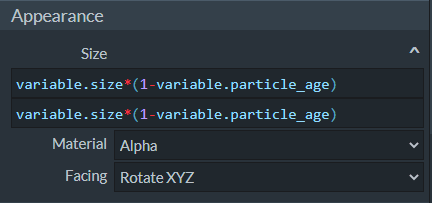
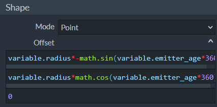
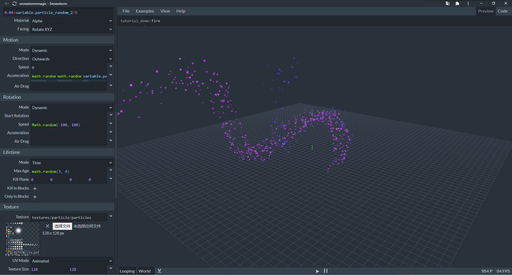
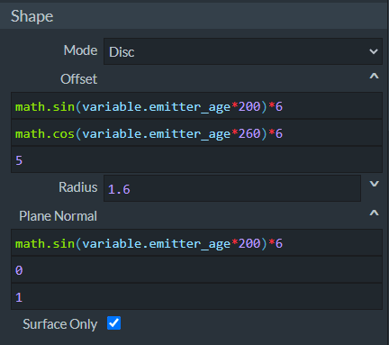
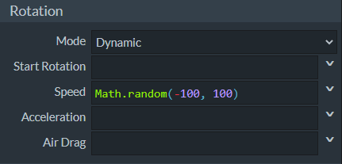
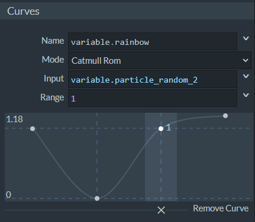
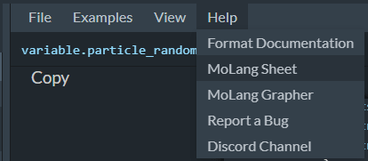
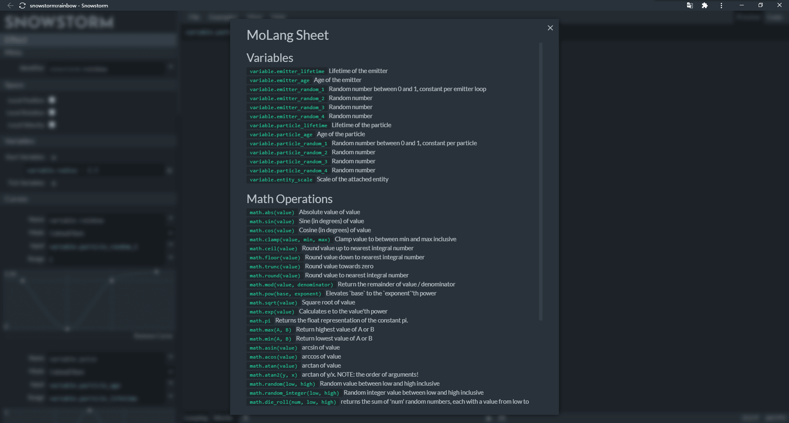

--- 
front: https://nie.res.netease.com/r/pic/20211104/69055361-2e7a-452f-8b1a-f23e1262a03a.jpg 
hard: Advanced 
time: 25 minutes 
--- 
# Use Molang to make particles dynamic 

In this section, we will learn how to use Molang in particles through various examples that come with Snowstorm. 

## Set variables 

 

Let's open the Loading particle to see how to set variables. 

 

In the **Variables** column on the left, we can set two types of Molang variables, **Start Variables** and **Tick Variables**. Start variables are variables that are set when the particle is **Initialized**, and are only set once. Tick variables are variables that are set every time the particle follows the game's main tick loop, and are set once every game tick. 

Here, we set two start variables `variable.size = 0.08` and `variable.radius = 0.6`. This can be written as: 

```json 
"minecraft:emitter_initialization": { 
"creation_expression": " 
variable.size = 0.08; 
variable.radius = 0.6; 
", 
"per_update_expression": "" // No update-by-update variable, i.e. tick variable, is set 
} // Emitter initialization component 
``` 

## Dynamically set particle size 

Particles can be dynamically sized using Molang. Let's continue with the example of loading particles. 

 

Here, the previously customized variable `variable.size` and a particle's own native variable `variable.particle_age` are used. In fact, although particles are componentized, they are not considered an *entity* in the ECS framework. Therefore, particles themselves do not have query functions, and all particle query functions come from their attached entities. If the entity to which the particle is attached dies, the particle will no longer be able to use the entity's query function. Some of the variable values of the particle itself are provided through the `variable.` prefix. In other words, although the particle has no query, it still has some native variables. Here, `variable.particle_age` is an example, which represents the time from the generation zone to the current time of the particle. 

This content is expressed in JSON as: 

```json 
"minecraft:particle_appearance_billboard": { 
"size": [ 
"variable.size*(1-variable.particle_age)", 
"variable.size*(1-variable.particle_age)" 
], 
"facing_camera_mode": "rotate_xyz", 
"uv": {

// Texture UV related information is irrelevant here 
} 
}, 
``` 

## Dynamically set the emitter position 

We can use Molang to dynamically set the emitter position. Let's continue to look at loading particles. 

 

We can see in the emitter's Shape column that another custom variable `variable.radius` is used here. This is to scale the unit circular motion constructed later by `math.sin` and `math.cos` to the size we want. This circular motion is for the particle emitter, which means that in addition to the appearance of the particles getting smaller as the particles age, the particles will also be generated periodically on the circumference because the emitter is in circular motion. 

```json 
"minecraft:emitter_shape_point": { 
"offset": [ 
"variable.radius*-math.sin(variable.emitter_age*360)", 
"variable.radius*math.cos(variable.emitter_age*360)", 
0 
] 
}, 
``` 

Next, let's look at another type of particle. Let's look at Magic particles. 

 

 

We can see that compared to loading particles, Magic particles have richer parameters. This is because Magic particles use Disc-shaped emitters. In mathematics, a disk generally refers to a two-dimensional circular surface, but our particles are emitted in three-dimensional space, so the disk here must specify a **Normal**. With the normal direction, the disk can be placed on a plane perpendicular to the normal direction. The direction of the normal direction can be represented by a **Normal Vector**. **Plane Normal** is the property used to specify the three axial components of this normal vector. 

As you can see, in addition to using Molang for circular motion in Offset, magic particles also use simple harmonic vibrations of the same frequency on the normal vector. In other words, the plane where the disk is located will perform circular motion while performing simple harmonic vibrations, and the superposition of these two motions constitutes the final motion of the disk. 

## Dynamically set particle spin 

In order to separate it from general rotational motion (such as the pseudo-rotation we performed through circular motion above), we call the rotational motion of the particle itself around an axis **Spin**. Let's continue to look at magic particles. 

 

We can see that the single instance of the magic particle will spin while moving as a whole. Here, a random initial spin velocity is specified through Molang. 

## Dynamically set particle linear motion 

In addition to spinning, that is, angular motion with angular velocity, the particle monomer will also move linearly with linear velocity. Let's continue to look at magic particles. 

 

Here we find that we use a variable `variable.particle_random_3` variable to perform random linear acceleration. In fact, `variable.particle_random_3` is a native variable of the particle. The same variables include `variable.particle_random_1`, `variable.particle_random_2`, `variable.particle_random_4`, `variable.emitter_random_1`, `variable.emitter_random_2`, `variable.emitter_random_3`, `variable.emitter_random_4`. They are different native random variables between 0 and 1, which are different from each other and can be directly referenced. 

```json

"minecraft:particle_motion_dynamic": { 
"linear_acceleration": [ 
"math.random(0, 4)", 
"math.random(0, 8)", 
"variable.particle_random_3>0.2 ? -10 : -4" 
] 
} 
``` 

## Dynamically set particle collision 

Particle collision can also be controlled by Molang, but Snowstorm does not support this function yet. In fact, particle collision, that is, the collision between particles and terrain in the world, is implemented through the `minecraft:particle_motion_collision` component. Although Snowstorm's particles have a **Collision** column to support the modification of collision parameters, it does not support the modification of the `enabled` field, the only one in the component that supports Molang. 

```json 
"minecraft:particle_motion_collision": { 
"enabled": "/* Molang Expression */" 
} 
``` 

The Molang control of this field can dynamically control whether a particle has collision characteristics. 

## Design particle color gradient 

 

Finally, let's learn to set color gradients through the Rainbow particle. 

 

 

The rainbow particle changes the **Color Mode** to **Gradient** in the Color & Light tab and uses the **Interpolant** variable `variable.rainbow`. As you can see, in the top **Curve** column, we defined the curve of variable `variable.rainbow`. It uses the native variable `variable.particle_random_2` as the **Input** variable, and generates a curve through **Catmull-Rom interpolation**, thus producing the rainbow effect displayed in the preview window. 

So far, we have a basic understanding of the application of Molang in particles. In fact, in the menu bar of Snowstorm, we can get the information of the native Molang variables of all particles for subsequent reference: 

 

 
