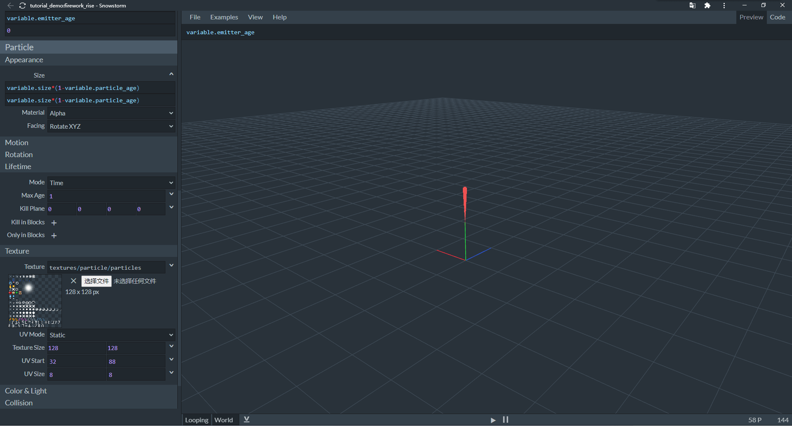

--- 
front: https://nie.res.netease.com/r/pic/20211104/69055361-2e7a-452f-8b1a-f23e1262a03a.jpg 
hard: Advanced 
time: 25 minutes 
--- 
# Challenge: Design a firework particle 

In this section, let's make a firework particle. According to our life experience, the blooming of fireworks is generally divided into two parts: rising and bursting. Therefore, we make rising and bursting particles separately, and then connect them together through particle events. 

## Make rising particles 

We create a new particle in Snowstorm and name it `tutorial_demo:firework_rise`. 

 

We imitate loading particles and set a variable to represent the particle size. 

 

We set the mode to emit particles steadily and change the emitter life cycle to **Once**. After all, we don't want the fireworks to "rise again" after they rise. The activation time is set to 5 seconds, and the vertical offset of the shape is set to `variable.emitter_age`. So our fireworks will rise 5 meters and the speed is 1 meter per second. 

 

We use the same texture as the loaded particles, and then set the maximum age of each particle to 1, and use the same particle size change method as the loaded particles, that is, it disappears completely from large to small after 1 second. Finally, we set the color to red. 

Therefore, we get the following JSON file:

```json
{
	"format_version": "1.10.0",
	"particle_effect": {
		"description": {
			"identifier": "tutorial_demo:firework_rise",
			"basic_render_parameters": {
				"material": "particles_alpha",
				"texture": "textures/particle/particles"
			}
		},
		"components": {
			"minecraft:emitter_initialization": {
				"creation_expression": "variable.size = 0.08;"
			},
			"minecraft:emitter_rate_steady": {
				"spawn_rate": 31,
				"max_particles": 60
			},
			"minecraft:emitter_lifetime_once": {
				"active_time": 5
			},

			"minecraft:emitter_shape_point": {
				"offset": [0, "variable.emitter_age", 0]
			},
			"minecraft:particle_lifetime_expression": {
				"max_lifetime": 1
			},
			"minecraft:particle_initial_speed": 0,
			"minecraft:particle_motion_dynamic": {},
			"minecraft:particle_appearance_billboard": {
				"size": ["variable.size*(1-variable.particle_age)", "variable.size*(1-variable.particle_age)"],
				"facing_camera_mode": "rotate_xyz",
				"uv": {
					"texture_width": 128,
					"texture_height": 128,
					"uv": [32, 88],
					"uv_size": [8, 8] } 
}, 
"minecraft:particle_appearance_tinting": { 
"color": [0.93725, 0.32157, 0.32157, 1] 
} 
} 
} 
} 
``` 

 

## Making Explosion Particles 

We create a second particle in Snowstorm and name it `tutorial_demo:firework_crack`. 

 

Similarly, we create a `variable.size` variable. 

 

We want many particles to explode at the same time, so we set it to Instant mode. At the same time, the emitter is offset 5 meters upward because this is the end position of the rising particles. 

 

In addition to the same parts as the rising particles, we set the particle motion simulation. We set the movement direction to Outwards, and then set the acceleration to -2 on all three axes. 

In this way, we get the exploding particles: 

```json 
{ 
"format_version": "1.10.0", 
"particle_effect": {

		"description": {
			"identifier": "tutorial_demo:firework_crack",
			"basic_render_parameters": {
				"material": "particles_alpha",
				"texture": "textures/particle/particles"
			}
		},
		"components": {
			"minecraft:emitter_initialization": {
				"creation_expression": "variable.size = 0.08;"
			},
			"minecraft:emitter_rate_instant": {
				"num_particles": 600
			},
			"minecraft:emitter_lifetime_once": {
				"active_time": 1
			},
			"minecraft:emitter_shape_sphere": {
				"offset": [0, 5, 0],
				"radius": 2,
				"direction": "outwards"			},
			"minecraft:particle_lifetime_expression": {
				"max_lifetime": 1
			},
			"minecraft:particle_initial_speed": 2,
			"minecraft:particle_motion_dynamic": {
				"linear_acceleration": [-2, -2, -2]
			},
			"minecraft:particle_appearance_billboard": {
				"size": ["variable.size*(1-variable.particle_age)", "variable.size*(1-variable.particle_age)"],
				"facing_camera_mode": "lookat_xyz",
				"uv": {
					"texture_width": 128,
					"texture_height": 128,
					"uv": [32, 88],
					"uv_size": [8, 8]
				}
			}, "minecraft:particle_appearance_tinting": { 
"color": [0.93725, 0.32157, 0.32157, 1] 
} 
} 
} 
} 
``` 

 

Finally, we put the two particles together. We use the `minecraft:emitter_lifetime_events` component to trigger the events of the two particles. We manually create the `firework.particle.json` file and write the following content:


```json
{
	"format_version": "1.10.0",
	"particle_effect": {
		"description": {
			"identifier": "tutorial_demo:firework",
			"basic_render_parameters": {
				"material": "particles_alpha",
				"texture": "textures/particle/particles"
			}
		},
		"components": {
			"minecraft:emitter_lifetime_events": {
				"creation_event": "rise",
				"timeline": {
					"5.0": "crack"
				}
			},
			"minecraft:emitter_rate_instant": {
				"num_particles": 0
			},
			"minecraft:emitter_lifetime_once": {
				"active_time": 6
			}, "minecraft:emitter_shape_point": { 
"offset": [0, "variable.emitter_age", 0] 
} 
}, 
"events": { 
"rise": { 
"particle_effect": { 
"effect": "tutorial_demo:firework_rise", 
"type": "emitter" 
} 
}, 
"crack": { 
"particle_effect": { 
"effect": "tutorial_demo:firework_crack", 
"type": "emitter" 
} 
} 
} 
} 
} 
``` 

`basic_render_parameters` is a required field, but we don't need it, just fill in the default material and texture. The key point is the `minecraft:emitter_lifetime_events` component. We execute the `rise` event through `creation_event` when the particle is created, and the `rise` event is used to generate the `tutorial_demo:firework_rise` particle. We trigger the `crack` event at 5.0s through `timeline`, and the `crack` event is used to generate the `tutorial_demo:firework_crack` particle. In this way, our fireworks particles are completed. 


We can enter the game and use the `/particle` command to test the effect. As you can see, the particles really take on the shape of fireworks as we imagined!