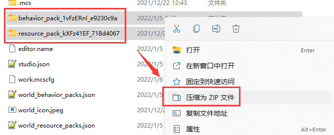
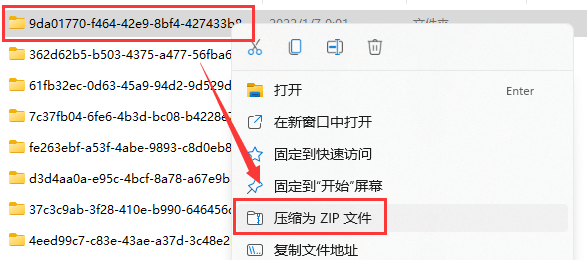

--- 
front: https://nie.res.netease.com/r/pic/20211104/69055361-2e7a-452f-8b1a-f23e1262a03a.jpg 
hard: Getting Started 
time: 10 minutes 
--- 
# Understanding the structure and packaging of works 

When our works are completed, we want to publish them to the market for players to download. Therefore, we may need to understand how to package our works correctly to prevent the possibility of failure in listing. 

## Add-on package 

During the listing process, our **Add-on package** (**Add-on**) is called "**Functional gameplay**". This type of work has the simplest packaging method. 

A typical add-on package generally consists of a resource package and a behavior package, as shown below: 

```json 
Add-on package root directory 
├─SomeAddonRes 
└─SomeAddonBeh 
``` 

The correct way to package the add-on package is to directly select the two folders and compress them into a compressed file. 

 

If we select their root directory and then compress them, the packaging will fail and cannot be put on the shelf. 

## Map 

**Map** is also a way to publish works. Often we hope that our add-on package can be used with a map, so we will want to directly publish a map with an add-on package. 

A map often has the following format: 

```shell 
Map root directory 
│ level.dat # archive file 
│ level.dat_old # old version archive file 
│ levelname.txt # world name file 
│ world_behavior_packs.json # world loaded behavior pack file 
│ world_resource_packs.json # world loaded resource pack file 
│ 
├─behavior_packs # all behavior packs stored 
├─db # LevelDB file 
└─resource_packs # all resource packs stored 
``` 

For map files, we need to use the map root directory folder to compress directly. 




For example, the root folder of our map is `9da01770-f464-42e9-8bf4-427433b86c3b`, as shown in the figure, we can directly compress it into a compressed file. 

If you find `netease_world_behavior_packs.json` and `netease_world_resource_packs.json` in your map, you need to manually delete their `netease_` prefix and check whether the `pack_id` field in these two files is consistent with the UUID in the `header` header of the resource pack and behavior pack. At the same time, these two files with the `netease_` prefix usually do not have the `type` field. You need to manually add the `type` field and set its value to `Addon`. As shown below: 

```json 
[ 
{ 
"pack_id" : "eefcf409-a40a-46f7-9a48-3147960a8c39", // Ensure that the value of the changed line is consistent with the UUID in the add-on package 
"type": "Addon", // Add this line 
"version" : [ 0, 0, 1 ] // Ensure that the value of this line is consistent with the version in the add-on package 
} 
] 
``` 

## Texture Pack and Light and Shadow Pack 

**Texture Pack** and **Light and Shadow Pack** often have only one resource package, which is not suitable for uploading as an add-on package. Therefore, we need to compress it directly into a compressed file and upload it. For example, we have the structure shown in the figure below. 

```json 
SomeRootFolder 
└─TexturePack 
``` 

Then we directly right-click `TexturePack` and compress it into a compressed file to complete the packaging. 

## Skins 

Although there are add-on packs called skin packs for Bedrock Edition, only the international version currently uses this type of pack, and we do not use this type of pack. To upload a skin, please prepare a PNG file with a transparent channel and upload the file directly.